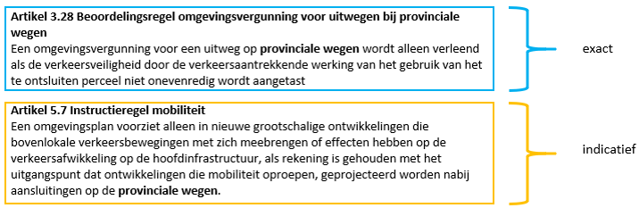
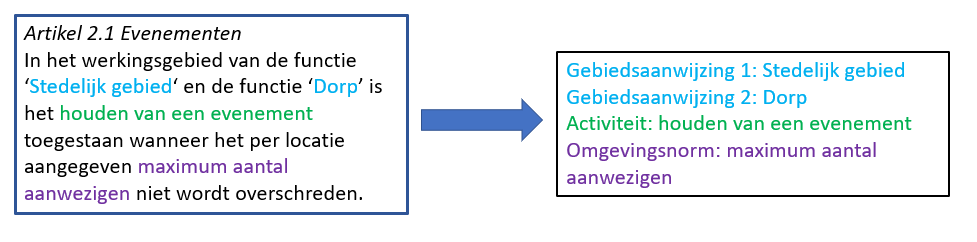
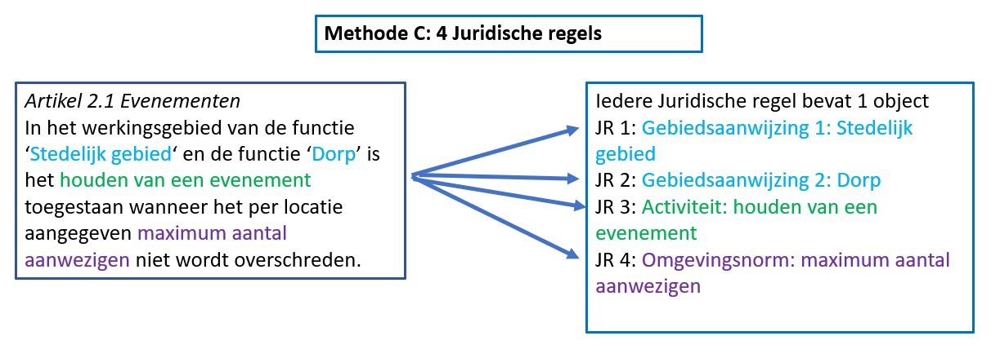
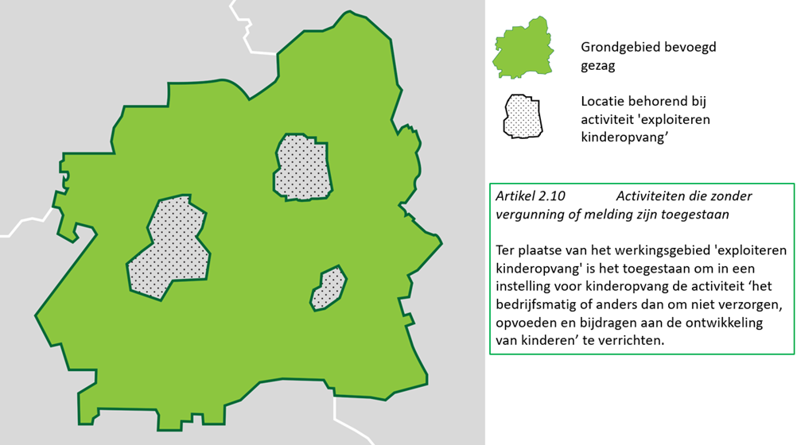

## Annoteren met OW-objecten: productmodel, objecten en attributen

Dit hoofdstuk beschrijft de toepassing van het annoteren met OW-objecten op de
AMvB/MR. De objecten, de bijbehorende attributen en waardelijsten worden
gedetailleerd toegelicht. Paragraaf 7.1 bevat het productmodel voor de AMvB/MR
in de vorm van een IMOW-UML-klassediagram, met een korte toelichting op het
diagram. In de paragrafen 7.2 tot en met 7.13 worden in detail de OW-objecten en
hun attributen en de toepassing van die objecten op de AMvB/MR beschreven. Ieder
onderdeel wordt volgens een vast stramien beschreven. Het begint met een
toelichting op de toepassing: waarvoor en wanneer wordt het object of attribuut
in de praktijk gebruikt. Daarna volgt een definitie van het object, om precies
aan te geven waar het over gaat. In de volgende subparagraaf wordt aangegeven
wat het doel van het objecttype is, met andere woorden: wat is het resultaat,
wat levert de extra inspanning van het annoteren met dit object op? Vervolgens
wordt de norm gesteld. Deze subparagraaf begint steeds met een uitsnede van het
IMOW-diagram met daarin die objecten en relaties die relevant zijn. De norm somt
de attributen op die horen bij dit OW-object, waarbij wordt aangegeven of het
attribuut verplicht of optioneel is, hoe vaak het attribuut kan of moet
voorkomen, of er een waardelijst voor het attribuut bestaat en of er
constraints, oftewel voorwaarden voor de toepassing, gelden. De daaropvolgende
subparagraaf geeft een toelichting op de attributen, de waardelijsten en de
eventuele constraints die samen de norm vormen.

In de laatste twee paragrafen van dit hoofdstuk wordt beschreven op welk niveau
annotaties worden geplaatst en wordt aangegeven hoe het annoteren wordt
toegepast wanneer een deel van norm of beleid in een bijlage staat.

Daar waar in dit hoofdstuk de naam van een OW-object gebruikt wordt, wordt die
naam met een hoofdletter geschreven. De namen van attributen van objecten worden
cursief gedrukt.

### Productmodel: het IMOW-UML-diagram voor de AMvB/MR

Figuur 18 toont het volledige IMOW-diagram in UML voor het Lichaam van de
Regeling van de AMvB/MR het deel dat de artikelen met de inhoud bevat.

1.  IMOW-UML-klassediagram de AMvB/MR

In het diagram zijn in blauw de tekstobjecten weergegeven: Regeltekst en
Juridische regel (inclusief zijn drie typen). Regeltekst (in het donkerblauwe
blokje) is het koppelobject naar STOP. In roze is Locatie met zijn
verschijningsvormen weergegeven. De groene blokjes staan voor de
domeinspecifieke annotatie-objecten Activiteit, Omgevingswaarde, Omgevingsnorm
en Gebiedsaanwijzing. Tekst, Locatie en Annotatie zijn de hoofdcomponenten van
IMOW die in paragraaf 6.1 al zijn beschreven. Het witte blokje is het
Regelingsgebied. In het model is aangegeven welke waardelijsten van toepassing
zijn. Het model bevat ook de attributen die nodig zijn om domeinspecifieke
annotaties te kunnen presenteren op een kaart. In de navolgende paragrafen
worden de objecten in detail beschreven.

### Objecttype Regeltekst

#### Toelichting op de toepassing

Regeltekst is de STOP/TPOD-term voor de kleinste *zelfstandige* eenheid van
ordening en informatie in het Lichaam van een Regeling van een omgevingsdocument
met Artikelstructuur: artikel of lid. Regeltekst bevat altijd ten minste één
Juridische regel; wanneer dat nodig is kan Regeltekst meerdere Juridische regels
bevatten. Iedere Regeltekst heeft een werkingsgebied-relatie met Locatie,
waarmee wordt aangegeven waar een Regeltekst zijn werking heeft. Opgemerkt wordt
dat het annoteren van Juridische regel met OW-objecten via het koppelobject
Regeltekst wordt gekoppeld aan de STOP-elementen Artikel en Lid. Artikel en Lid
zijn in STOP elementen die inhoud bevatten en geen structuurelementen.
Omgevingsdocumenten met Artikelstructuur kunnen dus, anders dan
omgevingsdocumenten met Vrijetekststructuur, niet geannoteerd worden op het
niveau van structuurelementen zoals Hoofdstuk en Afdeling.

#### Definitie

Regeltekst is de kleinste zelfstandige eenheid van (een of meer) bij elkaar
horende Juridische regels in het Lichaam van de Regeling van omgevingsdocumenten
met Artikelstructuur, te weten een artikel of een lid.

#### Doel

Doel van het objecttype Regeltekst is het leggen van de verbinding tussen de
Juridische regel uit het Omgevingswet-domein en het artikel of lid uit STOP.

#### Norm

1.  Uitsnede uit IMOW-diagram voor objecttype Regeltekst

Regeltekst kent de volgende attributen:

-   *identificatie*: de unieke identificatie waaronder elk object van dit type
    bekend is. Identificatie conform datatype NEN3610-ID. Verplicht attribuut.
    Komt 1 keer voor.

Regeltekst kent geen waardelijsten.

Regeltekst kent de volgende constraints:

-   één type Juridische regel per Regeltekst; constraint geldig op het niveau
    van Artikel: alle Juridische regels in een Artikel en alle Juridische regels
    in alle Leden van een Artikel moeten van hetzelfde type zijn;

-   indien Artikel is onderverdeeld in Leden, annotaties alleen op Leden.

#### Toelichting op de norm

*Attributen*

Het attribuut *identificatie* behoeft geen toelichting.

In de uitsnede van het diagram is ook de relatie werkingsgebied te zien. Deze
relatie is de verwijzing van een specifieke Regeltekst naar (de identificatie
van) de bijbehorende Locatie(s). De relatie is in een onderbroken lijn
weergegeven omdat het een conceptuele relatie is. De relatie is impliciet
inbegrepen in de relatie tussen Regeltekst, Juridische regel en Locatie en geeft
aan wat het werkingsgebied van de Regeltekst is: het gebied waar het Artikel of
Lid zijn werking heeft. De *relatie* wordt afgeleid in DSO-LV waarbij de som van
de locaties van de onderliggende Juridische regels wordt gebruikt. Het is dus
niet zo dat het bevoegd gezag ook nog een afzonderlijke geometrie voor het
werkingsgebied moet aanleveren.

Regeltekst kent geen waardelijsten.

*Constraints*

-   ‘*één type Juridische regel per Regelteks*t: deze constraint betekent dat
    alle Juridische regels in een Regeltekst van hetzelfde type moeten zijn.
    Deze voorwaarde dient het doel van het onderscheid in de verschillende typen
    Juridische regel, namelijk het als uitgangssituatie alleen tonen van die
    regels die op de betreffende doelgroep gericht zijn. De typen Juridische
    regel en de achterliggende doelgroepbenadering worden toegelicht bij
    Juridische regel in paragraaf 7.3.5. Deze constraint geldt op het niveau van
    Artikel*:* alle Juridische regels in een Artikel en alle Juridische regels
    in alle Leden van een Artikel moeten van hetzelfde type zijn.

-   *indien Artikel is onderverdeeld in Leden, annotaties alleen op Leden*: deze
    constraint houdt in dat als een Artikel is onderverdeeld in Leden, de
    annotaties alleen mogen verwijzen naar de Leden en niet naar het Artikel,
    oftewel annotaties worden dan alleen op Lid-niveau toegepast. Deze
    constraint heeft ook tot gevolg dat als een Artikel is onderverdeeld in
    Leden, alleen de Leden kunnen worden geannoteerd als Regeltekst en Artikel
    niet.

### Objecttype Juridische regel

#### Toelichting op de toepassing

Juridische regel is een conceptuele constructie, die in IMOW wordt gebruikt om
verschillende onderdelen van een Regeltekst, bijvoorbeeld de onderdelen van een
Lijst of de verschillende activiteiten die in een Regeltekst worden genoemd, een
eigen Locatie te kunnen geven. Ook maakt Juridische regel het mogelijk om
verschillende onderdelen van een Regeltekst een eigen thema te geven en/of te
annoteren met verschillende annotaties Activiteit, Omgevingsnorm,
Omgevingswaarde en Gebiedsaanwijzing. Juridische regel is altijd onderdeel van
een Regeltekst en, zoals we in de paragrafen 6.1.1 en 7.2 al hebben gezien,
Regeltekst kan meerdere Juridische regels bevatten. In een Regeltekst met
meerdere Juridische regels zijn de individuele Juridische regels niet als
zelfstandige eenheid te identificeren.

Bij de Juridische regel moet worden aangegeven hoe nauwkeurig het bevoegd gezag
de Locatie van die Juridische regel bedoeld heeft en hoe Locatie geïnterpreteerd
moet worden. Een Locatie kan exact bedoeld zijn, maar ook indicatief. Een
voorbeeld van dat laatste is als een grens met een formule berekend is; de grens
houdt dan geen rekening met de situering van objecten als woningen e.d. terwijl
dat in de interpretatie wel zou moeten. Ook kan een Locatie in een
omgevingsdocument bedoeld zijn als indicatie of zoekzone voor de plek voor een
toekomstige ontwikkeling: pas later wordt de daadwerkelijke plek bepaald.

Met het OW-object Juridische regel kan extra informatie aan de Juridische regel
worden gekoppeld: tot welke regelsoort de Juridische regel behoort, wat het
thema is waarover de Juridische regel gaat en met welk OW-object of met welke
OW-objecten de Juridische regel geannoteerd is.

Juridische regel heeft drie typen: Regel voor iedereen, Instructieregel en
Omgevingswaarderegel. Doel van deze typen is het eenvoudig kunnen selecteren van
regeltekst voor een specifieke gebruikersgroep, waardoor iedere gebruikersgroep
als uitgangssituatie alleen die regels krijgt voorgelegd die voor die groep van
belang zijn. Daartoe wordt onderscheid gemaakt tussen instructieregels, die
alleen voor andere overheden zijn bedoeld, omgevingswaarderegels, die op
zichzelf alleen werking hebben voor de bestuursorganen van het bevoegd gezag dat
de omgevingswaarde heeft vastgesteld, en regels die voor iedereen van belang
zijn. Uiteraard wordt alleen dat type gekozen dat in het betreffende
omgevingsdocument kan voorkomen. Instructieregels kunnen alleen voorkomen in
AMvB, ministeriële regeling en omgevingsverordening. Omgevingswaarden kunnen
alleen in AMvB, omgevingsverordening en omgevingsplan voorkomen. Regels voor
iedereen tot slot kunnen voorkomen in alle omgevingsdocumenten met regels. Het
type Juridische regel geeft dus aan tot welke soort een Juridische regel behoort
en voor wie de Juridische regel bedoeld is.

Instructieregels kunnen worden gesteld over de uitoefening van een bevoegdheid
of een taak. Ze richten zich dus tot een bepaald instrument of een
taakuitoefening. Om met behulp van een computer snel te kunnen selecteren welke
instructieregels relevant zijn, wordt aan Instructieregel extra informatie
toegevoegd: richt de instructieregel zich tot een instrument, en zo ja tot welk
instrument, of gaat het over de uitoefening van een taak en zo ja wie moet die
taak uitoefenen.

Bij Regeltekst is de voorwaarde opgenomen dat alle Juridische regels binnen één
Regeltekst van hetzelfde type moeten zijn, zie hiervoor ook paragraaf 7.2. Op
deze manier wordt voorkomen dat Juridische regels die voor verschillende
doelgroepen bedoeld zijn bij elkaar in één lid respectievelijk artikel worden
geplaatst. Dit komt het tonen van regels per doelgroep ten goede.

#### Definitie

Juridische regel is het objecttype, te gebruiken in het Lichaam van de Regeling
van omgevingsdocumenten met Artikelstructuur, dat een regel met juridische
werkingskracht beschrijft.

#### Doel

Doel van het objecttype Juridische regel is:

-   het kunnen verbinden van verschillende onderdelen van een Regeltekst met
    eigen Locaties;

-   het kunnen annoteren van verschillende onderdelen van een Regeltekst met
    thema en de domeinspecifieke annotaties Activiteit, Omgevingsnorm,
    Omgevingswaarde en de verschillende typen Gebiedsaanwijzing;

-   het kunnen leggen van relaties tussen de domeinspecifieke annotaties,
    waardoor de Juridische regel als geheel machineleesbaar wordt;

-   het, door middel van het attribuut *thema*, in samenhang kunnen tonen van
    verschillende Juridische regels;

-   het kunnen leggen van verbindingen tussen onderdelen van verschillende
    omgevingsdocumenten, bijvoorbeeld een omgevingsvisie en een
    omgevingsverordening, die met hetzelfde thema zijn geannoteerd;

-   het kunnen selecteren van Regelteksten naar doelgroep door middel van de
    keuze voor het type Juridische regel.

#### Norm

1.  Uitsnede uit IMOW-diagram voor objecttype Juridische regel

Juridische regel kent de volgende attributen en waardelijsten:

-   *identificatie*: de unieke identificatie waaronder elk object van dit type
    bekend is. Identificatie conform datatype NEN3610-ID. Verplicht attribuut.
    Komt 1 keer voor.

-   *idealisatie*: attribuut dat vastlegt op welke manier de begrenzing van
    Locatie voor deze Juridische regel geïnterpreteerd moet worden en door het
    bevoegd gezag bedoeld is. Te kiezen uit de limitatieve waardelijst
    ‘Idealisatie’. Verplicht attribuut. Komt 1 keer voor.

-   *thema*: de naam van het thema van de Juridische regel, te kiezen uit de
    limitatieve waardelijst ‘Thema’. Optioneel attribuut. Komt zo vaak voor als
    gewenst.

-   *locatieaanduiding*: de verwijzing van een specifieke Juridische regel naar
    (de identificatie van) de bijbehorende Locatie(s); attribuut dat een of meer
    specifieke Locatie(s) aanduidt waar deze Juridische regel van toepassing is.
    Verplicht attribuut. Komt ten minste 1 keer voor.

-   *gebiedsaanwijzing*: de verwijzing van een specifieke Juridische regel naar
    (de identificatie van) een Gebiedsaanwijzing; attribuut dat vastlegt dat de
    Juridische regel met (één van de typen van) het object Gebiedsaanwijzing
    geannoteerd is. Optioneel attribuut. Komt zo vaak voor als gewenst.

-   *artikelOfLid*: de verwijzing van een specifieke Juridische regel naar de
    Regeltekst oftewel het artikel of lid waar de Juridische regel onderdeel van
    is. Verplicht attribuut. Komt 1 keer voor.

-   *kaartaanduiding*: de verwijzing van een specifieke Juridische regel naar
    (de identificatie van) de Kaart waarop de Locaties en OW-objecten worden
    weergegeven die horen bij de betreffende Juridische regel. Optioneel
    attribuut. Komt zo vaak voor als gewenst.

Juridische regel kent drie typen:

-   Regel voor iedereen: een Juridische regel die voor eenieder relevant is of
    relevant kan zijn; te gebruiken voor iedere Juridische regel die geen
    Instructieregel of Omgevingswaarderegel is. Regel voor iedereen heeft alle
    attributen van Juridische regel, aangevuld met:

    -   *activiteitaanduiding*: de verwijzing van een specifieke Juridische
        regel naar (de identificatie van) een Activiteit; attribuut dat vastlegt
        dat de Juridische regel met het object Activiteit geannoteerd is.
        Optioneel attribuut. Komt zo vaak voor als gewenst.

    -   *omgevingsnormaanduiding*: de verwijzing van een specifieke Juridische
        regel van het type Regel voor iedereen naar (de identificatie van) een
        Omgevingsnorm; attribuut dat vastlegt dat de Juridische regel met het
        object Omgevingsnorm geannoteerd is. Optioneel attribuut. Komt zo vaak
        voor als gewenst.

-   Instructieregel: regel als bedoeld in paragraaf 2.5.1 Omgevingswet, gericht
    tot een ander bestuursorgaan of bestuurlijke organisatie. Instructieregel
    heeft alle attributen van Juridische regel, aangevuld met:

    -   een verplichte keuze uit de volgende attributen:

        -   *instructieregelInstrument*: de naam van het instrument waartoe de
            instructieregel zich richt. Te kiezen uit de limitatieve waardelijst
            ‘Instrument’. Onder voorwaarde verplicht attribuut: alleen te
            gebruiken wanneer de instructieregel zich richt tot een instrument;
            dan verplicht. Komt zo vaak voor als gewenst.

        -   *instructieregelTaakuitoefening*: geeft het type bestuurslaag of
            organisatie aan dat de taak waarover de instructieregel gaat, moet
            uitvoeren. Te kiezen uit de limitatieve waardelijst ‘Adressaat’.
            Onder voorwaarde verplicht attribuut: alleen te gebruiken wanneer de
            instructieregel gaat over de uitoefening van een taak; dan
            verplicht. Komt zo vaak voor als gewenst.

    -   *omgevingsnormaanduiding*: de verwijzing van een specifieke Juridische
        regel van het type Instructieregel naar (de identificatie van) een
        Omgevingsnorm; attribuut dat vastlegt dat de Juridische regel met het
        object Omgevingsnorm geannoteerd is. Optioneel attribuut. Komt zo vaak
        voor als gewenst.

-   Omgevingswaarderegel: regel over een omgevingswaarde als bedoeld in afdeling
    2.3 Omgevingswet, die op zichzelf alleen gericht is tot de bestuursorganen
    van het bevoegd gezag dat de omgevingswaarde heeft vastgesteld.
    Omgevingswaarderegel heeft alle attributen van Juridische regel, aangevuld
    met:

    -   *omgevingswaardeaanduiding*: de verwijzing van een specifieke Juridische
        regel van het type Omgevingswaarderegel naar (de identificatie van) een
        Omgevingswaarde; attribuut dat vastlegt dat de Juridische regel met het
        object Omgevingswaarde geannoteerd is. Optioneel attribuut. Komt zo vaak
        voor als gewenst.

Juridische regel kent de volgende constraint:

-   instructieregelInstrument of instructieregelTaakuitoefening.

Ook is voor Juridische regel relevant dat het objecttype Regeltekst de
constraint heeft dat alle Juridische regels in een Regeltekst van hetzelfde type
moeten zijn. Zie hiervoor paragraaf 7.2.4.

#### Toelichting op de norm

*Attributen en waardelijsten*

-   *idealisatie:* attribuut dat aangeeft op welke manier de begrenzing van
    Locatie voor een Juridische regel door het bevoegd gezag bedoeld is: is het
    een exacte of een indicatieve afbakening? De waardelijst ‘Idealisatie’ kent
    twee waarden: exact en indicatief. Hiermee kan worden aangegeven of de
    begrenzing van Locatie voor deze Juridische regel exact of indicatief
    bedoeld is. Wanneer wordt gekozen voor de waarde indicatief geeft dat alleen
    aan dat de begrenzing indicatief bedoeld is. Met *idealisatie* wordt niet
    vastgelegd met welke marge de indicatieve begrenzing bedoeld is. Het
    attribuut *idealisatie* is in IMOW gepositioneerd als attribuut van
    Juridische regel. Dat lijkt misschien vreemd omdat het informatie geeft over
    de gewenste interpretatie van Locatie. Toch hoort *idealisatie* bij
    Juridische regel omdat het vertelt hoe de Locatie voor déze Juridische regel
    geïnterpreteerd moet worden. Op deze manier is het mogelijk om dezelfde
    Locatie ook voor een andere Juridische regel te (her)gebruiken en voor die
    Juridische regel een andere idealisatie te geven. Figuur 21 geeft hiervan
    een voorbeeld. De artikelen 3.28 en 5.7 van een omgevingsverordening gaan
    over dezelfde Locatie ‘provinciale wegen’. Artikel 3.28 bevat een Juridische
    regel van het type Regel voor iedereen; met de waarde exact voor idealisatie
    wordt aangegeven dat voor deze Juridische regel de begrenzing exact is
    bedoeld. Wanneer een omgevingsvergunning voor een uitweg wordt aangevraagd
    voor een plek die ligt binnen de begrenzing is deze (beoordelings)regel
    daarop van toepassing; ligt de plek net daarbuiten dan is de regel daar niet
    van toepassing. In artikel 5.7 staat een Juridische regel van het type
    Instructieregel. Met de waarde indicatief voor idealisatie heeft de
    provincie aangegeven dat voor deze Juridische regel de begrenzing indicatief
    is bedoeld.

1.  Gebruik van idealisatie bij twee Juridische regels over dezelfde Locatie

    -   *thema:* attribuut dat kernachtig de grondgedachte van de Juridische
        regel weergeeft. Het thema is een aanduiding van het aspect van de
        fysieke leefomgeving waar de Juridische regel over gaat. Om harmonisatie
        tussen bevoegde gezagen en tussen instrumenten te bevorderen is er een
        waardelijst voor *thema*. Het overgrote deel van de waarden van deze
        waardelijst is rechtstreeks ontleend aan artikel 1.2 Ow, waarin is
        aangegeven welke aspecten de fysieke leefomgeving omvat. In Bijlage 2
        wordt de relatie tussen artikel 1.2 Ow en de waarden van de waardelijst
        gelegd.  
        Per Juridische regel kunnen net zoveel thema’s worden toegevoegd als
        gewenst is. *thema* is een attribuut en geen object. Het kent daardoor
        geen eigen weergave.  
        Met het attribuut *thema* kan het thema van een Juridische regel worden
        aangegeven. *thema* kan bijvoorbeeld worden gebruikt om alle Juridische
        regels over een bepaald thema in eenzelfde omgevingsdocument te
        selecteren, of om van verschillende omgevingsdocumenten de Juridische
        regels en/of Tekstdelen met hetzelfde thema te selecteren. Afhankelijk
        van de functionaliteit die een viewer biedt is het vervolgens ook
        mogelijk om de Locaties van alle Juridische regels en/of Tekstdelen met
        hetzelfde thema op een kaartbeeld weer te geven.  
        Overwogen wordt om aan het objecttype Juridische regel een attribuut
        *subthema* toe te voegen waarmee het bevoegde gezag desgewenst binnen
        een thema een nadere specialisatie kan aanbrengen.

    -   *locatieaanduiding:* attribuut dat de verwijzing bevat naar de
        identificatie van de Locatie(s) die bij de Juridische regel horen én
        aangeeft wat de betekenis van die Locatie(s) is voor het object waar het
        bij hoort; in dit geval voor Juridische regel. Dit attribuut legt dus
        vast dat deze Locatie(s) de locatie(s) is (zijn) waar deze Juridische
        regel van toepassing is.  
        Iedere Juridische regel heeft een verwijzing naar één of meer Locaties.
        Ook de objecten ActiviteitLocatieaanduiding, Omgevingsnorm,
        Omgevingswaarde en (de verschillende typen) Gebiedsaanwijzing hebben een
        verwijzing naar één of meer Locaties. Op deze manier is van iedere
        Juridische regel, ongeacht het object of de objecten waarmee het is
        geannoteerd, duidelijk voor welke Locatie(s) deze geldt. Doordat ieder
        specifiek voorkomen van de objecten ActiviteitLocatieaanduiding,
        Omgevingsnorm, Omgevingswaarde en (de verschillende typen)
        Gebiedsaanwijzing ook zelf een verwijzing naar één of meer Locaties
        heeft, kan van iedere Activiteit -
        ActiviteitLocatieaanduiding-combinatie, Omgevingsnorm, Omgevingswaarde
        en Gebiedsaanwijzing worden getoond voor welke Locatie(s) deze geldt,
        onafhankelijk van de Juridische regels waarin hij geldt.

    -   *artikelOfLid*: attribuut voor de verwijzing van een Juridische regel
        naar de identificatie van de Regeltekst oftewel het artikel of lid
        waarin de Juridische regel voorkomt.

    -   *activiteitaanduiding*, *gebiedsaanwijzing, omgevingswaardeaanduiding*
        en *omgevingsnormaanduiding:* de attributen die de verwijzing bevatten
        van de Juridische regel (of het type Juridische regel) naar de
        identificatie van de domeinspecifieke annotatie oftewel Activiteit,
        Gebiedsaanwijzing, Omgevingswaarde of Omgevingsnorm. Samen met die
        domeinspecifieke annotatie duidt dit attribuut aan waar de Juridische
        regel over gaat: over een activiteit, over een van de typen
        gebiedsaanwijzing, over een omgevingswaarde of een omgevingsnorm.

    -   *kaartaanduiding*: attribuut dat de verwijzing bevat van de Juridische
        regel naar de identificatie van een specifiek Kaartobject. Met het
        objecttype Kaart kan bij een Juridische regel een specifieke kaart
        worden gegenereerd waarop alle bij die Juridische regel behorende
        Locaties en OW-objecten worden weergegeven*.* Het is ook mogelijk om
        vanuit meerdere Juridische regels te verwijzen naar dezelfde Kaart.
        Daardoor ontstaat een gecombineerd kaartbeeld met alle kaartgerelateerde
        informatie uit alle Juridische regels die naar dezelfde Kaart verwijzen.
        Zie voor het objecttype Kaart paragraaf 7.11.

De drie typen van Juridische regel geven aan tot welke soort een Juridische
regel behoort en geven daarvan indien nodig een nadere specificatie. Zoals in
paragraaf 7.3.1 al is uitgelegd is het doel daarvan het eenvoudig kunnen
selecteren van regels voor een specifieke gebruikersgroep, waardoor een
gebruiker in principe alleen die regels krijgt voorgelegd die voor hem of haar
van belang zijn. Daartoe wordt onderscheid gemaakt tussen instructieregels, die
alleen voor andere overheden zijn bedoeld, omgevingswaarderegels, die op
zichzelf alleen werking hebben voor de bestuursorganen van het bevoegd gezag dat
de omgevingswaarde heeft vastgesteld, en regels die voor iedereen van belang
zijn.

Wanneer de Juridische regel een instructieregel is, wordt gekozen voor het type
‘Instructieregel’. Instructieregels zijn regels die door provincie of Rijk bij
omgevingsverordening of AMvB worden gesteld over de uitoefening van taken of
bevoegdheden door bestuursorganen om te voldoen aan in de omgevingsverordening
of AMvB vastgestelde omgevingswaarden of voor het bereiken van andere
doelstellingen voor de fysieke leefomgeving. Ze zijn dus in de basis alleen voor
andere overheden bedoeld en niet, of veel minder, voor iedereen van belang.
Opgemerkt wordt dat beoordelingsregels in strikt juridische zin gezien zouden
kunnen worden als een bijzondere vorm van instructieregel omdat het een opdracht
van het ene aan het andere bestuursorgaan is om bij het beoordelen van een
aanvraag om omgevingsvergunning bepaalde criteria te betrekken. In het kader van
de standaarden worden beoordelingsregels niet als instructieregels gezien, maar
als Regel voor iedereen. Dat is omdat ze voor eenieder van belang zijn om te
bezien of een aanvraag tot een vergunning kan leiden of dat een aanpassing van
de aanvraag leidt tot een grotere kans op een vergunning.

Bij een instructieregel moet worden gekozen tussen de attributen
*instructieregelInstrument* en *instructieregelTaakuitoefening*. Met het
attribuut *instructieregelInstrument* wordt gespecificeerd in welk instrument
(of welke instrumenten) de instructieregel moet worden uitgewerkt. Bij dit
attribuut hoort de (limitatieve) waardelijst ‘Instrument’, waarop alle
instrumenten voorkomen waarover instructieregels gesteld kunnen worden. Het
attribuut *instructieregelTaakuitoefening* wordt gebruikt als de instructieregel
gaat over de uitoefening van taken. Dit attribuut kent de limitatieve
waardelijst ‘Adressaat’. Op deze waardelijst staan de bestuurslagen en
organisaties aan wie de uitoefening van taken door middel van een
instructieregel kan worden opgedragen.

Het type ‘Omgevingswaarderegel’ is voor de Juridische regels die gaan over een
omgevingswaarde. Dit type wordt gekozen voor Juridische regels over
omgevingswaarden die alleen werking hebben voor de bestuursorganen van het
bevoegd gezag dat de omgevingswaarde heeft vastgesteld. Voor regels die
omgevingswaarden concreet maken, bijvoorbeeld regels met een vergunningplicht
die bijdraagt aan het bereiken van de omgevingswaarde, is dit type niet bedoeld;
dan moet worden gekozen voor het type ‘Regel voor iedereen’. Het type
‘Omgevingswaarderegel’ kent geen nadere specificatie of waardelijst.

Wanneer de Juridische regel geen instructieregel is en ook geen
omgevingswaarderegel, moet het type ‘Regel voor iedereen’ gekozen worden.

In het model is vastgelegd met welke domeinspecifieke OW-objecten een type
Juridische regel geannoteerd kan worden. Het object Activiteit kan alleen
gebruikt worden in een Regel voor iedereen. Het object Omgevingsnorm kan worden
toegepast in een Regel voor iedereen en een Instructieregel. Het object
Omgevingswaarde kan alleen worden gebruikt in een Omgevingswaarderegel. Het
object Gebiedsaanwijzing kan worden toegepast in alle typen Juridische regel. In
het IMOW-diagram is dat te zien doordat het attribuut *gebiedsaanwijzing*
verwijst van Juridische regel naar het object Gebiedsaanwijzing en niet vanuit
een van de typen Juridische regel.

In AMvB, MR en omgevingsverordening kunnen alle drie de typen Juridische regel
voorkomen. Het omgevingsplan kan de typen ‘Regel voor iedereen’ en
‘Omgevingswaarderegel’ bevatten. In de waterschapsverordening ten slotte kan
alleen het type ‘Regel voor iedereen’ voorkomen.

*Constraints*

*instructieregelInstrument of instructieregelTaakuitoefening*: deze constraint,
die geldt voor de Juridische regel van het type Instructieregel, houdt in dat er
bij een instructieregel altijd één van de genoemde attributen gekozen moet
worden, met andere woorden: het is verplicht dat er precies één van de twee
voorkomt, niet minder en niet meer.

Opgemerkt wordt dat voor Regeltekst de constraint geldt ‘één type Juridische
regel per Regeltekst’. Dat betekent dat alle Juridische regels in een Regeltekst
van hetzelfde type moeten zijn. Deze constraint is toegelicht in paragraaf
7.2.5.

Zoals gezegd kan een Regeltekst één of meer Juridische regels bevatten. Een
Juridische regel kan een of meer Gebiedsaanwijzingen, Activiteiten,
Omgevingsnormen en/of Omgevingswaarden bevatten. Dit samen betekent dat IMOW het
mogelijk maakt om een Juridische regel te annoteren met:

-   één of meer voorkomens van één objecttype (bijvoorbeeld één Activiteit);

-   combinaties van één of meer verschillende objecttypen (bijvoorbeeld meerdere
    Activiteiten, een Gebiedsaanwijzing en meerdere Omgevingsnormen).

Een Regeltekst kan daardoor één Juridische regel bevatten die is geannoteerd met
meerdere objecten. Een Regeltekst kan ook meerdere Juridische regels bevatten
die ieder zijn geannoteerd met één of meer objecten. IMOW maakt het zelfs
mogelijk om in de Regeltekst net zoveel Juridische regels te onderscheiden als
er objecten zijn. Het is aan het bevoegd gezag om hierin een keuze te maken.
Uitgangspunt van IMOW is echter dat er een logische groepering van Juridische
regel(s) en objecten wordt gemaakt die samen de machineleesbare variant van de
tekstregel vormen. Het doel van die logische groepering is dat de regel via
systemen beter toegankelijk en bevraagbaar is. De indeling heeft geen juridische
betekenis.

In onderstaande figuren worden de mogelijkheden met een voorbeeld met drie
uitwerkingen toegelicht.

1.  Voorbeeld Regeltekst en objecten

In artikel 2.1 van dit voorbeeld komen 4 OW-objecten voor: 2
Gebiedsaanwijzingen, 1 Activiteit en 1 Omgevingsnorm. Voor het opdelen van deze
Regeltekst in Juridische regels zijn verschillende methoden denkbaar.

1.  Voorbeeld uitgewerkt: 1 Juridische regel met 4 objecten

Bij methode A is het artikel zo geannoteerd dat het bestaat uit één Juridische
regel die is geannoteerd met 2 Gebiedsaanwijzingen, 1 Activiteit en 1
Omgevingsnorm, dus met 4 OW-objecten.

1.  Voorbeeld uitgewerkt: 2 Juridische regels met ieder 3 objecten

Bij methode B is het artikel zo geannoteerd dat het bestaat uit twee Juridische
regels, ieder geannoteerd met de combinatie van 1 van de Gebiedsaanwijzingen, de
Activiteit en de Omgevingsnorm.

1.  Voorbeeld uitgewerkt: 4 Juridische regels met ieder 1 object

Bij methode C is het artikel zo geannoteerd dat het bestaat uit vier
verschillende Juridische regels, ieder met één OW-object.

De standaard maakt al deze en vergelijkbare methoden mogelijk. Met een
groepering zoals die van methode C ontstaat echter geen logische groepering van
Juridische regels en objecten. Daardoor zal de regel via systemen minder goed
toegankelijk en bevraagbaar zijn.

### Objecttype Locatie

#### Toelichting op de toepassing

Het OW-object Locatie geeft aan waar een Juridische regel of Tekstdeel en de
domeinspecifieke annotaties Activiteit, Omgevingswaarde, Omgevingsnorm, de
verschillende typen Gebiedsaanwijzing en de bijbehorende waarden van toepassing
zijn. De optelling van alle Locaties van alle Juridische regels in een
Regeltekst vormt het werkingsgebied van de Regeltekst; de optelling van alle
Locaties van alle Tekstdelen in een Divisie of Divisietekst vormt het
werkingsgebied van de Divisie of Divisietekst. Locatie wordt altijd vastgelegd
in een GIO.

Locatie heeft zes verschijningsvormen: Gebied, Gebiedengroep, Lijn, Lijnengroep,
Punt en Puntengroep. Optioneel kan de hoogteligging van het Gebied, de Lijn of
de Punt worden vastgelegd. Toegestane geometrieën bij een Gebied zijn Vlak en
Multivlak. Bij Multivlak worden meerdere Vlakken samengevoegd tot één
onlosmakelijk geheel. Wanneer slechts een onderdeel gewijzigd moet worden, leidt
dat toch tot een wijziging van het hele Multivlak. Een andere manier van
groepering is het samenvoegen van twee of meer Gebieden, Lijnen of Punten tot
een Gebiedengroep, Lijnengroep respectievelijk Puntengroep. Op deze manier is
het mogelijk om één van de Gebieden van een Gebiedengroep, één van de Lijnen van
een Lijnengroep of één van de Punten van een Puntengroep te wijzigen. Punt is
noodzakelijk voor het als omgevingswaarde vaststellen van
geluidproductieplafonds; die hebben de vorm van een puntlocatie. Voor het
overige is het aan te bevelen om Punt en Lijn als Geometrie zoveel mogelijk te
vermijden omdat bij raadplegen in een viewer een punt en een lijn lastig te
vinden zijn.

Locaties kunnen onbeperkt gestapeld worden, dat wil zeggen dat Locaties elkaar
geheel of gedeeltelijk kunnen overlappen. Dat geldt zowel voor Locaties met
eenzelfde annotatie oftewel OW-object als voor Locaties met verschillende
annotaties c.q. OW-objecten. Het is dus mogelijk om op exact dezelfde plek
bijvoorbeeld de Locaties van verschillende Juridische regels of Tekstdelen, van
een aantal Activiteiten, van een Omgevingswaarde, van een aantal Omgevingsnormen
en diverse typen Gebiedsaanwijzing neer te leggen. Ook kunnen die Locaties
elkaar gedeeltelijk overlappen. De navolgende figuren laten daarvan voorbeelden
zien. De figuren laten mogelijke toepassingen in het omgevingsplan zien, maar
zijn bedoeld om generiek voor omgevingsdocumenten het principe te illustreren.

| [./media/image12.png](./media/image12.png)                                                                                                                                      | [./media/image13.png](./media/image13.png)                                                                                                                             |
|---------------------------------------------------------------------------------------------------------------------------------------------------------------------------------|------------------------------------------------------------------------------------------------------------------------------------------------------------------------|
| Gedeeltelijke stapeling van Locaties van hetzelfde OW-object: de Locaties van 3 verschillende Gebiedsaanwijzingen van het type Functie die gedeeltelijk op dezelfde plek liggen | Volledige stapeling van locaties van hetzelfde OW-object: de Locaties van 3 verschillende Gebiedsaanwijzingen van het type Functie die op precies dezelfde plek liggen |
| [./media/image14.png](./media/image14.png)                                                                                                                                      | [./media/image15.png](./media/image15.png)                                                                                                                             |
| Gedeeltelijke stapeling van Locaties van verschillende OW-objecten: de locaties van Omgevingswaarde, Functie en Activiteit die gedeeltelijk op dezelfde plek liggen             | Volledige stapeling van Locaties van verschillende OW-objecten: de Locaties van Omgevingswaarde, Functie en Activiteit die precies op dezelfde plek liggen             |

1.  Voorbeelden van stapeling van Locaties

#### Definitie

Locatie is het objecttype dat machineleesbaar vastlegt waar een Juridische
regel, Tekstdeel en/of de domeinspecifieke objecttypen van toepassing zijn.

#### Doel

Doel van het objecttype Locatie is het met coördinaten vastleggen waar een
Juridische regel, Tekstdeel, Activiteit, Omgevingsnorm, Omgevingswaarde, type
Gebiedsaanwijzing en bij Omgevingsnorm en Omgevingswaarde behorende waarden van
toepassing zijn.

#### Norm

1.  Uitsnede uit IMOW-diagram voor objecttype Locatie

Locatie kent de volgende attributen:

-   *identificatie*: de unieke identificatie waaronder elk object van dit type
    bekend is. Identificatie conform datatype NEN3610-ID. Verplicht attribuut.
    Komt 1 keer voor.

-   *noemer*: de mensleesbare term of frase waarmee een Locatie wordt aangeduid.
    Optioneel attribuut. Komt 0 of 1 keer voor.

Locatie kent zeven verschijningsvormen:

-   Gebied: op zichzelf staande geometrisch afgebakende ‘ruimte’ in een virtuele
    weergave van de fysieke leefomgeving. De geometrische afbakening is
    juridisch van aard. Voor de Geometrie van het Gebied moet een keuze gemaakt
    worden tussen Vlak en Multivlak. Gebied heeft alle attributen van Locatie,
    aangevuld met:

    -   *hoogte*: de hoogte waarop het Gebied ligt of de hoogte binnen het
        Gebied waarop de Juridische regel of het Tekstdeel van toepassing is.
        Optioneel attribuut. Komt 0 of 1 keer voor. Wordt vastgelegd met
        WaardeEenheid, dat bestaat uit de volgende elementen:

        -   *waarde*: de numerieke waarde van de hoogte. Verplicht element
            indien het attribuut *hoogte* wordt gebruikt.

        -   *eenheid*: de grootheid waarin de hoogte wordt uitgedrukt. Voor
            *eenheid* kan gebruik gemaakt worden van de uitbreidbare waardelijst
            'Eenheid’. Verplicht element indien het attribuut *hoogte* wordt
            gebruikt.

    -   *geometrie*: de verwijzing van een specifiek Gebied naar (de
        identificatie van) de bijbehorende Geometrie. Verplicht attribuut. Komt
        1 keer voor.

-   Gebiedengroep: een groep of verzameling van bij elkaar behorende Gebieden,
    die samen de Locatie vormen. Gebiedengroep heeft alle attributen van
    Locatie, aangevuld met:

    -   *groepselement*: de verwijzing van een Gebiedengroep naar de Gebieden
        die samen de Gebiedengroep vormen. Verplicht attribuut. Komt ten minste
        1 keer voor.

-   Lijn: op zichzelf staande geometrisch afgebakende lijnlocatie in een
    virtuele weergave van de fysieke leefomgeving. De geometrische afbakening is
    juridisch van aard. Lijn heeft alle attributen van Locatie, aangevuld met:

    -   *hoogte*: de hoogte waarop de Lijn ligt. Optioneel attribuut. Komt 0 of
        1 keer voor. Wordt vastgelegd met WaardeEenheid, dat bestaat uit de
        volgende elementen:

        -   *waarde*: de numerieke waarde van de hoogte. Verplicht element
            indien het attribuut *hoogte* wordt gebruikt.

        -   *eenheid*: de grootheid waarin de hoogte wordt uitgedrukt. Voor
            *eenheid* kan gebruik gemaakt worden van de uitbreidbare waardelijst
            'Eenheid’. Verplicht element indien het attribuut *hoogte* wordt
            gebruikt.

    -   *geometrie*: de verwijzing van een specifieke Lijn naar (de
        identificatie van) de bijbehorende Geometrie. Verplicht attribuut. Komt
        1 keer voor.

-   Lijnengroep: een groep of verzameling van bij elkaar behorende Lijnen, die
    samen de Locatie vormen. Lijnengroep heeft alle attributen van Locatie,
    aangevuld met:

    -   *groepselement*: de verwijzing van een Lijnengroep naar de Lijnen die
        samen de Lijnengroep vormen. Verplicht attribuut. Komt ten minste 1 keer
        voor.

-   Punt: op zichzelf staande geometrisch afgebakende puntlocatie in een
    virtuele weergave van de fysieke leefomgeving. De geometrische afbakening is
    juridisch van aard. Punt heeft alle attributen van Locatie, aangevuld met:

    -   *hoogte*: de hoogte waarop de Punt ligt. Optioneel attribuut. Komt 0 of
        1 keer voor. Wordt vastgelegd met WaardeEenheid, dat bestaat uit de
        volgende elementen:

        -   *waarde*: de numerieke waarde van de hoogte. Verplicht element
            indien het attribuut *hoogte* wordt gebruikt.

        -   *eenheid*: de grootheid waarin de hoogte wordt uitgedrukt. Voor
            *eenheid* kan gebruik gemaakt worden van de uitbreidbare waardelijst
            'Eenheid’. Verplicht element indien het attribuut *hoogte* wordt
            gebruikt.

    -   *geometrie*: de verwijzing van een specifieke Punt naar (de
        identificatie van) de bijbehorende Geometrie. Verplicht attribuut. Komt
        1 keer voor.

-   Puntengroep: een groep of verzameling van bij elkaar behorende Punten, die
    samen de Locatie vormen. Puntengroep heeft alle attributen van Locatie,
    aangevuld met:

    -   *groepselement*: de verwijzing van een Puntengroep naar de Punten die
        samen de Puntengroep vormen. Verplicht attribuut. Komt ten minste 1 keer
        voor.

-   Ambtsgebied: bijzondere vorm van Gebied, zijnde een op zichzelf staande
    geometrisch afgebakende ‘ruimte’ in een virtuele weergave van de fysieke
    leefomgeving, die samenvalt met het ambtsgebied van een bepaald bevoegd
    gezag: het gebied waarover dat bevoegd gezag de bevoegdheid tot regeling en
    bestuur heeft. Ambtsgebied heeft alle attributen van Locatie, aangevuld met:

    -   *bestuurlijkeGrenzenVerwijzing*: attribuut dat de gegevens voor het doen
        van een verwijzing naar de bestuurlijkeGrenzen-voorziening bevat.  
        *bestuurlijkeGrenzenVerwijzing* wordt ingevuld met de gegevensgroep
        BestuurlijkeGrenzenVerwijzing die de volgende attributen kent:

        -   *bestuurlijkeGrenzenID*: de identificatie van het gebied in de
            bestuurlijkegrenzenvoorziening: de CBS-code respectievelijk de
            RVIG-code van het bevoegd gezag, inclusief de letteraanduiding in
            hoofdletters van de bestuurslaag;

        -   *domein*: het onderdeel van de bestuurlijkeGrenzen-voorziening
            waarin de ambtsgebieden worden bijgehouden. Verplicht attribuut.
            Komt 1 keer voor. Wordt ingevuld met de verplichte waarde
            ‘NL.BI.BestuurlijkGebied’.

        -   *geldigOp*: de datum waarop Ambtsgebied geldig is. Verplicht
            attribuut. Komt 1 keer voor. De verwijzing is altijd statisch: met
            de Locatie Ambtsgebied wordt bedoeld het ambtsgebied zoals dat gold
            op de ingevulde datum.

Locatie kent geen waardelijsten en geen constraints.

#### Toelichting op de norm

-   *noemer*: de mensleesbare term of frase waarmee de Locatie wordt aangeduid
    en beschreven, waardoor er naar de Locatie kan worden verwezen. De noemer
    verbindt de tekst met de Locatie, die is vastgelegd in een juridisch
    vastgestelde GIO. Uit de noemer kan de lezer begrijpen waar de Locatie
    betrekking op heeft. De noemer komt voor in de tekst van de Juridische regel
    of het Tekstdeel, bij de Locatie én in het GIO. Hierdoor is (zowel machine-
    als mensleesbaar) duidelijk dat Locatie en Juridische regel of Tekstdeel bij
    elkaar horen. Het gebruik van *noemer* is optioneel omdat er Locaties zijn
    die niet met een term of frase te benoemen zijn. Dat geldt voor de Locatie
    bij Pons (objecttype dat alleen voor het omgevingsplan beschikbaar is). Het
    geldt ook voor de Locaties bij specifieke normwaarden (voor
    omgevingsdocumenten met Artikelstructuur). Het is immers niet zinvol om
    bijvoorbeeld alle Locaties met de normwaarde 5 meter een noemer te geven en
    alle Locaties met de normwaarde 7 meter een andere noemer. Voorbeelden van
    noemer voor omgevingsplan respectievelijk omgevingsverordening, waarbij de
    noemer in cursieve tekst is weergegeven, zijn: Ter plaatse van de functie
    *Levendig stadscentrum* zijn de volgende activiteiten toegestaan. Nieuwe
    luidruchtige activiteiten en gedragingen zijn in een *stiltegebied*
    verboden.  
    Zie voor een beschrijving van noemer ook paragraaf 6.1.2.2.

-   *hoogte*: optioneel attribuut waarmee voor Gebied, Lijn en Punt de
    hoogteligging kan worden vastgelegd. *hoogte* wordt vastgelegd met
    WaardeEenheid, dat bestaat uit de elementen waarde en eenheid. waarde legt
    de hoogte in een getal vast, eenheid geeft aan in welke grootheid de hoogte
    moet worden gemeten. Voor *eenheid* kan gebruik gemaakt worden van de
    uitbreidbare waardelijst 'Eenheid’. Zie voor de -vooralsnog beperkte-
    betekenis van uitbreidbare waardelijsten paragraaf 3.5. Het gebruik van het
    attribuut *hoogte* maakt een (zeer beperkte) benadering van 3D mogelijk.
    *hoogte* kan bijvoorbeeld worden gebruikt om van (de omgevingswaarde)
    geluidproductieplafonds aan te geven op welke hoogte ze gelden; in dat geval
    wordt de eenheid meter gekozen.

-   *geometrie*: attribuut dat de verwijzing bevat van een specifiek Gebied,
    Lijn of Punt naar de identificatie van de bijbehorende Geometrie. Dit
    attribuut legt dus vast dat deze Geometrie bij het betreffende Gebied, Lijn
    of Punt hoort. Bij Ambtsgebied kan er geen geometrie worden meegeleverd.

-   *bestuurlijkeGrenzenVerwijzing*: attribuut waardoor DSO-LV weet dat de
    inhoud van dit object te vinden is in een andere voorziening, alleen te
    gebruiken bij Ambtsgebied. Het bijhouden van het Ambtsgebied gebeurt in de
    bestuurlijkeGrenzen-voorziening. Het attribuut
    *bestuurlijkeGrenzenVerwijzing* maakt gebruik van de gegevensgroep
    BestuurlijkeGrenzenVerwijzing. In het navolgende worden de attributen van
    BestuurlijkeGrenzenVerwijzing toegelicht.

    -   *bestuurlijkeGrenzenID*: de identificatie van het Ambtsgebied. Deze is
        gelijk aan de bevoegd-gezag-code. Voor gemeenten, provincies en
        waterschappen is dat de CBS-code, inclusief de letteraanduiding van de
        bestuurslaag. Een voorbeeld daarvan is GM0297 voor de gemeente
        Zaltbommel. Voor het Rijk wordt de RVIG-code gehanteerd. Aan de hand van
        deze code weet DSO-LV van welk bevoegd gezag het ambtsgebied uit de
        bestuurlijkeGrenzen-voorziening getoond moet worden

    -   *domein*: attribuut dat aangeeft welke van de onderdelen van de
        bestuurlijkeGrenzen-voorziening moet worden bevraagd: het bestuurlijk
        gebied;

    -   *geldigOp*: attribuut waardoor DSO-LV weet welke versie van het
        ambtsgebied getoond moet worden: het Ambtsgebied zoals dat geldig was op
        de ingevulde datum. Het Ambtsgebied-object wordt alleen aangeleverd als
        dat noodzakelijk is: de eerste keer dat in een Regeling het Ambtsgebied
        de Locatie is van een regel én wanneer naar aanleiding van een
        bestuurlijke herindeling of andere grenscorrectie in een
        wijzigingsbesluit het Ambtsgebied wordt gewijzigd naar een nieuwe versie
        van dat Ambtsgebied.

Met uitzondering van Locatie in de verschijningsvorm van Ambtsgebied wordt
Locatie altijd vastgelegd in een GIO.

Uitgangspunt van regelgeving over de bekendmaking van besluiten is dat
informatie die niet op een begrijpelijke manier in tekst te beschrijven is,
wordt vastgelegd in een informatieobject. Daarom wordt de locatie waar een regel
(of beleid) geldig is, vastgelegd met een GIO. Op deze manier is de locatie
permanent terug te vinden en is de onveranderlijkheid van de locatie gewaarborgd
(zie ook paragraaf 6.1.2.2). Door het nemen van het besluit stelt het bevoegd
gezag het GIO vast en ‘ontstaat’ de locatie. Wanneer een regel geldt voor het
hele ambtsgebied van het bevoegd gezag wordt het niet passend geacht als het
bevoegd gezag dat ambtsgebied in de vorm van een GIO vast zou stellen.
Ambtsgebieden worden immers door andere wetgeving (en in de meeste gevallen door
een ander bevoegd gezag) vastgesteld. Daarom wordt Ambtsgebied als
verschijningsvorm van Locatie niet vastgelegd met het object Geometrie en niet
vastgesteld in de vorm van een GIO, maar neemt het bevoegd gezag een verwijzing
op naar het eigen ambtsgebied in de bestuurlijkeGrenzen-voorziening. Dit is de
voorziening waarin de door die andere wetgeving vastgestelde bestuurlijke
grenzen worden vastgelegd en beheerd. Aangezien Ambtsgebied niet wordt
vastgelegd met het object Geometrie en niet door het bevoegd gezag wordt
vastgesteld, kent het niet de attributen *geometrie* en *hoogte*.

Bij het gebruik van Ambtsgebied als Locatie van een regel of beleid wordt altijd
statisch verwezen naar het Ambtsgebied. Dat is nodig om bij een eventuele
toekomstige bestuurlijke herindeling de overgang naar de nieuwe indeling te
kunnen maken.

Aanbevolen wordt om, als het de bedoeling is dat een regel of (beleids)tekst
geldt voor het hele ambtsgebied, vanuit de Juridische regel of het Tekstdeel te
verwijzen naar (de identificatie van) het ambtsgebied in de
bestuurlijkeGrenzen-voorziening. Het is echter mogelijk om in zo’n geval gebruik
te maken van een zelf gecreëerde Locatie. Het is dan aan het bevoegd gezag om er
voor te zorgen dat de geometrie van die zelf gecreëerde Locatie exact samenvalt
met de geometrie van het ambtsgebied in de bestuurlijkeGrenzen-voorziening. Dat
kan door een kopie te maken van de geometrie van het ambtsgebied in de
bestuurlijkeGrenzen-voorziening. Het aanleveren van een onjuiste geometrie heeft
gevolgen voor de vindbaarheid van regels op locatie in DSO-LV.

### Objecttype Geometrie

#### Toelichting op de toepassing

Met uitzondering van Ambtsgebied worden de in de vorige paragraaf besproken
typen van Locatie vastgelegd met Geometrie. Het object Geometrie legt de positie
en vorm van een Gebied, Lijn of Punt vast door middel van coördinaten om het te
kunnen begrenzen en op een kaart op de juiste positie te kunnen weergeven.
Geometrie wordt door zowel IMOW als IMOP gebruikt. Geometrie wordt vastgelegd in
de vorm van een GML-bestand dat in de GIO wordt opgenomen.

#### Definitie

Geometrie is het object dat de geometrische bepaling van een Gebied, Lijn of
Punt door middel van coördinaten bevat.

#### Doel

Doel van het objecttype Geometrie is:

-   het vastleggen en begrenzen van Locatie door middel van coördinaten ten
    behoeve van het publiceren van geo-informatieobjecten;

-   het op een kaart of in een viewer op de juiste positie weergeven van
    Locaties.

#### Norm

1.  Uitsnede uit IMOW-diagram voor objecttype Geometrie

Geometrie kent de volgende attributen:

-   *id*: het identificerend attribuut dat gebruikt wordt om naar de Geometrie
    te verwijzen. Verplicht attribuut. Komt 1 keer voor.

-   *geometrie*: het attribuut dat de coördinaten van de Geometrie bevat.
    Verplicht attribuut. Komt 1 keer voor.

Geometrie kent geen waardelijsten en constraints.

#### Toelichting op de norm

*geometrie*: dit attribuut bevat de coördinaten van de Geometrie. De
geometrische typen die gebruikt worden binnen dit attribuut dienen overeen te
komen met de gekozen verschijningsvorm van Locatie. Bij Gebied dient dit polygon
of multipolygon te zijn, bij Lijn curve en bij Punt point.

### Objecttype Activiteit

#### Toelichting op de toepassing

In het domein van de Omgevingswet is een activiteit ieder menselijk handelen
waarbij, of ieder menselijk nalaten waardoor een verandering of effect in de
fysieke leefomgeving wordt of kan worden bewerkstelligd. In de
omgevingsdocumenten met regels zullen regels gesteld worden over veel
verschillende activiteiten.

Regels over activiteiten zullen naar verwachting behoren tot de meest bevraagde
regels in DSO-LV. De grootste groep gebruikers, die bestaat uit initiatiefnemers
(zowel professionele als niet-professionele) en derde-belanghebbenden, wil weten
welke regels over een bepaalde activiteit voor hem of haar gelden. Dat zijn
alleen de rechtstreeks werkende regels over activiteiten: de regels die voor
degene die een activiteit verricht én voor derde-belanghebbenden rechten en
plichten vastleggen. Instructieregels over activiteiten zijn gericht tot een
ander bevoegd gezag en zijn voor de genoemde groep gebruikers niet van
rechtstreeks belang. Datzelfde geldt voor regels over activiteiten in het kader
van omgevingswaarden, wanneer ze alleen werking hebben voor het bevoegde gezag
zelf. Daarom maakt IMOW juist de rechtstreeks werkende regels over activiteiten
extra machineleesbaar door middel van de annotatie Activiteit. Dat is ook de
reden waarom de objecten Activiteit en Juridische regel in IMOW zo gemodelleerd
zijn dat de annotatie met het OW-object Activiteit alleen kan worden toegepast
in combinatie met een Juridische regel van het type Regel voor iedereen. De
annotatie Activiteit kan dus niet worden gebruikt voor instructieregels die
bepalen dat in een ander omgevingsdocument regels over een bepaalde activiteit
moeten worden opgenomen en ook niet voor Juridische regels van het type
Omgevingswaarderegel.

Bij het object Activiteit hoort het object ActiviteitLocatieaanduiding. Dit
object vormt de verbinding tussen de Juridische regel (van het type Regel voor
iedereen), Activiteit en Locatie. ActiviteitLocatieaanduiding heeft het
attribuut *activiteitregelkwalificatie* waarmee een regel die met Activiteit is
geannoteerd nader wordt gekwalificeerd, bijvoorbeeld dat de Juridische regel een
vergunningplicht of een meldingsplicht instelt. ActiviteitLocatieaanduiding
zorgt voor ‘instanties’ van Activiteit: voor Activiteit A bepaalt Juridische
regel B dat op Locatie C een vergunningplicht geldt; voor diezelfde Activiteit A
bepaalt Juridische regel D dat op Locatie E het verrichten van die activiteit
zonder vergunning of melding is toegestaan.

Er zullen regels over heel veel verschillende activiteiten gesteld worden. Er is
geen symbolisatie (kleur, arcering, lijnstijl) voorhanden die een grote
hoeveelheid activiteiten kan weergeven op een manier waarbij voor het menselijk
oog voldoende onderscheid is tussen de verschillende activiteiten. Daarom heeft
niet iedere individuele activiteit een eigen symbolisatie, maar is er een
(standaard)symbolisatie per groep bij elkaar horende activiteiten. Daarvoor
heeft Activiteit het attribuut *groep* met een bijbehorende (limitatieve)
waardelijst. Het bevoegd gezag kiest een eigen naam voor de individuele
activiteit en kiest voor het attribuut groep uit de waardelijst de waarde die
het meest overeenkomt met de bedoeling van die activiteit. Hierdoor kunnen de
Locaties van iedere activiteit in een (interactieve) viewer met de
standaardweergave worden weergegeven op een kaart. Het is dan mogelijk om een
kaartbeeld weer te geven van de Locaties van alle activiteiten waarmee een
artikel is geannoteerd, maar ook om de locaties van alle activiteiten van een
bepaalde activiteitengroep weer te geven.

Juridische regels over activiteiten zullen in DSO-LV veel bevraagd worden.
Daarvoor zal gebruik gemaakt worden van vragenbomen. De objecten Activiteit en
ActiviteitLocatieaanduiding bevatten een aantal attributen die het opstellen van
vragenbomen vergemakkelijken.

#### Definitie

Activiteit is het objecttype voor het Lichaam van de Regeling van
omgevingsdocumenten met Artikelstructuur dat machineleesbaar maakt dat een
rechtstreeks werkende regel en de bijbehorende Locatie(s) gaan over een
activiteit als bedoeld in de Omgevingswet: menselijk handelen waarbij, of
menselijk nalaten waardoor een verandering of effect in de fysieke leefomgeving
wordt of kan worden bewerkstelligd.

#### Doel

Doel van het objecttype Activiteit is:

-   machineleesbaar vastleggen dat een Juridische regel en de bijbehorende
    Locatie(s) gaan over een activiteit;

-   inzicht geven in de kwalificatie van de Juridische regel op een bepaalde
    Locatie, waardoor een gebruiker weet of op die Locatie het verrichten van de
    activiteit is toegestaan of dat daarvoor eerst een vergunning moet worden
    aangevraagd, een melding gedaan et cetera;

-   verbinding leggen met de functionele structuur en toepasbare regels door
    middel van gerelateerde en bovenliggende activiteiten;

-   herkenbaar presenteren van de Locaties waar de regels over de activiteit
    gelden;

-   kunnen filteren in een viewer of op een kaart.

#### Norm

1.  Uitsnede uit IMOW-diagram voor objecttype Activiteit

Activiteit kent de volgende attributen:

-   *identificatie*: de unieke identificatie waaronder elk object van het type
    Activiteit bekend is. Identificatie conform datatype NEN3610-ID. Verplicht
    attribuut. Komt 1 keer voor.

-   *naam*: de naam van de activiteit die wordt overgenomen uit of ontleend aan
    de naam of omschrijving van de betreffende activiteit in de Juridische
    regel. Het bevoegd gezag is vrij in de keuze van de naam van de activiteit.
    Verplicht attribuut. Komt 1 keer voor.

-   *groep*: de categorie waartoe de activiteit behoort. Attribuut dat zorgt
    voor symbolisatie conform de standaardweergave. Te kiezen uit de limitatieve
    waardelijst ‘Activiteitengroep’. Verplicht attribuut. Komt 1 keer voor.

-   *bovenliggendeActiviteit*: de verwijzing van een specifieke activiteit naar
    (de identificatie van) een andere activiteit, die inhoudelijk generieker is
    dan de activiteit die wordt geannoteerd. Attribuut dat wordt gebruikt voor
    de werking van toepasbare regels. Verplicht attribuut. Komt 1 keer voor.

-   *gerelateerdeActiviteit*: de verwijzing van een specifieke activiteit naar
    (de identificatie van) een andere activiteit in het geval de regels voor die
    andere activiteit contextueel relevant zijn voor de specifieke activiteit.
    Optioneel attribuut. Komt zo vaak voor als gewenst.

Het attribuut *activiteitaanduiding*, attribuut van Juridische regel van het
type Regel voor iedereen dat de verwijzing is van een specifieke Regel voor
iedereen naar (de identificatie van) een Activiteit, kent specifieke gegevens
die met het object ActiviteitLocatieaanduiding worden vastgelegd. Het object
ActiviteitLocatieaanduiding kent de volgende attributen:

-   *identificatie*: de unieke identificatie waaronder elk object van het type
    ActiviteitLocatieaanduiding bekend is. Identificatie conform datatype
    NEN3610-ID. Verplicht attribuut. Komt 1 keer voor.

-   *activiteitregelkwalificatie*: de naam van de kwalificatie van de Juridische
    regel over een activiteit. Te kiezen uit de limitatieve waardelijst
    ‘Activiteitregelkwalificatie’. Verplicht attribuut. Komt 1 keer voor.

-   *locatieaanduiding*: de verwijzing van een specifieke
    Activiteit-ActiviteitLocatieaanduiding-combinatie naar (de identificatie
    van) de bijbehorende Locatie(s); attribuut dat de specifieke Locatie(s)
    aanduidt waar deze annotatie Activiteit van toepassing is. Verplicht
    attribuut. Komt ten minste 1 keer voor.

Activiteit en ActiviteitLocatieaanduiding kennen geen constraints.

#### Toelichting op de norm

-   *naam*: de naam van de activiteit. Het aantal activiteiten waarover in
    omgevingsdocumenten regels gesteld zullen worden, zal nagenoeg
    onuitputtelijk zijn. Er geldt daarom geen waardelijst voor de naam van de
    activiteit; het bevoegd gezag kan zelf de naam van de activiteit bepalen.
    Uiteraard ligt het voor de hand om waar mogelijk aan te sluiten bij in de
    Omgevingswet (en bijbehorende regelgeving) en de bestaande praktijk
    gebruikte benamingen voor activiteiten. De naam kan worden overgenomen uit
    de Juridische regel. Wanneer de activiteit in de Juridische regel een lange
    naam of omschrijving heeft kan indien gewenst een verkorte versie daarvan in
    het attribuut naam worden opgenomen. De naam van de activiteit mag dezelfde
    zijn als de naam van de hierna genoemde activiteitengroep.  
    Elke activiteit die gecreëerd wordt dient primair het doel om te voldoen aan
    de wettelijke vereiste om regels te stellen over activiteiten in de fysieke
    leefomgeving én heeft mede het doel een activiteitgerichte bevraging in
    verschillende componenten van de DSO-LV mogelijk te maken.  
    Enerzijds wordt de activiteit gebruikt voor de oriëntatie-functie binnen
    DSO-LV. Anderzijds wordt de activiteit (en diens identificatie) opgeslagen
    in de functionele structuur, zijnde de taxonomie van activiteiten in het
    Register toepasbare regels. De functionele structuur voedt onder andere
    digitale voorzieningen voor het opstellen van vragenbomen.

-   *groep*: om een nagenoeg onuitputtelijk aantal activiteiten op een
    kaartbeeld te kunnen weergeven op een manier die voor het menselijk oog
    voldoende onderscheidend is, worden activiteiten gebundeld in groepen. De
    groep vormt het kenmerk waarop de symbolisatie (kleur, arcering, lijnstijl)
    van de standaardweergave wordt georganiseerd. De groepen die gebruikt kunnen
    worden zijn opgenomen in de limitatieve waardelijst ‘Activiteitengroep’. Om
    het mogelijk te maken ook activiteiten te annoteren die nu nog niet voorzien
    zijn, is de groep ‘overig’ aan de waardelijst toegevoegd. Zie hiervoor ook
    de uitgebreidere toelichting in paragraaf 7.6.1

-   *bovenliggendeActiviteit*: dit verplichte attribuut zorgt ervoor dat iedere
    nieuwe activiteit in de hiërarchie van de functionele structuur van de
    Registratie Toepasbare Regels wordt geplaatst onder de activiteit die de
    bovenliggende activiteit is van die nieuwe activiteit. Vragenbomen, oftewel
    toepasbare regels, maken gebruik van deze functionele structuur.  
    Met *bovenliggendeActiviteit* moet worden verwezen naar een activiteit die
    voorkomt in hetzelfde omgevingsdocument. De hoogste bovenliggende activiteit
    is de meest generieke activiteit die in het omgevingsdocument voorkomt,
    bijvoorbeeld: ‘Activiteit gereguleerd in het omgevingsplan gemeente
    Gemeentestad’.  
    De activiteit die in de hiërarchie van een regeling de hoogste is, moet
    verwijzen naar een bovenliggende activiteit die reeds bestaat in de
    functionele structuur. Met *bovenliggendeActiviteit* mag niet verwezen
    worden naar een activiteit die lager in de hiërarchie ligt.  
    Figuur 30 laat een voorbeeld zien van de functionele structuur met de
    bovenliggende-activiteit-relaties. De activiteit ‘aanbieden van short stay’
    is de onderste activiteit in de structuur. De activiteit ‘Activiteit
    gereguleerd in het omgevingsplan gemeente Amsterdam’ is de activiteit die in
    de hiërarchie van de regeling ‘omgevingsplan Amsterdam’ de hoogste is. De
    bovenliggende activiteit daarvan is ‘Activiteit gereguleerd in het
    omgevingsplan’, die al aanwezig is in de functionele structuur. De
    activiteit van het allerhoogste niveau is ‘Activiteit met gevolgen voor de
    leefomgeving’, die voor alle regelingen de meest bovenliggende activiteit
    is.

1.  Functionele structuur met daarin gemarkeerd de
    bovenliggendeActiviteit-relatie; de pijl wijst van de activiteit naar de
    bovenliggende activiteit

    -   *gerelateerdeActiviteit*: attribuut dat aangeeft dat een specifieke
        activiteit een sterke relatie heeft met een andere activiteit. Het
        attribuut speelt een rol bij de vergunningcheck in DSO-LV. Als een
        activiteit is gerelateerd aan een andere activiteit wordt bij een
        vergunningcheck op de activiteit automatisch ook een vergunningcheck op
        de gerelateerde activiteit uitgevoerd. Een voorbeeld waarin de
        activiteit ‘lassen van metalen’ is gerelateerd aan de activiteit
        ‘handeling in het kader van de metaalproductenindustrie’. Bij het
        uitvoeren van een vergunningcheck voor het ‘lassen van metalen’ wordt
        ook een vergunningcheck voor de ‘handeling in het kader van de
        metaalproductenindustrie’ uitgevoerd. Andersom is dat niet zo, bij het
        uitvoeren van een vergunningcheck voor de ‘handeling in het kader van de
        metaalproductenindustrie’ wordt niet automatisch een vergunningcheck
        gedaan voor het ‘lassen van metalen’. Het attribuut
        *gerelateerdeActiviteit* is optioneel, hoeft dus niet toegevoegd te
        worden. Dit attribuut speelt een rol bij de dienstverlening
        (vergunningcheck in DSO-LV), het heeft geen juridische betekenis voor de
        inhoud van de AMvB/MR. Met het attribuut *gerelateerdeActiviteit* kan
        van een specifieke activiteit die door een bevoegd gezag is gecreëerd,
        worden verwezen naar een gerelateerde activiteit van datzelfde bevoegd
        gezag die al bestaat in de functionele structuur die in de
        Stelselcatalogus aanwezig is en daar een identificatie heeft.

Met het object ActiviteitLocatieaanduiding worden extra gegevens toegevoegd aan
de relatie van Regel voor iedereen, een van de typen Juridische regel, met
Activiteit en indirect ook met Locatie. Omdat dit object zeer sterk aan
Activiteit gelieerd is en zonder Activiteit geen betekenis heeft, wordt het hier
samen met Activiteit besproken en niet in een afzonderlijke subparagraaf. Het
object ActiviteitLocatieaanduiding maakt het mogelijk om ‘instanties’ te maken
van een Activiteit gecombineerd met de kwalificatie én de Locatie van die
Activiteit. Daardoor ontstaat de mogelijkheid om bijvoorbeeld alle Juridische
regels en alle Locaties te tonen waar voor een bepaalde activiteit een
vergunningplicht geldt, of waar die activiteit verboden is. In het navolgende
worden de attributen van het object ActiviteitLocatieaanduiding toegelicht.

-   *identificatie*: iedere ActiviteitLocatieaanduiding heeft een identificatie.
    Let op: ook Activiteit zelf heeft een identificatie.

-   *activiteitregelkwalificatie*: als de Juridische regel over een activiteit
    gaat en met het OW-object Activiteit wordt geannoteerd, worden regel,
    activiteit en Locatie met dit attribuut nog verder gespecificeerd. Hiervoor
    wordt gebruik gemaakt van de waardelijst 'Activiteitregelkwalificatie'.
    Voorbeelden van waarden van deze waardelijst zijn verbod, gebod en
    vergunningplicht. Deze waardelijst kent een beperkt aantal waarden, die
    allen zijn gericht op een zinvolle, snelle selectie in het Omgevingsloket.
    Wanneer de andere waarden van die waardelijst niet van toepassing zijn,
    wordt de waarde ‘anders geduid’ gebruikt. Deze waarde kan ook worden
    gebruikt wanneer de kwalificatie meer genuanceerd is. Een voorbeeld daarvan
    is dat voor een activiteit afhankelijk van condities die in de Juridische
    regel zijn vermeld een meldingsplicht of juist een vergunningplicht geldt.
    In de waardelijst 'Activiteitregelkwalificatie' zijn alle waarden voorzien
    van een definitie die uitlegt wat er mee bedoeld wordt en voor welke
    gevallen zo’n waarde is bedoeld. Iedere Juridische regel van het type Regel
    voor iedereen die is geannoteerd met het OW-object Activiteit krijgt dus een
    kwalificatie. De waarde ‘anders geduid’ geeft geen aanvullende informatie
    maar zorgt er wel voor dat *activiteitregelkwalificatie* altijd toegepast
    kan worden.

-   *locatieaanduiding*: het attribuut dat de verwijzing bevat naar de
    identificatie van de specifieke Locatie(s) die bij deze
    ActiviteitLocatieaanduiding en dus bij deze Activiteit horen én aangeeft wat
    de betekenis van die Locatie(s) is voor het object waar het bij hoort; in
    dit geval voor Activiteit. Dit attribuut legt dus vast dat deze Locatie de
    locatie is waar de specifieke
    Activiteit-ActiviteitLocatieaanduiding-combinatie van toepassing is.

De eerste keer dat een specifieke activiteit (bij voorbeeld het exploiteren van
een horeca-inrichting) in een omgevingsdocument in een Juridische regel
voorkomt, wordt deze met de OW-objecten Activiteit en
ActiviteitLocatieaanduiding geannoteerd, waardoor wordt verwezen naar de Locatie
die bij dit voorkomen van de Activiteit hoort. In een volgende Juridische regel
over diezelfde activiteit wordt verwezen naar het al bestaande Activiteit-object
en naar een bij die Juridische regel horend ActiviteitLocatieaanduiding-object.
Op deze manier is van iedere afzonderlijke Juridische regel over die activiteit
te zien welke combinatie van Locatie en activiteitregelkwalificatie er bij de
Juridische regel hoort. Een Activiteit heeft dus altijd met 1 of meer Juridische
regels een relatie.

In paragraaf 6.2 is al toegelicht dat de bedoeling van IMOW is dat de locaties
en de nadere gegevens een letterlijke vertaling of vastlegging van de regels
zijn en dat IMOW niet bedoeld is om er interpretaties en a
contrario-redeneringen uit af te leiden.

Wat dat betekent voor de annotatie met het OW-object Activiteit wordt aan de
hand van het volgende voorbeeld nader uitgelegd. Het voorbeeld laat een
activiteit in het omgevingsplan zien, maar is bedoeld om generiek het principe
te illustreren.

1.  Voorbeeld bedoeling van IMOW voor Activiteit

Bovenstaande afbeelding toont het grondgebied van een gemeente en drie Locaties
die horen bij de Juridische regel van artikel 2.10. Ter plaatse van deze
Locaties is het -kort samengevat- toegestaan om zonder vergunning of melding een
kinderopvanginstelling te exploiteren. Regel en Locaties zijn geannoteerd met
Activiteit en ActiviteitLocatieaanduiding met als waarde voor
activiteitregelkwalificatie ‘toegestaan’. Het is niet de bedoeling om uit deze
annotaties af te leiden dat in de rest van het grondgebied van deze gemeente het
exploiteren van een kinderopvanginstelling verboden is, of dat voor die
activiteit een vergunningplicht of meldingsplicht geldt. Dat kan alleen gelden
wanneer dat expliciet in een Juridische regel is bepaald.

IMOW is zo opgezet dat een Juridische regel over een activiteit wordt
geannoteerd met een Activiteit, waaraan door middel van het object
ActiviteitLocatieaanduiding een kwalificatie wordt gegeven en een Locatie wordt
gekoppeld. Daarmee ontstaat een instantie van de Activiteit: op deze Locatie
geldt voor die Activiteit dat deze zonder vergunning of melding is toegestaan.
De juridische bedoeling wordt expliciet in de Juridische regel vastgelegd; de
annotaties zijn daarvan een letterlijke vertaling.

Wanneer het bevoegd gezag in het voorbeeld van Figuur 31 wil bewerkstelligen dat
het exploiteren van een kinderopvanginstelling alleen is toegestaan ter plaatse
van de drie Locaties en niet is toegestaan in de rest van het grondgebied kan
dat op verschillende manieren. We noemen er twee. Een eerste manier is dat er
een algemene regel wordt opgenomen, voor het hele grondgebied geldend, met de
strekking dat het verrichten van activiteiten alleen is toegestaan waar dat
expliciet is bepaald. Voor het exploiteren van een kinderopvanginstelling heeft
die algemene regel de werking dat het buiten de Locaties van het voorbeeld
verboden is om die activiteit te verrichten. Een tweede manier is het toevoegen
van een tweede Juridische regel die bepaalt dat het is verboden om een
kinderopvanginstelling te exploiteren, met als Locatie de rest van het
grondgebied en de annotaties Activiteit en ActiviteitLocatieaanduiding met als
waarde voor activiteitregelkwalificatie ‘verbod’.

Voor interpretatiekwesties kunnen eventueel toepasbare regels worden benut.

### Objecttype Omgevingswaarde

#### Toelichting op de toepassing

In de Omgevingswet zijn diverse bepalingen opgenomen die duidelijk maken wat
omgevingswaarden zijn. Omgevingswaarden zijn normen die voor (een onderdeel van)
de fysieke leefomgeving de gewenste staat of kwaliteit, de toelaatbare belasting
door activiteiten en/of de toelaatbare concentratie of depositie van stoffen als
beleidsdoel vastleggen. De omgevingswaarden worden uitgedrukt in meetbare of
berekenbare eenheden of anderszins in objectieve termen. Bij de vaststelling van
een omgevingswaarde moet worden bepaald of de waarde een resultaatsverplichting,
een inspanningsverplichting of een andere, daarbij te omschrijven verplichting
met zich meebrengt. Ook moet vastgelegd worden op welke locaties de
omgevingswaarde van toepassing is. Bij de vaststelling van een omgevingswaarde
kan een termijn worden gesteld waarbinnen aan die verplichting moet zijn
voldaan.

De Omgevingswet verbindt twee gevolgen aan het vaststellen van een
omgevingswaarde:

-   Vastgestelde omgevingswaarden moeten door middel van een systeem van
    monitoring worden bewaakt en er moet worden beoordeeld of aan die
    omgevingswaarde wordt voldaan.

-   Wanneer niet wordt voldaan of naar verwachting niet zal worden voldaan aan
    een omgevingswaarde moet het bevoegd gezag een programma vaststellen: een
    pakket met beleids- of beheersmaatregelen om alsnog aan die waarde te
    voldoen.

Een omgevingswaarde leidt dus alleen tot verplichtingen voor de overheid en
heeft geen rechtstreekse werking voor anderen. Omgevingswaarden kunnen in de
AMvB/MR worden opgenomen voor zover provincie of Rijk voor dat specifieke
beleidsveld geen omgevingswaarden hebben vastgesteld dan wel als zij bij het
vaststellen van die omgevingswaarden hebben bepaald dat de gemeente aanvullende
of afwijkende omgevingswaarden kan vaststellen.

Wanneer er in het omgevingsdocument slechts een beperkt aantal omgevingswaarden
wordt vastgesteld, die omgevingswaarden voor het hele grondgebied van het
bevoegd gezag gelden en iedere omgevingswaarde niet voor verschillende locaties
verschillende waarden heeft, kan worden volstaan met voor de regels over
omgevingswaarden te kiezen voor het type Juridische regel ‘Omgevingswaarderegel’
en daaraan als Locatie het hele grondgebied van het bevoegd gezag te koppelen.
De standaarden maken het zelfs mogelijk om dit bij een omgevingswaarde met veel
verschillende waarden voor verschillende locaties ver door te voeren door alle
locaties en waarden in de tekst op te nemen. Een voorbeeld daarvan is –voor
Omgevingsnorm- gegeven in Figuur 33 in paragraaf 7.8.1. Op deze manier is wel
machineleesbaar dat de Juridische regels over omgevingswaarden gaan, maar wordt
er geen verdere informatie aan toegevoegd en kan het feit dat op een locatie een
omgevingswaarde geldt niet herkenbaar op een kaart worden weergegeven.

Het is ook mogelijk dat in een omgevingsdocument omgevingswaarden worden
vastgesteld die op verschillende locaties verschillende waarden hebben. Het
bevoegd gezag kan er dan voor kiezen om die omgevingswaarden bevraagbaar te
maken en herkenbaar weer te geven op een kaartbeeld. Dit is mogelijk door de
Juridische regel te annoteren met het OW-object Omgevingswaarde.

Naar verwachting zullen er in omgevingsdocumenten veel verschillende
omgevingswaarden worden vastgesteld. Vanwege de verwachte verscheidenheid van
die omgevingswaarden is er voor de standaard geen waardelijst Omgevingswaarde
gemaakt. Het bevoegd gezag kan dus de naam van iedere omgevingswaarde zelf
bepalen. Er is geen symbolisatie (kleur, arcering, lijnstijl) voorhanden die een
grote hoeveelheid omgevingswaarden kan weergeven op een manier waarbij voor het
menselijk oog voldoende onderscheid is tussen de verschillende omgevingswaarden.
Daarom heeft niet iedere individuele omgevingswaarde een eigen symbolisatie,
maar is er een (standaard)symbolisatie per groep bij elkaar horende
omgevingswaarden. Daarvoor heeft Omgevingswaarde het attribuut *groep* met een
bijbehorende (limitatieve) waardelijst. Het bevoegd gezag kiest een eigen naam
voor de individuele omgevingswaarde en kiest voor het attribuut groep uit de
waardelijst de waarde die het meest overeenkomt met de bedoeling van die
omgevingswaarde. Hierdoor kunnen de Locaties van iedere omgevingswaarde in een
(interactieve) viewer met de standaardweergave worden weergegeven op een kaart.
Het is dan mogelijk om een kaartbeeld weer te geven van de Locaties van alle
omgevingswaarden waarmee een artikel is geannoteerd, maar ook om de locaties van
alle omgevingswaarden van een bepaalde omgevingswaardegroep weer te geven.

De waarden (oftewel de meetbare of berekenbare eenheden dan wel de anderszins
objectieve termen waarin een omgevingswaarde volgens de wet moet worden
uitgedrukt) die een omgevingswaarde kan aannemen, kunnen kwantitatief oftewel
numeriek zijn, maar ook kwalitatief oftewel in woorden worden beschreven. De
kwalitatieve waarden kunnen in de Juridische regel worden opgenomen. Dat zal met
name worden gedaan wanneer de omgevingswaarde slechts één waarde heeft die voor
iedere Locatie dezelfde is. Kwalitatieve waarden kunnen ook in het GIO worden
opgenomen. Die mogelijkheid kan worden toegepast wanneer het de bedoeling is dat
op verschillende Locaties verschillende kwalitatieve waarden gelden. Bij die
laatste methode staan de in woorden beschreven waarden niet in de Juridische
regel. Dit wordt in subparagraaf 7.7.5 verder toegelicht.

Welke verplichting een omgevingswaarde met zich meebrengt en de eventuele
termijn waarbinnen aan die verplichting moet zijn voldaan worden in de tekst van
de Juridische regel vastgelegd. IMOW kent daar geen attributen voor.

In paragraaf 7.3 is beschreven dat Juridische regel drie typen kent waarmee
extra informatie kan worden toegevoegd over het soort regel. Zoals daar is
beschreven wordt voor een Juridische regel over een omgevingswaarde het type
Omgevingswaarderegel gekozen. Dit kan zowel als de regel is geannoteerd met het
OW-object Omgevingswaarde als wanneer die annotatie niet is gebruikt.

Het object Omgevingswaarde is alleen bedoeld voor het annoteren van regels die
daadwerkelijk een omgevingswaarde vaststellen en daar nadere bepalingen over
geven. Daarom zijn de objecten Omgevingswaarde en Juridische regel in IMOW zo
gemodelleerd dat de annotatie met het OW-object Omgevingswaarde alleen kan
worden gebruikt in combinatie met een Juridische regel van het type
Omgevingswaarderegel. De annotatie Omgevingswaarde kan dus niet worden gebruikt
voor instructieregels die bepalen dat in de AMvB/MR een bepaalde omgevingswaarde
moet worden vastgesteld en ook niet voor Juridische regels van het type Regel
voor iedereen.

Let op: het OW-object Omgevingswaarde is alleen bedoeld voor gevallen die
voldoen aan de beschrijving van omgevingswaarde in afdeling 2.3 van de
Omgevingswet.

#### Definitie

Omgevingswaarde is het objecttype voor het Lichaam van de Regeling van
omgevingsdocumenten met Artikelstructuur dat machineleesbaar maakt dat een
Juridische regel en de bijbehorende Locatie(s) gaan over een omgevingswaarde als
bedoeld in de Omgevingswet: een norm die voor (een onderdeel van) de fysieke
leefomgeving de gewenste staat of kwaliteit, de toelaatbare belasting door
activiteiten en/of de toelaatbare concentratie of depositie van stoffen als
beleidsdoel vastlegt.

#### Doel

Doel van het objecttype Omgevingswaarde is:

-   machineleesbaar vastleggen dat een Juridische regel en de bijbehorende
    Locatie(s) gaan over een omgevingswaarde als bedoeld in de Omgevingswet;

-   juridisch geborgd vastleggen welke waarde een omgevingswaarde op de
    verschillende Locaties heeft, zonder alle locaties en waarden in de tekst
    van de regel op te moeten nemen;

-   herkenbaar presenteren van de Locaties waar de regels over de
    omgevingswaarde gelden in een viewer of op een kaart;

-   kunnen filteren in een viewer of op een kaart.

#### Norm

1.  Uitsnede uit IMOW-diagram voor objecttype Omgevingswaarde

Omgevingswaarde is één van de verschijningsvormen van Norm. Omgevingswaarde en
Norm kennen samen de volgende attributen:

-   *identificatie*: de unieke identificatie waaronder elk object van het type
    Omgevingswaarde bekend is. Identificatie conform datatype NEN3610-ID.
    Verplicht attribuut. Komt 1 keer voor.

-   *naam*: de naam van de omgevingswaarde die wordt overgenomen uit of ontleend
    aan de naam of omschrijving van de betreffende omgevingswaarde in de
    Juridische regel. Het bevoegd gezag is vrij in de keuze van de naam.
    Verplicht attribuut. Komt 1 keer voor.

-   *type*: het type van de norm waartoe de omgevingswaarde behoort. Te kiezen
    uit de uitbreidbare waardelijst 'Typenorm'. Verplicht attribuut. Komt 1 keer
    voor.

-   *groep*: de categorie waartoe de omgevingswaarde behoort. Attribuut dat
    zorgt voor symbolisatie conform de standaardweergave. Te kiezen uit de
    limitatieve waardelijst ‘Omgevingswaardegroep’. Verplicht attribuut. Komt 1
    keer voor.

-   *normwaarde*: attribuut waarmee kan worden vastgelegd welke waarde een
    omgevingswaarde op een bepaalde locatie heeft. *normwaarde* kan kwantitatief
    (oftewel numeriek) of kwalitatief (oftewel in woorden) worden uitgedrukt of
    in de Regeltekst worden opgenomen. Verplicht attribuut. Komt zo vaak voor
    als gewenst.  
    *normwaarde* wordt ingevuld met de gegevensgroep Normwaarde die de volgende
    attributen kent:

    -   *identificatie*: de unieke identificatie waaronder elk voorkomen van
        Normwaarde bekend is. Identificatie conform datatype NEN3610-ID.
        Verplicht attribuut. Komt 1 keer voor.

    -   een verplichte keuze uit de volgende attributen:

        -   *kwalitatieveWaarde*: de kwalitatief oftewel in woorden beschreven
            waarde van de omgevingswaarde wanneer deze op verschillende locaties
            een verschillende waarde heeft en die waarden in het
            informatieobject zijn opgenomen. Het bevoegd gezag is vrij in de
            keuze van de beschrijving van de waarde. Optioneel attribuut. Komt 0
            of 1 keer voor. De waarden worden in het OW-object én in een GIO
            vastgelegd. Dit attribuut kan alleen worden gebruikt wanneer de
            waarden niet in de Regeltekst staan.

        -   *kwantitatieveWaarde*: de kwantitatief oftewel numeriek vastgelegde
            waarde van de omgevingswaarde. Optioneel attribuut. Komt 0 of 1 keer
            voor. Wordt vastgelegd door middel van een getal. De waarden worden
            in het OW-object én in een GIO vastgelegd. Dit attribuut kan alleen
            worden gebruikt wanneer de waarden niet in de Regeltekst staan.

        -   *waardeInRegeltekst*: attribuut dat wordt gebruikt wanneer de waarde
            van de omgevingswaarde in de Regeltekst is opgenomen. Het bevoegd
            gezag is vrij in de keuze van de beschrijving van de waarde.
            Optioneel attribuut. Komt 0 of 1 keer voor. Dit attribuut kan alleen
            worden gebruikt wanneer de waarden in de Regeltekst staan.

-   *eenheid*: de grootheid waarin de kwantitatieve waarde van de
    Omgevingswaarde wordt uitgedrukt. Het bevoegd gezag is vrij in de keuze van
    de eenheid, waarbij gebruik gemaakt kan worden van de uitbreidbare
    waardelijst 'Eenheid'. Onder voorwaarde verplicht attribuut: alleen te
    gebruiken wanneer bij Normwaarde is gekozen voor het attribuut
    *kwantitatieveWaarde*; dan verplicht. Komt dan 1 keer voor.

-   *locatieaanduiding*: de verwijzing van een specifieke Normwaarde behorend
    bij een Omgevingswaarde naar (de identificatie van) de bijbehorende
    Locatie(s); attribuut dat de specifieke Locatie(s) aanduidt waar deze
    annotatie Omgevingswaarde van toepassing is. Verplicht attribuut. Komt ten
    minste 1 keer voor.

Omgevingswaarde heeft de volgende constraints:

-   waarde is kwalitatief of kwantitatief of waardeInRegeltekst;

-   eenheid alleen bij kwantitatieve normwaarden.

#### Toelichting op de norm

*Attributen en waardelijsten*

-   *naam*: de naam van de omgevingswaarde. Het bevoegd gezag kan zelf de naam
    van de omgevingswaarde bepalen, er is geen waardelijst voor de naam van de
    omgevingswaarde. De naam kan worden overgenomen uit de Juridische regel.
    Wanneer de omgevingswaarde in de Juridische regel een lange naam of
    omschrijving heeft kan indien gewenst een verkorte versie daarvan in het
    attribuut naam worden opgenomen.

-   *type*: attribuut dat aangeeft tot welk type norm een omgevingswaarde
    behoort. Dit attribuut geeft een gedetailleerdere indeling van
    omgevingswaarden dan het attribuut *groep dat* hierna besproken wordt. Het
    speelt geen rol bij de weergave van omgevingswaarden. Dit attribuut is
    vergelijkbaar met de maatvoeringaanduidingen uit de RO Standaarden, maar dan
    voor het domein van de Omgevingswet. Een voorbeeld is: maximum toelaatbare
    concentratie. Voor *type* kan gebruik gemaakt worden van de uitbreidbare
    waardelijst ‘Typenorm’. Zie voor de -vooralsnog beperkte- betekenis van
    uitbreidbare waardelijsten paragraaf 3.5.

-   *groep*: om een groot aantal verschillende omgevingswaarden op een
    kaartbeeld te kunnen weergeven op een manier die voor het menselijk oog
    voldoende onderscheidend is, worden omgevingswaarden gebundeld in groepen.
    De groep vormt het kenmerk waarop de symbolisatie (kleur, arcering,
    lijnstijl) van de standaardweergave wordt georganiseerd. De groepen die
    gebruikt kunnen worden zijn opgenomen in de limitatieve waardelijst
    ‘Omgevingswaardegroep’. Om het mogelijk te maken ook omgevingswaarden te
    annoteren die nu nog niet voorzien zijn, is de groep ‘overig’ aan de
    waardelijst toegevoegd.

-   *normwaarde*: omgevingswaarden moeten worden uitgedrukt in meetbare of
    berekenbare eenheden of anderszins in objectieve termen. Met het attribuut
    *normwaarde* wordt vastgelegd welke specifieke waarden een
    omgevingswaarde-norm op specifieke locaties heeft en van welke soort die
    combinatie van norm en waarde voor een bepaalde omgevingswaarde is. Het
    attribuut *normwaarde* maakt gebruik van de gegevensgroep Normwaarde. In het
    navolgende worden de attributen van Normwaarde toegelicht.

    -   *identificatie*: iedere Normwaarde heeft een identificatie. Let op: ook
        Omgevingswaarde zelf heeft een identificatie.

    -   een keuze tussen de attributen *kwalitatieveWaarde*,
        *kwantitatieveWaarde* en *waardeInRegeltekst*:

        -   *kwalitatieveWaarde:* dit attribuut wordt gekozen voor waarden die
            kwalitatief worden vastgelegd, oftewel in woorden worden omschreven,
            in het geval dat de Omgevingswaarde op verschillende locaties
            verschillende kwalitatieve waarden heeft, die in een
            geo-informatieobject worden vastgelegd. Een (fictief) voorbeeld voor
            de omgevingswaarde duurzame energie: ‘voldoende om in de
            energiebehoefte van alle huishoudens te voorzien’ voor locatie A,
            ‘voldoende om in de energiebehoefte van alle kleinschalige bedrijven
            te voorzien’ voor locatie B. De STOP/TPOD-standaard staat niet toe
            dat kwalitatieve waarden die bij een norm horen zowel in de tekst
            als in het normwaarde-attribuut van Omgevingswaarde en GIO’s
            voorkomen. Er moet namelijk eenduidig vaststaan wat de bron van een
            waarde is. Dit uitgangspunt voorkomt ook dat in de tekst per abuis
            een andere waarde staat dan in het normwaarde-attribuut en het
            geografische informatieobject. Daarom kan het attribuut
            *kwalitatieveWaarde* alleen gebruikt worden wanneer de waarden niet
            in de Regeltekst staan.

        -   *kwantitatieveWaarde:* dit attribuut wordt gekozen bij een
            kwantitatieve oftewel numerieke vastlegging van de omgevingswaarde.
            Bij het attribuut *kwantitatieveWaarde* worden de waarden die voor
            de verschillende locaties gelden in getallen vastgelegd. Wanneer dit
            attribuut is gekozen, moet ook het attribuut *eenheid* worden
            toegepast. Dat wordt verderop in deze subparagraaf toegelicht, zie
            daarvoor ook de toelichting op de betreffende constraint. De
            STOP/TPOD-standaard staat niet toe dat kwantitatieve waarden die bij
            een norm horen zowel in de tekst als in het normwaarde-attribuut van
            Omgevingswaarde en GIO’s voorkomen. Er moet namelijk eenduidig
            vaststaan wat de bron van een waarde is. Dit uitgangspunt voorkomt
            ook dat in de tekst per abuis een andere waarde staat dan in het
            normwaarde-attribuut en het geografische informatieobject. Daarom
            kan het attribuut *kwantitatieveWaarde* alleen gebruikt worden
            wanneer de waarden niet in de Regeltekst staan.

        -   *waardeInRegeltekst:* dit attribuut wordt gebruikt in die gevallen
            waarin het bevoegd gezag het wel wenselijk vindt om een
            omgevingswaarde met het OW-object Omgevingswaarde te annoteren maar
            niet de waarden van de omgevingswaarde aan de annotatie wil
            toevoegen en in een GIO wil vastleggen. De omgevingswaarde wordt dan
            wel op een kaart weergegeven en is ook in het Omgevingsloket als
            omgevingswaarde bevraagbaar. Deze optie kan bijvoorbeeld gebruikt
            worden wanneer een omgevingswaarde overal waar hij voorkomt dezelfde
            waarde heeft en bij heel complexe waarden. Een voorbeeld van dat
            laatste is deze Juridische regel: “Voor zwaveldioxide geldt als ten
            hoogste toelaatbare concentratie 350 μg/m3 als uurgemiddelde dat ten
            hoogste 24 maal per kalenderjaar wordt overschreden.” Bij de keuze
            voor *waardeInRegeltekst* verschijnt bij raadpleging in de viewer de
            tekst ‘waarde staat in regeltekst’. De STOP/TPOD-standaard staat
            niet toe dat kwantitatieve en kwalitatieve waarden die bij een norm
            horen zowel in de tekst als in het normwaarde-attribuut van
            Omgevingswaarde en GIO’s voorkomen. Er moet namelijk eenduidig
            vaststaan wat de bron van een waarde is. Dit uitgangspunt voorkomt
            ook dat in de tekst per abuis een andere waarde staat dan in het
            normwaarde-attribuut en het geografische informatieobject. Wanneer
            de waarden in de Regeltekst staan kan dan ook alleen het attribuut
            *waardeInRegeltekst* gebruikt worden.

>   De waarden die worden vastgelegd met *kwalitatieveWaarde* en
>   *kwantitatieveWaarde* worden vastgelegd in GIO’s en krijgen daarmee hun
>   juridische borging. Bij gebruik van het attribuut *waardeInRegeltekst* wordt
>   in het GIO alleen de Locatie vastgelegd en niet de waarde.

-   *eenheid*: met het attribuut *eenheid* wordt aangegeven in welke grootheid
    de kwantitatieve waarde van de Normwaarde *kwantitatieveWaarde* is
    uitgedrukt, bijvoorbeeld μg/m3. Samen met het getal dat bij het attribuut
    *kwantitatieveWaarde* is ingevuld wordt dit bijvoorbeeld 200 μg/m3. Voor
    *eenheid* kan gebruik gemaakt worden van de uitbreidbare waardelijst
    ‘Eenheid’. Zie voor de -vooralsnog beperkte- betekenis van uitbreidbare
    waardelijsten paragraaf 3.5. Het attribuut *eenheid* is bij Norm geplaatst.
    Dat verplicht ertoe om alle voorkomens van een specifieke norm in dezelfde
    eenheid uit te drukken. Daardoor komen in een geo-informatieobject ook
    alleen waarden voor met dezelfde eenheid. Dit voorkomt bij voorbeeld dat een
    bepaalde omgevingswaarde de ene keer in meters en de andere keer in
    decimeters wordt uitgedrukt.

-   *locatieaanduiding*: het attribuut dat de verwijzing bevat naar de
    identificatie van de Locatie die bij deze specifieke Normwaarde behorend bij
    een Omgevingswaarde hoort én aangeeft wat de betekenis van Locatie is voor
    het object waar het bij hoort; in dit geval voor Omgevingswaarde. Dit
    attribuut legt dus vast dat deze Locatie de locatie is waar een bepaalde
    Normwaarde van de Omgevingswaarde van toepassing is.

*Constraints*

-   *waarde is kwalitatief of kwantitatief of waardeInRegeltekst*: deze
    constraint, die geldt voor Normwaarde, houdt in dat er bij Normwaarde altijd
    één van de genoemde attributen gekozen moet worden, met andere woorden: het
    is verplicht dat er precies één van de drie voorkomt, niet minder en niet
    meer.

-   *eenheid alleen bij kwantitatieve normwaarden*: deze constraint, die geldt
    voor het attribuut *eenheid* bij Norm, legt vast dat het attribuut *eenheid*
    alleen mag voorkomen indien bij Normwaarde is gekozen voor het attribuut
    *kwantitatieveWaarde*. Als bij Normwaarde gekozen is voor
    *kwalitatieveWaarde* of *waardeInRegeltekst* mag het attribuut *eenheid*
    niet voorkomen.

De eerste keer dat een specifieke omgevingswaarde (bij voorbeeld de
omgevingswaarde ‘veiligheid primaire waterkeringen’) in een omgevingsdocument in
een Juridische regel voorkomt, wordt deze met het OW-object Omgevingswaarde
geannoteerd, met een verwijzing naar de Locatie die bij die Juridische regel
hoort. Als in een volgende Juridische regel diezelfde omgevingswaarde wordt
gebruikt, wordt in die Juridische regel volstaan met een verwijzing naar het
betreffende al bestaande Omgevingswaarde-object, en wordt verwezen naar de
Locatie die bij de nieuwe Juridische regel hoort. Op deze manier is van iedere
afzonderlijke Juridische regel over die omgevingswaarde te zien welke Locatie er
bij hoort en is ook zichtbaar welke Locaties horen bij de specifieke
Omgevingswaarde. Een Omgevingswaarde heeft dus altijd met 1 of meer Juridische
regels een relatie.

### Objecttype Omgevingsnorm

#### Toelichting op de toepassing

In het bestuursrecht is een norm een regel met een waarde waaraan voldaan moet
worden. De Omgevingswet kent een bijzondere norm, de omgevingswaarde als bedoeld
in afdeling 2.3 van de Omgevingswet, die in paragraaf 7.7 is beschreven. In
omgevingsdocumenten met regels worden ook andere normen dan omgevingswaarden
gesteld. Om de gewone norm van de omgevingswaarde te onderscheiden gebruikt de
standaard voor die gewone norm de term omgevingsnorm. Een omgevingsnorm is een
norm over de fysieke leefomgeving die een kwantitatieve of kwalitatieve waarde
stelt waaraan voldaan moet worden en die geen omgevingswaarde is. Vaak heeft een
omgevingsnorm een waarde die per locatie verschillend is. Een voorbeeld van een
omgevingsnorm is: “De bouwhoogte van een woning is niet hoger dan de ter plaatse
van het werkingsgebied ‘maximum bouwhoogte’ bepaalde waarde.” Dit is geen
omgevingsnorm: “Het is verboden om zonder omgevingsvergunning een boom te kappen
met een stamomtrek van ten minste 31 centimeter op 130 centimeter hoogte boven
maaiveld.” In de regel van het laatste voorbeeld staan wel getallen maar dat
zijn geen waarden bij een omgevingsnorm. De frase “stamomtrek van ten minste 31
centimeter” is de conditie waaronder de vergunningplicht geldt. De frase “130
centimeter hoogte boven maaiveld” is een meetbepaling.

Een omgevingsnorm kan zo geformuleerd zijn dat norm, waarden en een beschrijving
van de locatie in de regel zijn opgenomen. Een (fictief) voorbeeld daarvan voor
het omgevingsplan is: ‘De geurbelasting door activiteiten op een geurgevoelig
gebouw bedraagt in de hele gemeente niet meer dan 3,0 odour units’. Een
voorbeeld voor de waterschapsverordening: ‘De boordiepte bij het plaatsen van
pijlers in een watergang mag nooit meer zijn dan 15 meter.’ De standaarden staan
er niet aan in de weg om dit ver door te voeren door alle locaties en waarden in
de tekst op te nemen. Figuur 33 geeft daarvan een voorbeeld voor het
omgevingsplan en Figuur 34 geeft een voorbeeld van die toepassing in de
waterschapsverordening:

1.  Weergave locaties en waarden in tekst, voorbeeld omgevingsplan

1.  Weergave locaties en waarden in tekst, voorbeeld waterschapsverordening

Vanuit het uitgangspunt dat iedere regel een werkingsgebied heeft, moet aan zo’n
Regeltekst als Locatie het hele grondgebied van het bevoegd gezag worden
gekoppeld. Dan is alleen machineleesbaar gemaakt dat Regeltekst en Locatie bij
elkaar horen, maar niet dat het hier gaat om een norm met bijbehorende waarde en
welke dat dan zijn.

Het bevoegd gezag kan er echter ook voor kiezen om de Juridische regel met de
omgevingsnorm te annoteren met het OW-object Omgevingsnorm. Daardoor wordt
iedere locatie waar de omgevingsnorm geldt, herkenbaar weergegeven op een
kaartbeeld en worden de waarden die de omgevingsnorm op de verschillende
locaties heeft, raadpleegbaar door interactie met het kaartbeeld. De term
omgevingsnorm is door de standaard geïntroduceerd en wordt alleen als annotatie
gebruikt. De term heeft geen juridische betekenis en zal niet in de regeltekst
van de AMvB/MR voorkomen.

Naar verwachting zullen er in omgevingsdocumenten veel verschillende
omgevingsnormen worden vastgesteld. Vanwege de verwachte verscheidenheid van die
omgevingsnormen is er voor de standaard geen waardelijst Omgevingsnorm gemaakt.
Het bevoegd gezag kan dus de naam van iedere omgevingsnorm zelf bepalen. Er is
geen symbolisatie (kleur, arcering, lijnstijl) voorhanden die een grote
hoeveelheid omgevingsnormen kan weergeven op een manier waarbij voor het
menselijk oog voldoende onderscheid is tussen de verschillende omgevingsnormen.
Daarom heeft niet iedere individuele omgevingsnorm een eigen symbolisatie, maar
is er een (standaard)symbolisatie per groep bij elkaar horende omgevingsnormen.
Daarvoor heeft Omgevingsnorm het attribuut *groep* met een bijbehorende
(limitatieve) waardelijst. Het bevoegd gezag kiest een eigen naam voor de
individuele omgevingsnorm en kiest voor het attribuut groep uit de waardelijst
de waarde die het meest overeenkomt met de bedoeling van die omgevingsnorm.
Hierdoor kunnen de Locaties van iedere omgevingsnorm in een (interactieve)
viewer met de standaardweergave worden weergegeven op een kaart. Het is dan
mogelijk om een kaartbeeld weer te geven van de Locaties van alle
omgevingsnormen waarmee een artikel is geannoteerd, maar ook om de locaties van
alle omgevingsnormen van een bepaalde omgevingsnormgroep weer te geven.

De waarden die een omgevingsnorm kan aannemen, kunnen kwantitatief oftewel
numeriek zijn, maar ook kwalitatief oftewel in woorden worden beschreven. De
kwalitatieve waarden kunnen in de Juridische regel worden opgenomen. Dat zal met
name worden gedaan wanneer de omgevingsnorm slechts één waarde heeft die voor
iedere Locatie dezelfde is. Een voorbeeld: “De bouwhoogte van een woning in het
Centrumgebied is passend in het straatbeeld.” De frase ‘passend in het
straatbeeld’ is de kwalitatieve waarde die in de Juridische regel is opgenomen.
Kwalitatieve waarden kunnen ook in het GIO worden opgenomen. Die mogelijkheid
kan worden toegepast wanneer het de bedoeling is dat op verschillende Locaties
verschillende kwalitatieve waarden gelden. Een voorbeeld: “Het uiterlijk van
bouwwerken dient te voldoen aan het niveau van redelijke eisen van welstand dat
ter plaatse van het werkingsgebied ‘welstandsniveau’ is vastgelegd.”, waarbij in
het ene gebied het welstandsniveau hoog is en in een ander gebied laag. Bij die
laatste methode staan de kwalitatieve waarden niet in de Juridische regel. Dit
wordt in subparagraaf 7.8.5 verder toegelicht.

Het objecttype Omgevingsnorm is primair bedoeld voor het annoteren van
rechtstreeks werkende regels die daadwerkelijk een omgevingsnorm vaststellen en
daar nadere bepalingen over geven. Het kan ook worden gebruikt in
instructieregels om differentiatie aan te brengen in de waarden van
omgevingsnormen die op grond van een instructieregel in een ander
omgevingsdocument moeten worden opgenomen. Op die manier kunnen die waarden in
de instructieregels door interactie met het kaartbeeld worden getoond en
bevraagd. Een voorbeeld hiervan is de instructieregel die oplegt dat in een
omgevingsplan voor gebied A de maximum inhoud van een agrarische bedrijfswoning
niet meer mag zijn dan 400 m3 en in gebied B niet meer dan 600 m3. Daarom zijn
de objecten Omgevingsnorm en Juridische regel in IMOW zo gemodelleerd dat de
annotatie met het OW-object Omgevingsnorm kan worden gebruikt in combinatie met
Juridische regels van het type Regel voor iedereen en van het type
Instructieregel. Het is niet mogelijk om een Omgevingsnorm te gebruiken met
Juridische regels van het type Omgevingswaarderegel.

#### Definitie

Omgevingsnorm is het objecttype voor het Lichaam van de Regeling van
omgevingsdocumenten met Artikelstructuur dat machineleesbaar maakt dat een
Juridische regel en de bijbehorende Locatie(s) gaan over een norm over de
fysieke leefomgeving die in een kwantitatieve of kwalitatieve waarde wordt
uitgedrukt en geen omgevingswaarde is.

#### Doel

Doel van het objecttype Omgevingsnorm is:

-   machineleesbaar vastleggen dat een Juridische regel en de bijbehorende
    Locatie(s) gaan over een omgevingsnorm;

-   juridisch geborgd vastleggen welke waarde een omgevingsnorm op de
    verschillende Locaties heeft, zonder alle locaties en waarden in de tekst
    van de regel op te moeten nemen;

-   herkenbaar presenteren van de Locaties waar de regels over de omgevingsnorm
    gelden in een viewer of op een kaart;

-   kunnen filteren in een viewer of op een kaart.

#### Norm

1.  Uitsnede uit IMOW-diagram voor objecttype Omgevingsnorm

Omgevingsnorm is één van de verschijningsvormen van Norm. Omgevingsnorm en Norm
kennen samen de volgende attributen:

-   *identificatie*: de unieke identificatie waaronder elk object van dit type
    bekend is. Identificatie conform datatype NEN3610-ID. Verplicht attribuut.
    Komt 1 keer voor.

-   *naam*: de naam van de omgevingsnorm die wordt overgenomen uit of ontleend
    aan de naam of omschrijving van de betreffende omgevingsnorm in de
    Juridische regel. Het bevoegd gezag is vrij in de keuze van de naam.
    Verplicht attribuut. Komt 1 keer voor.

-   *type*: het type van de norm waartoe de omgevingsnorm behoort. Te kiezen uit
    de uitbreidbare waardelijst 'Typenorm'. Verplicht attribuut. Komt 1 keer
    voor.

-   *groep*: de categorie waartoe de omgevingsnorm behoort. Attribuut dat zorgt
    voor symbolisatie conform de standaardweergave. Te kiezen uit de limitatieve
    waardelijst ‘Omgevingsnormgroep’. Verplicht attribuut. Komt 1 keer voor.

-   *normwaarde*: attribuut waarmee kan worden vastgelegd welke waarde een
    omgevingsnorm op een bepaalde locatie heeft. De waarde kan kwantitatief
    (oftewel numeriek) of kwalitatief (oftewel in woorden) worden uitgedrukt of
    in de Regeltekst worden opgenomen. Verplicht attribuut. Komt zo vaak voor
    als gewenst.  
    *normwaarde* wordt ingevuld met de gegevensgroep Normwaarde die de volgende
    attributen kent:

    -   *identificatie*: de unieke identificatie waaronder elk voorkomen van
        Normwaarde bekend is. Identificatie conform datatype NEN3610-ID.
        Verplicht attribuut. Komt 1 keer voor.

    -   een verplichte keuze uit de volgende attributen:

        -   *kwalitatieveWaarde*: de kwalitatief oftewel in woorden beschreven
            waarde van de omgevingsnorm wanneer deze op verschillende locaties
            een verschillende waarde heeft en die waarden in het
            informatieobject zijn opgenomen. Het bevoegd gezag is vrij in de
            keuze van de beschrijving van de waarde. Optioneel attribuut. Komt 0
            of 1 keer voor. De waarden worden in het OW-object én in een GIO
            vastgelegd. Dit attribuut kan alleen worden gebruikt wanneer de
            waarden niet in de Regeltekst staan.

        -   *kwantitatieveWaarde*: de kwantitatief oftewel numeriek vastgelegde
            waarde van de omgevingsnorm. Optioneel attribuut. Komt 0 of 1 keer
            voor. Wordt vastgelegd door middel van een getal. De waarden worden
            in het OW-object én in een GIO vastgelegd. Dit attribuut kan alleen
            worden gebruikt wanneer de waarden niet in de Regeltekst staan.

        -   *waardeInRegeltekst*: attribuut dat wordt gebruikt wanneer de waarde
            van de omgevingsnorm in de Regeltekst is opgenomen. Het bevoegd
            gezag is vrij in de keuze van de beschrijving van de waarde.
            Optioneel attribuut. Komt 0 of 1 keer voor. Dit attribuut kan alleen
            worden gebruikt wanneer de waarden in de Regeltekst staan.

-   *eenheid*: de grootheid waarin de kwantitatieve waarde van de Omgevingsnorm
    wordt uitgedrukt. Het bevoegd gezag is vrij in de keuze van de eenheid,
    waarbij gebruik gemaakt kan worden van de uitbreidbare waardelijst
    'Eenheid'. Onder voorwaarde verplicht attribuut: alleen te gebruiken wanneer
    bij Normwaarde is gekozen voor het attribuut kwantitatieveWaarde; dan
    verplicht. Komt dan 1 keer voor.

-   *locatieaanduiding*: de verwijzing van een specifieke Normwaarde behorend
    bij een Omgevingsnorm naar (de identificatie van) de bijbehorende Locatie;
    attribuut dat de specifieke Locatie aanduidt waar deze annotatie
    Omgevingsnorm van toepassing is. Verplicht attribuut. Komt ten minste 1 keer
    voor.

Omgevingsnorm heeft de volgende constraints:

-   waarde is kwalitatief of kwantitatief of waardeInRegeltekst;

-   eenheid alleen bij kwantitatieve normwaarden.

#### Toelichting op de norm

*Attributen en waardelijsten*

-   *naam*: de naam van de omgevingsnorm. Het bevoegd gezag kan zelf de naam van
    de omgevingsnorm bepalen, er is geen waardelijst voor de naam van de
    omgevingsnorm. De naam kan worden overgenomen uit de Juridische regel.
    Wanneer de omgevingsnorm in de Juridische regel een lange naam of
    omschrijving heeft kan indien gewenst een verkorte versie daarvan in het
    attribuut *naam* worden opgenomen.

-   *type*: attribuut dat aangeeft tot welk type een omgevingsnorm behoort. Dit
    attribuut geeft een gedetailleerdere indeling van omgevingsnormen dan het
    attribuut groep dat hierna besproken wordt. Het speelt geen rol bij de
    weergave van omgevingsnormen. Dit attribuut is vergelijkbaar met de
    maatvoeringaanduidingen uit de RO Standaarden, maar dan voor het domein van
    de Omgevingswet. Een voorbeeld is: maximum aantal rijstroken. Voor *type*
    kan gebruik gemaakt worden van de uitbreidbare waardelijst ‘Typenorm’. Zie
    voor de -vooralsnog beperkte- betekenis van uitbreidbare waardelijsten
    paragraaf 3.5.

-   *groep*: om een groot aantal verschillende omgevingsnormen op een kaartbeeld
    te kunnen weergeven op een manier die voor het menselijk oog voldoende
    onderscheidend is, worden omgevingsnormen gebundeld in groepen. De groep
    vormt het kenmerk waarop de symbolisatie (kleur, arcering, lijnstijl) van de
    standaardweergave wordt georganiseerd. De groepen die gebruikt kunnen worden
    zijn opgenomen in de limitatieve waardelijst ‘Omgevingsnormgroep’. Om het
    mogelijk te maken ook omgevingsnormen te annoteren die nu nog niet voorzien
    zijn, is de groep ‘overig’ aan de waardelijst toegevoegd.

-   *normwaarde*: attribuut waarmee wordt vastgelegd welke specifieke waarden
    een omgevingsnorm op specifieke locaties heeft en van welke soort die
    combinatie van norm en waarde voor een bepaalde omgevingsnorm is. Het
    attribuut *normwaarde* maakt gebruik van de gegevensgroep Normwaarde. In het
    navolgende worden de attributen van Normwaarde toegelicht.

    -   *identificatie*: iedere Normwaarde heeft een identificatie. Let op: ook
        Omgevingsnorm zelf heeft een identificatie.

    -   een keuze tussen de attributen *kwalitatieveWaarde*,
        *kwantitatieveWaarde* en *waardeInRegeltekst*:

        -   *kwalitatieveWaarde*: dit attribuut wordt gekozen voor waarden die
            kwalitatief worden vastgelegd, oftewel in woorden worden omschreven,
            in het geval dat de Omgevingsnorm op verschillende locaties
            verschillende kwalitatieve waarden heeft, die in een
            geo-informatieobject worden vastgelegd. Een (fictief) voorbeeld voor
            de omgevingsnorm maximum bouwhoogte: 'passend in het straatbeeld'
            voor locatie A, 'niet hoger dan de kerk' voor locatie B. De
            STOP/TPOD-standaard staat niet toe dat kwalitatieve waarden die bij
            een norm horen zowel in de tekst als in het normwaarde-attribuut van
            Omgevingsnorm en GIO’s voorkomen. Er moet namelijk eenduidig
            vaststaan wat de bron van een waarde is. Dit uitgangspunt voorkomt
            ook dat in de tekst per abuis een andere waarde staat dan in het
            normwaarde-attribuut en het geografische informatieobject. Daarom
            kan het attribuut *kwalitatieveWaarde* alleen gebruikt worden
            wanneer de waarden niet in de Regeltekst staan.

        -   *kwantitatieveWaarde*: dit attribuut wordt gekozen bij een
            kwantitatieve oftewel numerieke vastlegging van de omgevingsnorm.
            Bij het attribuut *kwantitatieveWaarde* worden de waarden die voor
            de verschillende locaties gelden in getallen vastgelegd. Wanneer dit
            attribuut is gekozen, moet ook het attribuut *eenheid* worden
            toegepast. Dat wordt verderop in deze subparagraaf toegelicht. De
            STOP/TPOD-standaard staat niet toe dat kwantitatieve waarden die bij
            een norm horen zowel in de tekst als in het normwaarde-attribuut van
            Omgevingsnorm en GIO’s voorkomen. Er moet namelijk eenduidig
            vaststaan wat de bron van een waarde is. Dit uitgangspunt voorkomt
            ook dat in de tekst per abuis een andere waarde staat dan in het
            normwaarde-attribuut en het geografische informatieobject. Daarom
            kan het attribuut *kwantitatieveWaarde* alleen gebruikt worden
            wanneer de waarden niet in de Regeltekst staan.

        -   *waardeInRegeltekst*: dit attribuut wordt gebruikt in die gevallen
            waarin het bevoegd gezag het wel wenselijk vindt om een
            omgevingsnorm met het OW-object Omgevingsnorm te annoteren maar niet
            de waarden van de omgevingsnorm aan de annotatie wil toevoegen en in
            een GIO wil vastleggen. De omgevingsnorm wordt dan wel op een kaart
            weergegeven en is ook in het Omgevingsloket als omgevingsnorm
            bevraagbaar. Deze optie kan bijvoorbeeld gebruikt worden wanneer een
            omgevingsnorm overal waar hij voorkomt dezelfde waarde heeft, en bij
            heel complexe waarden. Bij de keuze voor *waardeInRegeltekst*
            verschijnt bij raadpleging in de viewer de tekst 'waarde staat in
            regeltekst'. De STOP/TPOD-standaard staat niet toe dat kwantitatieve
            en kwalitatieve waarden die bij een norm horen zowel in de tekst als
            in het normwaarde-attribuut van Omgevingsnorm en GIO’s voorkomen. Er
            moet namelijk eenduidig vaststaan wat de bron van een waarde is. Dit
            uitgangspunt voorkomt ook dat in de tekst per abuis een andere
            waarde staat dan in het normwaarde-attribuut en het geografische
            informatieobject. Wanneer de waarden in de Regeltekst staan kan dan
            ook alleen het attribuut *waardeInRegeltekst* gebruikt worden.

>   De waarden die worden vastgelegd met *kwalitatieveWaarde* en
>   *kwantitatieveWaarde* worden vastgelegd in GIO’s en krijgen daarmee hun
>   juridische borging. Bij gebruik van het attribuut waardeInRegeltekst wordt
>   in het GIO alleen de Locatie vastgelegd en niet de waarde.

-   *eenheid*: met het attribuut *eenheid* wordt aangegeven in welke grootheid
    de kwantitatieve waarde van de Normwaarde *kwantitatieveWaarde* is
    uitgedrukt, bijvoorbeeld μg/m3. Samen met het getal dat bij het attribuut
    kwantitatieveWaarde is ingevuld wordt dit bijvoorbeeld 200 μg/m3. Voor
    eenheid kan gebruik gemaakt worden van de uitbreidbare waardelijst
    'Eenheid'. Zie voor de -vooralsnog beperkte- betekenis van uitbreidbare
    waardelijsten paragraaf 3.5. Het attribuut *eenheid* is bij Norm geplaatst.
    Dat verplicht er toe om alle voorkomens van een specifieke norm in dezelfde
    eenheid uit te drukken. Daardoor komen in een geo-informatieobject ook
    alleen waarden voor met dezelfde eenheid. Dit voorkomt bij voorbeeld dat een
    bepaalde omgevingsnorm de ene keer in meters en de andere keer in decimeters
    wordt uitgedrukt.

-   *locatieaanduiding*: het attribuut dat de verwijzing bevat naar de
    identificatie van de Locatie die bij deze specifieke Normwaarde behorend bij
    een Omgevingsnorm hoort én aangeeft wat de betekenis van Locatie is voor het
    object waar het bij hoort; in dit geval voor Omgevingsnorm. Dit attribuut
    legt dus vast dat deze Locatie de locatie is waar een bepaalde Normwaarde
    van de Omgevingsnorm van toepassing is.

*Constraints*

-   *waarde is kwalitatief of kwantitatief of waardeInRegeltekst*: deze
    constraint, die geldt voor Normwaarde, houdt in dat er bij Normwaarde altijd
    één van de genoemde attributen gekozen moet worden, met andere woorden: het
    is verplicht dat er precies één van de drie voorkomt, niet minder en niet
    meer.

-   *eenheid alleen bij kwantitatieve normwaarden*: deze constraint, die geldt
    voor het attribuut *eenheid* bij Norm, legt vast dat het attribuut *eenheid*
    alleen mag voorkomen indien bij Normwaarde is gekozen voor het attribuut
    *kwantitatieveWaarde*. Als bij Normwaarde gekozen is voor
    *kwalitatieveWaarde* of *waardeInRegeltekst* mag het attribuut eenheid niet
    voorkomen.

De eerste keer dat een specifieke omgevingsnorm (bij voorbeeld de omgevingsnorm
‘maximum aantal parkeerplaatsen’ of ‘maximum boordiepte') in een
omgevingsdocument in een Juridische regel voorkomt, wordt deze met het OW-object
Omgevingsnorm geannoteerd, met een verwijzing naar de Locatie die bij die
Juridische regel hoort. Als in een volgende Juridische regel diezelfde
omgevingsnorm wordt gebruikt, wordt in die Juridische regel volstaan met een
verwijzing naar het betreffende al bestaande Omgevingsnorm-object, en wordt
verwezen naar de Locatie die bij de nieuwe Juridische regel hoort. Op deze
manier is van iedere afzonderlijke Juridische regel over die omgevingsnorm te
zien welke Locatie er bij hoort en is ook zichtbaar welke Locaties horen bij de
specifieke Omgevingsnorm. Een Omgevingsnorm heeft dus altijd met 1 of meer
Juridische regels een relatie.

### Objecttype Gebiedsaanwijzing

#### Toelichting op de toepassing

In omgevingsdocumenten worden gebieden benoemd waarover regels worden gesteld
respectievelijk beleids- of uitvoeringsaspecten worden vastgelegd. Met het
objecttype Gebiedsaanwijzing kunnen die gebieden op een kaart worden weergeven,
op een zodanige manier dat duidelijk is waar de regel of het beleids- of
uitvoeringsaspect over gaat. Ook maakt Gebiedsaanwijzing het mogelijk om in een
viewer een selectie te maken van bepaalde gebieden.

Het objecttype Gebiedsaanwijzing is een generiek objecttype. Het is generiek
gemodelleerd om voldoende flexibiliteit te bieden voor toekomstige
ontwikkelingen. Het wordt specifiek gemaakt door het attribuut *type*, dat
gekozen wordt uit een limitatieve waardelijst. Nieuwe typen gebieden kunnen
worden aangewezen doordat (na een wijzigingsproces) nieuwe waarden aan de
waardelijst voor *type* worden toegevoegd; het is dus niet nodig om extra
objecttypen aan het informatiemodel toe te voegen.

De waardelijst voor de Gebiedsaanwijzingtypen bevat nu 18 waarden. Ze zijn onder
te verdelen in sectorale en niet-sectorale typen, zoals is aangegeven in Tabel
6.

1.  De Gebiedsaanwijzingtypen, onderverdeeld in sectoraal en niet-sectoraal

| **Sectorale Gebiedsaanwijzingtypen** | **Niet-sectorale Gebiedsaanwijzingtypen** |                    |
|--------------------------------------|-------------------------------------------|--------------------|
| Bodem                                | Leiding                                   | Beperkingengebied  |
| Defensie                             | Lucht                                     | Functie            |
| Energievoorziening                   | Mijnbouw                                  | Ruimtelijk gebruik |
| Erfgoed                              | Natuur                                    |                    |
| Externe veiligheid                   | Recreatie                                 |                    |
| Geluid                               | Verkeer                                   |                    |
| Geur                                 | Water en watersysteem                     |                    |
| Landschap                            |                                           |                    |

##### Onderscheid tussen sectorale en niet-sectorale Gebiedsaanwijzingtypen

Met de sectorale Gebiedsaanwijzingtypen wordt aangegeven voor welk aspect van de
fysieke leefomgeving een gebied wordt aangewezen. Ze zijn bedoeld om gebieden
waarover regels respectievelijk beleidsuitspraken met een sterk sectoraal
karakter worden gesteld c.q. gedaan, in een viewer op een kaartbeeld weer te
kunnen geven en er zoek- en selecteeracties mee te kunnen doen.

De drie typen Functie, Beperkingengebied en Ruimtelijk gebruik zijn niet bedoeld
om een gebied voor een aspect van de fysieke leefomgeving aan te wijzen, maar
hebben een ander karakter. De Gebiedsaanwijzing van het type Functie is bedoeld
voor de situatie waarin het bevoegd gezag ervoor kiest om de evenwichtige
toedeling van functies aan locaties niet alleen als abstract criterium te
hanteren maar om het resultaat daarvan ook (geheel of gedeeltelijk) op een kaart
weer te geven, vergelijkbaar met het in het bestemmingsplan aanwijzen van de
bestemming van gronden op grond van de Wet ruimtelijke ordening. Dit type kan
alleen in het omgevingsplan en de omgevingsverordening toegepast worden. Het
Gebiedsaanwijzingtype Beperkingengebied is specifiek bedoeld voor het aanwijzen
van beperkingengebieden: gebieden waar regels gelden over activiteiten die
gevolgen hebben of kunnen hebben voor een bepaald, in dat gebied aanwezig, werk
of object. Dit type kan alleen toegepast worden in omgevingsdocumenten waarvan
in de Omgevingswet is bepaald dat ze beperkingengebieden kunnen aanwijzen en/of
regels over beperkingengebiedactiviteiten kunnen bevatten. Het
Gebiedsaanwijzingtype Ruimtelijk gebruik is enerzijds bedoeld om provincies in
staat te stellen om hun niet-sectorale regels in een viewer op een kaartbeeld
weer te geven. Anderzijds sluit het aan bij de door de VNG ontwikkelde
staalkaarten voor het omgevingsplan en stelt het gemeenten in staat om tot een
ordening van (combinaties van) activiteiten te komen, als alternatief voor het
werken met functies.

##### Gebruik van Gebiedsaanwijzingtypen per omgevingsdocument

Niet ieder type Gebiedsaanwijzing kan in ieder omgevingsdocument worden
gebruikt, zie bijvoorbeeld wat hiervoor al is aangegeven over het type
Beperkingengebied. Daarnaast zijn er Gebiedsaanwijzingtypen waarvan het gebruik
in het ene omgevingsdocument meer voor de hand ligt dan in het andere.
Provincies worden geacht terughoudend te zijn met het toedelen van functies.
Wanneer Rijk en provincies zelf gebiedsgerichte regels stellen, gebruiken ze
daarvoor primair de sectorale Gebiedsaanwijzingtypen. Dat geldt ook voor de
waterschappen. Omgekeerd ligt het in de rede dat gemeenten in het omgevingsplan
terughoudend zijn bij het gebruik van de sectorale Gebiedsaanwijzingtypen. Hen
wordt aangeraden voor dat instrument primair gebruik te maken van de
Gebiedsaanwijzingtypen Functie en Ruimtelijk gebruik. Tabel 7 geeft inzicht in
het beoogde gebruik van de Gebiedsaanwijzingtypen.

1.  Gebruik van de Gebiedsaanwijzingtypen in de verschillende
    omgevingsdocumenten

| **Omgevingsdocument →**     | AMvB/ MR                                          | Omgevingsverordening | Waterschapsverordening | Omgevingsplan | Omgevingsvisie | Projectbesluit vrijetekstdeel | Projectbesluit deel dat omgevingsplan wijzigt | Voorbeschermingsregels omgevingsverordening | Voorbeschermingsregls omgevingsplan | Programma | Natura 2000-besluiten |
|-----------------------------|---------------------------------------------------|----------------------|------------------------|---------------|----------------|-------------------------------|-----------------------------------------------|---------------------------------------------|-------------------------------------|-----------|-----------------------|
| **Gebiedsaanwijzingtype ↓** |                                                   |                      |                        |               |                |                               |                                               |                                             |                                     |           |                       |
| Beperkingengebied           | √                                                 | √                    | √                      | √             | X              | X                             | √                                             | √                                           | √                                   | X         | X                     |
| Bodem                       | √                                                 | √                    | T                      | T             | √              | √                             | √                                             | √                                           | T                                   | √         | X                     |
| Defensie                    | √                                                 | √                    | X                      | T             | √              | √                             | √                                             | √                                           | T                                   | √         | X                     |
| Energievoorziening          | √                                                 | √                    | T                      | T             | √              | √                             | √                                             | √                                           | T                                   | √         | X                     |
| Erfgoed                     | √                                                 | √                    | T                      | T             | √              | √                             | √                                             | √                                           | T                                   | √         | X                     |
| Externe veiligheid          | √                                                 | √                    | X                      | √             | √              | √                             | √                                             | √                                           | √                                   | √         | X                     |
| Functie                     | X                                                 | T                    | X                      | √             | X              | X                             | √                                             | T                                           | √                                   | X         | X                     |
| Geluid                      | √                                                 | √                    | T                      | √             | √              | √                             | √                                             | √                                           | √                                   | √         | X                     |
| Geur                        | √                                                 | √                    | X                      | √             | √              | √                             | √                                             | √                                           | √                                   | √         | X                     |
| Landschap                   | √                                                 | √                    | T                      | T             | √              | √                             | √                                             | √                                           | T                                   | √         | X                     |
| Leiding                     | √                                                 | √                    | T                      | T             | √              | √                             | √                                             | √                                           | T                                   | √         | X                     |
| Lucht                       | √                                                 | √                    | X                      | T             | √              | √                             | √                                             | √                                           | T                                   | √         | X                     |
| Mijnbouw                    | √                                                 | √                    | X                      | T             | √              | √                             | √                                             | √                                           | T                                   | √         | X                     |
| Natuur                      | √                                                 | √                    | T                      | √             | √              | √                             | √                                             | √                                           | T                                   | √         | √                     |
| Recreatie                   | √                                                 | √                    | X                      | T             | √              | √                             | √                                             | √                                           | T                                   | √         | X                     |
| Ruimtelijk gebruik          | √                                                 | √                    | X                      | √             | √              | √                             | √                                             | √                                           | √                                   | √         | X                     |
| Verkeer                     | √                                                 | √                    | T                      | T             | √              | √                             | √                                             | √                                           | T                                   | √         | X                     |
| Water en watersysteem       | √                                                 | √                    | √                      | T             | √              | √                             | √                                             | √                                           | T                                   | √         | X                     |
| √                           | Kan gebruikt worden in dit omgevingsdocument      |                      |                        |               |                |                               |                                               |                                             |                                     |           |                       |
| T                           | Terughoudend gebruik                              |                      |                        |               |                |                               |                                               |                                             |                                     |           |                       |
| X                           | Kan niet gebruikt worden in dit omgevingsdocument |                      |                        |               |                |                               |                                               |                                             |                                     |           |                       |

##### Combinatie van Gebiedsaanwijzing met objecttypen voor tekst

Het objecttype Gebiedsaanwijzing wordt altijd toegepast in combinatie met een
locatie en tekst. In het geval van omgevingsdocumenten met Vrijetekststructuur
wordt de Gebiedsaanwijzing gecombineerd met het tekst-object Tekstdeel. In
omgevingsdocumenten met Vrijetekststructuur kan geannoteerd worden op het niveau
van het element dat inhoud bevat (Divisietekst) én op het niveau van het
structuurelement (Divisie). Het annoteren met het objecttype Gebiedsaanwijzing
ligt het meeste voor de hand op het niveau van het element dat inhoud bevat:
Divisietekst. Bij omgevingsdocumenten met Artikelstructuur wordt de
Gebiedsaanwijzing gecombineerd met het tekst-object Juridische regel. De
Gebiedsaanwijzing kan gecombineerd worden met alle typen Juridische regel. Dat
maakt het mogelijk om met een Gebiedsaanwijzing een gebied aan te wijzen
waarvoor een rechtstreeks werkende regel (dus een Juridische regel van het type
Regel voor iedereen) wordt gesteld. Ook kan Gebiedsaanwijzing worden gebruikt om
duidelijk te maken dat een instructieregel over een bepaald type gebied gaat
waarbij dat gebied ook in de Juridische regel van de instructieregel wordt
benoemd. Tot slot is het ook mogelijk om een omgevingswaarderegel, naast de
annotatie met Omgevingswaarde, ook te annoteren met een Gebiedsaanwijzing.

##### Presentatie

Op voorhand is niet te zeggen hoeveel en welke specifieke vormen van een bepaald
Gebiedsaanwijzingtype in de verschillende omgevingsdocumenten begrensd zullen
worden, het is mogelijk dat het er veel verschillende zullen zijn. Er is geen
symbolisatie (kleur, arcering, lijnstijl) voorhanden die een grote hoeveelheid
verschillende specifieke vormen van een type kan weergeven op een manier die
voor het menselijk oog voldoende onderscheidend is. Daarom heeft niet iedere
individuele Gebiedsaanwijzing een eigen symbolisatie, maar is er een
(standaard)symbolisatie per groep bij elkaar horende Gebiedsaanwijzingen van een
bepaald type. Daarvoor heeft Gebiedsaanwijzing het attribuut *groep* en is er
voor ieder Gebiedsaanwijzingtype een (limitatieve) waardelijst voor de groep.
Het bevoegd gezag kiest een eigen naam voor de individuele Gebiedsaanwijzing van
een bepaald type en kiest voor het attribuut *groep* uit de waardelijst de
waarde die het meest overeenkomt met de bedoeling van die Gebiedsaanwijzing.
Hierdoor kunnen de Locaties van alle specifieke vormen van dat type
Gebiedsaanwijzing in een (interactieve) viewer met de standaardweergave worden
weergegeven op een kaart. Een voorbeeld van het Gebiedsaanwijzingtype Functie om
het gebruik van Gebiedsaanwijzing te verduidelijken: De functie supermarkt
(*naam*) hoort tot de functiegroep detailhandel (*groep*) van het
Gebiedsaanwijzingtype Functie (*type*).

#### Definitie

Gebiedsaanwijzing is het objecttype het Lichaam van de Regeling van
omgevingsdocumenten dat machineleesbaar maakt dat een Juridische regel of een
Tekstdeel en de bijbehorende Locatie(s) een specifiek type gebied aanwijzen.

#### Doel

Doel van het generieke objecttype Gebiedsaanwijzing is het bieden van
modelmatige flexibiliteit waardoor het toevoegen van nieuwe typen mogelijk is
zonder modelwijziging.

Doel van de verschillende typen Gebiedsaanwijzing is:

-   machineleesbaar vastleggen dat een Juridische regel of Tekstdeel en de
    bijbehorende Locatie(s) gaan over een specifiek type gebied;

-   zodanig presenteren van de Locaties waar de regels of het beleid over dat
    type gebied gelden, dat herkenbaar is over welk aspect ze gaan en er een
    legenda gemaakt kan worden;

-   kunnen filteren in een viewer of op een kaart.

#### Norm

1.  Uitsnede uit IMOW-diagram voor objecttype Gebiedsaanwijzing

1.  Groepen bij een aantal van de verschillende typen Gebiedsaanwijzing

Gebiedsaanwijzing kent de volgende attributen:

-   *identificatie*: de unieke identificatie waaronder elk object van dit type
    bekend is. Verplicht attribuut. Komt 1 keer voor.

-   *type*: het type Gebiedsaanwijzing. Te kiezen uit de limitatieve waardelijst
    ‘TypeGebiedsaanwijzing’. Verplicht attribuut. Komt 1 keer voor.

-   *naam*: de naam van de specifieke vorm van een bepaald type
    Gebiedsaanwijzing. Het bevoegd gezag is vrij in de keuze van de naam.
    Verplicht attribuut. Komt 1 keer voor.

-   *groep*: de categorie waartoe de specifieke vorm van een bepaald type
    Gebiedsaanwijzing behoort; attribuut dat de koppeling legt naar de
    standaardsymbolisatie van die categorie van de Gebiedsaanwijzing. Te kiezen
    uit de voor het betreffende type Gebiedsaanwijzing van toepassing zijnde
    limitatieve waardelijst ‘[TypeGebiedsaanwijzing]groep’ (waarbij op de plaats
    van [TypeGebiedsaanwijzing] het betreffende type Gebiedsaanwijzing wordt
    ingevuld). Verplicht attribuut. Komt 1 keer voor.

-   *locatieaanduiding*: de verwijzing van een specifieke vorm van een bepaald
    type Gebiedsaanwijzing naar de bijbehorende Locatie door middel van de
    identificatie van; attribuut waarmee de Locatie wordt aangeduid waar deze
    annotatie Gebiedsaanwijzing van toepassing is. Verplicht attribuut. Komt ten
    minste 1 keer voor. Gebiedsaanwijzing heeft één of meer Locaties en één of
    meer *locatieaanduiding*-relaties met Locatie. De locatieaanduiding van een
    Gebiedsaanwijzing mag alleen verwijzen naar gebieden of gebiedengroepen.

Gebiedsaanwijzing kent geen constraints.

#### Toelichting op de norm

-   *type*: Gebiedsaanwijzing is een generiek objecttype dat gespecificeerd
    wordt naar type. Het type wordt vastgelegd met het attribuut *type*. De
    typen die gebruikt kunnen worden zijn opgenomen in de limitatieve
    waardelijst ‘TypeGebiedsaanwijzing’. Voorbeelden zijn: Beperkingengebied,
    Externe veiligheid en Functie.

-   *naam:* door het bevoegd gezag zelf te kiezen, er is geen waardelijst voor
    de naam van de gebiedsaanwijzingen. Het gaat hier om de naam van een
    specifiek voorkomen van een bepaald type gebiedsaanwijzing, bijvoorbeeld
    ‘Centrumgebied’ als voorkomen van het Gebiedsaanwijzingtype Functie of
    ‘Kantoorlocatie’ als voorkomen van het Gebiedsaanwijzingtype Ruimtelijk
    gebruik.

-   *groep*: om een groot aantal verschillende gebiedsaanwijzingen van een
    bepaald type op een kaartbeeld te kunnen weergeven op een manier die voor
    het menselijk oog voldoende onderscheidend is, wordt ieder type
    Gebiedsaanwijzing gebundeld in groepen. De groep vormt het kenmerk waarop de
    symbolisatie (kleur, arcering, lijnstijl) van de standaardweergave wordt
    georganiseerd. Ieder type Gebiedsaanwijzing heeft een eigen, limitatieve,
    waardelijst voor de groepen. Afhankelijk van het type wordt de bijbehorende
    waardelijst gekozen. Zie hiervoor ook de uitgebreidere toelichting in
    paragraaf 7.9.1, onder het kopje Presentatie.

-   *locatieaanduiding*: attribuut dat vastlegt dat deze Locatie de locatie is
    waar deze specifieke vorm van een bepaald type Gebiedsaanwijzing van
    toepassing is. Bij een specifieke vorm van een bepaald Gebiedsaanwijzingtype
    horen één of meer Locaties; per Locatie is er een *locatieaanduiding*.

#### De typen Gebiedsaanwijzing

##### Bodem

###### Toelichting op de toepassing

De Gebiedsaanwijzing van het type Bodem wordt gebruikt voor gebieden waar
specifieke regels met het oog op de bescherming van de bodemkwaliteit gelden,
zoals bodembeheergebieden en stortplaatsen. De Gebiedsaanwijzing van het type
Bodem kan ook worden gebruikt in visies en programma’s voor het aangeven van
gebieden en objecten waar beleidsmatig bijzondere aandacht is voor de kwaliteit
van de bodem, inclusief bodemdaling.

Provincies zullen de Gebiedsaanwijzing van het type Bodem onder andere gebruiken
voor bodembeheergebieden, veenkoloniaal gebied, gesloten of voormalige
stortplaatsen, bodemdalingsgebieden en zones die vrij moeten blijven van
boringen en/of warmte-koude-opslag. Ook gemeenten zullen in omgevingsplan,
omgevingsvisie en andere beleidsmatige instrumenten regels en beleid over
bodemaspecten opnemen. Voor de beleidsmatige instrumenten kunnen zij gebruik
maken van de Gebiedsaanwijzing van het type Bodem. Voor het omgevingsplan is het
uitgangspunt dat zij bij voorkeur gebruik maken van de Gebiedsaanwijzing van het
type Functie (en daarvan de relevante groep kiezen).

###### Definitie

De Gebiedsaanwijzing van het type Bodem is het objecttype dat machineleesbaar
maakt dat een Juridische regel of een Tekstdeel en de bijbehorende Locatie(s)
een gebied aanwijzen waar de regels of het beleid gericht zijn op de bescherming
van de bodemkwaliteit.

##### Defensie

###### Toelichting op de toepassing

De Gebiedsaanwijzing van het type Defensie wordt gebruikt voor militaire
gebieden, militaire objecten, (de omgeving van) schietterreinen en voor gebieden
waar verstoring van radarapparatuur en zend- en ontvangstinstallaties moet
worden voorkomen. Voor deze locaties worden bijzondere regels gesteld, onder
andere door het Rijk. De Gebiedsaanwijzing van het type Defensie kan ook worden
gebruikt in visies en programma’s voor het aangeven van gebieden en objecten
waar beleidsmatig bijzondere aandacht is voor defensie. Ook gemeenten zullen in
omgevingsplan, omgevingsvisie en andere beleidsmatige instrumenten beleid en
regels over defensie opnemen. Voor de beleidsmatige instrumenten kunnen zij
gebruik maken van de Gebiedsaanwijzing van het type Defensie. Voor het
omgevingsplan is het uitgangspunt dat zij bij voorkeur gebruik maken van de
Gebiedsaanwijzing van het type Functie (en daarvan de relevante groep kiezen).

###### Definitie

De Gebiedsaanwijzing van het type Defensie is het objecttype dat machineleesbaar
maakt dat een Juridische regel of een Tekstdeel en de bijbehorende Locatie(s)
een gebied aanwijzen waar de regels of het beleid gericht zijn op de effecten,
de bescherming en het tegengaan van verstoring van militaire gebieden en
objecten.

##### Energievoorziening

###### Toelichting op de toepassing

De Gebiedsaanwijzing van het type Energievoorziening wordt gebruikt voor
gebieden waar specifieke regels gelden met het oog op de energievoorziening,
bijvoorbeeld locaties voor kernenergie of hoogspanningsverbindingen. De
Gebiedsaanwijzing Energievoorziening kan ook worden gebruikt in visies en
programma’s voor het aangeven van gebieden en objecten waar beleidsmatig
bijzondere aandacht is voor de energievoorziening, zoals zoeklocaties voor
windenergie.

Provincies zullen de Gebiedsaanwijzing Energievoorziening onder andere gebruiken
voor gebieden voor bodemenergie, windturbines, zonne-energie en duurzame
energie. Ook gemeenten zullen in omgevingsplan, omgevingsvisie en andere
beleidsmatige instrumenten beleid en regels over de energievoorziening opnemen.
Voor de beleidsmatige instrumenten kunnen zij gebruik maken van de
Gebiedsaanwijzing van het type Energievoorziening. Voor het omgevingsplan is het
uitgangspunt dat zij bij voorkeur gebruik maken van de Gebiedsaanwijzing van het
type Functie (en daarvan de relevante groep kiezen).

###### Definitie

De Gebiedsaanwijzing van het type Energievoorziening is het objecttype dat
machineleesbaar maakt dat een Juridische regel of een Tekstdeel en de
bijbehorende Locatie(s) een gebied aanwijzen waar de regels of het beleid
gericht zijn op de bescherming en bevordering van de energievoorziening.

##### Erfgoed

###### Toelichting op de toepassing

De Gebiedsaanwijzing van het type Erfgoed wordt gebruikt voor het weergeven van
gebieden en objecten waar specifieke regels gelden met het oog op de bescherming
van (cultureel) erfgoed. Het gaat hierbij bijvoorbeeld om werelderfgoederen,
beschermde stads- en dorpsgezichten, monumenten en waardevolle
cultuurlandschappen. De Gebiedsaanwijzing van het type Erfgoed kan ook worden
gebruikt in visies en programma’s voor het aangeven van gebieden en objecten
waar beleidsmatig bijzondere aandacht is voor het erfgoed.

Provincies zullen de Gebiedsaanwijzing Erfgoed onder andere gebruiken voor
archeologie, buitenplaatsen, cultuurhistorie, werelderfgoed en cultuurhistorisch
waardevol gebied. Ook gemeenten zullen in omgevingsplan, omgevingsvisie en
andere beleidsmatige instrumenten beleid en regels over erfgoed opnemen. Voor de
beleidsmatige instrumenten kunnen zij gebruik maken van de Gebiedsaanwijzing van
het type Erfgoed. Voor het omgevingsplan is het uitgangspunt dat zij bij
voorkeur gebruik maken van de Gebiedsaanwijzing van het type Functie (en daarvan
de relevante groep kiezen). Dat geldt in het bijzonder voor beschermde stads- en
dorpsgezichten en voor (al dan niet voorbeschermde) gemeentelijke en provinciale
monumenten. Die moeten worden geannoteerd met de Gebiedsaanwijzing van het type
Functie, omdat uit Omgevingswet en Bbl blijkt dat de wetgever er van uitgaat dat
daarvoor de systematiek van functie-aanduiding in het omgevingsplan wordt
toegepast.

###### Definitie

De Gebiedsaanwijzing van het type Erfgoed is het objecttype dat machineleesbaar
maakt dat een Juridische regel of een Tekstdeel en de bijbehorende Locatie(s)
een gebied aanwijzen waar de regels of het beleid gericht zijn op de bescherming
van cultureel erfgoed.

##### Externe veiligheid

###### Toelichting op de toepassing

De Gebiedsaanwijzing van het type Externe veiligheid wordt gebruikt voor
gebieden waar met het oog op het waarborgen van de veiligheid specifieke regels
gelden. Het gaat hierbij met name om de aandachtsgebieden externe veiligheid
(groepsrisico) en de afstanden voor het plaatsgebonden risico. Dit zijn gebieden
rond risicovolle activiteiten waarvoor het rijk instructieregels heeft gesteld.
De Gebiedsaanwijzing Externe veiligheid kan ook worden gebruikt in visies en
programma’s voor het aangeven van gebieden en objecten waar beleidsmatig
bijzondere aandacht is voor de externe veiligheid.

Provincies zullen de Gebiedsaanwijzing Externe veiligheid vooral gebruiken voor
belemmeringengebieden en risicogebieden. Ook gemeenten zullen in omgevingsvisie
en omgevingsplan beleid en regels over de externe veiligheid opnemen en kunnen
daarvoor gebruik maken van de Gebiedsaanwijzing Externe veiligheid, bijvoorbeeld
voor het in het omgevingsplan opnemen van bouwvoorschriftengebieden en
aandachtsgebieden externe veiligheid. Voor het overige is uitgangspunt dat zij
in het omgevingsplan bij voorkeur gebruik maken van de Gebiedsaanwijzing van het
type Functie (en daarvan de relevante groep kiezen).

###### Definitie

De Gebiedsaanwijzing van het type Externe veiligheid is het objecttype dat
machineleesbaar maakt dat een Juridische regel of een Tekstdeel en de
bijbehorende Locatie(s) een gebied aanwijzen waar de regels of het beleid
gericht zijn op het waarborgen van de veiligheid.

##### Geluid

###### Toelichting op de toepassing

De Gebiedsaanwijzing van het type Geluid wordt gebruikt voor gebieden waar met
het oog op het tegengaan van geluidhinder specifieke regels gelden. Het gaat
hierbij met name om de geluidaandachtsgebieden rond wegen, spoorwegen en
industrieterreinen en de agglomeraties die vallen onder het bereik van de
richtlijn Omgevingslawaai. Daarnaast kan het ook gaan om provinciale
stiltegebieden. De Gebiedsaanwijzing van het type Geluid kan ook worden gebruikt
in visies en programma’s voor het aangeven van gebieden en objecten waar
beleidsmatig bijzondere aandacht is voor geluid.

Provincies zullen de Gebiedsaanwijzing van het type Geluid vooral gebruiken voor
geluidaandachtsgebieden, geluidscontouren en stiltegebieden. Ook gemeenten
zullen in omgevingsvisie en omgevingsplan beleid en regels over geluid opnemen
en kunnen daarvoor gebruik maken van de Gebiedsaanwijzing van het type Geluid.
Dat geldt in ieder geval voor het in het omgevingsplan opnemen van
geluidaandachtsgebieden. Wanneer alle bestuurslagen voor het reguleren van
geluidaandachtsgebieden gebruik maken van de Gebiedsaanwijzing Geluid en de
groep ‘geluidaandachtsgebied’ bevordert dat de vindbaarheid van
geluidaandachtsgebieden. Voor het overige is uitgangspunt dat in het
omgevingsplan bij voorkeur gebruik gemaakt wordt van de Gebiedsaanwijzing van
het type Functie (en daarvan de relevante groep kiezen).

###### Definitie

De Gebiedsaanwijzing van het type Geluid is het objecttype dat machineleesbaar
maakt dat een Juridische regel of een Tekstdeel en de bijbehorende Locatie(s)
een gebied aanwijzen waar de regels of het beleid gericht zijn op het tegengaan
van geluidhinder.

##### Geur

###### Toelichting op de toepassing

De Gebiedsaanwijzing van het type Geur wordt gebruikt voor gebieden waar met het
oog op het tegengaan van geurhinder specifieke regels gelden. Het gaat hierbij
met name om de in het omgevingsplan aangewezen bebouwingscontour geur en om de
reconstructiegebieden voor veehouderijen. De Gebiedsaanwijzing van het type Geur
kan ook worden gebruikt in visies en programma’s voor het aangeven van gebieden
en objecten waar beleidsmatig bijzondere aandacht is voor geur.

Gemeenten zullen in omgevingsplan, omgevingsvisie en andere beleidsmatige
instrumenten regels en beleid over geur opnemen. Voor de beleidsmatige
instrumenten kunnen zij gebruik maken van de Gebiedsaanwijzing van het type
Geur. Voor het omgevingsplan is het uitgangspunt dat zij bij voorkeur gebruik
maken van de Gebiedsaanwijzing van het type Functie (en daarvan de relevante
groep kiezen).

###### Definitie

De Gebiedsaanwijzing van het type Geur is het objecttype dat machineleesbaar
maakt dat een Juridische regel of een Tekstdeel en de bijbehorende Locatie(s)
een gebied aanwijzen waar de regels of het beleid gericht zijn op het tegengaan
van geurhinder.

##### Landschap

###### Toelichting op de toepassing

De Gebiedsaanwijzing van het type Landschap wordt gebruikt voor gebieden waar
met het oog op de bescherming en de ontwikkeling van het landschap specifieke
regels gelden. De Gebiedsaanwijzing van het type Landschap kan ook worden
gebruikt in visies en programma’s voor het aangeven van gebieden en objecten
waar beleidsmatig bijzondere aandacht is voor het landschap. Daar waar Landschap
beschouwd en beschermd moet worden als Erfgoed wordt gebruik gemaakt van de
Gebiedsaanwijzing van het type Erfgoed.

Gemeenten zullen in omgevingsplan, omgevingsvisie en andere beleidsmatige
instrumenten regels en beleid over landschappen opnemen. Voor de beleidsmatige
instrumenten kunnen zij gebruik maken van de Gebiedsaanwijzing van het type
Landschap. Voor het omgevingsplan is het uitgangspunt dat zij bij voorkeur
gebruik maken van de Gebiedsaanwijzing van het type Functie (en daarvan de
relevante groep kiezen).

###### Definitie

De Gebiedsaanwijzing van het type Landschap is het objecttype dat
machineleesbaar maakt dat een Juridische regel of een Tekstdeel en de
bijbehorende Locatie(s) een gebied aanwijzen waar de regels of het beleid
gericht zijn op de bescherming en de ontwikkeling van het landschap vanuit ander
perspectief dan natuur en erfgoed.

##### Leiding

###### Toelichting op de toepassing

De Gebiedsaanwijzing van het type Leiding wordt gebruikt voor het weergeven van
gebieden waar met het oog op het waarborgen van de goede staat en instandhouding
van hoogspanningsverbindingen en (buis)leidingen specifieke regels gelden. Het
kan ook gaan om het behouden van ruimte voor toekomstige verbindingen. De
Gebiedsaanwijzing van het type Leiding kan ook worden gebruikt in visies en
programma’s voor het aangeven van gebieden en objecten waar beleidsmatig
bijzondere aandacht is voor de leiding, bijvoorbeeld als zoekgebied voor
toekomstige tracés.

Gemeenten zullen in omgevingsplan, omgevingsvisie en andere beleidsmatige
instrumenten regels en beleid over kabels en leidingen opnemen. Voor de
beleidsmatige instrumenten kunnen zij gebruik maken van de Gebiedsaanwijzing van
het type Leiding. Voor het omgevingsplan is het uitgangspunt dat zij bij
voorkeur gebruik maken van de Gebiedsaanwijzing van het type Functie (en daarvan
de relevante groep kiezen).

###### Definitie

De Gebiedsaanwijzing van het type Leiding is het objecttype dat machineleesbaar
maakt dat een Juridische regel of een Tekstdeel en de bijbehorende Locatie(s)
een gebied aanwijzen waar de regels of het beleid gericht zijn op het waarborgen
van de goede staat en instandhouding van leidingen.

##### Lucht

###### Toelichting op de toepassing

De Gebiedsaanwijzing van het type Lucht wordt gebruikt voor gebieden waar met
het oog op het beschermen van de kwaliteit van de buitenlucht specifieke regels
gelden. Het gaat hierbij in elk geval om de gebieden die in het Besluit
kwaliteit leefomgeving zijn aangewezen als gebieden waar niet kan worden
uitgesloten dat er sprake is een van dreigende overschrijding van de
rijksomgevingswaarden voor de kwaliteit van de buitenlucht. De Gebiedsaanwijzing
van het type Lucht kan ook worden gebruikt in visies en programma’s voor het
aangeven van gebieden en objecten waar beleidsmatig bijzondere aandacht is voor
de kwaliteit van de buitenlucht.

Provincies zullen de Gebiedsaanwijzing van het type Lucht vooral gebruiken bij
het stellen van regels over varend ontgassen. Ook gemeenten zullen in
omgevingsplan, omgevingsvisie en andere beleidsmatige instrumenten regels en
beleid en regels over (de kwaliteit van) lucht opnemen. Voor de beleidsmatige
instrumenten kunnen zij gebruik maken van de Gebiedsaanwijzing van het type
Lucht. Voor het omgevingsplan is het uitgangspunt dat zij bij voorkeur gebruik
maken van de Gebiedsaanwijzing van het type Functie (en daarvan de relevante
groep kiezen).

###### Definitie

De Gebiedsaanwijzing van het type Lucht is het objecttype dat machineleesbaar
maakt dat een Juridische regel of een Tekstdeel en de bijbehorende Locatie(s)
een gebied aanwijzen waar de regels of het beleid gericht zijn op de bescherming
van de kwaliteit van de buitenlucht.

##### Mijnbouw

###### Toelichting op de toepassing

De Gebiedsaanwijzing van het type Mijnbouw wordt gebruikt voor gebieden waar met
het oog op het kunnen uitvoeren van mijnbouwactiviteiten specifieke regels
gelden. De Gebiedsaanwijzing van het type Mijnbouw kan ook worden gebruikt in
visies en programma’s voor het aangeven van gebieden en objecten waar
beleidsmatig bijzondere aandacht is voor de mijnbouw.

Provincies zullen de Gebiedsaanwijzing van het type Mijnbouw onder andere
gebruiken voor beleid en het stellen van regels over de winning van schaliegas.
Ook gemeenten zullen in omgevingsplan, omgevingsvisie en andere beleidsmatige
instrumenten regels en beleid over de mijnbouw opnemen. Voor de beleidsmatige
instrumenten kunnen zij gebruik maken van de Gebiedsaanwijzing van het type
Mijnbouw. Voor het omgevingsplan is het uitgangspunt dat zij bij voorkeur
gebruik maken van de Gebiedsaanwijzing van het type Functie (en daarvan de
relevante groep kiezen).

###### Definitie

De Gebiedsaanwijzing van het type Mijnbouw is het objecttype dat machineleesbaar
maakt dat een Juridische regel of een Tekstdeel en de bijbehorende Locatie(s)
een gebied aanwijzen waar de regels of het beleid gericht zijn op het kunnen
verrichten van mijnbouwactiviteiten.

##### Natuur

###### Toelichting op de toepassing

De Gebiedsaanwijzing van het type Natuur wordt gebruikt voor gebieden waar
specifieke regels respectievelijk beleid voor de bescherming van de natuur
gelden. De Omgevingswet verplicht ertoe om bepaalde gebieden en landschappen aan
te wijzen. Het gaat dan bijvoorbeeld om Natura 2000-gebieden, gebieden behorend
tot het natuurnetwerk Nederland, nationale parken en bijzondere nationale en
provinciale natuurgebieden. Doelen van die aanwijzingen zijn het behoud of
herstel van dier- en plantensoorten, van hun biotopen en (natuurlijke) habitats
en de preventie en beheersing van de introductie en verspreiding van invasieve
uitheemse soorten. Deze gebieden zullen worden aangewezen bij specifieke
aanwijzingsbesluiten respectievelijk bij omgevingsverordening. In de
omgevingsvisies en programma’s van het Rijk en de provincies zullen de
beleidsuitgangspunten en doelstellingen voor de aanwijzing van die gebieden
beschreven worden. Ook voor andere gebieden zal, ter bescherming van de natuur,
beleid geformuleerd worden en regels gesteld worden. Dat doen in ieder geval
Rijk en provincie. Ook gemeenten zullen in omgevingsplan, omgevingsvisie en
andere beleidsmatige instrumenten regels en beleid over natuur opnemen. Voor de
beleidsmatige instrumenten kunnen zij gebruik maken van de Gebiedsaanwijzing van
het type Natuur. Voor het omgevingsplan is het uitgangspunt dat zij bij voorkeur
gebruik maken van de Gebiedsaanwijzing van het type Functie (en daarvan de
relevante groep kiezen).

###### Definitie

De Gebiedsaanwijzing van het type Natuur is het objecttype dat machineleesbaar
maakt dat een Juridische regel of een Tekstdeel en de bijbehorende Locatie(s)
een gebied aanwijzen waar de regels of het beleid gericht zijn op de bescherming
van natuur en landschap.

##### Recreatie

###### Toelichting op de toepassing

De Gebiedsaanwijzing van het type Recreatie wordt gebruikt voor gebieden waar
specifieke regels gelden met het oog op recreatie, bijvoorbeeld locaties waar
verblijfsrecreatie wel of juist niet is toegestaan. De Gebiedsaanwijzing van het
type Recreatie kan ook worden gebruikt in visies en programma’s voor het
aangeven van gebieden en objecten waar beleidsmatig bijzondere aandacht is voor
recreatie.

Provincies zullen de Gebiedsaanwijzing van het type Recreatie onder andere
gebruiken voor beleid en regels over verblijfsrecreatie en kleinschalige vormen
van recreatie. Ook gemeenten zullen in omgevingsplan, omgevingsvisie en andere
beleidsmatige instrumenten regels en beleid over recreatie opnemen. Voor de
beleidsmatige instrumenten kunnen zij gebruik maken van de Gebiedsaanwijzing van
het type Recreatie. Voor het omgevingsplan is het uitgangspunt dat zij bij
voorkeur gebruik maken van de Gebiedsaanwijzing van het type Functie (en daarvan
de relevante groep kiezen).

###### Definitie

De Gebiedsaanwijzing van het type Recreatie is het objecttype dat
machineleesbaar maakt dat een Juridische regel of een Tekstdeel en de
bijbehorende Locatie(s) een gebied aanwijzen waar de regels of het beleid
gericht zijn op de beheersing en ontwikkeling van recreatie.

##### Ruimtelijk gebruik

###### Toelichting op de toepassing

De Gebiedsaanwijzing van het type Ruimtelijk gebruik wordt gebruikt voor
gebieden waarvoor beleid en regels gesteld worden over die vormen van ruimtelijk
gebruik die niet onder een van de andere Gebiedsaanwijzingtypen te vatten zijn.
Het gaat hierbij met name om specifieke stedelijke, landelijke, en recreatieve
gebieden waar beperkingen gelden, maar eventueel ook ruimtelijke ontwikkeling
mogelijk is. De Gebiedsaanwijzing van het type Ruimtelijk gebruik kan ook worden
gebruikt in visies en programma’s voor het aangeven van gebieden waarvoor het
ruimtelijk gebruik beleidsmatig bijzondere aandacht vereist.

Provincies zullen de Gebiedsaanwijzing van het type Ruimtelijk gebruik met name
benutten voor het aangeven van specifieke vormen van ruimtelijk gebruik, zoals
bebouwingscontouren, bedrijventerreinen, detailhandel, kantoorlocaties, landbouw
en veehouderij. Voor gemeenten biedt de Gebiedsaanwijzing van het type
Ruimtelijk gebruik de mogelijkheid om een generalisatie van het feitelijke
ruimtelijke gebruik weer te geven voor het gemeentelijke grondgebied of delen
daarvan. Dit type Gebiedsaanwijzing geeft ook aansluiting bij de door de VNG
ontwikkelde staalkaarten voor het omgevingsplan. Een voorbeeld daarvan is
‘stedelijk gebied-buiten centrum’.

###### Definitie

De Gebiedsaanwijzing van het type Ruimtelijk gebruik is het objecttype dat
machineleesbaar maakt dat een Juridische regel of een Tekstdeel en de
bijbehorende Locatie(s) een gebied aanwijzen waar de regels of het beleid
gericht zijn op die vormen van ruimtelijk gebruik die niet onder een van de
andere Gebiedsaanwijzingtypen te vatten zijn.

##### Verkeer

###### Toelichting op de toepassing

De Gebiedsaanwijzing van het type Verkeer wordt gebruikt voor gebieden waar
mobiliteit een belangrijk aspect is. Het kan hier bij gaan om spoorwegen, wegen
en luchthavens en de gebieden daaromheen waar specifieke regels gelden over
beheer, onderhoud en ontwikkeling van deze gebieden, maar ook bijvoorbeeld over
het plaatsen van reclame-uitingen. De Gebiedsaanwijzing van het type Verkeer kan
ook worden gebruikt in visies en programma’s voor het aangeven van gebieden en
objecten waar beleidsmatig bijzondere aandacht is voor verkeer.

Provincies zullen de Gebiedsaanwijzing van het type Verkeer onder andere
gebruiken voor luchtvaart, wegen en spoorwegen. Ook gemeenten zullen in
omgevingsplan, omgevingsvisie en andere beleidsmatige instrumenten regels en
beleid over verkeersaspecten opnemen. Voor de beleidsmatige instrumenten kunnen
zij gebruik maken van de Gebiedsaanwijzing van het type Verkeer. Voor het
omgevingsplan is het uitgangspunt dat zij bij voorkeur gebruik maken van de
Gebiedsaanwijzing van het type Functie (en daarvan de relevante groep kiezen).

###### Definitie

De Gebiedsaanwijzing van het type Verkeer is het objecttype dat machineleesbaar
maakt dat een Juridische regel of een Tekstdeel en de bijbehorende Locatie(s)
een gebied aanwijzen waar de regels of het beleid gericht zijn op beheer,
onderhoud en ontwikkeling van verkeer en mobiliteit.

##### Water en watersysteem

###### Toelichting op de toepassing

De Gebiedsaanwijzing van het type Water en watersysteem wordt gebruikt voor
gebieden en waterstaatswerken die van belang zijn voor het beheer van water en
watersystemen. Voorbeelden zijn de ligging van oppervlaktewateren en
waterstaatswerken en de begrenzing van het kustfundament, zwemlocaties,
grondwaterbeschermingsgebieden en voor de reserveringsgebieden van grote
rivieren. De Gebiedsaanwijzing van het type Water en watersysteem kan ook worden
gebruikt in visies en programma’s voor het aangeven van gebieden en objecten
waar beleidsmatig bijzondere aandacht is voor water en watersysteem.

Provincies en waterschappen zullen de Gebiedsaanwijzing van het type Water en
watersysteem vooral gebruiken voor waterbergingsgebieden, grondwater en
grondwaterbeschermingsgebieden, oppervlaktewateren en (primaire en regionale)
keringen. Voor de waterschapsverordening zal het Gebiedsaanwijzingtype Water en
watersystemen het belangrijkste objecttype zijn. Ook gemeenten zullen in
omgevingsplan, omgevingsvisie en andere beleidsmatige instrumenten regels en
beleid over water en watersystemen opnemen. Voor de beleidsmatige instrumenten
kunnen zij gebruik maken van de Gebiedsaanwijzing van het type Water en
watersysteem. Voor het omgevingsplan is het uitgangspunt dat zij bij voorkeur
gebruik maken van de Gebiedsaanwijzing van het type Functie (en daarvan de
relevante groep kiezen).

###### Definitie

De Gebiedsaanwijzing van het type Water en watersysteem is het objecttype dat
machineleesbaar maakt dat een Juridische regel of een Tekstdeel en de
bijbehorende Locatie(s) een gebied aanwijzen waar de regels of het beleid
gericht zijn op het beheer van water en watersystemen.

### Objecttype SymbolisatieItem

#### Toelichting op de toepassing

Zoals in paragraaf 3.6 is beschreven, heeft het bevoegd gezag twee methoden om
zelf invloed uit te oefenen op de weergave van objecten, Locaties en waarden op
een kaart. De eerste methode bestaat uit het kiezen van een eigen, specifieke
symbolisatie voor een aantal objecttypen. Het bevoegd gezag kan de symbolisatie
zelf kiezen uit de lijst van gestandaardiseerde symboolcodes, te vinden in de
symbolenbibliotheek. Daarvoor wordt het objecttype SymbolisatieItem gebruikt.

Met SymbolisatieItem kan het bevoegd gezag een eigen, specifieke symbolisatie
geven aan ActiviteitLocatieaanduiding, Normwaarde en (de verschillende typen)
Gebiedsaanwijzing.

De tweede methode, het zelf samenstellen van kaarten en kaartlagen, is
beschreven in de paragrafen 7.11 en 7.12.

#### Definitie

SymbolisatieItem is het objecttype waarmee een bevoegd gezag zelf de
symbolisatie van domeinspecifieke objecten kan bepalen, die daarmee voorrang
krijgt boven de standaardsymbolisatie.

#### Doel

Doel van het objecttype SymbolisatieItem is om het bevoegd gezag de mogelijkheid
te bieden om zelf de symbolisatie van objecten te bepalen.

#### Norm

1.  Uitsnede uit IMOW-diagram voor objecttype SymbolisatieItem

SymbolisatieItem kent de volgende attributen:

-   *symboolcode*: een waarde uit de lijst van gestandaardiseerde symboolcodes,
    te vinden in de symbolenbibliotheek. Verplicht attribuut. Komt 1 keer voor.

-   *activiteitLocatieaanduidingSymbolisatie*: de Activiteitlocatieaanduiding
    die weergegeven dient te worden met de symbolisatie die door het bevoegd
    gezag is bepaald en afwijkt van de standaardsymbolisatie. Optioneel
    attribuut. Komt zo vaak voor als gewenst.

-   *gebiedsaanwijzingSymbolisatie*: de Gebiedsaanwijzing die weergegeven dient
    te worden met de stijl behorende bij de symboolcode. Optioneel attribuut.
    Komt zo vaak voor als gewenst.

-   *normwaardeSymbolisatie*: de normwaarde die weergegeven dient te worden met
    de stijl behorende bij de symboolcode. Optioneel attribuut. Komt zo vaak
    voor als gewenst.

SymbolisatieItem kent geen constraints.

#### Toelichting op de norm

-   *symboolcode*: het attribuut waarmee de gekozen symboolcode wordt
    vastgelegd. Het bevoegd gezag kiest de symboolcode uit de
    symbolenbibliotheek die hoort bij de symbolisatie die overeenkomt met de
    wijze waarop het bevoegd gezag de objecten wil weergeven. Wanneer het object
    SymbolisatieItem wordt gebruikt, is dat het object dat voor de weergave
    zorgt. Het gaat dan dus boven de weergave-werking van het attribuut *groep*.

-   *activiteitLocatieaanduidingSymbolisatie*, *gebiedsaanwijzingSymbolisatie*,
    *normwaardeSymbolisatie*: de attributen die de verwijzing bevatten van het
    SymbolisatieItem naar de identificatie van een specifieke
    ActiviteitLocatieaanduiding, Gebiedsaanwijzing of Normwaarde. Dit attribuut
    geeft aan welke van die objecten weergegeven wordt met de symboolcode uit
    het SymbolisatieItem. Voor de volledigheid wordt opgemerkt dat de
    ActiviteitLocatieaanduidingen, Gebiedsaanwijzingen Normwaarden waarnaar niet
    verwezen wordt met SymbolisatieItem, worden weergegeven met de
    standaardweergave van de groep die bij die objecten hoort.  
    Met *activiteitLocatieaanduidingSymbolisatie* is het mogelijk om de
    activiteiten ‘het exploiteren van een discotheek’ en ‘het exploiteren van
    daghoreca’ ieder op een eigen manier weer te geven in plaats van met de
    standaardweergave die hoort bij de Activiteitengroep ‘exploitatieactiviteit
    horeca’. Ook is het hiermee mogelijk om de symbolisatie af te stemmen op de
    ‘instantie’ van de activiteit, oftewel de activiteitregelkwalificatie. De
    Locaties waar voor een bepaalde activiteit een vergunningplicht geldt worden
    dan bijvoorbeeld in een rode kleur weergegeven en de locaties waar die
    activiteit zonder vergunning of melding is toegestaan worden in een groene
    kleur weergegeven. Met *gebiedsaanwijzingSymbolisatie* kunnen specifieke
    voorkomens van een type Gebiedsaanwijzing die tot dezelfde groep behoren,
    ieder op een manier worden weergegeven in plaats van met de
    standaardweergave die hoort bij de betreffende groep.  
    Met *normwaardeSymbolisatie* is het bijvoorbeeld mogelijk om van een
    omgevingsnorm of omgevingswaarde alle waarden die liggen tussen 0 en 5 met
    een rode kleur weer te geven en alle waarden die liggen tussen 6 en 10 met
    een blauwe kleur.

### Objecttype Kaart

#### Toelichting op de toepassing

Zoals in paragraaf 3.6 is beschreven, heeft het bevoegd gezag twee methoden om
zelf invloed uit te oefenen op de weergave van objecten, Locaties en waarden op
een kaart. De eerste methode, die bestaat uit het kiezen van een eigen
symbolisatie met behulp van het objecttype SymbolisatieItem, is beschreven in
paragraaf 7.10.

De tweede methode die bevoegde gezagen ter beschikking staat, is het zelf
samenstellen van kaarten en kaartlagen. Met deze methode kan het bevoegd gezag
zelf aangeven dat bepaalde informatie, of een set van informatie, op een
afzonderlijke kaart of kaartlaag moet worden weergegeven. Die tweede methode
wordt beschreven in deze en in de volgende paragraaf.

Het objecttype Kaart kan gebruikt worden om vast te leggen dat een Juridische
regel of een Tekstdeel wordt weergegeven op een specifieke kaart. Daarmee is het
mogelijk om een kaart te genereren waarop alle Locaties en OW-objecten worden
weergegeven die horen bij Juridische regels respectievelijk Tekstdelen die met
het objecttype Kaart zijn geannoteerd.

Deze eigen weergavemogelijkheden gelden alleen voor DSO-LV en een eventuele
eigen viewer van het bevoegd gezag, niet op overheid.nl.

#### Definitie

Het objecttype Kaart is het objecttype waarmee een bevoegd gezag aan kan geven
dat de Locaties en OW-objecten behorend bij een specifieke Juridische regel
respectievelijk een specifiek Tekstdeel moeten worden weergegeven op een
specifieke kaart.

#### Doel

Doel van het objecttype Kaart is het kunnen genereren van een kaart waarop de
Locaties en OW-objecten worden weergegeven die horen bij één of meer bepaalde
Juridische regels of Tekstdelen zodat die in samenhang kunnen worden getoond.

#### Norm

1.  Uitsnede uit IMOW-diagram voor objecttype Kaart

Kaart kent de volgende attributen:

-   *identificatie*: de unieke identificatie waaronder elk object van dit type
    bekend is. Identificatie conform datatype NEN3610-ID. Verplicht attribuut.
    Komt 1 keer voor.

-   *naam*: de naam van de kaart. Het bevoegd gezag is vrij in de keuze van de
    naam. Verplicht attribuut. Komt 1 keer voor.

-   *nummer*: het nummer van de kaart. Door het bevoegd gezag te kiezen.
    Optioneel attribuut. Komt 0 of 1 keer voor.

-   *uitsnede:* de ligging van de kaart. Verplicht attribuut. Komt 1 keer voor.
    Het attribuut *uitsnede* wordt ingevuld met de gegevensgroep Kaartextent die
    de volgende attributen kent:

    -   minX: de laagste X-coördinaat, bepaalt de linkergrens van de kaart.
        Verplicht attribuut. Komt 1 keer voor.

    -   minY: de laagste Y-coördinaat, bepaalt de ondergrens van de kaart.
        Verplicht attribuut. Komt 1 keer voor.

    -   maxX: de hoogste X-coördinaat, bepaalt de rechtergrens van de kaart.
        Verplicht attribuut. Komt 1 keer voor.

    -   maxY: de hoogste Y-coördinaat, bepaalt de bovengrens van de kaart.
        Verplicht attribuut. Komt 1 keer voor.

-   *kaartlagen*: de verwijzing van een specifieke Kaart naar (de identificatie
    van) de kaartlagen die deze kaart vormen. Verplicht attribuut. Komt 1 of
    meerdere keren voor.

Wanneer Kaart wordt gebruikt, moet aan de bijbehorende Juridische regel dan wel
het bijbehorende Tekstdeel het attribuut *kaartaanduiding* worden toegevoegd,
dat aangeeft op welke Kaart de Juridische regel dan wel het Tekstdeel wordt
weergegeven.

Kaart kent geen waardelijsten en geen constraints.

#### Toelichting op de norm

*kaartuitsnede*: met het attribuut *kaartuitsnede* kan het bevoegd gezag de
exacte grenzen van een specifieke kaart aangeven. DSO-LV kan dit gebruiken in de
weergave.

*kaartlagen*: het attribuut dat de verwijzing bevat van een specifieke kaart
naar de identificatie van de afzonderlijke kaartlagen die de kaart opbouwen. De
volgorde waarmee verwezen wordt naar de afzonderlijke kaartlagen heeft geen
invloed aangezien de opbouw van de kaart bepaald wordt door het attribuut
*niveau* van het object Kaartlaag.

### Objecttype Kaartlaag

#### Toelichting op de toepassing

Op een kaart kan veel informatie voorkomen. Wanneer die informatie in
verschillende kaartlagen wordt vastgelegd is het mogelijk om alle informatie van
de kaart tegelijk weer te geven, om de informatie van één van de kaartlagen weer
te geven en om de informatie van een deel van de kaartlagen in samenhang weer te
geven.

#### Definitie

Kaartlaag is het objecttype waarmee de lagen worden gedefinieerd waaruit een
kaart wordt opgebouwd.

#### Doel

Doel van het objecttype Kaartlaag is om het mogelijk te maken dat een kaart kan
worden opgebouwd uit verschillende, door het bevoegd gezag te bepalen lagen en
dat geselecteerd kan worden welke informatie van een kaart op die kaartlaag
wordt weergegeven.

#### Norm

1.  Uitsnede uit IMOW-diagram voor objecttype Kaartlaag

Kaartlaag kent de volgende attributen:

-   *identificatie*: de unieke identificatie waaronder elk object van dit type
    bekend is. Identificatie conform datatype NEN3610-ID. Verplicht attribuut.
    Komt 1 keer voor.

-   *naam*: de naam van de Kaartlaag. Het bevoegd gezag is vrij in de keuze van
    de naam. Optioneel attribuut. Komt 0 of 1 keer voor.

-   *niveau*: de plaats van een specifieke Kaartlaag in de volgorde van
    Kaartlagen waarmee een Kaart moet worden opgebouwd. Verplicht attribuut.
    Komt 1 keer voor. Wordt vastgelegd door middel van een positief geheel
    getal.

-   *gebiedsaanwijzingweergave*: de verwijzing van een specifieke Kaartlaag naar
    (de identificatie van) een Gebiedsaanwijzing die op de kaartlaag weergegeven
    dient te worden. Optioneel attribuut. Komt zo vaak voor als gewenst.

-   *normweergave*: de verwijzing van een specifieke Kaartlaag naar (de
    identificatie van) een Omgevingsnorm of Omgevingswaarde die op de kaartlaag
    weergegeven dient te worden. Optioneel attribuut. Komt zo vaak voor als
    gewenst.

-   *activiteitlocatieweergave*: de verwijzing van een specifieke Kaartlaag naar
    (de identificatie van) een ActiviteitLocatieaanduiding die op de kaartlaag
    weergegeven dient te worden. Optioneel attribuut. Komt zo vaak voor als
    gewenst.

Kaartlaag kent geen waardelijsten en geen constraints.

#### Toelichting op de norm

-   *niveau*: het niveau bepaalt de volgorde waarin de kaartlagen worden
    opgebouwd. Niveau 1 is de onderste Kaartlaag, de hier op volgende kaartlagen
    worden daarboven geprojecteerd.

-   *activiteitlocatieweergave*, *gebiedsaanwijzingweergave*, *normweergave*: de
    attributen die de verwijzing bevatten van de Kaartlaag naar de identificatie
    van een specifieke ActiviteitLocatieaanduiding, Gebiedsaanwijzing,
    Omgevingswaarde of Omgevingsnorm. Dit attribuut geeft aan welke van die
    objecten moet worden weergegeven op een bepaalde kaartlaag.  
    Wanneer aan de specifieke ActiviteitLocatieaanduiding, Gebiedsaanwijzing,
    Omgevingswaarde of Omgevingsnorm het object SymbolisatieItem is gekoppeld,
    wordt het object op de kaartlaag weergegeven met de door het bevoegd gezag
    gekozen symbolisatie. Wanneer er geen object SymbolisatieItem is gekoppeld,
    wordt het object op de kaartlaag weergegeven met de standaardweergave van de
    groep die bij het specifieke object is aangegeven.

### Objecttype Regelingsgebied

#### Toelichting op de toepassing

Het objecttype Regelingsgebied is bedoeld om het volledige gebied waar de
Regeling over gaat aan te geven. Dat volledige gebied wordt gevormd door de
optelling van alle Locaties van de Juridische regels of Tekstdelen die in de
Regeling voorkomen. Het object Regelingsgebied bestaat uit één Locatie die de
buitengrens of buitengrenzen van de optelling van alle Locaties vormt. Wanneer
het Regelingsgebied niet één aaneengesloten geheel vormt, kan de Locatie
uiteraard bestaan uit de samenvoeging van twee of meer Gebieden tot een
Gebiedengroep. Aan de hand van dit object, samen met de STOP-metadata die over
de Regeling aangeven van welk bevoegd gezag de Regeling is
(STOP-metadata-element ‘Eindverantwoordelijke’) en het type omgevingsdocument
(STOP-metadata-element ‘Soort regeling’) kan DSO-LV bepalen welke regelingen op
welke gebieden van toepassing zijn. Het objecttype Regelingsgebied is
noodzakelijk voor DSO-LV om het omgevingsdocument te kunnen tonen.

Het bevoegd gezag dient eenmalig per Regeling het Regelingsgebied aan te
leveren. In veel gevallen zal het Regelingsgebied samenvallen met het
grondgebied van het bevoegd gezag, bijvoorbeeld bij omgevingsverordening,
waterschapsverordening, omgevingsplan en omgevingsvisie. Bij een projectbesluit
en programma zal c.q. kan dat anders zijn. Voor omgevingsplan en
waterschapsverordening zal het Regelingsgebied samen met de bruidsschat door het
Rijk worden aangeleverd en hoeven gemeenten en waterschappen dat niet zelf te
doen.

Regelingsgebied is een objecttype dat hoort bij de Regeling. Het wordt niet
gekoppeld aan een Juridische regel of Tekstdeel. Het is dus niet nodig (en ook
niet de bedoeling) om in het omgevingsdocument een artikel of stuk tekst op te
nemen dat een Regelingsgebied instelt of beschrijft.

#### Definitie

Regelingsgebied is het objecttype dat machineleesbaar vastlegt waar de volledige
Regeling van toepassing is.

#### Doel

Doel van het objecttype Regelingsgebied is het geheel van Locaties aan te geven
waarover in een bepaalde Regeling regels dan wel beleid zijn vastgesteld.

#### Norm

1.  Uitsnede uit IMOW-diagram voor objecttype Regelingsgebied

Regelingsgebied kent de volgende attributen:

-   *identificatie*: de unieke identificatie waaronder elk object van dit type
    bekend is. Identificatie conform datatype NEN3610-ID. Verplicht attribuut.
    Komt 1 keer voor.

-   *locatieaanduiding*: de verwijzing van een Regelingsgebied naar (de
    identificatie van) de bijbehorende Locatie; attribuut dat de specifieke
    Locatie aanduidt waar dit Regelingsgebied van toepassing is. Verplicht
    attribuut. Komt 1 keer voor.

Regelingsgebied kent geen waardelijsten en geen constraints.

#### Toelichting op de norm

*locatieaanduiding*: het attribuut dat de verwijzing bevat naar de identificatie
van de specifieke Locatie die bij het Regelingsgebied hoort. Voor
Regelingsgebied bevat Locatie de geometrie(ën) die de buitengrens of
buitengrenzen van de regeling vormen.

### Het niveau van annoteren

Een annotatie met een OW-object kan -in inhoudelijke zin- betrekking hebben op
een hele Regeltekst respectievelijk een hele Divisie of Divisietekst, of alleen
op een Juridische regel of een Tekstdeel, en indien gewenst zelfs op een
onderdeel daarvan. In de technische uitwerking worden annotaties gepositioneerd
op het niveau van Regeltekst respectievelijk Divisie of Divisietekst: iedere
annotatie verwijst naar de identificatie van de Regeltekst dan wel de Divisie of
Divisietekst. De annotatie die inhoudelijk gaat over een onderdeel van een
Regeltekst, Divisie of Divisietekst verwijst dus niet exact naar het
opsommingsonderdeel of het stukje tekst waarop de annotatie van toepassing is,
maar naar (de identificatie van) de Regeltekst (oftewel het artikel of lid) of
de Divisie of Divisietekst waarin de annotatie voorkomt. Gevolg daarvan is dat
DSO-LV bij een bevraging het hele Artikel of het hele Lid c.q. de hele Divisie
of Divisietekst toont en niet alleen de Juridische regel, Tekstdeel of het
stukje tekst waar de annotatie inhoudelijk betrekking op heeft. Dat is ook
wenselijk omdat op die manier de volledige context wordt getoond.

### Annoteren wanneer een deel van norm of beleid in een bijlage staat

Zoals hiervoor al een aantal keren is opgemerkt wordt het annoteren met
OW-objecten alleen toegepast op het Lichaam van de Regeling van
omgevingsdocumenten, oftewel het onderdeel dat de artikelen respectievelijk de
inhoudelijke (beleids)teksten bevat. Bij dat inhoudelijke deel kunnen bijlagen
worden gevoegd. Aan (onderdelen van) bijlagen kunnen geen annotaties worden
toegevoegd. In omgevingsdocumenten met Artikelstructuur kunnen de
domeinspecifieke annotaties (Activiteit, Omgevingsnorm, Omgevingswaarde en
Gebiedsaanwijzing) immers alleen gekoppeld worden aan het OW-object Juridische
regel. Het object Juridische regel kan alleen in een artikel of een lid
voorkomen en niet in een bijlage. Datzelfde geldt voor omgevingsdocumenten met
Vrijetekststructuur: daar kan de domeinspecifieke annotatie (i.c.
Gebiedsaanwijzing) alleen gekoppeld worden aan het OW-object Tekstdeel. Het
object Tekstdeel kan voorkomen in de (beleids)tekst van het omgevingsdocument en
niet in de bijlagen.

Er zijn situaties waarin het, bijvoorbeeld om redenen van leesbaarheid of
vormgeving (denk aan lange lijsten en complexe tabellen), wenselijk is om
onderdelen van een norm niet in het artikel van de norm maar in een bijlage te
plaatsen. Voorbeelden van die onderdelen zijn de waarden van een omgevingsnorm
of omgevingswaarde en de locaties waar een norm geldt. Ook in zo’n geval wordt
een bijlage niet geannoteerd, maar worden de annotaties aan het artikel (of lid)
toegevoegd. De mensleesbare informatie staat dan in de bijlage; de
machineleesbare informatie is gekoppeld aan het artikel of lid. Een gebruiker
merkt dat niet.

Deze systematiek kan worden toegepast bij het annoteren met Activiteit. Een
voorbeeld is een artikel in een omgevingsplan waarin staat dat het ter plaatse
van de functie Bedrijventerrein toegestaan is om de activiteiten te verrichten
die in de bijlage zijn opgesomd. Ook bij het annoteren met de OW-objecten
Omgevingsnorm en Omgevingswaarde kan dit principe worden toegepast. Er moet dan
echter wel rekening mee gehouden worden dat de STOP/TPOD-standaard niet toestaat
dat kwantitatieve respectievelijk kwalitatieve waarden die bij een norm horen
zowel in de tekst als in GIO’s en het normwaarde-attribuut van Omgevingsnorm of
Omgevingswaarde voorkomen. Wanneer de waarden in de tekst van de bijlage zijn
geplaatst moet bij het annoteren van het artikel met Omgevingsnorm of
Omgevingswaarde gekozen worden voor het normwaarde-attribuut
‘*waardeInRegeltekst*’. Daarmee wordt een verwijzing gemaakt naar de tekst van
het artikel dat de norm bevat; het artikel bevat dan weer de verwijzing naar de
bijlage. Het GIO bevat in zo’n geval alleen de geometrie en geen waarden (en ook
geen verwijzing naar de tekst, die kent alleen de TPOD-standaard). Dit geldt
overigens ook wanneer kwantitatieve of kwalitatieve waarden in de tekst van het
artikel staan; ook dan moet bij het annoteren met Omgevingsnorm of
Omgevingswaarde gekozen worden voor het normwaarde-attribuut
‘*waardeInRegeltekst*’.

Hier kan nog worden opgemerkt dat het vanuit de standaard niet nodig is om te
werken met waarden en locaties in een bijlage. De kenbaarheid is afdoende
juridisch geborgd wanneer die informatie in het GIO is opgenomen. Vanuit dat
principe volstaat het om de norm in het artikel op te nemen en de geometrie en
de waarden in het GIO (en in het normwaarde-attribuut van Omgevingsnorm of
Omgevingswaarde) vast te leggen.
