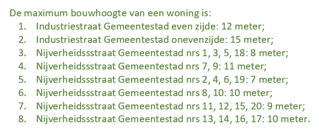
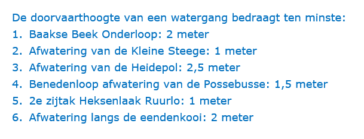
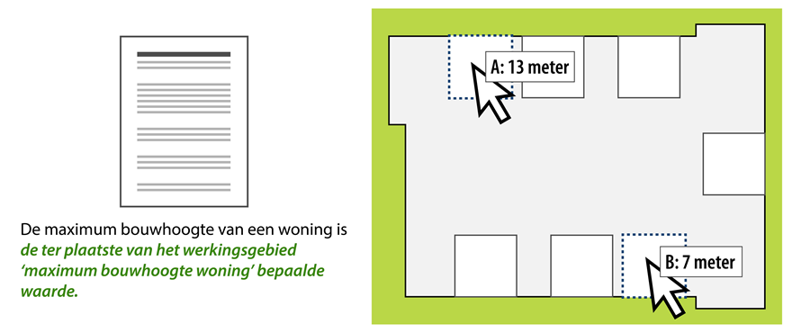
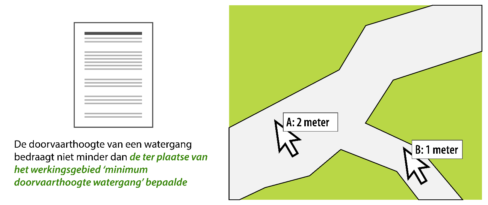
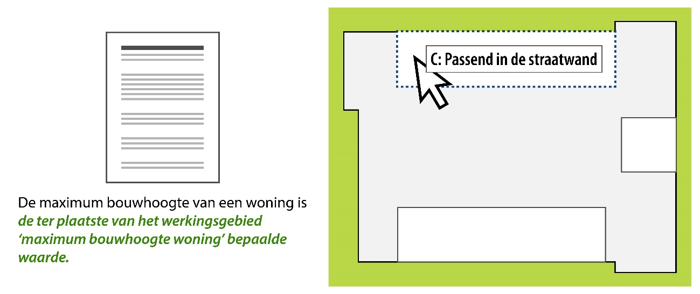

## Overige modelleringsaspecten van 

### Standaardindeling AMvB/MR

#### Toelichting

Om het bestuursorgaan de mogelijkheid te bieden de AMvB/MR zoveel mogelijk naar
eigen inzicht in te delen, stelt dit toepassingsprofiel slechts één
indelingseis. Die betreft de bijlage met namen en identificatiecodes van de
geografische informatieobjecten. Als in een AMvB geen informatieobjecten
voorkomen, vervalt deze verplichting.

#### Norm

De Regeling van moet een bijlage met namen en identificatiecodes van de
geografische informatieobjecten bevatten. Deze verplichting geldt niet als in
een AMvB geen geografische informatieobjecten voorkomen.

### Begripsbepalingen

#### Toelichting

Het doel van begripsbepalingen is om eenduidig vast te leggen wat wordt bedoeld
met een term die in een regeling wordt gebruikt. Begripsbepalingen bestaan uit
één of meer begrippen, die ieder bestaan uit een term en de definitie van die
term.

In is het toegestaan om op elke plek in de regeling begripsbepalingen op te
nemen. Begripsbepalingen kunnen dus allemaal in één artikel worden opgesomd, of
allemaal in een bijlage, maar ook in verschillende artikelen verspreid over de
tekst van de regeling. Ook combinaties daarvan zijn toegestaan. Op deze manier
is het bijvoorbeeld mogelijk om de algemene begrippen bij elkaar te zetten in
een specifiek daarvoor bestemde bijlage en contextgebonden begrippen, oftewel
begrippen die betrekking hebben op slechts een bepaald onderwerp in de regeling,
op te nemen in een artikel in het regelingonderdeel dat over dat onderwerp gaat.
Wanneer begrippen in een bijlage worden opgenomen, is het noodzakelijk om in een
artikel in de regeling (tekstueel) te verwijzen naar die bijlage. In het geval
van contextgebonden begrippen moet in de regeltekst duidelijk worden gemaakt dat
de betreffende begrippen alleen voor dat regelingonderdeel of dat onderwerp
gelden.

Om het met wijzigingsbesluiten invoegen en verwijderen van begrippen eenvoudig
te houden worden, wanneer er meerdere begrippen bij elkaar in één bijlage of in
één artikel worden gezet, de begrippen in alfabetische volgorde geplaatst zonder
gebruik te maken van nummering.

Het is mogelijk om met de systematiek voor Verwijzingen die in paragraaf 8.4 is
beschreven, een verwijzing te maken van een term die in de tekst van een regel
voorkomt naar een begrip in de begripsbepalingen waar die term wordt
gedefinieerd. Die verwijzing maakt het, bijvoorbeeld op overheid.nl en in
DSO-LV, mogelijk dat de raadpleger de definitie van een term te zien krijgt als
die term in de regel voorkomt. Het maken van zo’n verwijzing gebeurt in de
software waarmee het omgevingsdocument wordt opgesteld en/of geannoteerd en
vergt een menselijke handeling. Het gebeurt niet automatisch in bijvoorbeeld
LVBB of DSO-LV en dus ook niet onbedoeld.

Om machineleesbaar vast te leggen dat iets een begrip is, wordt gebruik gemaakt
van het STOP-Inhoud-element Begrippenlijst. Dit is een specifieke vorm van een
Lijst die gericht is op het coderen van een lijst met termen en hun definities.
Deze systematiek maakt geen onderscheid tussen algemene begrippen en
contextgebonden begrippen. Dat onderscheid wordt door de opsteller aangebracht
door de plaatsing van begrippen in de regeling en door de formulering.

Begrippen die in een bijlage worden geplaatst maken onlosmakelijk deel uit van
het juridische deel van de AMvB/MR. Om dat ook technisch te bewerkstelligen
dienen dergelijke bijlagen onderdeel te zijn van de Regeling en niet van het
Besluit. Alles wat deel uitmaakt van een Regeling wordt doorgeleverd aan DSO-LV
en is daar te raadplegen. Begrippen die in een bijlage buiten de Regeling worden
geplaatst, zijn in DSO-LV niet te raadplegen.

Opgemerkt wordt dat het niet de bedoeling is om de begrippen in een artikel of
een bijlage Begripsbepalingen te annoteren met de domeinspecifieke OW-objecten
Activiteit, Omgevingswaarde, Omgevingsnorm en Gebiedsaanwijzing.

#### Norm

Voor de begripsbepalingen gelden de volgende regels:

-   begripsbepalingen kunnen op iedere gewenste plaats in de regeling en/of een
    bijlage bij die regeling worden opgenomen;

-   wanneer de begrippen in een bijlage worden geplaatst, wordt in het artikel
    Begripsbepalingen een tekstuele verwijzing naar de bijlage met begrippen
    opgenomen

-   wanneer alle begrippen bij elkaar worden geplaatst in één artikel
    Begripsbepalingen begint dit artikel met een introducerende zin;

-   wanneer begrippen bij elkaar worden geplaatst in een bijlage bij de regeling
    begint deze bijlage met een introducerende zin;

-   ieder begrip bestaat uit een term en een definitie;

-   de begrippen worden in alfabetische volgorde opgenomen en krijgen geen
    opsommingstekens in de vorm van nummers of letters.

Om machineleesbaar te maken dat iets een begrip is wordt gebruik gemaakt van de
STOP-systematiek Begrippenlijst: een specifieke vorm van een Lijst die gericht
is op het coderen van een lijst met definities. Hiervoor wordt verwezen naar de
betreffende STOP-documentatie.

### Meet- en rekenbepalingen

#### Toelichting

In zullen regels voorkomen waarvan duidelijk moet zijn hoe er bij de toepassing
ervan gemeten en/of gerekend moet worden. Dit zal onder andere het geval zijn
bij omgevingswaarden (zie paragraaf 7.7) en omgevingsnormen (zie paragraaf 7.8).
Hoe gemeten en/of gerekend moet worden, wordt vastgelegd in meet- en
rekenbepalingen.

Meet- en rekenbepalingen kunnen overal in de Regeling voorkomen.

Het is mogelijk om met de systematiek voor de Verwijzing die in paragraaf 8.4 is
beschreven, aan te geven welke meet- en rekenbepalingen bij welke andere regels
(zoals een omgevingswaarde en/of omgevingsnorm) horen. Die verwijzing maakt het,
bijvoorbeeld op overheid.nl en in DSO-LV, mogelijk dat de raadpleger de meet- en
rekenbepaling te zien krijgt waar deze in de regeltekst van toepassing is. De
verwijzing geeft een generieke relatie; er wordt niet machineleesbaar gemaakt
dat de verwijzing meet- en rekenbepalingen betreft. Het maken van zo’n
verwijzing gebeurt in de software waarmee het omgevingsdocument wordt opgesteld
en/of geannoteerd en vergt een menselijke handeling. Het gebeurt niet
automatisch in bijvoorbeeld LVBB of DSO-LV en dus ook niet onbedoeld.

Meet- en rekenbepalingen die in een bijlage worden geplaatst maken onlosmakelijk
deel uit van het juridische deel van . Om dat ook technisch te bewerkstelligen
dienen dergelijke bijlagen onderdeel te zijn van de Regeling en niet van het
Besluit. Alles wat deel uitmaakt van de Regeling wordt doorgeleverd aan DSO-LV
en is daar te raadplegen. Meet- en rekenbepalingen die in een bijlage buiten de
Regeling worden geplaatst, zijn in DSO-LV niet te raadplegen.

#### Norm

Wanneer er in meet- en rekenbepalingen voorkomen gelden daarvoor de volgende
regels:

-   meet- en rekenbepalingen kunnen overal in de regeltekst worden geplaatst.

Om machineleesbaar te maken dat iets een meet- of rekenbepaling is, wordt
gebruik gemaakt van de STOP-systematiek Begrippenlijst: een specifieke vorm van
een Lijst die gericht is op het coderen van een lijst met definities. Hiervoor
wordt verwezen naar de betreffende STOP-documentatie.

### Verwijzing

#### Toelichting

Een stuk tekst kan een verwijzing naar een ander tekstelement of ander document
bevatten. Voorbeelden hiervan zijn:

-   de verwijzing vanuit een begrip in een regel naar de begripsbepaling waarin
    dat begrip wordt gedefinieerd;

-   de verwijzing vanuit een beleidsregel over de toepassing van een open norm
    naar de regel waarin de open norm is vastgelegd;

-   de verwijzing vanuit een artikel naar de artikelsgewijze toelichting op dat
    artikel (en vice versa);

-   de verwijzing vanuit een regel naar een wettelijke bepaling;

-   de verwijzing vanuit een tekstelement in een omgevingsdocument met
    Vrijetekststructuur naar een ander tekstelement in datzelfde of een ander
    omgevingsdocument of in een ander besluit of regeling.

Het gaat hier om een simpele verwijzing; de verhouding tussen het ene
tekstelement en het andere tekstelement of document is niet gekwalificeerd. Met
de hier beschreven verwijzing wordt ook uitdrukkelijk niet de verwijzing vanuit
een Juridische regel, Divisie, Divisietekst of Tekstdeel naar een Locatie of een
OW-object bedoeld.

Het model maakt het mogelijk de hier bedoelde verwijzing te maken. Hiervoor
wordt gebruik gemaakt van de STOP-XML-elementen IntRef (voor verwijzingen tussen
tekstelementen binnen een omgevingsdocument) en ExtRef (voor verwijzingen vanuit
een omgevingsdocument naar tekstelementen in) andere documenten; dat kunnen
omgevingsdocumenten maar ook andere typen documenten zijn). Een verwijzing kan
gemaakt worden naar een tekstelement in de AMvB/MR zelf, maar ook naar (een
tekstelement in) een ander document.

Bij een verwijzing naar een ander document is aandacht nodig voor de formulering
van de verwijzing. Wanneer een algemene verwijzing naar het andere document
wordt gemaakt, dus zonder te verwijzen naar een specifieke versie daarvan, zou
een wijziging in het andere document onbedoeld kunnen leiden tot wijziging van
de AMvB/MR zonder dat daar een besluit van het bevoegd gezag aan ten grondslag
ligt. Zo’n algemene verwijzing zonder specifieke versie noemen we een dynamische
verwijzing. Wanneer het ongewenst is dat een wijziging in het andere document
doorwerkt in de AMvB/MR kan een statische verwijzing worden gemaakt. Er wordt
dan expliciet verwezen naar een specifieke versie van dat andere document.

Ten behoeve van de goede raadpleegbaarheid van de AMvB/MR wordt sterk aanbevolen
om in ieder geval gebruik te maken van de verwijzing vanuit een begrip in een
regel naar de begripsbepaling waarin dat begrip wordt gedefinieerd.

#### Norm

Voor het maken van de verwijzing wordt gebruik gemaakt van de generieke
XML-elementen IntRef (voor de verwijzing naar een ander tekstelement in
hetzelfde document) en ExtRef (voor de verwijzing naar (tekstelementen in) een
ander document).

### Standaardfrase als verbinding tussen Regeltekst, Locatie en waarden

In omgevingsdocumenten met regels zullen normen voorkomen die in verschillende
gebieden verschillende waarden hebben, denk hierbij bijvoorbeeld aan maximum
bouwhoogte in het omgevingsplan of minimum doorvaarthoogte in de
waterschapsverordening. Het is mogelijk om in de Regeltekst van het
omgevingsdocument voor iedere norm zoveel regels op te nemen als er gebieden
zijn, dan wel als er waarden zijn die de norm kan aannemen. Figuur 42 en Figuur
43 laten voor omgevingsplan en waterschapsverordening een stukje Regeltekst zien
waarin deze systematiek is toegepast:

1.  Beschrijving van de gebieden waar de norm geldt én de waarden zijn in de
    Regeltekst opgenomen, voorbeeld omgevingsplan

1.  Beschrijving van de gebieden waar de norm geldt én de waarden zijn in de
    Regeltekst opgenomen, voorbeeld waterschapsverordening

De leesbaarheid en raadpleegbaarheid kunnen worden vergroot door de Locaties
waar regels gelden en de waarden die normen op de verschillende Locaties hebben,
op een kaartbeeld weer te geven.

Voor die tweede methode biedt de standaard de mogelijkheid om de norm zodanig te
formuleren dat deze voor de mens leesbaar en begrijpelijk is én de verbinding
legt met de Locaties en alle waarden die de betreffende norm op de afzonderlijke
Locaties van heeft. Hiertoe wordt in de norm een standaardfrase opgenomen. De
standaardfrase is een in algemene bewoording geformuleerde verwijzing naar de
Locaties. Na interactie met het kaartbeeld wordt de op die locatie geldende
waarde getoond. Zoals in de paragrafen 7.7 en 7.8 over het annoteren met de
OW-objecten Omgevingswaarde en Omgevingsnorm is aangegeven, kunnen de waarden
kwantitatief of kwalitatief (oftewel in woorden beschreven) zijn. Ook kan de
waarde een verwijzing naar de Regeltekst zijn. De standaard maakt het weergeven
van alle varianten mogelijk.

Een voorbeeld van een norm met een standaardfrase die in het omgevingsplan kan
voorkomen: "De maximum bouwhoogte van een woning is *de ter plaatse van het
werkingsgebied ‘maximum bouwhoogte woning’ bepaalde waarde*." In dit voorbeeld
is de standaardfrase in cursieve tekst aangegeven. Afhankelijk van de plaats die
wordt geraadpleegd, wordt de op die plaats geldende waarde na interactie met het
kaartbeeld getoond. Figuur 44 laat hiervan een voorbeeld zien:

1.  Standaardfrase in Regeltekst, weergave van de waarden door interactie met
    kaart, omgevingsplan

Het resultaat van bevraging A is dat de waarde 13 meter wordt getoond. Het
resultaat van bevraging B is dat de waarde 7 meter wordt getoond.

Een voorbeeld van een norm met een standaardfrase die in de
waterschapsverordening kan voorkomen: "De doorvaarthoogte van een watergang
bedraagt niet minder dan *de ter plaatse van het werkingsgebied ‘minimum
doorvaarthoogte watergang’ bepaalde waarde*." In dit voorbeeld is de
standaardfrase in cursieve tekst aangegeven. Afhankelijk van de plaats die wordt
geraadpleegd, wordt de op die plaats geldende waarde na interactie met het
kaartbeeld getoond. Figuur 45 laat hiervan een voorbeeld zien:

1.  Standaardfrase in Regeltekst, weergave van de waarden door interactie met
    kaart, waterschapsverordening

Het resultaat van bevraging A is dat de waarde 2 meter wordt getoond. Het
resultaat van bevraging B is dat de waarde 1 meter wordt getoond.

Dit kan ook met kwalitatieve waarden, waarbij bijvoorbeeld locatie C de waarde
'passend in het straatbeeld' heeft en locatie D de waarde 'niet hoger dan de
kerk':

1.  Standaardfrase in Regeltekst, weergave van de waarden door interactie met
    kaart, kwalitatief, omgevingsplan

### Onderdelen van de standaard die voor omgevingsdocumenten met Artikelstructuur verplicht of noodzakelijk zijn

Een besluit kan pas in werking treden als het is bekendgemaakt, aldus artikel
3:40 Awb. De Bekendmakingswet stelt algemene regels over de bekendmaking. Voor
omgevingsdocumenten[^1] gelden specifieke regels[^2]. Omgevingsdocumenten, en
ontwerpen daarvan, moeten door het betrokken bestuursorgaan elektronisch worden
vormgegeven overeenkomstig STOP, IMOW en het betreffende toepassingsprofiel en
moeten voor publicatie worden aangeleverd aan het bronhouderskoppelvlak van de
LVBB. Daarnaast is in de Omgevingswet bepaald dat omgevingsdocumenten worden
ontsloten via DSO-LV.

[^1]: Omgevingsdocumenten zijn besluiten en andere rechtsfiguren die in de
Omgevingsregeling (de ministeriële regeling bij de Omgevingswet) als zodanig
zijn aangewezen

[^2]: Deze regels zijn vastgelegd in de Regeling standaarden publicaties
Omgevingswet, een ministeriële regeling bij de Bekendmakingswet

#### Juridische verplichtingen voor de bekendmaking

Door de hiervoor genoemde bepalingen geldt een aantal verplichtingen voor het
publiceren van ontwerpen en het juridisch rechtsgeldig bekendmaken van
besluiten. Een besluit tot vaststelling of wijziging van moet worden vormgegeven
overeenkomstig de in paragraaf 4.3 voorgeschreven en op toegespitste
STOP-modellen voor Besluit en Regeling. De regels in het Lichaam van de Regeling
moeten worden gestructureerd overeenkomstig de in paragraaf 5.2 beschreven
specificaties voor de Artikelstructuur. Van ieder artikel of lid moet, door er
een of meer Locaties aan te koppelen, worden vastgelegd wat het werkingsgebied
ervan is. Bij elkaar horende collecties van Locaties moeten worden vastgesteld
in de vorm van een GIO, waarmee de identiteit en onveranderlijkheid van de
geometrie wordt geborgd. De GIO’s moeten bij het besluit over de regeling worden
gevoegd. In de tekst van het artikel of lid moet met een tekstuele aanduiding
een verwijzing naar het GIO gemaakt worden. Door deze verwijzing in de tekst
krijgt het GIO juridische status.

#### Annotaties voor de dienstverlening in DSO-LV

Belangrijke resultaten van het annoteren met OW-objecten zijn het herkenbaar op
de kaart weergegeven van de werkingsgebieden van artikelen en leden en het
mogelijk maken van selecteren en filteren. Annoteren met OW-objecten verhoogt
het niveau van dienstverlening in het Omgevingsloket van DSO-LV. Er is niet
wettelijk bepaald dat en in welke mate geannoteerd moet worden, wel dat daarbij
IMOW en het betreffende toepassingsprofiel moeten worden toegepast. Om het
afgesproken dienstverleningsniveau van DSO-LV te bereiken is het annoteren wel
noodzakelijk.

Om het omgevingsdocument met alles wat daar bij hoort in DSO-LV te kunnen tonen,
is het verplicht om, eenmalig per omgevingsdocument, het Regelingsgebied aan te
leveren[^3].

[^3]: Zie voor de uitzondering op de aanleveringsplicht paragraaf 7.13

Het annoteren van een artikel of lid met de overige OW-objecten is alleen
mogelijk als dat artikel of lid is geannoteerd met Regeltekst en Juridische
regel. Om te voldoen aan de verplichting om aan te geven waar een artikel of lid
geldt, moet het worden gekoppeld aan de juiste Locatie of Locaties.

Het annoteren met Activiteit zorgt er voor dat de Locaties waar de regel over
een bepaalde activiteit geldt, herkenbaar op de kaart wordt weergegeven. Ook
maakt het machineleesbaar hoe de regel op die Locaties wordt gekwalificeerd:
voor de betreffende activiteit geldt op deze locatie een vergunningplicht en op
die locatie een verbod. Daarnaast speelt het annoteren met Activiteit een
belangrijke rol bij de toepasbare regels. Het is namelijk zo dat, wanneer een
bevoegd gezag in een omgevingsdocument een vergunningplicht of meldingsplicht
voor een activiteit instelt, het verplicht is om het elektronisch indienen van
aanvragen en meldingen mogelijk te maken. Dat gebeurt door het aanleveren van
een vragenboom met toepasbare regels over activiteiten. Toepasbare regels maken
gebruik van de activiteiten die aanwezig zijn in de functionele structuur van de
Registratie Toepasbare Regels. Wanneer een regelingversie met daarin een
annotatie met een nieuwe Activiteit aan DSO-LV wordt aangeleverd, wordt deze
automatisch toegevoegd aan de functionele structuur van het betreffende bevoegde
gezag. Dit is de enige route om daaraan activiteiten toe te voegen. Ten behoeve
van de werking van toepasbare regels is het dus noodzakelijk om te annoteren met
Activiteit.

Wanneer het bevoegd bezag bepaalde normen op verschillende plekken verschillende
waarden wil geven kan dat op twee manieren. De eerste manier is door alle
adressen of percelen én de bijbehorende waarden in de tekst van de regel op te
nemen, zoals getoond in Figuur 33 en Figuur 34 in paragraaf 7.8.1. Doordat de
waarden en de adressen of percelen waar die waarden gelden in de (mensleesbare)
tekst staan, vormen ze rechtstreeks onderdeel van het besluit. Ze hebben daarmee
juridische werking. Als het bevoegd gezag de gebruiker makkelijker en
duidelijker inzicht wil geven, dan kiest het bevoegd gezag voor de tweede
manier: het annoteren met de OW-objecten Omgevingsnorm en Omgevingswaarde. Dat
zorgt ervoor dat in het kaartbeeld herkenbaar is dat een Locatie hoort bij een
regel over een omgevingsnorm of omgevingswaarde en dat door middel van
interactie met de kaart per locatie te zien is welke waarde daar geldt. De
Locaties en de bij de omgevingsnorm of omgevingswaarde behorende waarden worden
in een GIO vastgelegd. In de tekst van de regel wordt met behulp van een
tekstuele aanduiding verwezen naar het GIO (zie Figuur 14 voor een illustratie).
Door het vastleggen van de waarden in GIO’s en daarnaar door middel van een
noemer in de tekst van de regel te verwijzen, krijgen de waarden juridische
werking en zijn ze onderdeel van het besluit.

Regels die een specifiek gebied aanwijzen, kunnen worden geannoteerd met een van
de typen Gebiedsaanwijzing. Dat zorgt er voor dat die gebieden herkenbaar op de
kaart worden weergegeven en dat er kan worden gefilterd op alle regels die over
een bepaald type gebied gaan. De annotatie met Gebiedsaanwijzing kan tevens
worden gebruikt om de relatie met een ander omgevingsdocument te versterken,
wanneer daarin dezelfde Gebiedsaanwijzing-annotatie voor dezelfde Locatie is
toegepast.

Met het attribuut thema kan tenslotte worden aangegeven over welk aspect van de
fysieke leefomgeving de regel gaat. Ook met thema kan de relatie met een ander
omgevingsdocument worden versterkt, als daarin hetzelfde thema is geannoteerd.
