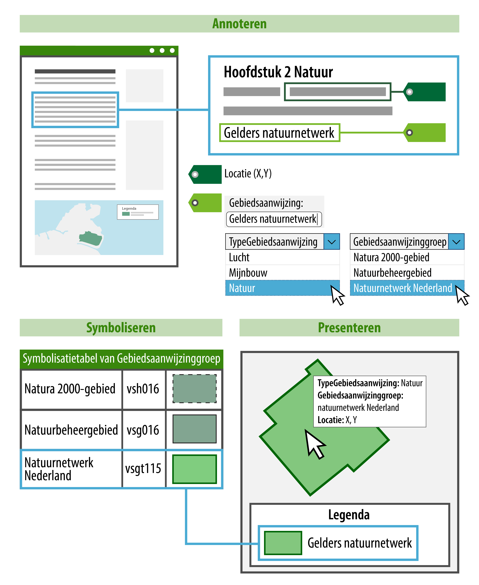
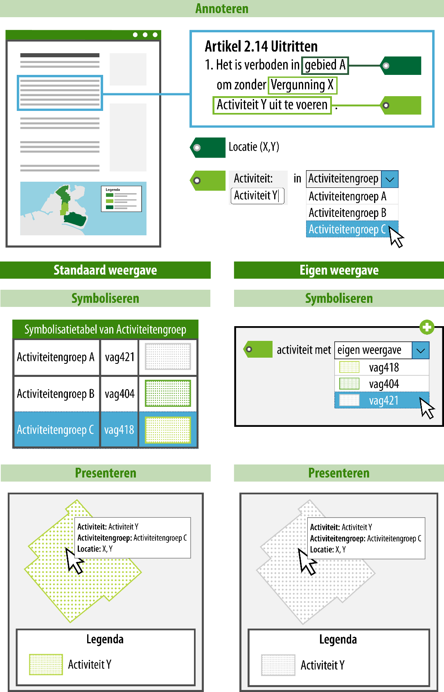

## Uitgangspunten voor de toepassingsprofielen voor omgevingsdocumenten

In dit hoofdstuk worden de uitgangspunten voor de toepassingsprofielen voor
omgevingsdocumenten beschreven. Deze uitgangspunten zijn mede gebruikt als
bouwstenen voor de ontwikkeling van de TPOD’s. Deze informatie is met name
beschrijvend van aard en dient het doel achtergrond te bieden voor deel B, dat
de modellering van de omgevingsvisie beschrijft en voortborduurt op de
uitgangspunten beschreven in dit hoofdstuk. Dit hoofdstuk beschrijft generiek de
toegepaste principes in algemene bewoording. Het is mogelijk dat onderdelen van
die teksten voor de omgevingsvisie niet van toepassing zijn.

### Proces van totstandkoming en bekendmaking c.q. publicatie van omgevingsdocumenten

Het proces van opstellen van omgevingsdocumenten en daarbij toepassen van de
STOP/TPOD-Standaarden begint intern bij het bevoegd gezag. Waar dat relevant is
voor het instrument kan een informeel deel volgen dat bestaat uit participatie
en (voor)overleg. Deze informele fase is vormvrij. In het informele deel van het
proces kan een informele versie van het omgevingsdocument gebruikt worden die
aan de STOP/TPOD-Standaarden voldoet, maar dat is niet verplicht.

Bij het opstellen van het omgevingsdocument ten behoeve van het formele deel van
het proces moet gebruik gemaakt worden van de standaarden STOP en TPOD. De
standaarden ondersteunen ook dit opstelproces. Na het opstellen van het
omgevingsdocument volgen voor die instrumenten waarvoor dat van toepassing is
publicatie en kennisgeving van het ontwerp van het omgevingsdocument en later
publicatie of bekendmaking van het besluit op overheid.nl.

Op overheid.nl worden alleen ontwerp- en vastgestelde besluiten gepubliceerd
respectievelijk bekendgemaakt. Vooralsnog is nog niet voorzien in een landelijk
beschikbare omgeving waarin ook informele versies van de omgevingsdocumenten
beschikbaar gesteld en geraadpleegd kunnen worden.

### Omgevingsdocumenten met en zonder regels

Er is onderscheid tussen omgevingsdocumenten die regels bevatten, zoals het
omgevingsplan, en omgevingsdocumenten die geen regels bevatten, zoals de
omgevingsvisie.

Omgevingsdocumenten die regels bevatten, zullen vanuit de gebruikerstoepassing
van het DSO het meest bevraagd worden. Daarom worden aan die omgevingsdocumenten
extra eisen gesteld ten behoeve van de bekendmaking en zijn er extra
mogelijkheden aan toegevoegd voor bevraging en raadpleging. Om deze reden
besteden de standaarden bijzondere aandacht aan deze categorie als het gaat om
tekststructuur, annotaties en weergave.

De omgevingsdocumenten zonder regels hebben een ander karakter. Ze hebben een
vrijere opzet en kennen geen artikelsgewijze indeling. Hiervoor geldt dan ook
een aantal eisen niet die wel voor de omgevingsdocumenten met regels gelden,
zoals vaste tekststructuren.

De specificaties voor de tekststructuur zijn opgenomen in hoofdstuk 5.

### Initieel besluit, wijzigingsbesluit en geconsolideerde Regeling

Omgevingsdocumenten komen in principe tot stand door het nemen van een initieel
besluit (het eerste besluit waarbij een volledig omgevingsdocument wordt
vastgesteld). Bij het omgevingsplan en de waterschapsverordening bestaat het
initiële besluit uit een overgangsrechtelijke situatie en/of een regeling van
rijkswege. Daarna kunnen de omgevingsdocumenten door wijzigingsbesluiten
gewijzigd worden. Voor omgevingsplannen, omgevingsverordeningen,
waterschapsverordeningen, AMvB’s, MR en omgevingsvisies geldt de verplichting ze
in geconsolideerde vorm beschikbaar te stellen. De LVBB zorgt er voor dat alle
achtereenvolgens genomen wijzigingsbesluiten verwerkt worden tot een doorlopende
versie van het omgevingsdocument: de geconsolideerde Regeling. In hoofdstuk 4
wordt dit nader beschreven.

### Annoteren

Onder annoteren verstaan we het toevoegen van gegevens aan (onderdelen van)
regelingen, gegevens die de regelingen machineleesbaar maken. Dit zorgt ervoor
dat de regeling gestructureerd bevraagbaar is en dat locaties en andere gegevens
op een kaart weergegeven worden. Het annoteren helpt ook bij het verbinden van
toepasbare regels, oftewel vragenbomen, aan regels met locaties. De gegevens die
bij het annoteren worden toegevoegd worden niet in de voor de mens leesbare
tekst weergegeven. Voor degene die dat wil zijn ze wel terug te vinden. Het
annoteren van omgevingsdocumenten met OW-objecten is beschreven in hoofdstuk 6.
Daar wordt ook van ieder OW-object aangegeven wat het doel is van die annotatie,
met andere woorden: wat levert de extra inspanning van het annoteren op aan
meerwaarde voor gebruiker en opsteller?

### Waardelijsten

Een waardelijst is een collectie van waarden die gebruikt kunnen worden bij het
annoteren. Bij diverse attributen van annotaties hoort een waardelijst met
vooraf gedefinieerde waarden. Waardelijsten zijn er in twee vormen: limitatieve
waardelijsten en uitbreidbare waardelijsten. In de toepassingsprofielen voor de
omgevingsdocumenten bedoelen we daar het volgende mee:

-   limitatieve waardelijst: een lijst met vooraf gedefinieerde waarden waaruit
    gekozen moet worden. Deze waardelijst wordt centraal beheerd en kan alleen
    beheermatig gewijzigd worden, aangezien een wijziging direct effect heeft op
    de werking en functionaliteiten van de applicaties van DSO-LV en LVBB;

-   uitbreidbare waardelijst: een lijst met vooraf gedefinieerde waarden.
    Wanneer de gewenste waarde op de waardelijst voorkomt, wordt die gebruikt.
    De bedoeling is dat, als de gewenste waarde niet op de waardelijst voorkomt,
    het bevoegd gezag een eigen waarde kan definiëren. Het stelsel ondersteunt
    uitbreidbare waardelijsten echter nog niet. Daarom is aan de uitbreidbare
    waardelijsten toegevoegd de waarde ‘Nog toe te voegen’. Die waarde kan
    worden gebruikt wanneer het bevoegd gezag een eigen waarde zou willen
    gebruiken.

De waardelijsten IMOW zijn vastgelegd in de Stelselcatalogus van het DSO-LV.

In hoofdstuk 7 is per objecttype is aangegeven voor welke attributen een
waardelijst geldt en of deze limitatief of uitbreidbaar is.

### Presentatiemodel

De inhoud van een omgevingsdocument dient kenbaar te zijn. Daarom moet een
omgevingsdocument niet alleen machineleesbaar worden aangeboden, maar is ook een
voor de mens te interpreteren presentatie noodzakelijk. Uitgangspunt is dat de
tekst, de bijbehorende Locaties en de waarden die normen op de verschillende
Locaties hebben zo overzichtelijk worden gepresenteerd dat de raadpleger ze kan
interpreteren.

Het Presentatiemodel richt zich op de mensleesbare vorm van het presenteren.
Onder presenteren verstaan we het weergeven en visualiseren van de inhoud van
een regeling in een voorgedefinieerde vorm (gebruik van symbolen, kleur,
lijndikte, arcering, karakterset) conform een afgesproken standaard. Het
Presentatiemodel beschrijft daarbij de wijze van presenteren van annotaties met
OW-objecten op een kaart.

De mensleesbare presentatie van Locaties maakt gebruik van de annotaties met
OW-objecten, waardelijsten en symboolcodes. Een symboolcode die is toegekend aan
een waarde uit de waardelijsten IMOW bepaalt hoe Locaties, de bijbehorende
annotaties en waarden op een kaartbeeld worden weergegeven. De tabel geeft de
symbolisatie waarmee een annotatie wordt gepresenteerd. Hierbij wordt een waarde
uit een limitatieve waardelijst aan de bijbehorende, afgesproken, symboolcode
gekoppeld. Gebruik van de symboolcode uit de waardelijsten IMOW leidt tot een
standaardweergave, ook wel geharmoniseerde weergave genoemd. Figuur 1 laat de
werking van de standaardweergave zien voor een annotatie met een
Gebiedsaanwijzing.

<figure id="figuur01">
    
    <figcaption>Presentatiemodel: annoteren met object, type en groep, in combinatie met symboolcode uit waardelijst IMOW, toepassing standaardweergave </figcaption>
</figure>

<!--

1.  Presentatiemodel: annoteren met object, type en groep, in combinatie met
    symboolcode uit waardelijst IMOW, toepassing standaardweergave
-->

Figuur 1 laat zien dat een tekst wordt gekoppeld aan een Locatie. Om de Locatie
herkenbaar op een kaart weer te geven is deze geannoteerd met een
Gebiedsaanwijzing, in dit geval van het type Natuur. Het bevoegd gezag heeft
zelf een naam gekozen voor de Gebiedsaanwijzing (in dit geval ‘Gelders
Natuurnetwerk’) en heeft aangegeven tot welke groep die specifieke
Gebiedsaanwijzing hoort. De groep wordt gekozen uit de waardelijst ‘Natuurgroep’
die hoort bij de Gebiedsaanwijzing van het type Natuur. In het voorbeeld is uit
de waardelijst de waarde ‘Natuurnetwerk Nederland’ gekozen. De groep is het
onderdeel van de annotatie dat bepaalt hoe de Locatie op de kaart wordt
weergegeven. Alle waarden voor groep van de waardelijsten IMOW hebben een
symboolcode die bepaalt hoe de groep wordt weergegeven: de kleur, arcering, mate
van transparantie en lijnstijl. Voor het bevoegd gezag is het voldoende om aan
te geven welke groep van toepassing is. Een viewer kan dan geautomatiseerd met
behulp van de symboolcode uit de waardelijsten IMOW de Locatie met de juiste
standaardsymbolisatie weergeven.

Het bevoegd gezag heeft twee methoden om zelf invloed uit te oefenen op de
weergave van objecten, Locaties en waarden op een kaart. De eerste methode is
door te kiezen voor een eigen, specifieke symbolisatie in plaats van de
standaardweergave. Dit maakt het bijvoorbeeld mogelijk om de activiteiten ‘het
exploiteren van een discotheek’ en ‘het exploiteren van daghoreca’ ieder op een
eigen manier weer te geven in plaats van met de standaardweergave die hoort bij
de Activiteitengroep ‘exploitatieactiviteit horeca’. Figuur 2 laat daarvan
(enigszins versimpeld) een voorbeeld zien. IMOW heeft daarvoor het objecttype
SymbolisatieItem. Met SymbolisatieItem kan het bevoegd gezag een eigen,
specifieke symbolisatie geven aan ActiviteitLocatieaanduiding, Normwaarde en (de
verschillende typen) Gebiedsaanwijzing.

<figure id="figuur02">
    
    <figcaption>Presentatiemodel: annoteren met object en groep, in combinatie met de symboolcode uit de waardelijsten IMOW, toepassing standaardweergave (links) en eigen weergave (rechts)</figcaption>
</figure>

<!--

1.  Presentatiemodel: annoteren met object en groep, in combinatie met de
    symboolcode uit de waardelijsten IMOW, toepassing standaardweergave (links)
    en eigen weergave (rechts)
-->

Figuur 2 laat het verschil zien tussen de toepassing van de standaardweergave en
de eerste methode voor het bevoegd gezag om zelf invloed uit te oefenen op de
weergave, namelijk door te kiezen voor een eigen, specifieke symbolisatie. Het
bovenste deel van de afbeelding laat, net als in Figuur 1 maar dan voor een
activiteit, zien dat een tekst wordt gekoppeld aan een Locatie, de activiteit
een naam krijgt en een groep wordt gekozen. Het onderste deel van de figuur laat
aan de linkerkant de toepassing van de standaardweergave zien. Dit is al
beschreven in de toelichting op Figuur 1. De rechterkant toont de toepassing van
de eigen, specifieke symbolisatie. Het bevoegd gezag kiest uit de
symbolenbibliotheek de symboolcode die het beste past bij de manier waarop het
het object wil weergeven. In dat geval gaat de specifieke symbolisatie boven de
weergave-werking van de groep.

De tweede methode die het bevoegd gezag heeft om zelf invloed uit te oefenen op
de weergave is het samenstellen van kaarten en kaartlagen. Daarmee geeft het
bevoegd gezag zelf aan dat bepaalde informatie, of een set van informatie, op
een kaart of kaartlaag wordt weergegeven. IMOW kent hiervoor de objecten Kaart
en Kaartlaag, die in de paragrafen 7.10 en 7.11 zijn beschreven.

### Metadata

Informatie en specificaties voor de metadata die moeten worden meegeleverd bij
de aanlevering voor de bekendmaking c.q. publicatie van omgevingsdocumenten zijn
te vinden in de STOP-documentatie.

### Van plan tot publicatie

#### Het aanleverproces

Het bevoegd gezag levert via het digitale kanaal het digitale besluit aan via
het bronhouderskoppelvlak. Het digitale besluit bestaat uit een generiek formeel
deel met daarin de artikelen c.q. beleidstekst en geografische
informatieobjecten (verder afgekort tot GIO, zie hiervoor paragraaf 6.1.2.2) en
een Omgevingswetdeel met specifieke objecten vanuit dit domein (verder:
OW-objecten, zie hiervoor hoofdstuk 7). In het geval van een wijzigingsbesluit
levert het bevoegd gezag de consolidatie-instructies ten behoeve van het
consolideren van het wijzigingsbesluit in de regeling. Beide delen vormen een
gevalideerd consistent geheel. De LVBB verzorgt de publicatie van het formele
deel van het besluit in het digitale publicatieblad van het bevoegde gezag op
officiëlebekendmakingen.nl en consolideert het besluit in de regeling. De
OW-objecten worden gedistribueerd naar DSO-LV ten behoeve van het
Omgevingsloket.

<figure id="figuur03">
    
    <figcaption>Aanleverproces</figcaption>
</figure>

<!--

1.  Aanleverproces
-->

#### Raadplegen

##### Raadplegen in het officiële publicatieblad

Op officielebekendmakingen.nl wordt het besluit formeel bekend gemaakt in het
digitale publicatieblad van het bevoegde gezag. De authentieke tekst van het
besluit wordt in PDF-formaat weergegeven en er is een zogeheten landingspagina
voor de informatieobjecten. Tevens is er een web-versie van het besluit.

Daarnaast worden de consolidatie-instructies verwerkt in de geldende regeling
van dat moment. Dit resulteert in een documentgerichte weergave van de regeling
van waaruit de informatieobjecten kunnen worden benaderd. De informatieobjecten
worden afzonderlijk getoond in een interactieve viewer en kunnen vanuit daar ook
worden gedownload.

Raadplegen is alleen mogelijk per omgevingsdocument of regeling en dus ook
alleen van één bevoegd gezag. Er is geen integraal overzicht van alle regels
voor de leefomgeving.

##### Raadplegen in DSO-LV

DSO-LV ontvangt de geconsolideerde regeling met de OW-objecten. In het
Omgevingsloket zijn diverse functies beschikbaar voor de gebruiker. Het biedt de
mogelijkheid tot het oriënteren op de integrale regels of het integrale beleid
over de fysieke leefomgeving via de kaart. Met een klik op de kaart zijn de daar
geldende regels en het geldende beleid te raadplegen. De locaties uit de diverse
regelingen worden via een legenda gesymboliseerd op de kaart. De tekst en kaart
geven ook selectiemogelijkheden, bijvoorbeeld het tonen van regeltekst en
locaties voor een specifieke activiteit, het uitsluitend tonen van regels die
voor iedereen gelden of het tonen van beleid over een specifiek beleidsaspect
met de bijbehorende locaties. De getoonde tekst komt uit de geconsolideerde
Regelingen vanuit de officiële publicatiebladen.

Tot slot vormen de OW-objecten de basis voor de toepasbare regels (vragenbomen)
in het Omgevingsloket, indien van toepassing. De locaties zijn gekoppeld aan de
activiteiten in de vragenboom. De vragenbomen zelf worden via een apart kanaal
aangeleverd.
