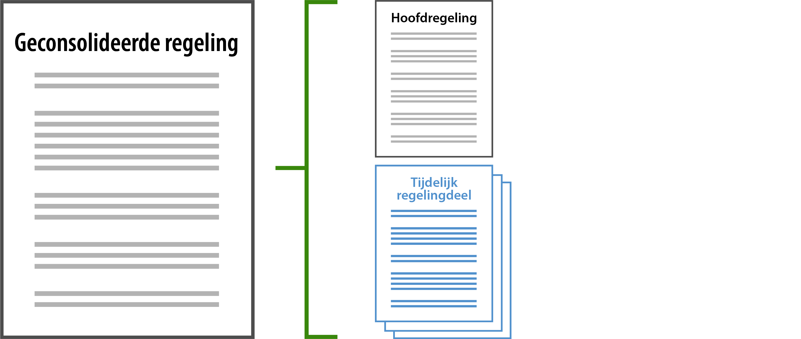
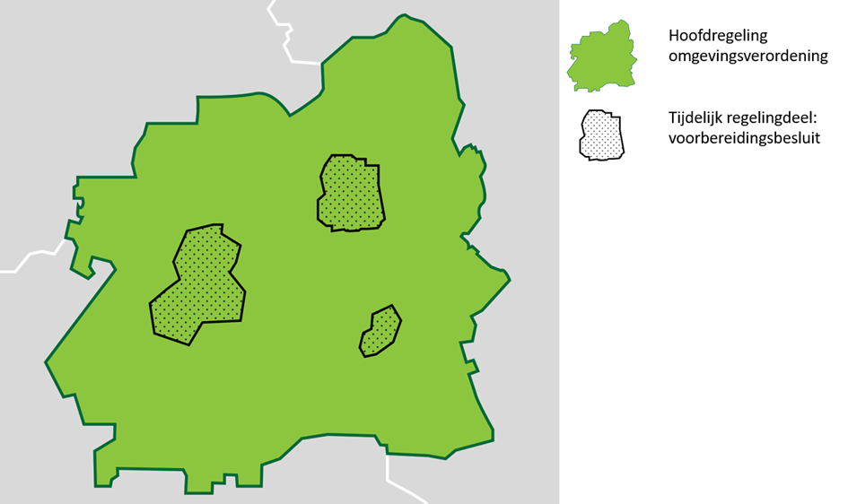

## Inhoudelijke aspecten van de omgevingsverordening

Dit hoofdstuk beschrijft het instrument omgevingsverordening en heeft als doel
de functionele elementen in het toepassingsprofiel te kunnen identificeren.

Paragraaf 2.1 schetst het karakter van de omgevingsverordening. Deze schets
bevat informatie op hoofdlijnen, die van belang is voor de functionele elementen
in het toepassingsprofiel.

In paragraaf 2.2 staan algemene kenmerken van de omgevingsverordening. Deze
kenmerken geven de (juridische, procedurele, etc.) context weer van de
omgevingsverordening, maar beschrijven geen domeinspecifieke zaken.

Paragraaf 2.3 beschrijft domeinspecifieke kenmerken van de omgevingsverordening.
Dit zijn niet alleen inhoudelijke kenmerken van de omgevingsverordening zelf.
Waar relevant zijn ook kenmerken beschreven die aangeven hoe de
omgevingsverordening zich verhoudt tot zaken in breder verband, bijvoorbeeld ten
opzichte van andere instrumenten. In paragraaf 2.4 wordt aandacht besteed aan
het andere omgevingsdocument dat de omgevingsverordening kan wijzigen, namelijk
het voorbereidingsbesluit, en het meervoudig bronhouderschap. In paragraaf 2.5
ten slotte worden overgangsfase en overgangsrecht beschreven.

### Kenschets rechtsfiguur

Rijk, provincies, waterschappen en gemeenten stellen elk (integraal) beleid en
regels vast en nemen vervolgens andere (uitvoerings)besluiten over de
ontwikkeling, het gebruik, de bescherming en het beheer en onderhoud van de
fysieke leefomgeving voor hun grondgebied. Zij leggen dit vast in één of
meerdere omgevingsdocumenten.

Elk van deze bestuursorganen heeft in het stelsel voor het omgevingsrecht zijn
eigen bevoegdheden en verantwoordelijkheden en daarmee samenhangende
instrumenten, waaronder de omgevingsdocumenten.

De provincie stelt regels over de fysieke leefomgeving en legt deze vast in één
omgevingsverordening voor haar gehele grondgebied. De omgevingsverordening bevat
in de eerste plaats de regels die op grond van de Omgevingswet worden gesteld en
daarnaast ook regels over de fysieke leefomgeving die worden gesteld op grond
van de Provinciewet en andere bijzondere wetten.

De omgevingsverordening zorgt ervoor dat het beleid en de doelen zoals opgenomen
in de Omgevingswet, AMvB’s en de provinciale omgevingsvisie en programma’s
doorwerken naar derden. De provincie kan daartoe in de omgevingsverordening
algemeen bindende regels en instructieregels opnemen, omgevingswaarden
vaststellen en beperkingengebieden aanwijzen.

Voor zover het gaat om regels waarmee functies aan locaties worden toegedeeld
ligt het primaat bij het omgevingsplan. Het uitgangspunt is dat de provincie op
dat punt alleen instructieregels opneemt in de omgevingsverordening over de
inhoud van omgevingsplannen. Alleen als het onderwerp van zorg niet doelmatig en
doeltreffend met een instructieregel of een instructie kan worden behartigd,
kunnen in de omgevingsverordening regels worden gesteld over activiteiten die
gevolgen (kunnen) hebben voor de fysieke leefomgeving met het oog op een
evenwichtige toedeling van functies aan locaties.

### Algemene kenmerken omgevingsverordening

In Tabel 1 tot en met Tabel 3 zijn de algemene kenmerken van de
omgevingsverordening opgenomen. Deze kenmerken leggen de algemene eigenschappen
vast, waarmee informatie over de omgevingsverordening wordt bijgehouden. Doel
van deze tabellen is het weergeven van de meest essentiële algemene kenmerken
van het instrument zodat de lezer het beter kan plaatsen en vergelijken met
bestaande instrumenten, niet om een volledig sluitende beschrijving te geven. De
in de tabellen aangehaalde artikelen zijn afkomstig uit de Omgevingswet (verder:
Ow), tenzij anders vermeld.

1.  Juridische kenmerken

| Onderwerp                                                                 | Specificatie                                                                                                                                  |
|---------------------------------------------------------------------------|-----------------------------------------------------------------------------------------------------------------------------------------------|
| Grondslag rechtsfiguur                                                    | Artikel 2.6 Ow                                                                                                                                |
| Voorbereidingsprocedure                                                   | Toepassen afdeling 3.4 Awb verplicht                                                                                                          |
| Tijdstip bekendmaking/ terinzagelegging vastgestelde omgevingsverordening | Door bestuursorgaan te bepalen                                                                                                                |
| Wijze van bekendmaking                                                    | Bekendmaking door plaatsing van het volledige besluit in het elektronisch publicatieblad van het bestuursorgaan dat het besluit heeft genomen |
| Tijdstip inwerkingtreding                                                 | Inwerkingtreding op achtste dag na dag van bekendmaking of op in besluit aangegeven andere datum                                              |
| Rechtsbescherming                                                         | hoofdregel: geen bezwaar en beroep mogelijk                                                                                                   |
| Geldt toepassingsprofiel ook voor ontwerpbesluit                          | Ja                                                                                                                                            |
| Rechtsfiguur roept meldingsplicht of vergunningplicht in het leven        | Ja                                                                                                                                            |
| Rechtsfiguur bevat voor eenieder bindende regels                          | Ja                                                                                                                                            |

2.  Kenmerken ten behoeve van metadata en annotaties

| Onderwerp                                                                                                   | Specificatie              |
|-------------------------------------------------------------------------------------------------------------|---------------------------|
| Bevoegde bestuurslaag                                                                                       | Bevoegd tot vaststellen:  |
| Bestuursorgaan                                                                                              | Bevoegd tot vaststellen:  |
| Omgevingsdocument kan rechtstreeks ander omgevingsdocument wijzigen (meervoudig bronhouderschap)            | Nee                       |
| Ander omgevingsdocument kan rechtstreeks onderhavig omgevingsdocument wijzigen (meervoudig bronhouderschap) | Ja, voorbereidingsbesluit |
| Rechtsfiguur kan gewijzigd worden door wijzigingsbesluiten                                                  | Ja                        |

-   provincie

-   Rijk (via indeplaatsstelling)

-   provinciale staten

-   gedeputeerde staten (na delegatie)

-   minister (via indeplaatsstelling)

1.  Vergelijking met huidige rechtsfiguren en RO Standaarden

| Onderwerp                                                | Specificatie                                                                                                                  |
|----------------------------------------------------------|-------------------------------------------------------------------------------------------------------------------------------|
| Vergelijkbaar met/ voortzetting van huidige rechtsfiguur | provinciale verordening ruimte (Wro) provinciale milieuverordening (Wet milieubeheer) provinciale waterverordening (Waterwet) |
| Voortzetting van instrument in                           | Ja, provinciale verordening                                                                                                   |
| RO Standaarden                                           |                                                                                                                               |
| INSPIRE thema                                            | Planned Land Use: SpatialPlan                                                                                                 |

### De inhoud van de omgevingsverordening

De Omgevingswet geeft geen sluitend overzicht van onderwerpen waarover in de
omgevingsverordening regels gesteld moeten of kunnen worden. Wel is bepaald
welke aspecten de fysieke leefomgeving in ieder geval omvat en welke gevolgen
worden aangemerkt als gevolgen voor de fysieke leefomgeving.

In de wet staan vervolgens -soms expliciet, vaker ook impliciet- specifiekere
bepalingen over de inhoud van de omgevingsverordening, zoals het aanwijzen van
onderwerpen waarover regels alleen in een omgevingsverordening mogen worden
opgenomen.

In de Omgevingswet is bepaald dat bij AMvB gevallen kunnen worden aangewezen:

-   waarin regels over de fysieke leefomgeving alleen in de omgevingsverordening
    mogen worden opgenomen;

-   waarin regels over de fysieke leefomgeving niet in de omgevingsverordening
    mogen worden opgenomen.

Deze gevallen zijn aangewezen in artikel 2.1 van het Omgevingsbesluit[^1]. Naast
de regels die, als ze worden gesteld, in de omgevingsverordening moeten worden
opgenomen en de regels over onderwerpen die daarin niet mogen worden opgenomen,
ontstaat als vanzelf ook een categorie regels over onderwerpen die in de
omgevingsverordening kunnen worden opgenomen maar waarvan dat niet verplicht
wordt gesteld. Over die onderwerpen kunnen regels ook in een (andere)
verordening worden gesteld.

[^1]: Lichaam van de regeling als bedoeld in Aanwijzing 3.53 van de Aanwijzingen
voor de regelgeving en in IMOP

Tabel 4 biedt een overzicht van de belangrijkste regels en onderwerpen die de
omgevingsverordening op grond van de Omgevingswet moet, respectievelijk kan,
bevatten.

1.  Inhoudelijke kenmerken omgevingsverordening

| Onderwerp                            | Bron | Karakterisering/ Toelichting                                                                                                                                 |
|--------------------------------------|------|--------------------------------------------------------------------------------------------------------------------------------------------------------------|
| Cultureel erfgoed en Werelderfgoed   | Bkl  | Verplicht uitwerken van instructieregels voor de bescherming van cultureel erfgoed en werelderfgoed                                                          |
| Natuurnetwerk, inclusief Natura 2000 | Bkl  | Verplicht uitwerken van instructieregels voor de bescherming van het natuurnetwerk en de daarbinnen aangewezen Natura2000-gebieden                           |
| Lokaal spoor                         | Bkl  | Verplicht uitwerken van instructieregels voor de beperkingengebieden lokaal spoor                                                                            |
| Luchthavens                          | Bkl  | Verplicht uitwerken van instructieregels voor de beperkingengebieden van luchthavens                                                                         |
| Stiltegebieden                       | Bkl  | Verplicht uitwerken van instructieregels voor stiltegebieden                                                                                                 |
| Grondwater                           | Bkl  | Verplicht uitwerken van instructieregels voor grondwaterbeschermingsgebieden                                                                                 |
| Regionale waterkeringen              | Bkl  | Verplicht uitwerken van instructieregels met betrekking tot omgevingswaarden voor de veiligheid van regionale waterkeringen                                  |
| Overstromingen                       | Bkl  | Verplicht uitwerken van instructieregels met betrekking tot omgevingswaarden voor de gemiddelde kans op overstroming van bij verordening aangewezen gebieden |
| Luchtkwaliteit                       | Bkl  | De mogelijkheid om strengere regels of aanvullende omgevingswaarden met betrekking tot luchtkwaliteit op te nemen                                            |
| Ammoniak                             | Bkl  | Het opnemen van regels voor ammoniak-verzuringsgevoelige gebieden                                                                                            |
| Instructieregels                     | Ow   | Instructieregels over bevoegdheden van Gedeputeerde Staten, zoals:                                                                                           |
| Instructieregels                     | Ow   | Opstellen van instructieregels voor waterschapsverordening en omgevingsplan, over:                                                                           |
| Provinciaal belang                   | Ow   | Opstellen van regels voor onderwerpen met een provinciaal belang (gemeente-overstijgend, subsidiariteitsbeginsel), zoals:                                    |

-   beoordelingsregels voor omgevingsvergunningen

-   regels voor de toepassing van een ontheffing

-   regels voor het vaststellen van een programma of projectbesluit

-   een evenwichtige toedeling van functies

-   beoordelingsregels voor de vergunningverlening voor milieubelastende
    activiteiten

-   het verplicht (niet) opnemen van omgevingswaarden

-   het opnemen van maatwerkregels

-   monitoring

-   het beheer van watersystemen

-   de vergunningplicht in de waterschapsverordening

-   beheer van de provinciale weg

-   (verbod) op het ontgassen van binnenvaartschepen

-   verplicht zuiveren van gronden van distels

-   regels rondom gaswinning, windenergie, etc.

-   regels voor zorgvuldig ruimtegebruik en ruimtelijke kwaliteit

-   regels over agrarische ontwikkelingen

-   regels over stedelijke ontwikkelingen

-   regels met betrekking tot leegstand

### Andere omgevingsdocumenten die de omgevingsverordening wijzigen

In het algemeen is een bestuursorgaan verantwoordelijk voor het vaststellen en
wijzigen van het omgevingsdocument waarvoor het op grond van de Omgevingswet is
aangewezen als bevoegd gezag en worden omgevingsdocumenten alleen gewijzigd door
wijzigingsbesluiten van hetzelfde type. In het geval van het omgevingsplan
berust die bevoegdheid primair bij de gemeente, maar zijn er ook andere
bestuursorganen die andere typen besluiten nemen die leiden tot wijziging van
het omgevingsplan. Gedeputeerde Staten kunnen met een reactieve interventie
besluiten dat een onderdeel van een besluit tot vaststelling of wijziging van
het omgevingsplan geen deel van het omgevingsplan uitmaakt (artikel 16.21 Ow).
Waterschap, provincie en Rijk kunnen een projectbesluit vaststellen dat het
omgevingsplan wijzigt met regels die nodig zijn voor het uitvoeren en in werking
hebben of in stand houden van het project (artikel 5.52 lid 1 Ow). Een
voorbereidingsbesluit wijzigt het omgevingsplan met voorbeschermingsregels; zo’n
voorbereidingsbesluit kan worden genomen door gemeente (artikel 4.14 Ow) of door
provincie of Rijk (artikel 4.16 Ow). De wetgever heeft reactieve interventie,
projectbesluit en voorbereidingsbesluit zo bedoeld dat het nemen ervan tot
gevolg heeft dat het het omgevingsplan, dus een ander type omgevingsdocument,
wijzigt. Technisch uitgedrukt zijn er bij een voorbereidingsbesluit op grond van
artikel 4.16 Ow, een reactieve interventie en een projectbesluit meerdere
bevoegde gezagen, oftewel bronhouders, die het omgevingsplan kunnen wijzigen.
Dit wordt meervoudig bronhouderschap genoemd.

In juridische zin is meervoudig bronhouderschap niet heel ingewikkeld. Gebleken
is echter dat meervoudig bronhouderschap in technische zin heel complex is.
Enerzijds omdat iedere wijziging niet alleen tekst wijzigt, maar ook locaties,
annotaties en geografische informatieobjecten en ook gevolgen kan hebben voor de
vragenbomen waarmee het omgevingsplan in het Omgevingsloket bevraagd kan worden.
Anderzijds omdat niet eenduidig is hoe wijzigingen uitgevoerd moeten worden.
Voor het omgevingsplan geldt namelijk een overgangsfase waarin gemeenten het
omgevingsplan stapsgewijs kunnen opbouwen. In die periode bestaat het
omgevingsplan uit het omgevingsplan van rechtswege (bestaande uit de geldende
bestemmingsplannen c.a. die in Ruimtelijkeplannen.nl zijn gepubliceerd en dan
via de overbruggingsfunctie getoond worden), het omgevingsplan van Rijkswege
(oftewel de bruidsschatregels) en het omgevingsplan dat de gemeente zelf aan het
opbouwen is. Om deze redenen is het niet haalbaar gebleken dat de plansystemen
van bevoegde gezagen op de beoogde datum van inwerkingtreden van de Omgevingswet
gereed zijn voor de vorm van tweerichtingsverkeer met de LVBB die voor het
meervoudig bronhouderschap nodig is.

Daarom is er interbestuurlijk besloten om in de eerste periode na het in werking
treden van de Omgevingswet geen meervoudig bronhouderschap in technische zin toe
te passen, maar te kiezen voor alternatieve oplossingen om zo te komen tot
complexiteitsreductie. Voor het projectbesluit bestaan de oplossingen in het
overgangsrecht (gedurende de overgangstermijn geldt het projectbesluit als
omgevingsvergunning voor de buitenplanse omgevingsplanactiviteit) en in
afspraken over het wijzigen van het omgevingsplan tussen het bestuursorgaan dat
het projectbesluit voorbereidt en vaststelt en de gemeente. Voor het
voorbereidingsbesluit en de reactieve interventie is gekozen voor een
alternatieve toepassing van het meervoudig bronhouderschap: het concept
‘tijdelijk regelingdeel’; bij de reactieve interventie aangevuld met de opdracht
van provincie aan gemeente om de reactieve interventie in het omgevingsplan te
verwerken.

Dit concept houdt in dat de juridische geconsolideerde regeling kan bestaan uit
één hoofdregeling en nul of meer tijdelijke regelingdelen. Tijdelijk
regelingdelen maken tijdelijk deel uit van de regeling. Technisch zijn het twee
losse delen. Schematisch ziet dit er zo uit:

1.  Geconsolideerde regeling: 1 hoofdregeling en 0 of meer tijdelijk
    regelingdelen

Het concept tijdelijk regelingdeel wordt toegepast bij alle verschijningsvormen
van het voorbereidingsbesluit, dus niet alleen bij de voorbereidingsbesluiten
met meervoudig bronhouderschap (o.g.v. artikel 4.16 Ow), maar ook bij
voorbereidingsbesluiten zonder meervoudig bronhouderschap (o.g.v. de artikelen
4.14 en 4.15 Ow). Bij die laatste categorie voorbereidingsbesluiten voegt het
bevoegd gezag met het voorbereidingsbesluit voorbeschermingsregels toe aan het
‘eigen’ omgevingsplan of de ‘eigen’ omgevingsverordening. Er is een aantal
redenen voor de keuze om het tijdelijk regelingdeel ook toe te passen bij
voorbereidingsbesluiten zonder meervoudig bronhouderschap. Het zorgt voor de
raadpleger voor uniformiteit: alle voorbeschermingsregels zijn op dezelfde
manier vormgegeven en te benaderen. Verder geldt dat voorbeschermingsregels
altijd vervallen, hetzij door een besluit hetzij door tijdsverloop. Door ze
onder te brengen in het tijdelijk regelingdeel is het technisch eenvoudig om ze
niet meer te laten tonen nadat ze zijn vervallen. Automatisch of na slechts een
beperkte handeling zijn de voorbeschermingsregels dan niet meer zichtbaar in
DSO-LV. Wanneer de voorbeschermingsregels rechtstreeks zijn opgenomen in de
geconsolideerde versie van het omgevingsplan of de omgevingsverordening vraagt
dat veel meer van plansoftware en administratie. Dan moet immers de volledige
verwerking van de voorbeschermingsregels in het omgevingsplan of de
omgevingsverordening worden teruggedraaid, waarbij eventueel ook nog
tussentijdse wijzigingsbesluiten een rol kunnen spelen. Daarom is, in ieder
geval voor de eerste periode na het inwerkingtreden van de Omgevingswet, gekozen
voor een oplossing die voor de bevoegde gezagen een zo beperkt mogelijk aantal
complicaties met zich meebrengt.

De regeling van de omgevingsverordening bestaat op deze manier uit één
hoofdregeling en nul of meer tijdelijke regelingdelen. Tijdelijke regelingdelen
heten tijdelijk omdat ze tijdelijk bedoeld zijn: op een gegeven moment vervallen
ze omdat ze niet meer geldig, niet meer van toepassing of niet meer nodig zijn.
De hoofdregeling is het initiële besluit tot vaststelling van de
omgevingsverordening, geconsolideerd met alle wijzigingsbesluiten die de
provincie daarna heeft genomen. Het tijdelijk regelingdeel is een technisch
afzonderlijk deel, dat niet wordt geconsolideerd in de hoofdregeling, maar wel
samen met de hoofdregeling de geconsolideerde regeling vormt. Elk deel (de
hoofdregeling en ieder tijdelijk regelingdeel) is een apart 'work' (een
eigenstandig deel). Ieder tijdelijk regelingdeel kan met wijzigingsbesluiten
worden gewijzigd; dan ontstaat een consolidatie van dat tijdelijk regelingdeel;
het tijdelijk regelingdeel heeft dus ook zijn eigen versies.

In de omgevingsverordening worden tijdelijk regelingdelen toegevoegd door het
voorbereidingsbesluit. Bij het voorbereidingsbesluit wordt het gebruikt om
voorbeschermingsregels vorm te geven als een technisch van de
omgevingsverordening afgescheiden blokje dat in juridische zin onderdeel is van
de geconsolideerde regeling van de omgevingsverordening.

Ieder voorbereidingsbesluit en iedere reactieve interventie leidt tot een
afzonderlijk tijdelijk regelingdeel. Er kunnen dus tegelijkertijd voor het
grondgebied van één gemeente of één provincie meerdere tijdelijk regelingdelen
zijn, ieder ontstaan uit een afzonderlijk voorbereidingsbesluit of, in het geval
van de gemeente, uit een afzonderlijke reactieve interventie. Het is dus niet zo
dat er per gemeente respectievelijk provincie één tijdelijk regelingdeel is
waarin alle reactieve interventies en de voorbeschermingsregels van alle genomen
voorbereidingsbesluiten worden opgenomen.

Visueel gemaakt in een kaartbeeld zoals dat in bijvoorbeeld DSO-LV te zien kan
zijn, ziet dat er uit als weergegeven in Figuur 2:

1.  Schematisch kaartbeeld van geconsolideerde regeling bestaande uit
    hoofdregeling en tijdelijk regelingdelen van één provincie

Opgemerkt wordt dat er toepasbare regels kunnen zijn bij regels uit de
hoofdregeling die door het voorbereidingsbesluit zijn gewijzigd. Als die
toepasbare regels in de Vergunningcheck- en Aanvraagmodules van DSO-LV aanwezig
blijven, krijgt een raadpleger onjuiste informatie. Wanneer er zowel bij de
hoofdregeling als bij het tijdelijk regelingdeel toepasbare regels zijn, krijgt
een raadpleger dubbele informatie die deels juist en deels onjuist is. Er zullen
bestuurlijke afspraken moeten worden gemaakt hoe hiermee omgegaan moet worden.

### Overgangsrecht en overgangsfase

Er is niet voorzien in overgangsrecht voor de omgevingsverordening. Streven is
dat de provincies hun omgevingsverordeningen op het moment van inwerkingtreding
van de Omgevingswet hebben vastgesteld en bekendgemaakt.
