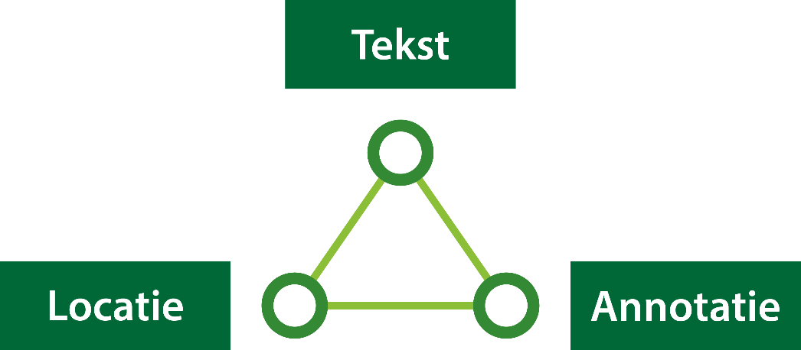

## Inleiding op het Informatiemodel Omgevingswet

Het Informatiemodel Omgevingswet, verder afgekort tot IMOW, beschrijft vanuit
informatiekundig én domeininhoudelijk perspectief de aspecten die van belang
zijn voor het annoteren bij het opstellen van omgevingsdocumenten en ten behoeve
van de informatieverschaffing in DSO-LV.

Dit hoofdstuk geeft een introductie op IMOW. Paragraaf 6.1 beschrijft de drie
hoofdcomponenten van IMOW: tekst, locatie en annotatie. Voordat daar in
hoofdstuk 7 gedetailleerd wordt ingegaan, wordt in paragraaf 6.2 beschreven hoe
het annoteren met OW-objecten vanuit de standaard is bedoeld.

### De drie hoofdcomponenten van IMOW: tekst, locatie en annotatie

1.  De hoofdcomponenten van IMOW

Bovenstaande figuur toont de drie hoofdcomponenten van IMOW in hun samenhang.
IMOW is een model waarmee van tekst kan worden vastgelegd op welke locatie deze
geldig is en aan tekst en locatie met behulp van annotaties gegevens kunnen
worden toegevoegd. Die gegevens maken tekst en locatie machineleesbaar waardoor
ze bekendgemaakt kunnen worden, herkenbaar in een viewer weergegeven kunnen
worden en waardoor onderdelen geselecteerd en bevraagd kunnen worden. Het
vervolg van deze paragraaf beschrijft deze drie componenten in grote lijnen. In
hoofdstuk 7 worden ze in detail beschreven.

Benadrukt wordt dat IMOW alleen van toepassing is op het Lichaam van de Regeling
van omgevingsdocumenten, oftewel het onderdeel dat de artikelen respectievelijk
de (beleids)teksten bevat.

#### Tekst

Zoals in hoofdstuk 5 al is beschreven kent STOP twee soorten tekststructuur:
Artikelstructuur en Vrijetekststructuur. In het STOP-tekstmodel is
Artikelstructuur de tekststructuur voor het Lichaam van een Regeling die is
opgebouwd uit één of meer artikelen. Vrijetekststructuur is de tekststructuur
die wordt gebruikt voor het Lichaam van een Regeling van juridisch authentieke
documenten die geen artikelen bevat én voor diverse onderdelen van Regeling en
Besluit buiten het Lichaam, waaronder Bijlage en Toelichting.

IMOW maakt eveneens onderscheid tussen de Artikelstructuur en de
Vrijetekststructuur. Het verschil met STOP is dat IMOW alleen wordt toegepast op
het lichaam van de Regeling van omgevingsdocumenten, oftewel het onderdeel dat
de artikelen respectievelijk de (beleids)teksten bevat. IMOW wordt dus niet
toegepast op de overige onderdelen van de Regeling, zoals motivering,
artikelsgewijze toelichting en bijlagen, en niet op de onderdelen van het
Besluit. Twee voorbeelden: IMOW wordt wel toegepast op de artikelen met regels
van de omgevingsverordening maar niet op bijlagen bij die regels en ook niet op
de motivering die onderdeel vormt van het besluit, wel op de beleidsteksten in
de omgevingsvisie maar niet op een eventuele bijbehorende zienswijzennota of
participatieverslag.

Voor tekst met Artikelstructuur onderscheidt IMOW de objecten Regeltekst en
Juridische regel (beschreven in subparagraaf 6.1.1.1), voor het lichaam van
omgevingsdocumenten met Vrijetekststructuur heeft IMOW de objecten Divisie,
Divisietekst en Tekstdeel (de onderwerpen van subparagraaf 6.1.1.2).

##### Regeltekst en Juridische regel

Voor het Lichaam van de Regeling van omgevingsdocumenten met Artikelstructuur
onderscheidt IMOW de objecttypen Regeltekst en Juridische regel.

Regeltekst is de IMOW-term voor de kleinste zelfstandige eenheid van (een of
meer) bij elkaar horende Juridische regels in een omgevingsdocument met
Artikelstructuur: artikel en lid. Het OW-objecttype Regeltekst is het
koppelobject naar de STOP-elementen Artikel en Lid. Zoals in paragraaf 5.2 is
beschreven zijn Artikel en Lid in STOP elementen met inhoud en geen
structuurelementen. De Regeltekst is in een tekst concreet aan te wijzen.

Het OW-objecttype Juridische regel staat voor een abstract concept waarmee een
regel met juridische werkingskracht wordt beschreven. Juridische regel wordt
gebruikt om aan verschillende onderdelen van een Regeltekst locaties en
annotaties met de domeinspecifieke OW-objecten (zie daarvoor hoofdstuk 7) te
kunnen koppelen.

Regeltekst bevat altijd ten minste één Juridische regel; wanneer dat gewenst is
kan Regeltekst meerdere Juridische regels bevatten. De individuele Juridische
regels in een Regeltekst met meerdere Juridische regels zijn niet als
zelfstandige eenheden te identificeren. Bij bevraging in bijvoorbeeld DSO-LV zal
altijd de volledige Regeltekst als resultaat worden weergegeven en niet de
individuele Juridische regel. Het is niet verplicht om een Regeltekst in
meerdere Juridische regels onder te verdelen.

##### Divisie, Divisietekst en Tekstdeel

Voor het Lichaam van de Regeling van omgevingsdocumenten met Vrijetekststructuur
onderscheidt IMOW de objecttypen Divisie, Divisietekst en Tekstdeel.

De OW-objecttypen Divisie en Divisietekst zijn de koppelobjecten naar de Divisie
en Divisietekst van STOP. Zoals in paragraaf 5.3 is beschreven is Divisie in
STOP het structurerende element dat ingedeeld kan worden in verschillende
hiërarchische niveaus. De STOP-Divisie is dus vergelijkbaar met Hoofdstuk,
Afdeling en Paragraaf et cetera van de Artikelstructuur. In STOP is Divisietekst
het element dat de inhoud bevat, het is de inhoudelijke bouwsteen van de
Vrijetekststructuur. De STOP-Divisietekst is vergelijkbaar met Artikel (en Lid)
van de Artikelstructuur.

Het OW-objecttype Tekstdeel staat voor een abstract concept waarmee een deel van
een tekst wordt beschreven. Tekstdeel wordt gebruikt om aan verschillende
onderdelen van een Divisie of Divisietekst Locaties en annotaties met de
domeinspecifieke OW-objecten (zie daarvoor hoofdstuk 7) te kunnen koppelen. Een
Divisie of Divisietekst bevat altijd ten minste één Tekstdeel; wanneer dat
gewenst is kan een Divisie of Divisietekst meerdere Tekstdelen bevatten.

Let op dat het STOP-tekstmodel de elementen Divisie en Divisietekst kent en IMOW
de objecttypen Divisie en Divisietekst. Ze zijn niet hetzelfde. De
STOP-elementen Divisie en Divisietekst worden gebruikt voor het Lichaam van de
Regeling van omgevingsdocumenten met Vrijetekststructuur, maar ook voor diverse
andere onderdelen van Besluit en Regeling. Dat is ruimer dan de OW-objecten
Divisie en Divisietekst, die alleen kunnen voorkomen in het Lichaam van de
Regeling van een omgevingsdocument met Vrijetekststructuur.

#### Locatie

##### Werkingsgebied en Locatie

In de toelichtingen op Omgevingswet en Omgevingsbesluit wordt de term
werkingsgebied gebruikt voor het gebied waar een regel zijn werking heeft. IMOW
maakt ook gebruik van de term werkingsgebied. In de praktijk bestaat het
werkingsgebied van een Regeltekst niet altijd uit één aaneengesloten gebied,
maar vaak uit meerdere gebieden en soms ook uit punten of lijnen. IMOW gebruikt
voor de afzonderlijke onderdelen van het werkingsgebied van een Regeltekst het
object Locatie, dat de coördinaten bevat die het gebied begrenzen. Het
werkingsgebied van de Regeltekst bestaat dus uit de optelling van alle Locaties
van de Juridische regels die samen de Regeltekst vormen. Uit het juridisch
systeem volgt dat van iedere Regeltekst duidelijk moet zijn waar deze geldt.
Iedere Regeltekst heeft daarom een werkingsgebied en dus ook één of meer
Locaties.

IMOW kent het werkingsgebied in de vorm van de relatie tussen de Regeltekst en
de Locatie(s) van die Regeltekst, of, als de Regeltekst uit meerdere Juridische
regels bestaat, alle Locaties van de Juridische regels in de Regeltekst. IMOW
noemt de relatie tussen Regeltekst en Locatie(s) werkingsgebied. Deze relatie
wordt door LVBB en in DSO-LV afgeleid, het bevoegd gezag hoeft geen
afzonderlijke geometrie voor het werkingsgebied aan te leveren.

In een Juridische regel kan de term werkingsgebied gebruikt worden als term om
aan te geven dat in die regel een gebied wordt vastgelegd waar die regel zijn
werking heeft. Voorbeelden zijn: “Ter plaatse van het werkingsgebied
‘Stiltegebied’ is het verboden om een toestel te gebruiken dat het ervaren van
de natuurlijke geluiden kan verstoren.” “Ter plaatse van het werkingsgebied van
de omgevingswaarde ‘Duurzame energie’ wordt ernaar gestreefd om in 2025 18
hectare zonnepanelen gerealiseerd te hebben.”

Locatie komt ook voor in het Lichaam van de Regeling van omgevingsdocumenten met
Vrijetekststructuur. Het wordt gebruikt om het gebied vast te leggen waarover
een Tekstdeel gaat. Net als bij de Regeltekst wordt de optelling van alle
Locaties van de Tekstdelen die samen de Divisie of de Divisietekst vormen
werkingsgebied genoemd. Ook hier geldt dat de relatie door LVBB en in DSO-LV
wordt afgeleid en het bevoegd gezag geen afzonderlijke geometrie voor het
werkingsgebied hoeft aan te leveren. Anders dan bij Juridische regel is het niet
verplicht om aan ieder Tekstdeel een Locatie te koppelen.

Figuur 18 laat een voorbeeld zien: een artikel uit een omgevingsdocument met
Artikelstructuur respectievelijk een Divisie of Divisietekst uit een
omgevingsdocument met Vrijetekststructuur heeft drie Locaties die samen het
werkingsgebied van dat artikel of Tekstdeel vormen.

1.  Drie Locaties die samen een werkingsgebied vormen

Ook uit de tekst van Juridische regel of Tekstdeel moet duidelijk blijken welke
Locatie erbij hoort. Daarom wordt in de tekst een verwijzing opgenomen naar de
Locatie. Dit is een mensleesbare term of frase waarmee de Locatie wordt
aangeduid, waaruit een lezer kan begrijpen waar de Locatie betrekking op heeft.
In het object Locatie wordt de tekstuele verwijzing in de vorm van het attribuut
*noemer* vastgelegd. Voorbeelden van de tekstuele verwijzingen (cursief
weergegeven) zijn: “Ter plaatse van het werkingsgebied ‘*Stiltegebied*’ is het
verboden om een toestel te gebruiken dat het ervaren van de natuurlijke geluiden
kan verstoren.” “Ter plaatse van het werkingsgebied van de omgevingswaarde
‘*Duurzame energie*’ wordt ernaar gestreefd om in 2025 18 hectare zonnepanelen
gerealiseerd te hebben.”

Met het OW-objecttype Locatie wordt de begrenzing vastgelegd van het gebied
waarover een Juridische regel of een Tekstdeel gaat. Het kan wenselijk zijn om
in een Juridische regel of een Tekstdeel een onderdeel van zo’n gebied in
woorden te beschrijven, bijvoorbeeld met een geografische of vergelijkbare term
(in het Stadspark, op de Veluwe, in ieder hoekpand), zonder de begrenzing van
zo’n gebied of gebieden vast te leggen. LVBB en DSO-LV kunnen de ligging van
zo’n in woorden beschreven gebied niet afleiden en ook niet tonen. Zij weten
immers niet waar het Stadspark is of waar de hoekpanden zijn. Bij zo’n
Juridische regel of Tekstdeel worden in zo’n geval de Locaties getoond die het
werkingsgebied vormen van de Regeltekst of de Divisie of Divisietekst waarin die
Juridische regel of dat Tekstdeel voorkomt. Het wordt dan aan de lezer
overgelaten om te interpreteren waar de regel wel en niet werking heeft.

In IMOW wordt Locatie niet alleen gekoppeld aan de Juridische regel of het
Tekstdeel, maar ook aan de domeinspecifieke objecttypen Activiteit (via
ActiviteitLocatieaanduiding), Omgevingswaarde, Omgevingsnorm en de verschillende
typen Gebiedsaanwijzing. Met Locatie wordt vastgelegd waar de domeinspecifieke
objecttypen van toepassing zijn. Locatie en de toepassing ervan worden in detail
beschreven in paragraaf 7.4.

##### Vastleggen van Locatie met geografisch informatieobject

In regelingen kan informatie worden vastgelegd die niet op een begrijpelijke
manier in tekst te beschrijven is. De geometrische begrenzing van Locatie is
daar een voorbeeld van; gedacht kan ook worden aan een geluidsfragment. STOP
gebruikt het informatieobject als bedoeld in Aanwijzing 3.50 van de Aanwijzingen
voor de regelgeving (waarin de voorwaarden staan waar verwijzingen naar
informatie op internet aan moeten voldoen) om dergelijke informatie op een
juridisch juiste manier vast te leggen en er vanuit de tekst van een besluit
naar te verwijzen. Een informatieobject dat de geometrische begrenzing van een
of meer Locaties vastlegt wordt een geografisch informatieobject genoemd. (Zoals
al eerder gemeld wordt de term geografisch informatieobject afgekort tot GIO.)
Feitelijk is een GIO een GML-bestand met een of meer Locaties, voorzien van
metadata conform de STOP-specificatie voor een GIO. Een informatieobject is een
opzichzelfstaand object voor het opslaan en via internet ontsluiten van de niet
op een begrijpelijke manier in tekst te beschrijven informatie.

In de tekst van de Regeling moet met een tekstuele aanduiding worden verwezen
naar het GIO. Daardoor wordt de inhoud ervan onderdeel van besluit en regeling.
Voor die tekstuele aanduiding wordt de naam van het GIO gebruikt, die hetzelfde
zal zijn als de noemer van de Locatie. Met deze tekstuele aanduiding van GIO en
Locatie kan een lezer begrijpen op welke locatie de tekst betrekking heeft. De
systematiek waarmee informatieobjecten machineleesbaar worden vastgelegd en de
manier waarop in de Regeling naar het informatieobject wordt verwezen zorgen
ervoor dat:

-   de informatie permanent via de verwijzing is terug te vinden;

-   de informatie met algemeen beschikbare software op een voor de mens
    begrijpelijke manier gepresenteerd kan worden;

-   de onveranderlijkheid van het informatieobject voldoende is gewaarborgd.

STOP bevat de eisen waaraan een GIO moet voldoen. Deze eisen zorgen voor de
borging van de juridische bestendigheid van de GIO’s.

Het informatieobject is geen onderdeel van of bijlage bij de tekst van de
Regeling, maar is een zelfstandige entiteit. Het wordt tegelijk met het besluit
in het publicatieblad van het betreffende bevoegd gezag op
officielebekendmakingen.nl gepubliceerd. Door in de tekst van de Regeling naar
het informatieobject te verwijzen krijgt het informatieobject juridische status.

Voor de bekendmaking van omgevingsdocumenten is het verplicht om de Locatie of
Locaties die het werkingsgebied van Juridische regel of Tekstdeel vormen, vast
te leggen in een GIO. Een uitzondering daarop is een regel die geldt voor het
hele ambtsgebied van het bevoegd gezag: in dat geval wordt de Locatie, oftewel
het ambtsgebied, niet vastgelegd met een GIO. Zie hiervoor verder paragraaf
7.4.5

Het in de tekst van omgevingsdocumenten juridisch juist verwijzen naar het GIO
gebeurt als volgt:

-   In de tekst van het STOP-element (Artikel, Lid of Divisietekst) wordt de
    tekstuele aanduiding van Locatie en GIO opgenomen.

-   De Locatie wordt vastgelegd in een GIO.

-   In het OW-Locatie-object wordt de tekstuele aanduiding opgenomen in de vorm
    van de noemer.

-   In de bijlage Informatieobjecten wordt de tekstuele aanduiding oftewel de
    naam van het GIO opgenomen op een manier vergelijkbaar met een begrip en
    zijn definitie: bij wijze van definitie komt achter de tekstuele aanduiding
    de volledige identificatie van het GIO.

De constructie met een tekstuele aanduiding in de lopende tekst waarna in de
bijlage de aanduiding wordt gekoppeld aan de volledige identificatie van het GIO
zorgt ervoor dat de lopende tekst goed leesbaar blijft, maar dat tevens de
unieke identificatie van het GIO, waarmee de inhoud van het GIO altijd te vinden
is, leesbaar in het besluit en de regeling te vinden is.

Figuur 19 laat een voorbeeld van deze verwijzing zien in een Juridische regel;
Figuur 20 laat een voorbeeld zien van deze verwijzing in een Tekstdeel:

1.  Tekstuele aanduiding en informatieobject in omgevingsdocument met
    Artikelstructuur

1.  Tekstuele aanduiding en informatieobject in omgevingsdocument met
    Vrijetekststructuur

Het is mogelijk om een GIO in meerdere omgevingsdocumenten te gebruiken. In het
omgevingsdocument wordt immers verwezen naar (de identificatie van) het GIO. Dat
maakt het ook mogelijk om te verwijzen naar een GIO van het eigen bevoegd gezag
dat voor een ander omgevingsdocument is gecreëerd of naar een GIO behorend bij
een omgevingsdocument van een ander bevoegd gezag. Een eerste voorwaarde is
uiteraard dat het GIO voldoet aan de in STOP vastgelegde eisen aan een GIO.

Er zitten juridische gevolgen en dus ook juridische risico’s aan het verwijzen
naar een GIO in een ander omgevingsdocument. Wanneer het GIO in het andere
omgevingsdocument wordt gewijzigd, wijzigt ook het werkingsgebied van de regel
of de beleidstekst in het omgevingsdocument dat ernaar verwijst. Dat gebeurt dan
zonder dat het betreffende bevoegd gezag een besluit heeft genomen over de
wijziging in het verwijzende omgevingsdocument. Daarnaast zijn er veel andere
onzekerheden over het verwijzen naar GIO’s die horen bij een ander
omgevingsdocument: hoe houd je wijzigingen in de gaten, wat betekent dit voor de
‘informatiehuishouding’ binnen het eigen bevoegd gezag? Daarom wordt geadviseerd
om vooralsnog geen gebruik te maken van deze verwijsmogelijkheid. In plaats van
te verwijzen naar een GIO in een ander omgevingsdocument kan de betreffende
geometrie worden overgenomen in een eigen GIO.

#### Annotatie

De STOP/TPOD-standaarden maken het voor bevoegde gezagen mogelijk om zich te
beperken tot het verbinden van Juridische regels of Tekstdelen met Locaties. Een
computer weet dan dat beide bij elkaar horen maar kan geen verdere betekenis aan
die relatie geven en kan de Locaties ook niet op een voor de mens herkenbare
manier op een kaart weergeven.

Dat kan wel met het in paragraaf 3.4 al kort beschreven mechanisme annoteren:
het toevoegen van gegevens aan Regelingen of onderdelen daarvan die de
Regelingen machineleesbaar maken. Annoteren zorgt ervoor dat de Regeling
gestructureerd bevraagbaar is en dat Locaties en andere gegevens op een kaart
weergegeven worden. Het annoteren kan ook helpen bij het verbinden van
toepasbare regels, oftewel vragenbomen, aan regels en Locaties. In paragraaf 6.2
wordt de bedoeling van het annoteren van omgevingsdocumenten met OW-objecten
toegelicht. In hoofdstuk 7 worden de OW-objecten in detail gespecificeerd en
toegelicht.

### De bedoeling van het annoteren met OW-objecten

Zoals hiervoor al is beschreven maakt IMOW het mogelijk om vast te leggen op
welke Locatie een bepaalde tekst geldig is en om daar nadere gegevens aan toe te
voegen. Het doel daarvan is om die Locaties herkenbaar op een kaart weer te
geven en om de informatie in het omgevingsdocument raadpleegbaar te maken: met
behulp van die informatie kunnen bepaalde onderdelen geselecteerd worden. Een
voorbeeld daarvan is het annoteren met de activiteit zwemmen. Door in een
zoekscherm de activiteit zwemmen te selecteren, worden in DSO-LV alle artikelen
getoond waarin Juridische regels zijn geannoteerd met die activiteit. Ook worden
in het bijbehorende kaartbeeld alle Locaties getoond die bij die artikelen en
die Activiteit-annotatie horen.

De bedoeling van het annoteren met IMOW is dat de Locaties en de nadere gegevens
een letterlijke vertaling of vastlegging van de regels respectievelijk de
beleidstekst zijn. IMOW is niet bedoeld voor interpretaties, nadere afleidingen
of het toevoegen van niet door regels of beleidsteksten vastgelegde gebieden.
Ook is IMOW niet bedoeld voor a contrario-redeneringen, bijvoorbeeld dat het
gebruik van een annotatie op de ene plek een betekenis geeft aan het ontbreken
van die annotatie (of juist zijn tegenhanger) op een andere plek.

Dit wordt toegelicht aan de hand van twee voorbeelden, het eerste voor een
omgevingsdocument met Artikelstructuur en het tweede voor een omgevingsdocument
met Vrijetekststructuur. De afbeeldingen in de voorbeelden zijn bedoeld om het
principe uit te leggen, niet om de werking van een specifiek instrument te
tonen. De weergave is willekeurig gekozen, het Presentatiemodel is niet
toegepast.

1.  Voorbeeld bedoeling van IMOW, activiteit in omgevingsplan

Bovenstaande afbeelding toont het grondgebied van een gemeente en drie Locaties
die horen bij de Juridische regel van artikel 2.10. Ter plaatse van deze
Locaties is het -kort gezegd- toegestaan om zonder vergunning of melding een
kinderopvanginstelling te exploiteren. De OW-objecten zijn niet bedoeld om
vervolgens af te leiden dat in de rest van het grondgebied van deze gemeente het
exploiteren van een kinderopvanginstelling verboden is, of dat daar voor die
activiteit een vergunningplicht of meldingsplicht geldt. Dat is alleen zo
wanneer het bevoegd gezag dat expliciet heeft bepaald, bijvoorbeeld door een
Locatie voor de rest van het grondgebied op te nemen en daaraan een Juridische
regel met een verbod, vergunningplicht of meldingsplicht te koppelen, met de
bijbehorende annotatie.

1.  Voorbeeld bedoeling van IMOW, omgevingsvisie

Bovenstaande afbeelding toont het grondgebied van een provincie en drie Locaties
die horen bij een hoofdstuk in de omgevingsvisie over
kantoorontwikkelingslocaties. In haar omgevingsvisie legt de provincie vast dat
zij de haar ter beschikking staande middelen wil inzetten om deze Locaties te
ontwikkelen tot kantoorlocaties. De OW-objecten zijn niet bedoeld om vervolgens
af te leiden dat er in de rest van het grondgebied van deze provincie geen
kantoren aanwezig zijn of geen nieuwe kantoren kunnen komen. Dat is alleen zo
wanneer het bevoegd gezag dat expliciet heeft bepaald, bijvoorbeeld door een
Locatie voor de rest van het grondgebied op te nemen en daarvoor als
beleidsvoornemen te formuleren dat bestaande leegstaande kantoorruimte wordt
omgevormd tot woonruimte en dat geen nieuwe kantoorgebouwen worden toegestaan.
