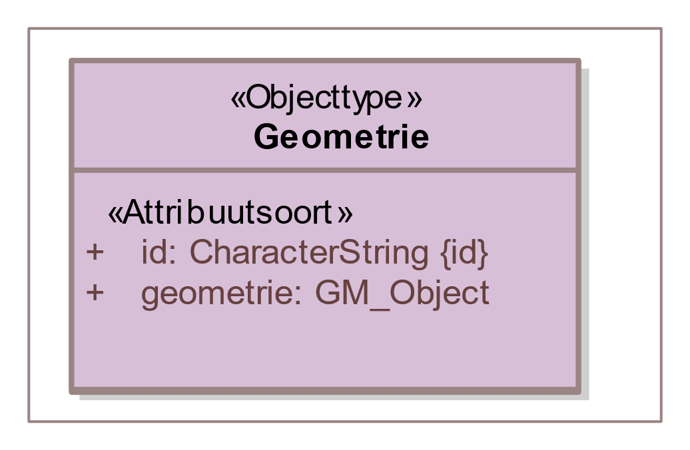
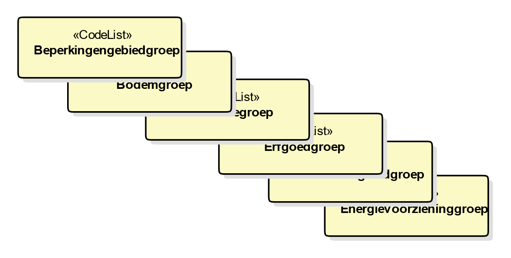
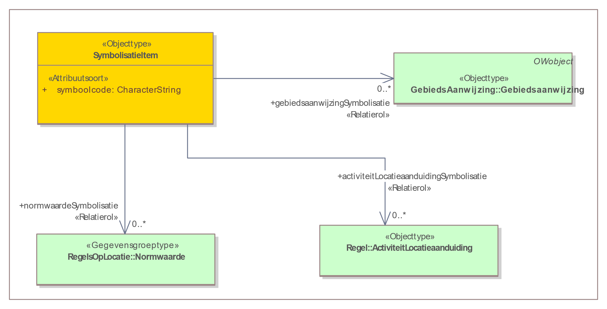

## Annoteren met OW-objecten: productmodel, objecten en attributen

Dit hoofdstuk beschrijft de toepassing van het annoteren met OW-objecten op de
omgevingsvisie. De objecten, de bijbehorende attributen en waardelijsten worden
gedetailleerd toegelicht. Paragraaf 7.1 bevat het productmodel voor de
omgevingsvisie in de vorm van een IMOW-UML-klassediagram, met een korte
toelichting op het diagram. In de paragrafen 7.2 tot en met 7.12 worden in
detail de OW-objecten en hun attributen en de toepassing van die objecten op de
omgevingsvisie beschreven. Ieder onderdeel wordt volgens een vast stramien
beschreven. Het begint met een toelichting op de toepassing: waarvoor en wanneer
wordt het object of attribuut in de praktijk gebruikt. Daarna volgt een
definitie van het object, om precies aan te geven waar het over gaat. In de
volgende subparagraaf wordt aangegeven wat het doel van het objecttype is, met
andere woorden: wat is het resultaat, wat levert de extra inspanning van het
annoteren met dit object op? Vervolgens wordt de norm gesteld. Deze subparagraaf
begint steeds met een uitsnede van het IMOW-diagram met daarin die objecten en
relaties die relevant zijn. De norm somt de attributen op die horen bij dit
OW-object, waarbij wordt aangegeven of het attribuut verplicht of optioneel is,
hoe vaak het attribuut kan of moet voorkomen, of er een waardelijst voor het
attribuut bestaat en of er constraints, oftewel voorwaarden voor de toepassing,
gelden. De daaropvolgende subparagraaf geeft een toelichting op de attributen,
de waardelijsten en de eventuele constraints die samen de norm vormen.

In de laatste twee paragrafen van dit hoofdstuk wordt beschreven op welk niveau
annotaties worden geplaatst en wordt aangegeven hoe het annoteren wordt
toegepast wanneer een deel van norm of beleid in een bijlage staat.

Daar waar in dit hoofdstuk de naam van een OW-object gebruikt wordt, wordt die
naam met een hoofdletter geschreven. De namen van attributen van objecten worden
cursief gedrukt.

### Productmodel: het IMOW-UML-diagram voor de omgevingsvisie

Figuur 17 toont het volledige IMOW-diagram in UML voor het Lichaam van de
Regeling van de omgevingsvisie: het deel dat de (beleids)tekst met de inhoud van
de omgevingsvisie bevat.

<figure id="293a54a1cfacf894411be880fee9ac7d">
    
    <figcaption>IMOW-UML-klassediagram voor de omgevingsvisie</figcaption>
</figure>

<!--

1.  IMOW-UML-klassediagram voor de omgevingsvisie
-->

In het diagram zijn in blauw de tekstobjecten weergegeven: Divisie, Divisietekst
en Tekstdeel. Divisie en Divisietekst (in de donkerblauwe blokjes), zijn de
koppelelementen naar STOP. In roze is Locatie met zijn verschijningsvormen
weergegeven. Het groene blokje staat voor het domeinspecifieke annotatie-object
Gebiedsaanwijzing. Tekst, Locatie en Annotatie zijn de hoofdcomponenten van IMOW
die in paragraaf 6.1 al zijn beschreven. Het witte blokje is het
Regelingsgebied. In het model is aangegeven welke waardelijsten van toepassing
zijn. Het model bevat ook de attributen die nodig zijn om inhoudelijke
annotaties te kunnen presenteren op een kaart. In de navolgende paragrafen
worden de objecten in detail beschreven.

### Objecttype Divisie

#### Toelichting op de toepassing

In het STOP-tekstmodel is Divisie het structurerende hiërarchische element voor
alle elementen die zijn opgebouwd volgens de Vrijetekststructuur: het Lichaam
van de Regeling van omgevingsdocumenten met Vrijetekststructuur maar ook diverse
onderdelen van Besluit en Regeling buiten het Lichaam, zoals Bijlage en
Toelichting.. Divisie is in STOP een structuurelement: het structureert de tekst
maar bevat zelf geen inhoud. In STOP kan Divisie een verzameling van
(lagergelegen) Divisie-, Divisietekst- en/of Tekstdeel-objecten bevatten.

In IMOW komt het objecttype Divisie alleen voor in het Lichaam van de Regeling
van omgevingsdocumenten met Vrijetekststructuur: het deel dat de (beleids)tekst
met de inhoud van de omgevingsvisie bevat. Divisie en de in paragraaf 7.3
besproken Divisietekst zijn in IMOW de koppelobjecten naar STOP.

Opgemerkt wordt dat het OW-object Tekstdeel, het objecttype dat geannoteerd
wordt met de overige OW-objecten, via de koppelobjecten Divisie respectievelijk
Divisietekst wordt gekoppeld aan de STOP-elementen Divisie of Divisietekst. In
STOP is Divisie een structuurelement en is Divisietekst een element dat inhoud
bevat. In omgevingsdocumenten met Vrijetekststructuur is het daardoor mogelijk
om te annoteren op het niveau van het element dat inhoud bevat én op het niveau
van structuurelementen. Dat is anders dan bij omgevingsdocumenten met
Artikelstructuur, waar alleen geannoteerd kan worden op het niveau van het
element dat inhoud bevat, te weten Regeltekst. Wanneer het bevoegd gezag het
omgevingsdocument met Vrijetekststructuur wil annoteren op het niveau van
structuurelementen (bijvoorbeeld op de Divisie van het niveau dat vergelijkbaar
is met een heel hoofdstuk of paragraaf), moet het de tekst structureren met het
STOP-element Divisie en uiteraard het te annoteren Tekstdeel koppelen aan het
OW-objecttype Divisie. Als het bevoegd gezag het omgevingsdocument met
Vrijetekststructuur wil annoteren op het niveau van het element dat inhoud
bevat, moet het het te annoteren Tekstdeel koppelen aan het OW-objecttype
Divisietekst. Annoteren op het niveau van structuurelementen (Divisie) ligt het
meest voor de hand bij annotaties met het attribuut thema en met het objecttype
Hoofdlijn. Het ligt niet voor de hand om dat te doen bij annotaties met het
objecttype Gebiedsaanwijzing. Het annoteren met het objecttype Gebiedsaanwijzing
ligt het meest voor de hand op het niveau van het element dat inhoud bevat:
Divisietekst. Divisietekst kan ook goed geannoteerd worden met het attribuut
thema en met het objecttype Hoofdlijn.

#### Definitie

Het OW-objecttype Divisie is een zelfstandige eenheid van (een of meer) bij
elkaar horende beleidsteksten waarnaar kan worden verwezen in het Lichaam van de
Regeling van omgevingsdocumenten met Vrijetekststructuur.

#### Doel

Doel van het objecttype Divisie is het leggen van de verbinding tussen het
Tekstdeel uit het OW-domein en de Divisie uit STOP.

#### Norm

<figure id="9a42e715d94419ce24f52743b49c648b">
    
    <figcaption>Uitsnede uit IMOW-diagram voor objecttype Divisie</figcaption>
</figure>

<!--

1.  Uitsnede uit IMOW-diagram voor objecttype Divisie
-->

Divisie kent het volgende attribuut:

*identificatie*: de unieke identificatie waaronder elk object van dit type
bekend is. Identificatie conform NEN3610. Verplicht attribuut. Komt 1 keer voor.

Divisie kent geen waardelijsten en geen constraints.

#### Toelichting op de norm

Het attribuut *identificatie* behoeft geen toelichting.

In de uitsnede van het diagram is ook het attribuut *werkingsgebied* te zien.
Dit attribuut is de verwijzing van een specifieke Divisie naar (de identificatie
van) de bijbehorende Locatie(s). De relatie is in een onderbroken lijn
weergegeven omdat het een conceptuele relatie is. De relatie is impliciet
inbegrepen in de relatie tussen Divisie, Tekstdeel en Locatie en geeft aan wat
het werkingsgebied van de Divisie is: het gebied waar het Tekstdeel zijn werking
heeft. De *relatie* wordt afgeleid door LVBB en in DSO-LV waarbij de som van de
locaties van de onderliggende Tekstdelen wordt gebruikt. Het is dus niet zo dat
het bevoegd gezag ook nog een afzonderlijke geometrie voor het werkingsgebied
moet aanleveren.

### Objecttype Divisietekst

#### Toelichting op de toepassing

In het STOP-model voor de Vrijetekststructuur is Divisietekst het element dat
inhoud bevat maar niet zelf inhoud *is*. Het is de inhoudelijke bouwsteen voor
alle elementen die zijn opgebouwd volgens de Vrijetekststructuur: het Lichaam
van de Regeling van omgevingsdocumenten met Vrijetekststructuur maar ook diverse
onderdelen van Besluit en Regeling buiten het Lichaam, zoals Bijlage en
Toelichting.

In IMOW komt het objecttype Divisietekst alleen voor in het Lichaam van de
Regeling van omgevingsdocumenten met Vrijetekststructuur: het deel dat de
(beleids)tekst met de inhoud van de omgevingsvisie bevat. Divisietekst en de in
paragraaf 7.2 besproken Divisie zijn in IMOW de koppelobjecten naar STOP.
Divisietekst kan een verzameling van Tekstdeel-objecten bevatten.

Opgemerkt wordt dat het OW-object Tekstdeel, het objecttype dat geannoteerd
wordt met de overige OW-objecten, via de koppelobjecten Divisie respectievelijk
Divisietekst wordt gekoppeld aan de STOP-elementen Divisie of Divisietekst. In
STOP is Divisie een structuurelement en is Divisietekst een element dat inhoud
bevat. In omgevingsdocumenten met Vrijetekststructuur is het daardoor mogelijk
om te annoteren op het niveau van het element dat inhoud bevat én op het niveau
van structuurelementen. Dat is anders dan bij omgevingsdocumenten met
Artikelstructuur, waar alleen geannoteerd kan worden op het niveau van het
element dat inhoud bevat, te weten Regeltekst. Wanneer het bevoegd gezag het
omgevingsdocument met Vrijetekststructuur wil annoteren op het niveau van
structuurelementen (bijvoorbeeld op de Divisie van het niveau dat vergelijkbaar
is met een heel hoofdstuk of paragraaf), moet het de tekst structureren met het
STOP-element Divisie en uiteraard het te annoteren Tekstdeel koppelen aan het
OW-objecttype Divisie. Als het bevoegd gezag het omgevingsdocument met
Vrijetekststructuur wil annoteren op het niveau van het element dat inhoud
bevat, moet het het te annoteren Tekstdeel koppelen aan het OW-objecttype
Divisietekst. Annoteren op het niveau van structuurelementen (Divisie) ligt het
meest voor de hand bij annotaties met het attribuut thema en met het objecttype
Hoofdlijn. Het ligt niet voor de hand om dat te doen bij annotaties met het
objecttype Gebiedsaanwijzing. Het annoteren met het objecttype Gebiedsaanwijzing
ligt het meest voor de hand op het niveau van het element dat inhoud bevat:
Divisietekst. Divisietekst kan ook goed geannoteerd worden met het attribuut
thema en met het objecttype Hoofdlijn.

#### Definitie

Het OW-objecttype Divisietekst is de diepste zelfstandige eenheid van (een of
meer) bij elkaar horende beleidsteksten waarnaar kan worden verwezen in het
Lichaam van de Regeling van omgevingsdocumenten met Vrijetekststructuur.

#### Doel

Doel van het objecttype Divisietekst is het leggen van de verbinding tussen het
Tekstdeel uit het OW-domein en de Divisietekst uit STOP.

#### Norm

<figure id="ba9e1727fa8d9f702ffb7c815c795e29">
    
    <figcaption>Uitsnede uit IMOW-diagram voor objecttype Divisietekst</figcaption>
</figure>

<!--

1.  Uitsnede uit IMOW-diagram voor objecttype Divisietekst
-->

Divisietekst kent het volgende attribuut:

*identificatie*: de unieke identificatie waaronder elk object van dit type
bekend is. Identificatie conform NEN3610. Verplicht attribuut. Komt 1 keer voor.

Divisietekst kent geen waardelijsten en geen constraints.

#### Toelichting op de norm

Het attribuut *identificatie* behoeft geen toelichting.

In de uitsnede van het diagram is ook het attribuut *werkingsgebied* te zien.
Dit attribuut is de verwijzing van een specifieke Divisietekst naar (de
identificatie van) de bijbehorende Locatie(s). De relatie is in een onderbroken
lijn weergegeven omdat het een conceptuele relatie is. De relatie is impliciet
inbegrepen in de relatie tussen Divisietekst, Tekstdeel en Locatie en geeft aan
wat het werkingsgebied van de Divisietekst is: het gebied waar het Tekstdeel
zijn werking heeft. De *relatie* wordt afgeleid door LVBB en in DSO-LV waarbij
de som van de locaties van de onderliggende Tekstdelen wordt gebruikt. Het is
dus niet zo dat het bevoegd gezag ook nog een afzonderlijke geometrie voor het
werkingsgebied moet aanleveren.

### Objecttype Tekstdeel

#### Toelichting op de toepassing

Tekstdeel is een conceptuele constructie, die in IMOW wordt gebruikt om
verschillende onderdelen van een Divisie of Divisietekst in het Lichaam van de
Regeling van omgevingsdocumenten met Vrijetekststructuur een eigen Locatie te
kunnen geven. Ook maakt Tekstdeel het mogelijk om verschillende onderdelen van
een Divisie of Divisietekst een eigen thema te geven en/of te annoteren met
verschillende domeinspecifieke annotaties van het objecttype Gebiedsaanwijzing.
Tekstdeel is altijd onderdeel van een Divisie of Divisietekst. Divisie en
Divisietekst kunnen meerdere Tekstdelen bevatten. Voor Tekstdeel geldt, net als
voor Divisie en Divisietekst, dat het alleen gebruikt kan worden in het Lichaam
van de Regeling van omgevingsdocumenten met Vrijetekststructuur.

#### Definitie

Tekstdeel is het objecttype, te gebruiken in het Lichaam van de Regeling van
omgevingsdocumenten met Vrijetekststructuur, dat de relatie vormt tussen een
beleids- of realisatietekst en de daarmee samenhangende annotaties.

#### Doel

Doel van het objecttype Tekstdeel is:

-   het kunnen verbinden van verschillende onderdelen van een Divisie of
    Divisietekst met eigen Locaties;

-   het kunnen annoteren van verschillende onderdelen van een Divisie of
    Divisietekst met thema, Hoofdlijn en de verschillende typen
    Gebiedsaanwijzing;

-   het kunnen leggen van de relaties tussen de domeinspecifieke annotaties,
    waardoor het Tekstdeel als geheel machineleesbaar wordt;

-   het, door middel van het attribuut *thema*, in samenhang kunnen tonen van
    verschillende Tekstdelen;

-   het kunnen leggen van verbindingen tussen onderdelen van verschillende
    omgevingsdocumenten, bijvoorbeeld een omgevingsvisie en een
    omgevingsverordening, die met hetzelfde thema zijn geannoteerd.

#### Norm

<figure id="455dca32d19824569dee81df24698d42">
    
    <figcaption>Uitsnede uit IMOW-diagram voor objecttype Tekstdeel</figcaption>
</figure>

<!-->

1.  Uitsnede uit IMOW-diagram voor objecttype Tekstdeel
-->

Tekstdeel kent de volgende attributen:

-   *identificatie*: de unieke identificatie waaronder elk object van dit type
    bekend is. Identificatie conform NEN3610. Verplicht attribuut. Komt 1 keer
    voor.

-   *idealisatie*: attribuut dat vastlegt op welke manier de begrenzing van
    Locatie voor dit Tekstdeel geïnterpreteerd moet worden en door het bevoegd
    gezag bedoeld is. Te kiezen uit de limitatieve waardelijst ‘Idealisatie’.
    Onder voorwaarde verplicht attribuut: alleen te gebruiken wanneer Tekstdeel
    Locatie of Locaties heeft; dan verplicht. Komt dan 1 keer voor.

-   *thema*: de naam van het thema van het Tekstdeel, te kiezen uit de
    limitatieve waardelijst ‘Thema’. Optioneel attribuut. Komt zo vaak voor als
    gewenst.

-   *divisieaanduiding*: de verwijzing van een specifiek Tekstdeel naar de
    Divisie of de Divisietekst waar het Tekstdeel onderdeel van is. Verplicht
    attribuut. Komt 1 keer voor. De keuze tussen Divisie en Divisietekst wordt
    aangegeven met het keuze-element DivisieOfDivisietekst.

-   *hoofdlijnaanduiding*: de verwijzing van een specifiek Tekstdeel naar (de
    identificatie van) de bijbehorende Hoofdlijn(en). Optioneel attribuut. Komt
    zo vaak voor als gewenst.

-   *locatieaanduiding*: de verwijzing van een specifiek Tekstdeel naar (de
    identificatie van) de bijbehorende Locatie(s); attribuut dat een of meer
    specifieke Locatie(s) aanduidt waar dit Tekstdeel van toepassing is.
    Optioneel attribuut. Komt zo vaak voor als gewenst.

-   *gebiedsaanwijzing*: de verwijzing van een specifiek Tekstdeel naar (de
    identificatie van) een Gebiedsaanwijzing. Attribuut dat vastlegt dat het
    Tekstdeel met (één van de typen van) het object Gebiedsaanwijzing
    geannoteerd is. Optioneel attribuut. Komt 0 of 1 keer voor.

-   *kaartaanduiding*: de verwijzing van een specifiek Tekstdeel naar (de
    identificatie van) de Kaart waarop de Locaties en OW-objecten worden
    weergegeven die horen bij het betreffende Tekstdeel. Optioneel attribuut.
    Komt zo vaak voor als gewenst.

Tekstdeel kent de volgende constraint:

-   idealisatie verplicht als Tekstdeel een Locatie heeft

#### Toelichting op de norm

*Attributen*

-   *idealisatie*: attribuut dat aangeeft op welke manier de begrenzing van
    Locatie voor een Tekstdeel door het bevoegd gezag bedoeld is: is het een
    exacte of een indicatieve afbakening? Het attribuut *idealisatie* is in IMOW
    gepositioneerd als attribuut van Tekstdeel. Dat lijkt misschien vreemd omdat
    het informatie geeft over de gewenste interpretatie van Locatie. Toch hoort
    idealisatie bij Tekstdeel omdat het vertelt hoe de Locatie voor dít
    Tekstdeel geïnterpreteerd moet worden. Op deze manier is het mogelijk om
    dezelfde Locatie ook voor een ander Tekstdeel te (her)gebruiken en voor dat
    Tekstdeel een andere idealisatie te geven. De waardelijst ‘Idealisatie’ kent
    twee waarden: exact en indicatief. Hiermee kan worden aangegeven of de
    begrenzing van Locatie voor dit Tekstdeel exact of indicatief bedoeld is.
    Wanneer wordt gekozen voor de waarde indicatief geeft dat alleen aan dat de
    begrenzing indicatief bedoeld is. Met idealisatie wordt niet vastgelegd met
    welke marge de indicatieve begrenzing bedoeld is. Bij Tekstdeel is het
    attribuut *idealisatie* alleen verplicht wanneer het Tekstdeel een Locatie
    heeft. Zie verder de constraint die hierna wordt besproken.

-   *thema*: attribuut dat kernachtig de grondgedachte van het Tekstdeel
    weergeeft. Het thema is een aanduiding van het aspect van de fysieke
    leefomgeving waar de Juridische regel over gaat. Om harmonisatie tussen
    bevoegde gezagen en tussen instrumenten te bevorderen is er een waardelijst
    voor *thema*. Het overgrote deel van de waarden van deze waardelijst is
    rechtstreeks ontleend aan artikel 1.2 Ow, waarin is aangegeven welke
    aspecten de fysieke leefomgeving omvat. In Bijlage 2 wordt de relatie tussen
    artikel 1.2 Ow en de waarden van de waardelijst gelegd.  
    Per Tekstdeel kunnen net zoveel thema’s worden toegevoegd als gewenst is.
    *thema* is een attribuut en geen object. Het kent daardoor geen eigen
    weergave.  
    Met het attribuut *thema* kan het thema van een Tekstdeel worden aangegeven.
    *thema* kan bijvoorbeeld worden gebruikt om alle Tekstdelen over een bepaald
    thema in eenzelfde omgevingsdocument te selecteren, of om van verschillende
    omgevingsdocumenten de Tekstdelen en/of Juridische regels met hetzelfde
    thema te selecteren. Afhankelijk van de functionaliteit die een viewer biedt
    is het vervolgens ook mogelijk om de Locaties van alle Tekstdelen en/of
    Juridische regels met hetzelfde thema op een kaartbeeld weer te geven.  
    Overwogen wordt om aan het objecttype Tekstdeel een attribuut *subthema* toe
    te voegen waarmee het bevoegde gezag desgewenst binnen een thema een nadere
    specialisatie kan aanbrengen.

-   *divisieaanduiding*: attribuut voor de verwijzing van een Tekstdeel naar de
    identificatie van de Divisie of Divisietekst waarin het Tekstdeel voorkomt.
    Tekstdeel wordt via de koppelobjecten Divisie respectievelijk Divisietekst
    gekoppeld aan de STOP-elementen Divisie of Divisietekst. Bij ieder Tekstdeel
    moet bepaald worden of het hoort bij een Divisie of een Divisietekst. Deze
    keuze wordt gemaakt met het keuze-element DivisieOfDivisietekst. Het
    STOP-element Divisie is een structuurelement en het STOP-element
    Divisietekst is een element dat inhoud bevat. In omgevingsdocumenten met
    Vrijetekststructuur is het daardoor mogelijk om te annoteren op het niveau
    van het element dat inhoud bevat én op het niveau van structuurelementen. In
    het geval van een annotatie op het niveau van structuurelementen
    (bijvoorbeeld op de Divisie van het niveau dat vergelijkbaar is met een heel
    hoofdstuk of paragraaf), wordt bij het keuze-element DivisieOfDivisietekst
    gekozen voor het OW-objecttype Divisie. Bij een annotatie op het niveau van
    het element dat inhoud bevat, wordt bij het keuze-element
    DivisieOfDivisietekst gekozen voor het OW-objecttype Divisietekst. Annoteren
    op het niveau van structuurelementen (Divisie) ligt het meeste voor de hand
    bij annotaties met het attribuut thema en met het objecttype Hoofdlijn. Het
    ligt niet voor de hand om dat te doen bij annotaties met het objecttype
    Gebiedsaanwijzing. Het annoteren met het objecttype Gebiedsaanwijzing ligt
    het meeste voor de hand op het niveau van het element dat inhoud bevat:
    Divisietekst. Divisietekst kan ook goed geannoteerd worden met het attribuut
    thema en met het objecttype Hoofdlijn.

-   *hoofdlijnaanduiding*: attribuut dat de verwijzing bevat van Tekstdeel naar
    de identificatie(s) van het daarbij behorende object Hoofdlijn. Het object
    Hoofdlijn wordt beschreven in paragraaf 7.5. Dit attribuut geeft aan dat het
    Tekstdeel hoort bij een bepaalde Hoofdlijn.

-   *locatieaanduiding*: attribuut dat de verwijzing bevat naar de identificatie
    van de Locatie(s) die bij het Tekstdeel horen én aangeeft wat de betekenis
    van die Locatie(s) is voor het object waar het bij hoort; in dit geval voor
    Tekstdeel. Wanneer bij een Tekstdeel Locatie wordt gebruikt legt dit
    attribuut dus vast dat deze Locatie(s) de locatie(s) is (zijn) waar dit
    Tekstdeel van toepassing is.

-   *gebiedsaanwijzing*: attribuut dat de verwijzing bevat van Tekstdeel naar de
    identificatie van het specifieke voorkomen van een bepaald type
    Gebiedsaanwijzing. Samen met die domeinspecifieke annotatie duidt dit
    attribuut aan dat het Tekstdeel gaat over een van de typen
    gebiedsaanwijzing.

-   *kaartaanduiding*: attribuut dat de verwijzing bevat van het Tekstdeel naar
    de identificatie van een specifiek Kaartobject. Met het objecttype Kaart kan
    bij een Tekstdeel een specifieke kaart worden gegenereerd waarop alle bij
    dat Tekstdeel behorende Locaties en OW-objecten worden weergegeven*.* Het is
    ook mogelijk om vanuit meerdere Tekstdelen te verwijzen naar dezelfde Kaart.
    Daardoor ontstaat een gecombineerd kaartbeeld met alle kaartgerelateerde
    informatie uit alle Tekstdelen die naar dezelfde Kaart verwijzen. Zie voor
    het objecttype Kaart paragraaf 7.10.

*Constraints*

*idealisatie verplicht als Tekstdeel een Locatie heeft*: deze constraint
betekent dat áls Tekstdeel een Locatie heeft, het verplicht is om *idealisatie*
te gebruiken. Bij Tekstdeel is, anders dan bij Juridische regel, het attribuut
*idealisatie* slechts onder voorwaarde verplicht. Het moet gebruikt worden
wanneer het Tekstdeel een Locatie heeft. Dat is namelijk niet verplicht.

### Objecttype Hoofdlijn

#### Toelichting op toepassing

Hoofdlijn biedt aan de hand van de attributen *soort* en *naam* de mogelijkheid
Tekstdeel extra informatie mee te geven waardoor informatie in het Lichaam van
de Regeling van omgevingsdocumenten met Vrijetekststructuur volgens een door het
bevoegd gezag gekozen indeling te structureren is. Voor het attribuut *soort*
kan het bevoegd gezag een herkenbare term kiezen die in het document terugkomt,
zoals ‘ambitie’, ‘doelstelling’ of ‘pijler’. Met het attribuut naam kan
vervolgens een meer specifieke naam opgenomen worden die correspondeert met de
inhoud of het opschrift van het gekozen deel van de tekst. Omdat er geen gebruik
gemaakt wordt van waardelijsten biedt dit de grootst mogelijk flexibiliteit voor
het naar eigen inzicht inrichten van visie-achtige omgevingsdocumenten.

Bij de Hoofdlijn kan als extra informatie worden aangegeven of de Hoofdlijn een
relatie met een andere Hoofdlijn heeft. Dat kan een Hoofdlijn in hetzelfde
omgevingsdocument zijn, maar ook een Hoofdlijn in een ander omgevingsdocument.

In de paragrafen 7.2, 7.3 en 7.4 over de objecttypen Divisie, Divisietekst en
Tekstdeel is al aangegeven dat het in omgevingsdocumenten met
Vrijetekststructuur mogelijk is om te annoteren op het niveau van het
(STOP-)element dat inhoud bevat (Divisietekst) én op het niveau van het
(STOP-)structuurelement (Divisie). Daar is ook aangegeven dat het annoteren op
het niveau van het structuurelement Divisie het meest voor de hand ligt bij
annotaties met het objecttype Hoofdlijn (en met het attribuut thema). Dat laat
onverlet dat het annoteren met Hoofdlijn ook goed toe te passen is op het niveau
van Divisietekst.

#### Definitie

Hoofdlijn is het objecttype, te gebruiken in het Lichaam van de Regeling van
omgevingsdocumenten met Vrijetekststructuur, dat machineleesbaar maakt dat in
een bepaald Tekstdeel een hoofdlijn van de kwaliteit, ontwikkeling of staat van
of het beleid voor de fysieke leefomgeving is vastgelegd.

#### Doel

Doel van het objecttype Hoofdlijn is het mogelijk maken om:

-   in een omgevingsdocument met Vrijetekststructuur verschillende onderdelen
    met eenzelfde Hoofdlijn te selecteren;

-   in verschillende omgevingsdocumenten met Vrijetekststructuur onderdelen met
    eenzelfde Hoofdlijn te selecteren.

#### Norm

<figure id="bf04696ef840108523e4644fadd7d672">
    
    <figcaption>Uitsnede uit IMOW-diagram voor objecttype Hoofdlijn</figcaption>
</figure>

<!--

1.  Uitsnede uit IMOW-diagram voor objecttype Hoofdlijn
-->

Hoofdlijn kent de volgende attributen:

-   *identificatie*: de unieke identificatie waaronder elk object van dit type
    bekend is. Identificatie conform datatype NEN3610-ID. Verplicht attribuut.
    Komt 1 keer voor.

-   *naam*: de naam van deze specifieke Hoofdlijn. Het bevoegd gezag is vrij in
    de keuze van de naam van de Hoofdlijn. Verplicht attribuut, komt 1 keer
    voor.

-   *soort*: de soort waartoe deze Hoofdlijn behoort. Het bevoegd gezag is vrij
    in het kiezen van een benaming voor *soort*. Verplicht attribuut, komt 1
    keer voor.

-   *gerelateerdeHoofdlijn*: de verwijzing van een specifieke Hoofdlijn naar een
    andere Hoofdlijn die aangeeft dat er een bijzondere relatie bestaat tussen
    die twee Hoofdlijnen. Optioneel attribuut. Komt zo vaak voor als gewenst.

Hoofdlijn kent geen waardelijsten en geen constraints.

#### Toelichting op de norm

-   *naam*: door het bevoegd gezag zelf te kiezen, er is geen waardelijst voor
    de naam van de Hoofdlijn. Voorbeelden zijn: ‘Een klimaatbestendige delta’,
    ‘Duurzaam, concurrerend en circulair’.

-   *soort*: door het bevoegd gezag zelf te kiezen, er is geen waardelijst voor
    de soort van de Hoofdlijn. Het attribuut *soort* maakt het mogelijk om
    Hoofdlijnen te groeperen. Voorbeelden zijn: ambitie, doel, opgave,
    toekomstperspectief, prioriteit, beleidskeuze.

-   *gerelateerdeHoofdlijn:* een Hoofdlijn kan in een bijzondere relatie tot een
    andere Hoofdlijn staan waardoor het van belang is dat de gebruiker ook op de
    andere Hoofdlijn wordt geattendeerd. Dat kan worden aangegeven met het
    attribuut *gerelateerdeHoofdlijn*. Ook kan met het attribuut
    *gerelateerdeHoofdlijn* een relatie worden gelegd tussen Hoofdlijnen in
    verschillende omgevingsdocumenten. Een voorbeeld daarvan is de relatie
    tussen een Hoofdlijn die een beleidsdoel in een omgevingsvisie aangeeft en
    een Hoofdlijn in een programma dat de uitwerking van dat beleidsdoel bevat.

### Objecttype Locatie

#### Toelichting op de toepassing

Het OW-object Locatie geeft aan waar een Juridische regel of Tekstdeel en de
domeinspecifieke annotaties Activiteit, Omgevingswaarde, Omgevingsnorm, de
verschillende typen Gebiedsaanwijzing en de bijbehorende waarden van toepassing
zijn. De optelling van alle Locaties van alle Juridische regels in een
Regeltekst vormt het werkingsgebied van de Regeltekst; de optelling van alle
Locaties van alle Tekstdelen in een Divisie of Divisietekst vormt het
werkingsgebied van de Divisie of Divisietekst. Locatie wordt altijd vastgelegd
in een GIO.

Locatie heeft zes verschijningsvormen: Gebied, Gebiedengroep, Lijn, Lijnengroep,
Punt en Puntengroep. Optioneel kan de hoogteligging van het Gebied, de Lijn of
de Punt worden vastgelegd. Toegestane geometrieën bij een Gebied zijn Vlak en
Multivlak. Bij Multivlak worden meerdere Vlakken samengevoegd tot één
onlosmakelijk geheel. Wanneer slechts een onderdeel gewijzigd moet worden, leidt
dat toch tot een wijziging van het hele Multivlak. Een andere manier van
groepering is het samenvoegen van twee of meer Gebieden, Lijnen of Punten tot
een Gebiedengroep, Lijnengroep respectievelijk Puntengroep. Op deze manier is
het mogelijk om één van de Gebieden van een Gebiedengroep, één van de Lijnen van
een Lijnengroep of één van de Punten van een Puntengroep te wijzigen. Punt is
noodzakelijk voor het als omgevingswaarde vaststellen van
geluidproductieplafonds; die hebben de vorm van een puntlocatie. Voor het
overige is het aan te bevelen om Punt en Lijn als Geometrie zoveel mogelijk te
vermijden omdat bij raadplegen in een viewer een punt en een lijn lastig te
vinden zijn.

Locaties kunnen onbeperkt gestapeld worden, dat wil zeggen dat Locaties elkaar
geheel of gedeeltelijk kunnen overlappen. Dat geldt zowel voor Locaties met
eenzelfde annotatie oftewel OW-object als voor Locaties met verschillende
annotaties c.q. OW-objecten. Het is dus mogelijk om op exact dezelfde plek
bijvoorbeeld de Locaties van verschillende Juridische regels of Tekstdelen, van
een aantal Activiteiten, van een Omgevingswaarde, van een aantal Omgevingsnormen
en diverse typen Gebiedsaanwijzing neer te leggen. Ook kunnen die Locaties
elkaar gedeeltelijk overlappen. De navolgende figuren laten daarvan voorbeelden
zien. De figuren laten mogelijke toepassingen in het omgevingsplan zien, maar
zijn bedoeld om generiek voor omgevingsdocumenten het principe te illustreren.

<figure id="stapeling_van_lokaties">
    
    <figcaption>Voorbeelden van stapeling van Locaties</figcaption>
</figure>

<!--

| [./media/image11.png](./media/image11.png)                                                                                                                                      | [./media/image12.png](./media/image12.png)                                                                                                                             |
|---------------------------------------------------------------------------------------------------------------------------------------------------------------------------------|------------------------------------------------------------------------------------------------------------------------------------------------------------------------|
| Gedeeltelijke stapeling van Locaties van hetzelfde OW-object: de Locaties van 3 verschillende Gebiedsaanwijzingen van het type Functie die gedeeltelijk op dezelfde plek liggen | Volledige stapeling van locaties van hetzelfde OW-object: de Locaties van 3 verschillende Gebiedsaanwijzingen van het type Functie die op precies dezelfde plek liggen |
| [./media/image13.png](./media/image13.png)                                                                                                                                      | [./media/image14.png](./media/image14.png)                                                                                                                             |
| Gedeeltelijke stapeling van Locaties van verschillende OW-objecten: de locaties van Omgevingswaarde, Functie en Activiteit die gedeeltelijk op dezelfde plek liggen             | Volledige stapeling van Locaties van verschillende OW-objecten: de Locaties van Omgevingswaarde, Functie en Activiteit die precies op dezelfde plek liggen             |

1.  Voorbeelden van stapeling van Locaties
-->

#### Definitie

Locatie is het objecttype dat machineleesbaar vastlegt waar een Juridische
regel, Tekstdeel en/of de domeinspecifieke objecttypen van toepassing zijn.

#### Doel

Doel van het objecttype Locatie is het met coördinaten vastleggen waar een
Juridische regel, Tekstdeel, Activiteit, Omgevingsnorm, Omgevingswaarde, type
Gebiedsaanwijzing en bij Omgevingsnorm en Omgevingswaarde behorende waarden van
toepassing zijn.

#### Norm

<figure id="2993c15dc8c1f65aeb0dfea02f7b4ac4">
    
    <figcaption>Uitsnede uit IMOW-diagram voor objecttype Locatie</figcaption>
</figure>

<!--

1.  Uitsnede uit IMOW-diagram voor objecttype Locatie
-->

Locatie kent de volgende attributen:

-   *identificatie*: de unieke identificatie waaronder elk object van dit type
    bekend is. Identificatie conform datatype NEN3610-ID. Verplicht attribuut.
    Komt 1 keer voor.

-   *noemer*: de mensleesbare term of frase waarmee een Locatie wordt aangeduid.
    Optioneel attribuut. Komt 0 of 1 keer voor.

Locatie kent zeven verschijningsvormen:

-   Gebied: op zichzelf staande geometrisch afgebakende ‘ruimte’ in een virtuele
    weergave van de fysieke leefomgeving. De geometrische afbakening is
    juridisch van aard. Voor de Geometrie van het Gebied moet een keuze gemaakt
    worden tussen Vlak en Multivlak. Gebied heeft alle attributen van Locatie,
    aangevuld met:

    -   *hoogte*: de hoogte waarop het Gebied ligt of de hoogte binnen het
        Gebied waarop de Juridische regel of het Tekstdeel van toepassing is.
        Optioneel attribuut. Komt 0 of 1 keer voor. Wordt vastgelegd met
        WaardeEenheid, dat bestaat uit de volgende elementen:

        -   *waarde*: de numerieke waarde van de hoogte. Verplicht element
            indien het attribuut *hoogte* wordt gebruikt.

        -   *eenheid*: de grootheid waarin de hoogte wordt uitgedrukt. Voor
            *eenheid* kan gebruik gemaakt worden van de uitbreidbare waardelijst
            'Eenheid’. Verplicht element indien het attribuut *hoogte* wordt
            gebruikt.

    -   *geometrie*: de verwijzing van een specifiek Gebied naar (de
        identificatie van) de bijbehorende Geometrie. Verplicht attribuut. Komt
        1 keer voor.

-   Gebiedengroep: een groep of verzameling van bij elkaar behorende Gebieden,
    die samen de Locatie vormen. Gebiedengroep heeft alle attributen van
    Locatie, aangevuld met:

    -   *groepselement*: de verwijzing van een Gebiedengroep naar de Gebieden
        die samen de Gebiedengroep vormen. Verplicht attribuut. Komt ten minste
        1 keer voor.

-   Lijn: op zichzelf staande geometrisch afgebakende lijnlocatie in een
    virtuele weergave van de fysieke leefomgeving. De geometrische afbakening is
    juridisch van aard. Lijn heeft alle attributen van Locatie, aangevuld met:

    -   *hoogte*: de hoogte waarop de Lijn ligt. Optioneel attribuut. Komt 0 of
        1 keer voor. Wordt vastgelegd met WaardeEenheid, dat bestaat uit de
        volgende elementen:

        -   *waarde*: de numerieke waarde van de hoogte. Verplicht element
            indien het attribuut *hoogte* wordt gebruikt.

        -   *eenheid*: de grootheid waarin de hoogte wordt uitgedrukt. Voor
            *eenheid* kan gebruik gemaakt worden van de uitbreidbare waardelijst
            'Eenheid’. Verplicht element indien het attribuut *hoogte* wordt
            gebruikt.

    -   *geometrie*: de verwijzing van een specifieke Lijn naar (de
        identificatie van) de bijbehorende Geometrie. Verplicht attribuut. Komt
        1 keer voor.

-   Lijnengroep: een groep of verzameling van bij elkaar behorende Lijnen, die
    samen de Locatie vormen. Lijnengroep heeft alle attributen van Locatie,
    aangevuld met:

    -   *groepselement*: de verwijzing van een Lijnengroep naar de Lijnen die
        samen de Lijnengroep vormen. Verplicht attribuut. Komt ten minste 1 keer
        voor.

-   Punt: op zichzelf staande geometrisch afgebakende puntlocatie in een
    virtuele weergave van de fysieke leefomgeving. De geometrische afbakening is
    juridisch van aard. Punt heeft alle attributen van Locatie, aangevuld met:

    -   *hoogte*: de hoogte waarop de Punt ligt. Optioneel attribuut. Komt 0 of
        1 keer voor. Wordt vastgelegd met WaardeEenheid, dat bestaat uit de
        volgende elementen:

        -   *waarde*: de numerieke waarde van de hoogte. Verplicht element
            indien het attribuut *hoogte* wordt gebruikt.

        -   *eenheid*: de grootheid waarin de hoogte wordt uitgedrukt. Voor
            *eenheid* kan gebruik gemaakt worden van de uitbreidbare waardelijst
            'Eenheid’. Verplicht element indien het attribuut *hoogte* wordt
            gebruikt.

    -   *geometrie*: de verwijzing van een specifieke Punt naar (de
        identificatie van) de bijbehorende Geometrie. Verplicht attribuut. Komt
        1 keer voor.

-   Puntengroep: een groep of verzameling van bij elkaar behorende Punten, die
    samen de Locatie vormen. Puntengroep heeft alle attributen van Locatie,
    aangevuld met:

    -   *groepselement*: de verwijzing van een Puntengroep naar de Punten die
        samen de Puntengroep vormen. Verplicht attribuut. Komt ten minste 1 keer
        voor.

-   Ambtsgebied: bijzondere vorm van Gebied, zijnde een op zichzelf staande
    geometrisch afgebakende ‘ruimte’ in een virtuele weergave van de fysieke
    leefomgeving, die samenvalt met het ambtsgebied van een bepaald bevoegd
    gezag: het gebied waarover dat bevoegd gezag de bevoegdheid tot regeling en
    bestuur heeft. Ambtsgebied heeft alle attributen van Locatie, aangevuld met:

    -   *bestuurlijkeGrenzenVerwijzing*: attribuut dat de gegevens voor het doen
        van een verwijzing naar de bestuurlijkeGrenzen-voorziening bevat.  
        *bestuurlijkeGrenzenVerwijzing* wordt ingevuld met de gegevensgroep
        BestuurlijkeGrenzenVerwijzing die de volgende attributen kent:

        -   *bestuurlijkeGrenzenID*: de identificatie van het gebied in de
            bestuurlijkegrenzenvoorziening: de CBS-code respectievelijk de
            RVIG-code van het bevoegd gezag, inclusief de letteraanduiding in
            hoofdletters van de bestuurslaag;

        -   *domein*: het onderdeel van de bestuurlijkeGrenzen-voorziening
            waarin de ambtsgebieden worden bijgehouden. Verplicht attribuut.
            Komt 1 keer voor. Wordt ingevuld met de verplichte waarde
            ‘NL.BI.BestuurlijkGebied’.

        -   *geldigOp*: de datum waarop Ambtsgebied geldig is. Verplicht
            attribuut. Komt 1 keer voor. De verwijzing is altijd statisch: met
            de Locatie Ambtsgebied wordt bedoeld het ambtsgebied zoals dat gold
            op de ingevulde datum.

Locatie kent geen waardelijsten en geen constraints.

#### Toelichting op de norm

-   *noemer*: de mensleesbare term of frase waarmee de Locatie wordt aangeduid
    en beschreven, waardoor er naar de Locatie kan worden verwezen. De noemer
    verbindt de tekst met de Locatie, die is vastgelegd in een juridisch
    vastgesteld GIO. Uit de noemer kan de lezer begrijpen waar de Locatie
    betrekking op heeft. De noemer komt voor in de tekst van de Juridische regel
    of het Tekstdeel, bij de Locatie én in het GIO. Hierdoor is (zowel machine-
    als mensleesbaar) duidelijk dat Locatie en Juridische regel of Tekstdeel bij
    elkaar horen. Het gebruik van *noemer* is optioneel omdat er Locaties zijn
    die niet met een term of frase te benoemen zijn. Dat geldt voor de Locatie
    bij Pons (objecttype dat alleen voor het omgevingsplan beschikbaar is). Het
    geldt ook voor de Locaties bij specifieke normwaarden (voor
    omgevingsdocumenten met Artikelstructuur). Het is immers niet zinvol om
    bijvoorbeeld alle Locaties met de normwaarde 5 meter een noemer te geven en
    alle Locaties met de normwaarde 7 meter een andere noemer. Voorbeelden van
    noemer voor omgevingsplan respectievelijk omgevingsverordening, waarbij de
    noemer in cursieve tekst is weergegeven, zijn: Ter plaatse van de functie
    *Levendig stadscentrum* zijn de volgende activiteiten toegestaan. Nieuwe
    luidruchtige activiteiten en gedragingen zijn in een *stiltegebied*
    verboden.  
    Zie voor een beschrijving van noemer ook paragraaf 6.1.2.2.

-   *hoogte*: optioneel attribuut waarmee voor Gebied, Lijn en Punt de
    hoogteligging kan worden vastgelegd. *hoogte* wordt vastgelegd met
    WaardeEenheid, dat bestaat uit de elementen waarde en eenheid. waarde legt
    de hoogte in een getal vast, eenheid geeft aan in welke grootheid de hoogte
    moet worden gemeten. Voor *eenheid* kan gebruik gemaakt worden van de
    uitbreidbare waardelijst 'Eenheid’. Zie voor de -vooralsnog beperkte-
    betekenis van uitbreidbare waardelijsten paragraaf 3.5. Het gebruik van het
    attribuut *hoogte* maakt een (zeer beperkte) benadering van 3D mogelijk.
    *hoogte* kan bijvoorbeeld worden gebruikt om van (de omgevingswaarde)
    geluidproductieplafonds aan te geven op welke hoogte ze gelden; in dat geval
    wordt de eenheid meter gekozen.

-   *geometrie*: attribuut dat de verwijzing bevat van een specifiek Gebied,
    Lijn of Punt naar de identificatie van de bijbehorende Geometrie. Dit
    attribuut legt dus vast dat deze Geometrie bij het betreffende Gebied, Lijn
    of Punt hoort. Bij Ambtsgebied kan er geen geometrie worden meegeleverd.

-   *bestuurlijkeGrenzenVerwijzing*: attribuut waardoor DSO-LV weet dat de
    inhoud van dit object te vinden is in een andere voorziening, alleen te
    gebruiken bij Ambtsgebied. Het bijhouden van het Ambtsgebied gebeurt in de
    bestuurlijkeGrenzen-voorziening. Het attribuut
    *bestuurlijkeGrenzenVerwijzing* maakt gebruik van de gegevensgroep
    BestuurlijkeGrenzenVerwijzing. In het navolgende worden de attributen van
    BestuurlijkeGrenzenVerwijzing toegelicht.

    -   *bestuurlijkeGrenzenID*: de identificatie van het Ambtsgebied. Deze is
        gelijk aan de bevoegd-gezag-code. Voor gemeenten, provincies en
        waterschappen is dat de CBS-code, inclusief de letteraanduiding van de
        bestuurslaag. Een voorbeeld daarvan is GM0297 voor de gemeente
        Zaltbommel. Voor het Rijk wordt de RVIG-code gehanteerd. Aan de hand van
        deze code weet DSO-LV van welk bevoegd gezag het ambtsgebied uit de
        bestuurlijkeGrenzen-voorziening getoond moet worden

    -   *domein*: attribuut dat aangeeft welke van de onderdelen van de
        bestuurlijkeGrenzen-voorziening moet worden bevraagd: het bestuurlijk
        gebied;

    -   *geldigOp*: attribuut waardoor DSO-LV weet welke versie van het
        ambtsgebied getoond moet worden: het Ambtsgebied zoals dat geldig was op
        de ingevulde datum. Het Ambtsgebied-object wordt alleen aangeleverd als
        dat noodzakelijk is: de eerste keer dat in een Regeling het Ambtsgebied
        de Locatie is van een regel én wanneer naar aanleiding van een
        bestuurlijke herindeling of andere grenscorrectie in een
        wijzigingsbesluit het Ambtsgebied wordt gewijzigd naar een nieuwe versie
        van dat Ambtsgebied.

Met uitzondering van Locatie in de verschijningsvorm van Ambtsgebied wordt
Locatie altijd vastgelegd in een GIO.

Uitgangspunt van regelgeving over de bekendmaking van besluiten is dat
informatie die niet op een begrijpelijke manier in tekst te beschrijven is,
wordt vastgelegd in een informatieobject. Daarom wordt de locatie waar een regel
(of beleid) geldig is, vastgelegd met een GIO. Op deze manier is de locatie
permanent terug te vinden en is de onveranderlijkheid van de locatie gewaarborgd
(zie ook paragraaf 6.1.2.2). Door het nemen van het besluit stelt het bevoegd
gezag het GIO vast en ‘ontstaat’ de locatie. Wanneer een regel geldt voor het
hele ambtsgebied van het bevoegd gezag wordt het niet passend geacht als het
bevoegd gezag dat ambtsgebied in de vorm van een GIO vast zou stellen.
Ambtsgebieden worden immers door andere wetgeving (en in de meeste gevallen door
een ander bevoegd gezag) vastgesteld. Daarom wordt Ambtsgebied als
verschijningsvorm van Locatie niet vastgelegd met het object Geometrie en niet
vastgesteld in de vorm van een GIO, maar neemt het bevoegd gezag een verwijzing
op naar het eigen ambtsgebied in de bestuurlijkeGrenzen-voorziening. Dit is de
voorziening waarin de door die andere wetgeving vastgestelde bestuurlijke
grenzen worden vastgelegd en beheerd. Aangezien Ambtsgebied niet wordt
vastgelegd met het object Geometrie en niet door het bevoegd gezag wordt
vastgesteld, kent het niet de attributen *geometrie* en *hoogte*.

Bij het gebruik van Ambtsgebied als Locatie van een regel of beleid wordt altijd
statisch verwezen naar het Ambtsgebied. Dat is nodig om bij een eventuele
toekomstige bestuurlijke herindeling de overgang naar de nieuwe indeling te
kunnen maken.

Aanbevolen wordt om, als het de bedoeling is dat een regel of (beleids)tekst
geldt voor het hele ambtsgebied, vanuit de Juridische regel of het Tekstdeel te
verwijzen naar (de identificatie van) het ambtsgebied in de
bestuurlijkeGrenzen-voorziening. Het is echter mogelijk om in zo’n geval gebruik
te maken van een zelf gecreëerde Locatie. Het is dan aan het bevoegd gezag om er
voor te zorgen dat de geometrie van die zelf gecreëerde Locatie exact samenvalt
met de geometrie van het ambtsgebied in de bestuurlijkeGrenzen-voorziening. Dat
kan door een kopie te maken van de geometrie van het ambtsgebied in de
bestuurlijkeGrenzen-voorziening. Het aanleveren van een onjuiste geometrie heeft
gevolgen voor de vindbaarheid van regels op locatie in DSO-LV.

### Objecttype Geometrie

#### Toelichting op de toepassing

Met uitzondering van Ambtsgebied worden de in de vorige paragraaf besproken
typen van Locatie vastgelegd met Geometrie. Het object Geometrie legt de positie
en vorm van een Gebied, Lijn of Punt vast door middel van coördinaten om het te
kunnen begrenzen en op een kaart op de juiste positie te kunnen weergeven.
Geometrie wordt door zowel IMOW als IMOP gebruikt. Geometrie wordt vastgelegd in
de vorm van een GML-bestand dat in het GIO wordt opgenomen.

#### Definitie

Geometrie is het object dat de geometrische bepaling van een Gebied, Lijn of
Punt door middel van coördinaten bevat.

#### Doel

Doel van het objecttype Geometrie is:

-   het vastleggen en begrenzen van Locatie door middel van coördinaten ten
    behoeve van het publiceren van geo-informatieobjecten;

-   het op een kaart of in een viewer op de juiste positie weergeven van
    Locaties.

#### Norm

<figure id="f4bafb272c5fc32e4a1aa295db4ea2d7">
    
    <figcaption>Uitsnede uit IMOW-diagram voor objecttype Geometrie</figcaption>
</figure>

<!--

1.  Uitsnede uit IMOW-diagram voor objecttype Geometrie
-->

Geometrie kent de volgende attributen:

-   *id*: het identificerend attribuut dat gebruikt wordt om naar de Geometrie
    te verwijzen. Verplicht attribuut. Komt 1 keer voor.

-   *geometrie*: het attribuut dat de coördinaten van de Geometrie bevat.
    Verplicht attribuut. Komt 1 keer voor.

Geometrie kent geen waardelijsten en constraints.

#### Toelichting op de norm

*geometrie*: dit attribuut bevat de coördinaten van de Geometrie. De
geometrische typen die gebruikt worden binnen dit attribuut dienen overeen te
komen met de gekozen verschijningsvorm van Locatie. Bij Gebied dient dit polygon
of multipolygon te zijn, bij Lijn curve en bij Punt point.

### Objecttype Gebiedsaanwijzing

#### Toelichting op de toepassing

In omgevingsdocumenten worden gebieden benoemd waarover regels worden gesteld
respectievelijk beleids- of uitvoeringsaspecten worden vastgelegd. Met het
objecttype Gebiedsaanwijzing kunnen die gebieden op een kaart worden weergeven,
op een zodanige manier dat duidelijk is waar de regel of het beleids- of
uitvoeringsaspect over gaat. Ook maakt Gebiedsaanwijzing het mogelijk om in een
viewer een selectie te maken van bepaalde gebieden.

Het objecttype Gebiedsaanwijzing is een generiek objecttype. Het is generiek
gemodelleerd om voldoende flexibiliteit te bieden voor toekomstige
ontwikkelingen. Het wordt specifiek gemaakt door het attribuut *type*, dat
gekozen wordt uit een limitatieve waardelijst. Nieuwe typen gebieden kunnen
worden aangewezen doordat (na een wijzigingsproces) nieuwe waarden aan de
waardelijst voor *type* worden toegevoegd; het is dus niet nodig om extra
objecttypen aan het informatiemodel toe te voegen.

De waardelijst voor de Gebiedsaanwijzingtypen bevat nu 18 waarden. Ze zijn onder
te verdelen in sectorale en niet-sectorale typen, zoals is aangegeven in Tabel
5.

1.  De Gebiedsaanwijzingtypen, onderverdeeld in sectoraal en niet-sectoraal

| **Sectorale Gebiedsaanwijzingtypen** | **Niet-sectorale Gebiedsaanwijzingtypen** |                    |
|--------------------------------------|-------------------------------------------|--------------------|
| Bodem                                | Leiding                                   | Beperkingengebied  |
| Defensie                             | Lucht                                     | Functie            |
| Energievoorziening                   | Mijnbouw                                  | Ruimtelijk gebruik |
| Erfgoed                              | Natuur                                    |                    |
| Externe veiligheid                   | Recreatie                                 |                    |
| Geluid                               | Verkeer                                   |                    |
| Geur                                 | Water en watersysteem                     |                    |
| Landschap                            |                                           |                    |

##### Onderscheid tussen sectorale en niet-sectorale Gebiedsaanwijzingtypen

Met de sectorale Gebiedsaanwijzingtypen wordt aangegeven voor welk aspect van de
fysieke leefomgeving een gebied wordt aangewezen. Ze zijn bedoeld om gebieden
waarover regels respectievelijk beleidsuitspraken met een sterk sectoraal
karakter worden gesteld c.q. gedaan, in een viewer op een kaartbeeld weer te
kunnen geven en er zoek- en selecteeracties mee te kunnen doen.

De drie typen Functie, Beperkingengebied en Ruimtelijk gebruik zijn niet bedoeld
om een gebied voor een aspect van de fysieke leefomgeving aan te wijzen, maar
hebben een ander karakter. De Gebiedsaanwijzing van het type Functie is bedoeld
voor de situatie waarin het bevoegd gezag ervoor kiest om de evenwichtige
toedeling van functies aan locaties niet alleen als abstract criterium te
hanteren maar om het resultaat daarvan ook (geheel of gedeeltelijk) op een kaart
weer te geven, vergelijkbaar met het in het bestemmingsplan aanwijzen van de
bestemming van gronden op grond van de Wet ruimtelijke ordening. Dit type kan
alleen in het omgevingsplan en de omgevingsverordening toegepast worden. Het
Gebiedsaanwijzingtype Beperkingengebied is specifiek bedoeld voor het aanwijzen
van beperkingengebieden: gebieden waar regels gelden over activiteiten die
gevolgen hebben of kunnen hebben voor een bepaald, in dat gebied aanwezig, werk
of object. Dit type kan alleen toegepast worden in omgevingsdocumenten waarvan
in de Omgevingswet is bepaald dat ze beperkingengebieden kunnen aanwijzen en/of
regels over beperkingengebiedactiviteiten kunnen bevatten. Het
Gebiedsaanwijzingtype Ruimtelijk gebruik is enerzijds bedoeld om provincies in
staat te stellen om hun niet-sectorale regels in een viewer op een kaartbeeld
weer te geven. Anderzijds sluit het aan bij de door de VNG ontwikkelde
staalkaarten voor het omgevingsplan en stelt het gemeenten in staat om tot een
ordening van (combinaties van) activiteiten te komen, als alternatief voor het
werken met functies.

##### Gebruik van Gebiedsaanwijzingtypen per omgevingsdocument

Niet ieder type Gebiedsaanwijzing kan in ieder omgevingsdocument worden
gebruikt, zie bijvoorbeeld wat hiervoor al is aangegeven over het type
Beperkingengebied. Daarnaast zijn er Gebiedsaanwijzingtypen waarvan het gebruik
in het ene omgevingsdocument meer voor de hand ligt dan in het andere.
Provincies worden geacht terughoudend te zijn met het toedelen van functies.
Wanneer Rijk en provincies zelf gebiedsgerichte regels stellen, gebruiken ze
daarvoor primair de sectorale Gebiedsaanwijzingtypen. Dat geldt ook voor de
waterschappen. Omgekeerd ligt het in de rede dat gemeenten in het omgevingsplan
terughoudend zijn bij het gebruik van de sectorale Gebiedsaanwijzingtypen. Hen
wordt aangeraden voor dat instrument primair gebruik te maken van de
Gebiedsaanwijzingtypen Functie en Ruimtelijk gebruik. Tabel 6 geeft inzicht in
het beoogde gebruik van de Gebiedsaanwijzingtypen.

1.  Gebruik van de Gebiedsaanwijzingtypen in de verschillende
    omgevingsdocumenten

| **Omgevingsdocument →**     | AMvB/ MR                                          | Omgevingsverordening | Waterschapsverordening | Omgevingsplan | Omgevingsvisie | Projectbesluit vrijetekstdeel | Projectbesluit deel dat omgevingsplan wijzigt | Voorbeschermingsregels omgevingsverordening | Voorbeschermingsregls omgevingsplan | Programma | Natura 2000-besluiten |
|-----------------------------|---------------------------------------------------|----------------------|------------------------|---------------|----------------|-------------------------------|-----------------------------------------------|---------------------------------------------|-------------------------------------|-----------|-----------------------|
| **Gebiedsaanwijzingtype ↓** |                                                   |                      |                        |               |                |                               |                                               |                                             |                                     |           |                       |
| Beperkingengebied           | √                                                 | √                    | √                      | √             | X              | X                             | √                                             | √                                           | √                                   | X         | X                     |
| Bodem                       | √                                                 | √                    | T                      | T             | √              | √                             | √                                             | √                                           | T                                   | √         | X                     |
| Defensie                    | √                                                 | √                    | X                      | T             | √              | √                             | √                                             | √                                           | T                                   | √         | X                     |
| Energievoorziening          | √                                                 | √                    | T                      | T             | √              | √                             | √                                             | √                                           | T                                   | √         | X                     |
| Erfgoed                     | √                                                 | √                    | T                      | T             | √              | √                             | √                                             | √                                           | T                                   | √         | X                     |
| Externe veiligheid          | √                                                 | √                    | X                      | √             | √              | √                             | √                                             | √                                           | √                                   | √         | X                     |
| Functie                     | X                                                 | T                    | X                      | √             | X              | X                             | √                                             | T                                           | √                                   | X         | X                     |
| Geluid                      | √                                                 | √                    | T                      | √             | √              | √                             | √                                             | √                                           | √                                   | √         | X                     |
| Geur                        | √                                                 | √                    | X                      | √             | √              | √                             | √                                             | √                                           | √                                   | √         | X                     |
| Landschap                   | √                                                 | √                    | T                      | T             | √              | √                             | √                                             | √                                           | T                                   | √         | X                     |
| Leiding                     | √                                                 | √                    | T                      | T             | √              | √                             | √                                             | √                                           | T                                   | √         | X                     |
| Lucht                       | √                                                 | √                    | X                      | T             | √              | √                             | √                                             | √                                           | T                                   | √         | X                     |
| Mijnbouw                    | √                                                 | √                    | X                      | T             | √              | √                             | √                                             | √                                           | T                                   | √         | X                     |
| Natuur                      | √                                                 | √                    | T                      | √             | √              | √                             | √                                             | √                                           | T                                   | √         | √                     |
| Recreatie                   | √                                                 | √                    | X                      | T             | √              | √                             | √                                             | √                                           | T                                   | √         | X                     |
| Ruimtelijk gebruik          | √                                                 | √                    | X                      | √             | √              | √                             | √                                             | √                                           | √                                   | √         | X                     |
| Verkeer                     | √                                                 | √                    | T                      | T             | √              | √                             | √                                             | √                                           | T                                   | √         | X                     |
| Water en watersysteem       | √                                                 | √                    | √                      | T             | √              | √                             | √                                             | √                                           | T                                   | √         | X                     |
| √                           | Kan gebruikt worden in dit omgevingsdocument      |                      |                        |               |                |                               |                                               |                                             |                                     |           |                       |
| T                           | Terughoudend gebruik                              |                      |                        |               |                |                               |                                               |                                             |                                     |           |                       |
| X                           | Kan niet gebruikt worden in dit omgevingsdocument |                      |                        |               |                |                               |                                               |                                             |                                     |           |                       |

##### Combinatie van Gebiedsaanwijzing met objecttypen voor tekst

Het objecttype Gebiedsaanwijzing wordt altijd toegepast in combinatie met een
locatie en tekst. In het geval van omgevingsdocumenten met Vrijetekststructuur
wordt de Gebiedsaanwijzing gecombineerd met het tekst-object Tekstdeel. In
omgevingsdocumenten met Vrijetekststructuur kan geannoteerd worden op het niveau
van het element dat inhoud bevat (Divisietekst) én op het niveau van het
structuurelement (Divisie). Het annoteren met het objecttype Gebiedsaanwijzing
ligt het meeste voor de hand op het niveau van het element dat inhoud bevat:
Divisietekst. Bij omgevingsdocumenten met Artikelstructuur wordt de
Gebiedsaanwijzing gecombineerd met het tekst-object Juridische regel. De
Gebiedsaanwijzing kan gecombineerd worden met alle typen Juridische regel. Dat
maakt het mogelijk om met een Gebiedsaanwijzing een gebied aan te wijzen
waarvoor een rechtstreeks werkende regel (dus een Juridische regel van het type
Regel voor iedereen) wordt gesteld. Ook kan Gebiedsaanwijzing worden gebruikt om
duidelijk te maken dat een instructieregel over een bepaald type gebied gaat
waarbij dat gebied ook in de Juridische regel van de instructieregel wordt
benoemd. Tot slot is het ook mogelijk om een omgevingswaarderegel, naast de
annotatie met Omgevingswaarde, ook te annoteren met een Gebiedsaanwijzing.

##### Presentatie

Op voorhand is niet te zeggen hoeveel en welke specifieke vormen van een bepaald
Gebiedsaanwijzingtype in de verschillende omgevingsdocumenten begrensd zullen
worden, het is mogelijk dat het er veel verschillende zullen zijn. Er is geen
symbolisatie (kleur, arcering, lijnstijl) voorhanden die een grote hoeveelheid
verschillende specifieke vormen van een type kan weergeven op een manier die
voor het menselijk oog voldoende onderscheidend is. Daarom heeft niet iedere
individuele Gebiedsaanwijzing een eigen symbolisatie, maar is er een
(standaard)symbolisatie per groep bij elkaar horende Gebiedsaanwijzingen van een
bepaald type. Daarvoor heeft Gebiedsaanwijzing het attribuut *groep* en is er
voor ieder Gebiedsaanwijzingtype een (limitatieve) waardelijst voor de groep.
Het bevoegd gezag kiest een eigen naam voor de individuele Gebiedsaanwijzing van
een bepaald type en kiest voor het attribuut *groep* uit de waardelijst de
waarde die het meest overeenkomt met de bedoeling van die Gebiedsaanwijzing.
Hierdoor kunnen de Locaties van alle specifieke vormen van dat type
Gebiedsaanwijzing in een (interactieve) viewer met de standaardweergave worden
weergegeven op een kaart. Een voorbeeld van het Gebiedsaanwijzingtype Functie om
het gebruik van Gebiedsaanwijzing te verduidelijken: De functie supermarkt
(*naam*) hoort tot de functiegroep detailhandel (*groep*) van het
Gebiedsaanwijzingtype Functie (*type*).

#### Definitie

Gebiedsaanwijzing is het objecttype het Lichaam van de Regeling van
omgevingsdocumenten dat machineleesbaar maakt dat een Juridische regel of een
Tekstdeel en de bijbehorende Locatie(s) een specifiek type gebied aanwijzen.

#### Doel

Doel van het generieke objecttype Gebiedsaanwijzing is het bieden van
modelmatige flexibiliteit waardoor het toevoegen van nieuwe typen mogelijk is
zonder modelwijziging.

Doel van de verschillende typen Gebiedsaanwijzing is:

-   machineleesbaar vastleggen dat een Juridische regel of Tekstdeel en de
    bijbehorende Locatie(s) gaan over een specifiek type gebied;

-   zodanig presenteren van de Locaties waar de regels of het beleid over dat
    type gebied gelden, dat herkenbaar is over welk aspect ze gaan en er een
    legenda gemaakt kan worden;

-   kunnen filteren in een viewer of op een kaart.

#### Norm

<figure id="64cda944b00dde80be3fe445d982bcc9">
    
    <figcaption>Uitsnede uit IMOW-diagram voor objecttype Gebiedsaanwijzing</figcaption>
</figure>

<!--

1.  Uitsnede uit IMOW-diagram voor objecttype Gebiedsaanwijzing
-->

<figure id="825079c5070338ed1cab4e5dc3310a64">
    
    <figcaption>Groepen bij een aantal van de verschillende typen Gebiedsaanwijzing</figcaption>
</figure>

<!--

1.  Groepen bij een aantal van de verschillende typen Gebiedsaanwijzing
-->

Gebiedsaanwijzing kent de volgende attributen:

-   *identificatie*: de unieke identificatie waaronder elk object van dit type
    bekend is. Verplicht attribuut. Komt 1 keer voor.

-   *type*: het type Gebiedsaanwijzing. Te kiezen uit de limitatieve waardelijst
    ‘TypeGebiedsaanwijzing’. Verplicht attribuut. Komt 1 keer voor.

-   *naam*: de naam van de specifieke vorm van een bepaald type
    Gebiedsaanwijzing. Het bevoegd gezag is vrij in de keuze van de naam.
    Verplicht attribuut. Komt 1 keer voor.

-   *groep*: de categorie waartoe de specifieke vorm van een bepaald type
    Gebiedsaanwijzing behoort; attribuut dat de koppeling legt naar de
    standaardsymbolisatie van die categorie van de Gebiedsaanwijzing. Te kiezen
    uit de voor het betreffende type Gebiedsaanwijzing van toepassing zijnde
    limitatieve waardelijst ‘[TypeGebiedsaanwijzing]groep’ (waarbij op de plaats
    van [TypeGebiedsaanwijzing] het betreffende type Gebiedsaanwijzing wordt
    ingevuld). Verplicht attribuut. Komt 1 keer voor.

-   *locatieaanduiding*: de verwijzing van een specifieke vorm van een bepaald
    type Gebiedsaanwijzing naar de bijbehorende Locatie door middel van de
    identificatie van; attribuut waarmee de Locatie wordt aangeduid waar deze
    annotatie Gebiedsaanwijzing van toepassing is. Verplicht attribuut. Komt ten
    minste 1 keer voor. Gebiedsaanwijzing heeft één of meer Locaties en één of
    meer *locatieaanduiding*-relaties met Locatie. De locatieaanduiding van een
    Gebiedsaanwijzing mag alleen verwijzen naar gebieden of gebiedengroepen.

Gebiedsaanwijzing kent geen constraints.

#### Toelichting op de norm

-   *type*: Gebiedsaanwijzing is een generiek objecttype dat gespecificeerd
    wordt naar type. Het type wordt vastgelegd met het attribuut *type*. De
    typen die gebruikt kunnen worden zijn opgenomen in de limitatieve
    waardelijst ‘TypeGebiedsaanwijzing’. Voorbeelden zijn: Beperkingengebied,
    Externe veiligheid en Functie.

-   *naam:* door het bevoegd gezag zelf te kiezen, er is geen waardelijst voor
    de naam van de gebiedsaanwijzingen. Het gaat hier om de naam van een
    specifiek voorkomen van een bepaald type gebiedsaanwijzing, bijvoorbeeld
    ‘Centrumgebied’ als voorkomen van het Gebiedsaanwijzingtype Functie of
    ‘Kantoorlocatie’ als voorkomen van het Gebiedsaanwijzingtype Ruimtelijk
    gebruik.

-   *groep*: om een groot aantal verschillende gebiedsaanwijzingen van een
    bepaald type op een kaartbeeld te kunnen weergeven op een manier die voor
    het menselijk oog voldoende onderscheidend is, wordt ieder type
    Gebiedsaanwijzing gebundeld in groepen. De groep vormt het kenmerk waarop de
    symbolisatie (kleur, arcering, lijnstijl) van de standaardweergave wordt
    georganiseerd. Ieder type Gebiedsaanwijzing heeft een eigen, limitatieve,
    waardelijst voor de groepen. Afhankelijk van het type wordt de bijbehorende
    waardelijst gekozen. Zie hiervoor ook de uitgebreidere toelichting in
    paragraaf 7.8.1, onder het kopje Presentatie.

-   *locatieaanduiding*: attribuut dat vastlegt dat deze Locatie de locatie is
    waar deze specifieke vorm van een bepaald type Gebiedsaanwijzing van
    toepassing is. Bij een specifieke vorm van een bepaald Gebiedsaanwijzingtype
    horen één of meer Locaties; per Locatie is er een *locatieaanduiding*.

#### De typen Gebiedsaanwijzing

##### Bodem

###### Toelichting op de toepassing

De Gebiedsaanwijzing van het type Bodem wordt gebruikt voor gebieden waar
specifieke regels met het oog op de bescherming van de bodemkwaliteit gelden,
zoals bodembeheergebieden en stortplaatsen. De Gebiedsaanwijzing van het type
Bodem kan ook worden gebruikt in visies en programma’s voor het aangeven van
gebieden en objecten waar beleidsmatig bijzondere aandacht is voor de kwaliteit
van de bodem, inclusief bodemdaling.

Provincies zullen de Gebiedsaanwijzing van het type Bodem onder andere gebruiken
voor bodembeheergebieden, veenkoloniaal gebied, gesloten of voormalige
stortplaatsen, bodemdalingsgebieden en zones die vrij moeten blijven van
boringen en/of warmte-koude-opslag. Ook gemeenten zullen in omgevingsplan,
omgevingsvisie en andere beleidsmatige instrumenten regels en beleid over
bodemaspecten opnemen. Voor de beleidsmatige instrumenten kunnen zij gebruik
maken van de Gebiedsaanwijzing van het type Bodem. Voor het omgevingsplan is het
uitgangspunt dat zij bij voorkeur gebruik maken van de Gebiedsaanwijzing van het
type Functie (en daarvan de relevante groep kiezen).

###### Definitie

De Gebiedsaanwijzing van het type Bodem is het objecttype dat machineleesbaar
maakt dat een Juridische regel of een Tekstdeel en de bijbehorende Locatie(s)
een gebied aanwijzen waar de regels of het beleid gericht zijn op de bescherming
van de bodemkwaliteit.

##### Defensie

###### Toelichting op de toepassing

De Gebiedsaanwijzing van het type Defensie wordt gebruikt voor militaire
gebieden, militaire objecten, (de omgeving van) schietterreinen en voor gebieden
waar verstoring van radarapparatuur en zend- en ontvangstinstallaties moet
worden voorkomen. Voor deze locaties worden bijzondere regels gesteld, onder
andere door het Rijk. De Gebiedsaanwijzing van het type Defensie kan ook worden
gebruikt in visies en programma’s voor het aangeven van gebieden en objecten
waar beleidsmatig bijzondere aandacht is voor defensie. Ook gemeenten zullen in
omgevingsplan, omgevingsvisie en andere beleidsmatige instrumenten beleid en
regels over defensie opnemen. Voor de beleidsmatige instrumenten kunnen zij
gebruik maken van de Gebiedsaanwijzing van het type Defensie. Voor het
omgevingsplan is het uitgangspunt dat zij bij voorkeur gebruik maken van de
Gebiedsaanwijzing van het type Functie (en daarvan de relevante groep kiezen).

###### Definitie

De Gebiedsaanwijzing van het type Defensie is het objecttype dat machineleesbaar
maakt dat een Juridische regel of een Tekstdeel en de bijbehorende Locatie(s)
een gebied aanwijzen waar de regels of het beleid gericht zijn op de effecten,
de bescherming en het tegengaan van verstoring van militaire gebieden en
objecten.

##### Energievoorziening

###### Toelichting op de toepassing

De Gebiedsaanwijzing van het type Energievoorziening wordt gebruikt voor
gebieden waar specifieke regels gelden met het oog op de energievoorziening,
bijvoorbeeld locaties voor kernenergie of hoogspanningsverbindingen. De
Gebiedsaanwijzing Energievoorziening kan ook worden gebruikt in visies en
programma’s voor het aangeven van gebieden en objecten waar beleidsmatig
bijzondere aandacht is voor de energievoorziening, zoals zoeklocaties voor
windenergie.

Provincies zullen de Gebiedsaanwijzing Energievoorziening onder andere gebruiken
voor gebieden voor bodemenergie, windturbines, zonne-energie en duurzame
energie. Ook gemeenten zullen in omgevingsplan, omgevingsvisie en andere
beleidsmatige instrumenten beleid en regels over de energievoorziening opnemen.
Voor de beleidsmatige instrumenten kunnen zij gebruik maken van de
Gebiedsaanwijzing van het type Energievoorziening. Voor het omgevingsplan is het
uitgangspunt dat zij bij voorkeur gebruik maken van de Gebiedsaanwijzing van het
type Functie (en daarvan de relevante groep kiezen).

###### Definitie

De Gebiedsaanwijzing van het type Energievoorziening is het objecttype dat
machineleesbaar maakt dat een Juridische regel of een Tekstdeel en de
bijbehorende Locatie(s) een gebied aanwijzen waar de regels of het beleid
gericht zijn op de bescherming en bevordering van de energievoorziening.

##### Erfgoed

###### Toelichting op de toepassing

De Gebiedsaanwijzing van het type Erfgoed wordt gebruikt voor het weergeven van
gebieden en objecten waar specifieke regels gelden met het oog op de bescherming
van (cultureel) erfgoed. Het gaat hierbij bijvoorbeeld om werelderfgoederen,
beschermde stads- en dorpsgezichten, monumenten en waardevolle
cultuurlandschappen. De Gebiedsaanwijzing van het type Erfgoed kan ook worden
gebruikt in visies en programma’s voor het aangeven van gebieden en objecten
waar beleidsmatig bijzondere aandacht is voor het erfgoed.

Provincies zullen de Gebiedsaanwijzing Erfgoed onder andere gebruiken voor
archeologie, buitenplaatsen, cultuurhistorie, werelderfgoed en cultuurhistorisch
waardevol gebied. Ook gemeenten zullen in omgevingsplan, omgevingsvisie en
andere beleidsmatige instrumenten beleid en regels over erfgoed opnemen. Voor de
beleidsmatige instrumenten kunnen zij gebruik maken van de Gebiedsaanwijzing van
het type Erfgoed. Voor het omgevingsplan is het uitgangspunt dat zij bij
voorkeur gebruik maken van de Gebiedsaanwijzing van het type Functie (en daarvan
de relevante groep kiezen). Dat geldt in het bijzonder voor beschermde stads- en
dorpsgezichten en voor (al dan niet voorbeschermde) gemeentelijke en provinciale
monumenten. Die moeten worden geannoteerd met de Gebiedsaanwijzing van het type
Functie, omdat uit Omgevingswet en Bbl blijkt dat de wetgever er van uitgaat dat
daarvoor de systematiek van functie-aanduiding in het omgevingsplan wordt
toegepast.

###### Definitie

De Gebiedsaanwijzing van het type Erfgoed is het objecttype dat machineleesbaar
maakt dat een Juridische regel of een Tekstdeel en de bijbehorende Locatie(s)
een gebied aanwijzen waar de regels of het beleid gericht zijn op de bescherming
van cultureel erfgoed.

##### Externe veiligheid

###### Toelichting op de toepassing

De Gebiedsaanwijzing van het type Externe veiligheid wordt gebruikt voor
gebieden waar met het oog op het waarborgen van de veiligheid specifieke regels
gelden. Het gaat hierbij met name om de aandachtsgebieden externe veiligheid
(groepsrisico) en de afstanden voor het plaatsgebonden risico. Dit zijn gebieden
rond risicovolle activiteiten waarvoor het rijk instructieregels heeft gesteld.
De Gebiedsaanwijzing Externe veiligheid kan ook worden gebruikt in visies en
programma’s voor het aangeven van gebieden en objecten waar beleidsmatig
bijzondere aandacht is voor de externe veiligheid.

Provincies zullen de Gebiedsaanwijzing Externe veiligheid vooral gebruiken voor
belemmeringengebieden en risicogebieden. Ook gemeenten zullen in omgevingsvisie
en omgevingsplan beleid en regels over de externe veiligheid opnemen en kunnen
daarvoor gebruik maken van de Gebiedsaanwijzing Externe veiligheid, bijvoorbeeld
voor het in het omgevingsplan opnemen van bouwvoorschriftengebieden en
aandachtsgebieden externe veiligheid. Voor het overige is uitgangspunt dat zij
in het omgevingsplan bij voorkeur gebruik maken van de Gebiedsaanwijzing van het
type Functie (en daarvan de relevante groep kiezen).

###### Definitie

De Gebiedsaanwijzing van het type Externe veiligheid is het objecttype dat
machineleesbaar maakt dat een Juridische regel of een Tekstdeel en de
bijbehorende Locatie(s) een gebied aanwijzen waar de regels of het beleid
gericht zijn op het waarborgen van de veiligheid.

##### Geluid

###### Toelichting op de toepassing

De Gebiedsaanwijzing van het type Geluid wordt gebruikt voor gebieden waar met
het oog op het tegengaan van geluidhinder specifieke regels gelden. Het gaat
hierbij met name om de geluidaandachtsgebieden rond wegen, spoorwegen en
industrieterreinen en de agglomeraties die vallen onder het bereik van de
richtlijn Omgevingslawaai. Daarnaast kan het ook gaan om provinciale
stiltegebieden. De Gebiedsaanwijzing van het type Geluid kan ook worden gebruikt
in visies en programma’s voor het aangeven van gebieden en objecten waar
beleidsmatig bijzondere aandacht is voor geluid.

Provincies zullen de Gebiedsaanwijzing van het type Geluid vooral gebruiken voor
geluidaandachtsgebieden, geluidscontouren en stiltegebieden. Ook gemeenten
zullen in omgevingsvisie en omgevingsplan beleid en regels over geluid opnemen
en kunnen daarvoor gebruik maken van de Gebiedsaanwijzing van het type Geluid.
Dat geldt in ieder geval voor het in het omgevingsplan opnemen van
geluidaandachtsgebieden. Wanneer alle bestuurslagen voor het reguleren van
geluidaandachtsgebieden gebruik maken van de Gebiedsaanwijzing Geluid en de
groep ‘geluidaandachtsgebied’ bevordert dat de vindbaarheid van
geluidaandachtsgebieden. Voor het overige is uitgangspunt dat in het
omgevingsplan bij voorkeur gebruik gemaakt wordt van de Gebiedsaanwijzing van
het type Functie (en daarvan de relevante groep kiezen).

###### Definitie

De Gebiedsaanwijzing van het type Geluid is het objecttype dat machineleesbaar
maakt dat een Juridische regel of een Tekstdeel en de bijbehorende Locatie(s)
een gebied aanwijzen waar de regels of het beleid gericht zijn op het tegengaan
van geluidhinder.

##### Geur

###### Toelichting op de toepassing

De Gebiedsaanwijzing van het type Geur wordt gebruikt voor gebieden waar met het
oog op het tegengaan van geurhinder specifieke regels gelden. Het gaat hierbij
met name om de in het omgevingsplan aangewezen bebouwingscontour geur en om de
reconstructiegebieden voor veehouderijen. De Gebiedsaanwijzing van het type Geur
kan ook worden gebruikt in visies en programma’s voor het aangeven van gebieden
en objecten waar beleidsmatig bijzondere aandacht is voor geur.

Gemeenten zullen in omgevingsplan, omgevingsvisie en andere beleidsmatige
instrumenten regels en beleid over geur opnemen. Voor de beleidsmatige
instrumenten kunnen zij gebruik maken van de Gebiedsaanwijzing van het type
Geur. Voor het omgevingsplan is het uitgangspunt dat zij bij voorkeur gebruik
maken van de Gebiedsaanwijzing van het type Functie (en daarvan de relevante
groep kiezen).

###### Definitie

De Gebiedsaanwijzing van het type Geur is het objecttype dat machineleesbaar
maakt dat een Juridische regel of een Tekstdeel en de bijbehorende Locatie(s)
een gebied aanwijzen waar de regels of het beleid gericht zijn op het tegengaan
van geurhinder.

##### Landschap

###### Toelichting op de toepassing

De Gebiedsaanwijzing van het type Landschap wordt gebruikt voor gebieden waar
met het oog op de bescherming en de ontwikkeling van het landschap specifieke
regels gelden. De Gebiedsaanwijzing van het type Landschap kan ook worden
gebruikt in visies en programma’s voor het aangeven van gebieden en objecten
waar beleidsmatig bijzondere aandacht is voor het landschap. Daar waar Landschap
beschouwd en beschermd moet worden als Erfgoed wordt gebruik gemaakt van de
Gebiedsaanwijzing van het type Erfgoed.

Gemeenten zullen in omgevingsplan, omgevingsvisie en andere beleidsmatige
instrumenten regels en beleid over landschappen opnemen. Voor de beleidsmatige
instrumenten kunnen zij gebruik maken van de Gebiedsaanwijzing van het type
Landschap. Voor het omgevingsplan is het uitgangspunt dat zij bij voorkeur
gebruik maken van de Gebiedsaanwijzing van het type Functie (en daarvan de
relevante groep kiezen).

###### Definitie

De Gebiedsaanwijzing van het type Landschap is het objecttype dat
machineleesbaar maakt dat een Juridische regel of een Tekstdeel en de
bijbehorende Locatie(s) een gebied aanwijzen waar de regels of het beleid
gericht zijn op de bescherming en de ontwikkeling van het landschap vanuit ander
perspectief dan natuur en erfgoed.

##### Leiding

###### Toelichting op de toepassing

De Gebiedsaanwijzing van het type Leiding wordt gebruikt voor het weergeven van
gebieden waar met het oog op het waarborgen van de goede staat en instandhouding
van hoogspanningsverbindingen en (buis)leidingen specifieke regels gelden. Het
kan ook gaan om het behouden van ruimte voor toekomstige verbindingen. De
Gebiedsaanwijzing van het type Leiding kan ook worden gebruikt in visies en
programma’s voor het aangeven van gebieden en objecten waar beleidsmatig
bijzondere aandacht is voor de leiding, bijvoorbeeld als zoekgebied voor
toekomstige tracés.

Gemeenten zullen in omgevingsplan, omgevingsvisie en andere beleidsmatige
instrumenten regels en beleid over kabels en leidingen opnemen. Voor de
beleidsmatige instrumenten kunnen zij gebruik maken van de Gebiedsaanwijzing van
het type Leiding. Voor het omgevingsplan is het uitgangspunt dat zij bij
voorkeur gebruik maken van de Gebiedsaanwijzing van het type Functie (en daarvan
de relevante groep kiezen).

###### Definitie

De Gebiedsaanwijzing van het type Leiding is het objecttype dat machineleesbaar
maakt dat een Juridische regel of een Tekstdeel en de bijbehorende Locatie(s)
een gebied aanwijzen waar de regels of het beleid gericht zijn op het waarborgen
van de goede staat en instandhouding van leidingen.

##### Lucht

###### Toelichting op de toepassing

De Gebiedsaanwijzing van het type Lucht wordt gebruikt voor gebieden waar met
het oog op het beschermen van de kwaliteit van de buitenlucht specifieke regels
gelden. Het gaat hierbij in elk geval om de gebieden die in het Besluit
kwaliteit leefomgeving zijn aangewezen als gebieden waar niet kan worden
uitgesloten dat er sprake is een van dreigende overschrijding van de
rijksomgevingswaarden voor de kwaliteit van de buitenlucht. De Gebiedsaanwijzing
van het type Lucht kan ook worden gebruikt in visies en programma’s voor het
aangeven van gebieden en objecten waar beleidsmatig bijzondere aandacht is voor
de kwaliteit van de buitenlucht.

Provincies zullen de Gebiedsaanwijzing van het type Lucht vooral gebruiken bij
het stellen van regels over varend ontgassen. Ook gemeenten zullen in
omgevingsplan, omgevingsvisie en andere beleidsmatige instrumenten regels en
beleid en regels over (de kwaliteit van) lucht opnemen. Voor de beleidsmatige
instrumenten kunnen zij gebruik maken van de Gebiedsaanwijzing van het type
Lucht. Voor het omgevingsplan is het uitgangspunt dat zij bij voorkeur gebruik
maken van de Gebiedsaanwijzing van het type Functie (en daarvan de relevante
groep kiezen).

###### Definitie

De Gebiedsaanwijzing van het type Lucht is het objecttype dat machineleesbaar
maakt dat een Juridische regel of een Tekstdeel en de bijbehorende Locatie(s)
een gebied aanwijzen waar de regels of het beleid gericht zijn op de bescherming
van de kwaliteit van de buitenlucht.

##### Mijnbouw

###### Toelichting op de toepassing

De Gebiedsaanwijzing van het type Mijnbouw wordt gebruikt voor gebieden waar met
het oog op het kunnen uitvoeren van mijnbouwactiviteiten specifieke regels
gelden. De Gebiedsaanwijzing van het type Mijnbouw kan ook worden gebruikt in
visies en programma’s voor het aangeven van gebieden en objecten waar
beleidsmatig bijzondere aandacht is voor de mijnbouw.

Provincies zullen de Gebiedsaanwijzing van het type Mijnbouw onder andere
gebruiken voor beleid en het stellen van regels over de winning van schaliegas.
Ook gemeenten zullen in omgevingsplan, omgevingsvisie en andere beleidsmatige
instrumenten regels en beleid over de mijnbouw opnemen. Voor de beleidsmatige
instrumenten kunnen zij gebruik maken van de Gebiedsaanwijzing van het type
Mijnbouw. Voor het omgevingsplan is het uitgangspunt dat zij bij voorkeur
gebruik maken van de Gebiedsaanwijzing van het type Functie (en daarvan de
relevante groep kiezen).

###### Definitie

De Gebiedsaanwijzing van het type Mijnbouw is het objecttype dat machineleesbaar
maakt dat een Juridische regel of een Tekstdeel en de bijbehorende Locatie(s)
een gebied aanwijzen waar de regels of het beleid gericht zijn op het kunnen
verrichten van mijnbouwactiviteiten.

##### Natuur

###### Toelichting op de toepassing

De Gebiedsaanwijzing van het type Natuur wordt gebruikt voor gebieden waar
specifieke regels respectievelijk beleid voor de bescherming van de natuur
gelden. De Omgevingswet verplicht ertoe om bepaalde gebieden en landschappen aan
te wijzen. Het gaat dan bijvoorbeeld om Natura 2000-gebieden, gebieden behorend
tot het natuurnetwerk Nederland, nationale parken en bijzondere nationale en
provinciale natuurgebieden. Doelen van die aanwijzingen zijn het behoud of
herstel van dier- en plantensoorten, van hun biotopen en (natuurlijke) habitats
en de preventie en beheersing van de introductie en verspreiding van invasieve
uitheemse soorten. Deze gebieden zullen worden aangewezen bij specifieke
aanwijzingsbesluiten respectievelijk bij omgevingsverordening. In de
omgevingsvisies en programma’s van het Rijk en de provincies zullen de
beleidsuitgangspunten en doelstellingen voor de aanwijzing van die gebieden
beschreven worden. Ook voor andere gebieden zal, ter bescherming van de natuur,
beleid geformuleerd worden en regels gesteld worden. Dat doen in ieder geval
Rijk en provincie. Ook gemeenten zullen in omgevingsplan, omgevingsvisie en
andere beleidsmatige instrumenten regels en beleid over natuur opnemen. Voor de
beleidsmatige instrumenten kunnen zij gebruik maken van de Gebiedsaanwijzing van
het type Natuur. Voor het omgevingsplan is het uitgangspunt dat zij bij voorkeur
gebruik maken van de Gebiedsaanwijzing van het type Functie (en daarvan de
relevante groep kiezen).

###### Definitie

De Gebiedsaanwijzing van het type Natuur is het objecttype dat machineleesbaar
maakt dat een Juridische regel of een Tekstdeel en de bijbehorende Locatie(s)
een gebied aanwijzen waar de regels of het beleid gericht zijn op de bescherming
van natuur en landschap.

##### Recreatie

###### Toelichting op de toepassing

De Gebiedsaanwijzing van het type Recreatie wordt gebruikt voor gebieden waar
specifieke regels gelden met het oog op recreatie, bijvoorbeeld locaties waar
verblijfsrecreatie wel of juist niet is toegestaan. De Gebiedsaanwijzing van het
type Recreatie kan ook worden gebruikt in visies en programma’s voor het
aangeven van gebieden en objecten waar beleidsmatig bijzondere aandacht is voor
recreatie.

Provincies zullen de Gebiedsaanwijzing van het type Recreatie onder andere
gebruiken voor beleid en regels over verblijfsrecreatie en kleinschalige vormen
van recreatie. Ook gemeenten zullen in omgevingsplan, omgevingsvisie en andere
beleidsmatige instrumenten regels en beleid over recreatie opnemen. Voor de
beleidsmatige instrumenten kunnen zij gebruik maken van de Gebiedsaanwijzing van
het type Recreatie. Voor het omgevingsplan is het uitgangspunt dat zij bij
voorkeur gebruik maken van de Gebiedsaanwijzing van het type Functie (en daarvan
de relevante groep kiezen).

###### Definitie

De Gebiedsaanwijzing van het type Recreatie is het objecttype dat
machineleesbaar maakt dat een Juridische regel of een Tekstdeel en de
bijbehorende Locatie(s) een gebied aanwijzen waar de regels of het beleid
gericht zijn op de beheersing en ontwikkeling van recreatie.

##### Ruimtelijk gebruik

###### Toelichting op de toepassing

De Gebiedsaanwijzing van het type Ruimtelijk gebruik wordt gebruikt voor
gebieden waarvoor beleid en regels gesteld worden over die vormen van ruimtelijk
gebruik die niet onder een van de andere Gebiedsaanwijzingtypen te vatten zijn.
Het gaat hierbij met name om specifieke stedelijke, landelijke, en recreatieve
gebieden waar beperkingen gelden, maar eventueel ook ruimtelijke ontwikkeling
mogelijk is. De Gebiedsaanwijzing van het type Ruimtelijk gebruik kan ook worden
gebruikt in visies en programma’s voor het aangeven van gebieden waarvoor het
ruimtelijk gebruik beleidsmatig bijzondere aandacht vereist.

Provincies zullen de Gebiedsaanwijzing van het type Ruimtelijk gebruik met name
benutten voor het aangeven van specifieke vormen van ruimtelijk gebruik, zoals
bebouwingscontouren, bedrijventerreinen, detailhandel, kantoorlocaties, landbouw
en veehouderij. Voor gemeenten biedt de Gebiedsaanwijzing van het type
Ruimtelijk gebruik de mogelijkheid om een generalisatie van het feitelijke
ruimtelijke gebruik weer te geven voor het gemeentelijke grondgebied of delen
daarvan. Dit type Gebiedsaanwijzing geeft ook aansluiting bij de door de VNG
ontwikkelde staalkaarten voor het omgevingsplan. Een voorbeeld daarvan is
‘stedelijk gebied-buiten centrum’.

###### Definitie

De Gebiedsaanwijzing van het type Ruimtelijk gebruik is het objecttype dat
machineleesbaar maakt dat een Juridische regel of een Tekstdeel en de
bijbehorende Locatie(s) een gebied aanwijzen waar de regels of het beleid
gericht zijn op die vormen van ruimtelijk gebruik die niet onder een van de
andere Gebiedsaanwijzingtypen te vatten zijn.

##### Verkeer

###### Toelichting op de toepassing

De Gebiedsaanwijzing van het type Verkeer wordt gebruikt voor gebieden waar
mobiliteit een belangrijk aspect is. Het kan hier bij gaan om spoorwegen, wegen
en luchthavens en de gebieden daaromheen waar specifieke regels gelden over
beheer, onderhoud en ontwikkeling van deze gebieden, maar ook bijvoorbeeld over
het plaatsen van reclame-uitingen. De Gebiedsaanwijzing van het type Verkeer kan
ook worden gebruikt in visies en programma’s voor het aangeven van gebieden en
objecten waar beleidsmatig bijzondere aandacht is voor verkeer.

Provincies zullen de Gebiedsaanwijzing van het type Verkeer onder andere
gebruiken voor luchtvaart, wegen en spoorwegen. Ook gemeenten zullen in
omgevingsplan, omgevingsvisie en andere beleidsmatige instrumenten regels en
beleid over verkeersaspecten opnemen. Voor de beleidsmatige instrumenten kunnen
zij gebruik maken van de Gebiedsaanwijzing van het type Verkeer. Voor het
omgevingsplan is het uitgangspunt dat zij bij voorkeur gebruik maken van de
Gebiedsaanwijzing van het type Functie (en daarvan de relevante groep kiezen).

###### Definitie

De Gebiedsaanwijzing van het type Verkeer is het objecttype dat machineleesbaar
maakt dat een Juridische regel of een Tekstdeel en de bijbehorende Locatie(s)
een gebied aanwijzen waar de regels of het beleid gericht zijn op beheer,
onderhoud en ontwikkeling van verkeer en mobiliteit.

##### Water en watersysteem

###### Toelichting op de toepassing

De Gebiedsaanwijzing van het type Water en watersysteem wordt gebruikt voor
gebieden en waterstaatswerken die van belang zijn voor het beheer van water en
watersystemen. Voorbeelden zijn de ligging van oppervlaktewateren en
waterstaatswerken en de begrenzing van het kustfundament, zwemlocaties,
grondwaterbeschermingsgebieden en voor de reserveringsgebieden van grote
rivieren. De Gebiedsaanwijzing van het type Water en watersysteem kan ook worden
gebruikt in visies en programma’s voor het aangeven van gebieden en objecten
waar beleidsmatig bijzondere aandacht is voor water en watersysteem.

Provincies en waterschappen zullen de Gebiedsaanwijzing van het type Water en
watersysteem vooral gebruiken voor waterbergingsgebieden, grondwater en
grondwaterbeschermingsgebieden, oppervlaktewateren en (primaire en regionale)
keringen. Voor de waterschapsverordening zal het Gebiedsaanwijzingtype Water en
watersystemen het belangrijkste objecttype zijn. Ook gemeenten zullen in
omgevingsplan, omgevingsvisie en andere beleidsmatige instrumenten regels en
beleid over water en watersystemen opnemen. Voor de beleidsmatige instrumenten
kunnen zij gebruik maken van de Gebiedsaanwijzing van het type Water en
watersysteem. Voor het omgevingsplan is het uitgangspunt dat zij bij voorkeur
gebruik maken van de Gebiedsaanwijzing van het type Functie (en daarvan de
relevante groep kiezen).

###### Definitie

De Gebiedsaanwijzing van het type Water en watersysteem is het objecttype dat
machineleesbaar maakt dat een Juridische regel of een Tekstdeel en de
bijbehorende Locatie(s) een gebied aanwijzen waar de regels of het beleid
gericht zijn op het beheer van water en watersystemen.

### Objecttype SymbolisatieItem

#### Toelichting op de toepassing

Zoals in paragraaf 3.6 is beschreven, heeft het bevoegd gezag twee methoden om
zelf invloed uit te oefenen op de weergave van objecten, Locaties en waarden op
een kaart. De eerste methode bestaat uit het kiezen van een eigen, specifieke
symbolisatie voor een aantal objecttypen. Het bevoegd gezag kan de symbolisatie
zelf kiezen uit de lijst van gestandaardiseerde symboolcodes, te vinden in de
symbolenbibliotheek. Daarvoor wordt het objecttype SymbolisatieItem gebruikt.

Met SymbolisatieItem kan het bevoegd gezag een eigen, specifieke symbolisatie
geven aan ActiviteitLocatieaanduiding, Normwaarde en (de verschillende typen)
Gebiedsaanwijzing.

De tweede methode, het zelf samenstellen van kaarten en kaartlagen, is
beschreven in de paragrafen 7.10 en 7.11.

#### Definitie

SymbolisatieItem is het objecttype waarmee een bevoegd gezag zelf de
symbolisatie van domeinspecifieke objecten kan bepalen, die daarmee voorrang
krijgt boven de standaardsymbolisatie.

#### Doel

Doel van het objecttype SymbolisatieItem is om het bevoegd gezag de mogelijkheid
te bieden om zelf de symbolisatie van objecten te bepalen.

#### Norm

<figure id="4df7775072a144e3ed0f8755c1b1b989">
    
    <figcaption>Uitsnede uit IMOW-diagram voor objecttype SymbolisatieItem</figcaption>
</figure>

<!--

1.  Uitsnede uit IMOW-diagram voor objecttype SymbolisatieItem
-->

SymbolisatieItem kent de volgende attributen:

-   *symboolcode*: een waarde uit de lijst van gestandaardiseerde symboolcodes,
    te vinden in de symbolenbibliotheek. Verplicht attribuut. Komt 1 keer voor.

-   *activiteitLocatieaanduidingSymbolisatie*: de Activiteitlocatieaanduiding
    die weergegeven dient te worden met de symbolisatie die door het bevoegd
    gezag is bepaald en afwijkt van de standaardsymbolisatie. Optioneel
    attribuut. Komt zo vaak voor als gewenst.

-   *gebiedsaanwijzingSymbolisatie*: de Gebiedsaanwijzing die weergegeven dient
    te worden met de stijl behorende bij de symboolcode. Optioneel attribuut.
    Komt zo vaak voor als gewenst.

-   *normwaardeSymbolisatie*: de normwaarde die weergegeven dient te worden met
    de stijl behorende bij de symboolcode. Optioneel attribuut. Komt zo vaak
    voor als gewenst.

SymbolisatieItem kent geen constraints.

#### Toelichting op de norm

-   *symboolcode*: het attribuut waarmee de gekozen symboolcode wordt
    vastgelegd. Het bevoegd gezag kiest de symboolcode uit de
    symbolenbibliotheek die hoort bij de symbolisatie die overeenkomt met de
    wijze waarop het bevoegd gezag de objecten wil weergeven. Wanneer het object
    SymbolisatieItem wordt gebruikt, is dat het object dat voor de weergave
    zorgt. Het gaat dan dus boven de weergave-werking van het attribuut *groep*.

-   *activiteitLocatieaanduidingSymbolisatie*, *gebiedsaanwijzingSymbolisatie*,
    *normwaardeSymbolisatie*: de attributen die de verwijzing bevatten van het
    SymbolisatieItem naar de identificatie van een specifieke
    ActiviteitLocatieaanduiding, Gebiedsaanwijzing of Normwaarde. Dit attribuut
    geeft aan welke van die objecten weergegeven wordt met de symboolcode uit
    het SymbolisatieItem. Voor de volledigheid wordt opgemerkt dat de
    ActiviteitLocatieaanduidingen, Gebiedsaanwijzingen Normwaarden waarnaar niet
    verwezen wordt met SymbolisatieItem, worden weergegeven met de
    standaardweergave van de groep die bij die objecten hoort.  
    Met *activiteitLocatieaanduidingSymbolisatie* is het mogelijk om de
    activiteiten ‘het exploiteren van een discotheek’ en ‘het exploiteren van
    daghoreca’ ieder op een eigen manier weer te geven in plaats van met de
    standaardweergave die hoort bij de Activiteitengroep ‘exploitatieactiviteit
    horeca’. Ook is het hiermee mogelijk om de symbolisatie af te stemmen op de
    ‘instantie’ van de activiteit, oftewel de activiteitregelkwalificatie. De
    Locaties waar voor een bepaalde activiteit een vergunningplicht geldt worden
    dan bijvoorbeeld in een rode kleur weergegeven en de locaties waar die
    activiteit zonder vergunning of melding is toegestaan worden in een groene
    kleur weergegeven. Met *gebiedsaanwijzingSymbolisatie* kunnen specifieke
    voorkomens van een type Gebiedsaanwijzing die tot dezelfde groep behoren,
    ieder op een manier worden weergegeven in plaats van met de
    standaardweergave die hoort bij de betreffende groep.  
    Met *normwaardeSymbolisatie* is het bijvoorbeeld mogelijk om van een
    omgevingsnorm of omgevingswaarde alle waarden die liggen tussen 0 en 5 met
    een rode kleur weer te geven en alle waarden die liggen tussen 6 en 10 met
    een blauwe kleur.

### Objecttype Kaart

#### Toelichting op de toepassing

Zoals in paragraaf 3.6 is beschreven, heeft het bevoegd gezag twee methoden om
zelf invloed uit te oefenen op de weergave van objecten, Locaties en waarden op
een kaart. De eerste methode, die bestaat uit het kiezen van een eigen
symbolisatie met behulp van het objecttype SymbolisatieItem, is beschreven in
paragraaf 7.9.

De tweede methode die bevoegde gezagen ter beschikking staat, is het zelf
samenstellen van kaarten en kaartlagen. Met deze methode kan het bevoegd gezag
zelf aangeven dat bepaalde informatie, of een set van informatie, op een
afzonderlijke kaart of kaartlaag moet worden weergegeven. Die tweede methode
wordt beschreven in deze en in de volgende paragraaf.

Het objecttype Kaart kan gebruikt worden om vast te leggen dat een Juridische
regel of een Tekstdeel wordt weergegeven op een specifieke kaart. Daarmee is het
mogelijk om een kaart te genereren waarop alle Locaties en OW-objecten worden
weergegeven die horen bij Juridische regels respectievelijk Tekstdelen die met
het objecttype Kaart zijn geannoteerd.

Deze eigen weergavemogelijkheden gelden alleen voor DSO-LV en een eventuele
eigen viewer van het bevoegd gezag, niet op overheid.nl.

#### Definitie

Het objecttype Kaart is het objecttype waarmee een bevoegd gezag aan kan geven
dat de Locaties en OW-objecten behorend bij een specifieke Juridische regel
respectievelijk een specifiek Tekstdeel moeten worden weergegeven op een
specifieke kaart.

#### Doel

Doel van het objecttype Kaart is het kunnen genereren van een kaart waarop de
Locaties en OW-objecten worden weergegeven die horen bij één of meer bepaalde
Juridische regels of Tekstdelen zodat die in samenhang kunnen worden getoond.

#### Norm

<figure id="fc0f3f355a58061d25bbfe3d09b00708">
    
    <figcaption>Uitsnede uit IMOW-diagram voor objecttype Kaart</figcaption>
</figure>

<!--

1.  Uitsnede uit IMOW-diagram voor objecttype Kaart
-->

Kaart kent de volgende attributen:

-   *identificatie*: de unieke identificatie waaronder elk object van dit type
    bekend is. Identificatie conform datatype NEN3610-ID. Verplicht attribuut.
    Komt 1 keer voor.

-   *naam*: de naam van de kaart. Het bevoegd gezag is vrij in de keuze van de
    naam. Verplicht attribuut. Komt 1 keer voor.

-   *nummer*: het nummer van de kaart. Door het bevoegd gezag te kiezen.
    Optioneel attribuut. Komt 0 of 1 keer voor.

-   *uitsnede:* de ligging van de kaart. Verplicht attribuut. Komt 1 keer voor.
    Het attribuut *uitsnede* wordt ingevuld met de gegevensgroep Kaartextent die
    de volgende attributen kent:

    -   minX: de laagste X-coördinaat, bepaalt de linkergrens van de kaart.
        Verplicht attribuut. Komt 1 keer voor.

    -   minY: de laagste Y-coördinaat, bepaalt de ondergrens van de kaart.
        Verplicht attribuut. Komt 1 keer voor.

    -   maxX: de hoogste X-coördinaat, bepaalt de rechtergrens van de kaart.
        Verplicht attribuut. Komt 1 keer voor.

    -   maxY: de hoogste Y-coördinaat, bepaalt de bovengrens van de kaart.
        Verplicht attribuut. Komt 1 keer voor.

-   *kaartlagen*: de verwijzing van een specifieke Kaart naar (de identificatie
    van) de kaartlagen die deze kaart vormen. Verplicht attribuut. Komt 1 of
    meerdere keren voor.

Wanneer Kaart wordt gebruikt, moet aan de bijbehorende Juridische regel dan wel
het bijbehorende Tekstdeel het attribuut *kaartaanduiding* worden toegevoegd,
dat aangeeft op welke Kaart de Juridische regel dan wel het Tekstdeel wordt
weergegeven.

Kaart kent geen waardelijsten en geen constraints.

#### Toelichting op de norm

*kaartuitsnede*: met het attribuut *kaartuitsnede* kan het bevoegd gezag de
exacte grenzen van een specifieke kaart aangeven. DSO-LV kan dit gebruiken in de
weergave.

*kaartlagen*: het attribuut dat de verwijzing bevat van een specifieke kaart
naar de identificatie van de afzonderlijke kaartlagen die de kaart opbouwen. De
volgorde waarmee verwezen wordt naar de afzonderlijke kaartlagen heeft geen
invloed aangezien de opbouw van de kaart bepaald wordt door het attribuut
*niveau* van het object Kaartlaag.

### Objecttype Kaartlaag

#### Toelichting op de toepassing

Op een kaart kan veel informatie voorkomen. Wanneer die informatie in
verschillende kaartlagen wordt vastgelegd is het mogelijk om alle informatie van
de kaart tegelijk weer te geven, om de informatie van één van de kaartlagen weer
te geven en om de informatie van een deel van de kaartlagen in samenhang weer te
geven.

#### Definitie

Kaartlaag is het objecttype waarmee de lagen worden gedefinieerd waaruit een
kaart wordt opgebouwd.

#### Doel

Doel van het objecttype Kaartlaag is om het mogelijk te maken dat een kaart kan
worden opgebouwd uit verschillende, door het bevoegd gezag te bepalen lagen en
dat geselecteerd kan worden welke informatie van een kaart op die kaartlaag
wordt weergegeven.

#### Norm

<figure id="fc0f3f355a58061d25bbfe3d09b00708">
    
    <figcaption>Uitsnede uit IMOW-diagram voor objecttype Kaartlaag</figcaption>
</figure>

<!--

1.  Uitsnede uit IMOW-diagram voor objecttype Kaartlaag
-->

Kaartlaag kent de volgende attributen:

-   *identificatie*: de unieke identificatie waaronder elk object van dit type
    bekend is. Identificatie conform datatype NEN3610-ID. Verplicht attribuut.
    Komt 1 keer voor.

-   *naam*: de naam van de Kaartlaag. Het bevoegd gezag is vrij in de keuze van
    de naam. Optioneel attribuut. Komt 0 of 1 keer voor.

-   *niveau*: de plaats van een specifieke Kaartlaag in de volgorde van
    Kaartlagen waarmee een Kaart moet worden opgebouwd. Verplicht attribuut.
    Komt 1 keer voor. Wordt vastgelegd door middel van een positief geheel
    getal.

-   *gebiedsaanwijzingweergave*: de verwijzing van een specifieke Kaartlaag naar
    (de identificatie van) een Gebiedsaanwijzing die op de kaartlaag weergegeven
    dient te worden. Optioneel attribuut. Komt zo vaak voor als gewenst.

-   *normweergave*: de verwijzing van een specifieke Kaartlaag naar (de
    identificatie van) een Omgevingsnorm of Omgevingswaarde die op de kaartlaag
    weergegeven dient te worden. Optioneel attribuut. Komt zo vaak voor als
    gewenst.

-   *activiteitlocatieweergave*: de verwijzing van een specifieke Kaartlaag naar
    (de identificatie van) een ActiviteitLocatieaanduiding die op de kaartlaag
    weergegeven dient te worden. Optioneel attribuut. Komt zo vaak voor als
    gewenst.

Kaartlaag kent geen waardelijsten en geen constraints.

#### Toelichting op de norm

-   *niveau*: het niveau bepaalt de volgorde waarin de kaartlagen worden
    opgebouwd. Niveau 1 is de onderste Kaartlaag, de hier op volgende kaartlagen
    worden daarboven geprojecteerd.

-   *activiteitlocatieweergave*, *gebiedsaanwijzingweergave*, *normweergave*: de
    attributen die de verwijzing bevatten van de Kaartlaag naar de identificatie
    van een specifieke ActiviteitLocatieaanduiding, Gebiedsaanwijzing,
    Omgevingswaarde of Omgevingsnorm. Dit attribuut geeft aan welke van die
    objecten moet worden weergegeven op een bepaalde kaartlaag.  
    Wanneer aan de specifieke ActiviteitLocatieaanduiding, Gebiedsaanwijzing,
    Omgevingswaarde of Omgevingsnorm het object SymbolisatieItem is gekoppeld,
    wordt het object op de kaartlaag weergegeven met de door het bevoegd gezag
    gekozen symbolisatie. Wanneer er geen object SymbolisatieItem is gekoppeld,
    wordt het object op de kaartlaag weergegeven met de standaardweergave van de
    groep die bij het specifieke object is aangegeven.

### Objecttype Regelingsgebied

#### Toelichting op de toepassing

Het objecttype Regelingsgebied is bedoeld om het volledige gebied waar de
Regeling over gaat aan te geven. Dat volledige gebied wordt gevormd door de
optelling van alle Locaties van de Juridische regels of Tekstdelen die in de
Regeling voorkomen. Het object Regelingsgebied bestaat uit één Locatie die de
buitengrens of buitengrenzen van de optelling van alle Locaties vormt. Wanneer
het Regelingsgebied niet één aaneengesloten geheel vormt, kan de Locatie
uiteraard bestaan uit de samenvoeging van twee of meer Gebieden tot een
Gebiedengroep. Aan de hand van dit object, samen met de STOP-metadata die over
de Regeling aangeven van welk bevoegd gezag de Regeling is
(STOP-metadata-element ‘Eindverantwoordelijke’) en het type omgevingsdocument
(STOP-metadata-element ‘Soort regeling’) kan DSO-LV bepalen welke regelingen op
welke gebieden van toepassing zijn. Het objecttype Regelingsgebied is
noodzakelijk voor DSO-LV om het omgevingsdocument te kunnen tonen.

Het bevoegd gezag dient eenmalig per Regeling het Regelingsgebied aan te
leveren. In veel gevallen zal het Regelingsgebied samenvallen met het
grondgebied van het bevoegd gezag, bijvoorbeeld bij omgevingsverordening,
waterschapsverordening, omgevingsplan en omgevingsvisie. Bij een projectbesluit
en programma zal c.q. kan dat anders zijn. Voor omgevingsplan en
waterschapsverordening zal het Regelingsgebied samen met de bruidsschat door het
Rijk worden aangeleverd en hoeven gemeenten en waterschappen dat niet zelf te
doen.

Regelingsgebied is een objecttype dat hoort bij de Regeling. Het wordt niet
gekoppeld aan een Juridische regel of Tekstdeel. Het is dus niet nodig (en ook
niet de bedoeling) om in het omgevingsdocument een artikel of stuk tekst op te
nemen dat een Regelingsgebied instelt of beschrijft.

#### Definitie

Regelingsgebied is het objecttype dat machineleesbaar vastlegt waar de volledige
Regeling van toepassing is.

#### Doel

Doel van het objecttype Regelingsgebied is het geheel van Locaties aan te geven
waarover in een bepaalde Regeling regels dan wel beleid zijn vastgesteld.

#### Norm

<figure id="3e383030b7c7b2f732d842afd287a850">
    
    <figcaption>Uitsnede uit IMOW-diagram voor objecttype Regelingsgebied</figcaption>
</figure>

<!--

1.  Uitsnede uit IMOW-diagram voor objecttype Regelingsgebied
-->

Regelingsgebied kent de volgende attributen:

-   *identificatie*: de unieke identificatie waaronder elk object van dit type
    bekend is. Identificatie conform datatype NEN3610-ID. Verplicht attribuut.
    Komt 1 keer voor.

-   *locatieaanduiding*: de verwijzing van een Regelingsgebied naar (de
    identificatie van) de bijbehorende Locatie; attribuut dat de specifieke
    Locatie aanduidt waar dit Regelingsgebied van toepassing is. Verplicht
    attribuut. Komt 1 keer voor.

Regelingsgebied kent geen waardelijsten en geen constraints.

#### Toelichting op de norm

*locatieaanduiding*: het attribuut dat de verwijzing bevat naar de identificatie
van de specifieke Locatie die bij het Regelingsgebied hoort. Voor
Regelingsgebied bevat Locatie de geometrie(ën) die de buitengrens of
buitengrenzen van de regeling vormen.

### Het niveau van annoteren

Een annotatie met een OW-object kan -in inhoudelijke zin- betrekking hebben op
een hele Regeltekst respectievelijk een hele Divisie of Divisietekst, of alleen
op een Juridische regel of een Tekstdeel, en indien gewenst zelfs op een
onderdeel daarvan. In de technische uitwerking worden annotaties gepositioneerd
op het niveau van Regeltekst respectievelijk Divisie of Divisietekst: iedere
annotatie verwijst naar de identificatie van de Regeltekst dan wel de Divisie of
Divisietekst. De annotatie die inhoudelijk gaat over een onderdeel van een
Regeltekst, Divisie of Divisietekst verwijst dus niet exact naar het
opsommingsonderdeel of het stukje tekst waarop de annotatie van toepassing is,
maar naar (de identificatie van) de Regeltekst (oftewel het artikel of lid) of
de Divisie of Divisietekst waarin de annotatie voorkomt. Gevolg daarvan is dat
DSO-LV bij een bevraging het hele Artikel of het hele Lid c.q. de hele Divisie
of Divisietekst toont en niet alleen de Juridische regel, Tekstdeel of het
stukje tekst waar de annotatie inhoudelijk betrekking op heeft. Dat is ook
wenselijk omdat op die manier de volledige context wordt getoond.

### Annoteren wanneer een deel van norm of beleid in een bijlage staat

Zoals hiervoor al een aantal keren is opgemerkt wordt het annoteren met
OW-objecten alleen toegepast op het Lichaam van de Regeling van
omgevingsdocumenten, oftewel het onderdeel dat de artikelen respectievelijk de
inhoudelijke (beleids)teksten bevat. Bij dat inhoudelijke deel kunnen bijlagen
worden gevoegd. Aan (onderdelen van) bijlagen kunnen geen annotaties worden
toegevoegd. In omgevingsdocumenten met Artikelstructuur kunnen de
domeinspecifieke annotaties (Activiteit, Omgevingsnorm, Omgevingswaarde en
Gebiedsaanwijzing) immers alleen gekoppeld worden aan het OW-object Juridische
regel. Het object Juridische regel kan alleen in een artikel of een lid
voorkomen en niet in een bijlage. Datzelfde geldt voor omgevingsdocumenten met
Vrijetekststructuur: daar kan de domeinspecifieke annotatie (i.c.
Gebiedsaanwijzing) alleen gekoppeld worden aan het OW-object Tekstdeel. Het
object Tekstdeel kan voorkomen in de (beleids)tekst van het omgevingsdocument en
niet in de bijlagen.

Er zijn situaties waarin het, bijvoorbeeld om redenen van leesbaarheid of
vormgeving (denk aan lange lijsten en complexe tabellen), wenselijk is om
onderdelen van een norm niet in het artikel van de norm maar in een bijlage te
plaatsen. Voorbeelden van die onderdelen zijn de waarden van een omgevingsnorm
of omgevingswaarde en de locaties waar een norm geldt. Ook in zo’n geval wordt
een bijlage niet geannoteerd, maar worden de annotaties aan het artikel (of lid)
toegevoegd. De mensleesbare informatie staat dan in de bijlage; de
machineleesbare informatie is gekoppeld aan het artikel of lid. Een gebruiker
merkt dat niet.

Deze systematiek kan worden toegepast bij het annoteren met Activiteit. Een
voorbeeld is een artikel in een omgevingsplan waarin staat dat het ter plaatse
van de functie Bedrijventerrein toegestaan is om de activiteiten te verrichten
die in de bijlage zijn opgesomd. Ook bij het annoteren met de OW-objecten
Omgevingsnorm en Omgevingswaarde kan dit principe worden toegepast. Er moet dan
echter wel rekening mee gehouden worden dat de STOP/TPOD-standaard niet toestaat
dat kwantitatieve respectievelijk kwalitatieve waarden die bij een norm horen
zowel in de tekst als in GIO’s en het normwaarde-attribuut van Omgevingsnorm of
Omgevingswaarde voorkomen. Wanneer de waarden in de tekst van de bijlage zijn
geplaatst moet bij het annoteren van het artikel met Omgevingsnorm of
Omgevingswaarde gekozen worden voor het normwaarde-attribuut
‘*waardeInRegeltekst*’. Daarmee wordt een verwijzing gemaakt naar de tekst van
het artikel dat de norm bevat; het artikel bevat dan weer de verwijzing naar de
bijlage. Het GIO bevat in zo’n geval alleen de geometrie en geen waarden (en ook
geen verwijzing naar de tekst, die kent alleen de TPOD-standaard). Dit geldt
overigens ook wanneer kwantitatieve of kwalitatieve waarden in de tekst van het
artikel staan; ook dan moet bij het annoteren met Omgevingsnorm of
Omgevingswaarde gekozen worden voor het normwaarde-attribuut
‘*waardeInRegeltekst*’.

Hier kan nog worden opgemerkt dat het vanuit de standaard niet nodig is om te
werken met waarden en locaties in een bijlage. De kenbaarheid is afdoende
juridisch geborgd wanneer die informatie in het GIO is opgenomen. Vanuit dat
principe volstaat het om de norm in het artikel op te nemen en de geometrie en
de waarden in het GIO (en in het normwaarde-attribuut van Omgevingsnorm of
Omgevingswaarde) vast te leggen.
