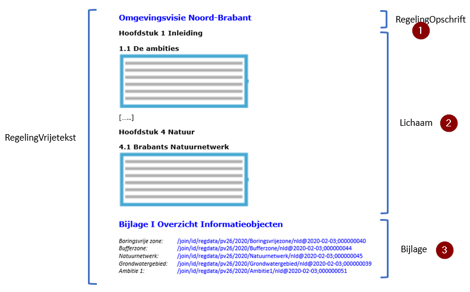

## De vormgeving van Besluit en Regeling bij de omgevingsvisie

### Besluit, juridisch geldende versie en (geconsolideerde) Regeling van de omgevingsvisie

Een Regeling in de context van STOP is een tekst die bestaat uit juridische
voorschriften van algemene strekking (regels) of beleidstekst. Voorbeelden zijn
het omgevingsplan en de omgevingsvisie. Een Besluit is een tekst die de
vaststelling of wijziging van een regeling beschrijft: een precieze beschrijving
van hoe een bestuursorgaan een nieuwe regeling vaststelt of een (bestaande)
regeling wijzigt. Onderdeel van het Besluit is dus ook de nieuwe regeling of de
wijziging van de regeling. Voorbeelden zijn het raadsbesluit met alle
bijbehorende onderdelen waarmee de gemeenteraad een wijziging van het
omgevingsplan vaststelt en het statenbesluit met alle bijbehorende onderdelen
waarmee provinciale staten de omgevingsvisie vaststellen. Het Besluit wordt, met
inbegrip van de inhoud of wijziging van de Regeling die onderdeel is van het
Besluit, bekendgemaakt op officielebekendmakingen.nl. De juridisch geldende
versie van de omgevingsvisie waaraan rechten en plichten kunnen worden ontleend,
bestaat uit de verzameling van de nieuwe regeling en alle daarna vastgestelde
wijzigingen van die regeling. Om die verzameling op een voor de mens leesbare en
begrijpelijke manier te presenteren is er ook de geconsolideerde Regeling. Een
(Toestand van een) geconsolideerde Regeling bevat de inhoud van een regeling
zoals die geldt op een bepaald moment. De geconsolideerde Regeling wordt
afgeleid uit de initiële regeling waarin steeds de (in werking getreden)
wijzigingen uit de wijzigingsbesluiten zijn verwerkt tot een doorlopende versie
van de omgevingsvisie. De geconsolideerde Regeling vormt de basis voor de
weergave van de regeling in de nationale respectievelijk lokale regelingenbank
op overheid.nl én van de versie van de omgevingsvisie die in DSO-LV te
raadplegen is.

### Modellen voor Besluit en Regeling en tekststructuren

STOP schrijft voor hoe een officiële publicatie vormgegeven en aangeleverd moet
worden om te kunnen worden bekendgemaakt of gepubliceerd en om te kunnen worden
geconsolideerd. Onderdeel van die voorschriften van STOP zijn de modellen voor
Besluit en Regeling en de tekststructuren. Beide spelen een belangrijke rol bij
het opstellen en aanleveren van omgevingsdocumenten.

#### Modellen voor Besluit en Regeling

Er zijn modellen voor de Regeling en modellen voor het Besluit. STOP kent vier
modellen voor de Regeling: RegelingKlassiek, RegelingCompact, RegelingVrijetekst
en RegelingTijdelijkdeel. Voor het Besluit kent STOP de modellen BesluitKlassiek
en BesluitCompact. RegelingKlassiek is uitsluitend bedoeld voor de instrumenten
met regels van het Rijk. RegelingCompact is het model voor de decentrale regels,
oftewel de instrumenten met regels van provincie, waterschap en gemeente, maar
kan ook voor instrumenten met regels van het Rijk gebruikt worden. Het Rijk
heeft dus een keuzemogelijkheid tussen RegelingKlassiek en RegelingCompact,
waarbij wordt opgemerkt dat als het omgevingsdocument eenmaal is vormgegeven
conform een van de modellen, er niet op een later moment in de levensloop van
datzelfde omgevingsdocument zomaar kan worden overgestapt op het andere model.
RegelingVrijetekst wordt gebruikt voor alle instrumenten met
Vrijetekststructuur. RegelingTijdelijkdeel tot slot is het model dat moet worden
gebruikt wanneer een tijdelijk regelingdeel wordt toegevoegd aan de
geconsolideerde regeling van omgevingsplan of omgevingsverordening: bij een
voorbereidingsbesluit en bij een reactieve interventie. BesluitKlassiek wordt
alleen in combinatie met RegelingKlassiek gebruikt. BesluitCompact wordt
gebruikt als besluitmodel bij RegelingCompact, RegelingVrijetekst en
RegelingTijdelijkdeel. In het vervolg van dit hoofdstuk worden alleen de
modellen beschreven die voor de omgevingsvisie van toepassing zijn.

De modellen voor Regeling en Besluit die in het geval van de omgevingsvisie
gebruikt moeten worden, zijn in detail beschreven in paragraaf 4.3.

#### Tekststructuren

STOP onderscheidt twee tekststructuren:

-   Artikelstructuur: de tekststructuur voor het Lichaam[^1] van een Regeling
    als dat is opgebouwd uit één of meer artikelen;

    [^1]: Lichaam van de regeling als bedoeld in Aanwijzing 3.53 van de
    Aanwijzingen voor de regelgeving en in STOP

-   Vrijetekststructuur:

    -   de tekststructuur voor het Lichaam van een Regeling van juridisch
        authentieke documenten die geen artikelen bevat;

    -   de tekststructuur voor onderdelen van Regeling en Besluit buiten het
        Lichaam.

Opgemerkt wordt dat er ook in het Lichaam van een Besluit artikelen voorkomen.
Deze artikelen vallen echter niet onder het begrip Artikelstructuur. Dat de
elementen van de Vrijetekststructuur worden gebruikt buiten het Lichaam geldt
zowel voor omgevingsdocumenten met Artikelstructuur als voor omgevingsdocumenten
met Vrijetekststructuur, en zowel voor Regeling als Besluit.

In het vervolg van dit hoofdstuk is vastgelegd welke modellen voor Besluit en
Regeling gebruikt moeten worden en welke bijzondere bepalingen gelden voor de
omgevingsvisie. In hoofdstuk 5 zijn de STOP-tekststructuren en de toepassing
daarvan op de omgevingsvisie beschreven.

### De vormgeving van Besluit en Regeling bij omgevingsdocumenten met Vrijetekststructuur

#### Inleiding

Bij het opstellen en wijzigen van omgevingsdocumenten werkt het bevoegd gezag in
de eigen software aan het omgevingsdocument in Regeling-vorm: de volledige
inhoud van het omgevingsdocument. Met de volledige inhoud wordt bedoeld: alle
divisies (en onderliggende elementen en inhoud), alle informatieobjecten en alle
IMOW-informatie.

Voorafgaand aan de terinzagelegging van een ontwerpbesluit en voorafgaand aan
(en eventueel ook na) het nemen van een definitief besluit genereert de software
van het bevoegd gezag uit die Regeling een Besluit. In het geval van een besluit
tot het instellen van een nieuwe Regeling genereert de software een Besluit met
daarin de volledige nieuwe Regeling, in het geval van een wijzigingsbesluit
genereert de software een Besluit dat in renvooiweergave de wijzigingen bevat
van de bestaande Regelingversie naar de nieuwe Regelingversie, oftewel een
overzicht van de wijzigingen die het besluit aanbrengt in de bestaande Regeling.
Naast het onderdeel met de nieuwe Regeling of de wijzigingen in de Regeling,
bevat het Besluit ook andere onderdelen, zoals de ondertekening, motivering en
bijlagen. Het bevoegd gezag levert het Besluit aan de LVBB aan. De LVBB zorgt
ervoor dat het aangeleverde Besluit bekend gemaakt wordt en genereert met behulp
van het Besluit een nieuwe RegelingVersie, oftewel een nieuwe geconsolideerde
Regeling. Om het de LVBB mogelijk te maken om die verwerkingen te doen stelt
STOP eisen aan de vormgeving van de tekst van Regeling en Besluit. Die eisen
zijn vastgelegd in modellen voor Regeling en modellen voor Besluit.

#### Besluit

In paragraaf 4.3.2.1 is de norm voor de toepassing van het STOP-model
BesluitCompact op de omgevingsvisie vastgelegd: welke elementen moeten
respectievelijk mogen worden gebruikt en hoe vaak kunnen ze voorkomen. Paragraaf
4.3.2.2 geeft een uitgebreide toelichting op de elementen van het Besluit,
waaronder ook tips over het al dan niet gebruikelijk zijn van een bepaald
element. In paragraaf 4.3.2.3 worden norm en toelichting concreet gemaakt met
een voorbeeld.

Opgemerkt wordt dat de STOP-modellen voor Besluit en Regeling XML-modellen zijn.
Met de in de volgende paragrafen genoemde elementen worden dus
(STOP-)XML-elementen bedoeld.

Omwille van de leesbaarheid en herkenbaarheid zijn de namen van de
‘hoofdelementen’ vetgedrukt en die van de ‘subelementen’ schuingedrukt. De
‘hoofdelementen’ zijn genummerd om er in de toelichting en het voorbeeld in de
volgende paragrafen naar te kunnen verwijzen.

##### Norm

Voor een besluit tot vaststelling of wijziging van de omgevingsvisie moet
gebruik gemaakt worden van het model BesluitCompact. BesluitCompact bevat de
volgende elementen:

1.  **RegelingOpschrift**: STOP-element dat de officiële titel van het Besluit
    bevat. Verplicht element. Komt 1 keer voor.

2.  Aanhef: STOP-element dat een blok tekst aan het begin van een Besluit bevat.
    Optioneel element. Komt 0 of 1 keer voor.

3.  **Lichaam**: STOP-element dat het lichaam (oftewel het dictum) van het
    Besluit bevat: dat wat het bestuursorgaan vaststelt of wijzigt. Verplicht
    element. Komt 1 keer voor. Bestaat voor zowel initieel besluit (besluit dat
    een regeling instelt) als wijzigingsbesluit (besluit dat een regeling
    wijzigt) uit de volgende elementen:

    -   *WijzigArtikel*: STOP-element dat beschrijft wat wordt vastgesteld of
        gewijzigd en verwijst naar de WijzigBijlage. Verplicht element. Komt ten
        minste 1 keer voor. Een WijzigArtikel kan worden onderverdeeld in
        WijzigLeden. Dat kan alleen in het geval van een wijzigingsbesluit en
        alleen wanneer met dat wijzigingsbesluit meerdere wijzigingen in
        dezelfde Regeling worden aangebracht en iedere wijziging een eigen
        inwerkingtredingsdatum heeft. Iedere
        wijziging-inwerkingtredingsdatum-combinatie kan dan in een eigen
        WijzigLid worden ondergebracht.  
        Ieder WijzigArtikel moet de volgende onderdelen bevatten:

        -   *Kop*: STOP-element dat de Kop bevat. Verplicht element. Komt 1 keer
            voor. Bevat ten minste één van de Kopelementen Label, Nummer en
            Opschrift; ieder van deze onderdelen komt 0 of 1 keer voor.

        -   *Wat*: STOP-element dat bevat:

            -   een tekstuele omschrijving van de vaststelling (in het geval van
                een initieel besluit) respectievelijk van de wijziging (in het
                geval van een wijzigingsbesluit); en

            -   een verwijzing, zowel tekstueel als met IntRef, naar de
                WijzigBijlage.

    -   *Artikel*: STOP-element dat een regulier artikel bevat. Verplicht
        element. Komt ten minste 1 keer voor.  
        Ieder Artikel moet de volgende onderdelen bevatten:

        -   *Kop*: STOP-element dat de Kop bevat. Verplicht element. Komt 1 keer
            voor. Bevat ten minste één van de Kopelementen Label, Nummer en
            Opschrift; ieder van deze onderdelen komt 0 of 1 keer voor.

        -   Verplichte keuze tussen Lid en Inhoud.

4.  **Sluiting**: STOP-element dat het Besluit afsluit. Optioneel element. Komt
    0 of 1 keer voor. De tekst van de Sluiting staat in een of meer reguliere
    Alinea’s. Ook kan gebruik gemaakt worden van de optionele elementen
    Slotformulering, Dagtekening en Ondertekening.

5.  **WijzigBijlage**: STOP-element dat voor een initieel besluit de inhoud van
    de instelling van de Regeling en voor een wijzigingsbesluit de wijzigingen
    van een versie van de Regeling bevat. Verplicht element. Komt ten minste 1
    keer voor.  
    Een WijzigBijlage bevat de volgende elementen:

    -   *Kop*: STOP-element dat de Kop bevat. Verplicht element. Komt 1 keer
        voor. Bevat ten minste één van de onderdelen Label, Nummer en Opschrift;
        ieder van deze onderdelen komt 0 of 1 keer voor. Optioneel kan het
        element Subtitel worden toegevoegd.

    -   Een verplichte keuze uit:

        -   *WijzigBijlage/RegelingVrijetekst*: STOP-element dat de volledige
            tekst van de initiële regeling bevat. Onder voorwaarde verplicht
            element: alleen te gebruiken bij een initieel besluit; is dan
            verplicht en komt dan 1 keer voor.

        -   *WijzigBijlage/RegelingMutatie*: STOP-element dat de wijzigingen
            tussen twee RegelingVersies in was-wordt oftewel renvooiweergave
            bevat. Onder voorwaarde verplicht element: alleen te gebruiken bij
            een wijzigingsbesluit; is dan verplicht en komt dan 1 keer voor.  
            Per onderdeel moet een keuze gemaakt worden tussen:

            -   VoegToe: element dat aangeeft dat een tekstonderdeel aan een
                bestaande Regeling wordt toegevoegd, op welke plaats en op welke
                wijze;

            -   Vervang: element dat aangeeft dat het onderdeel een
                tekstonderdeel in een bestaande Regeling vervangt;

            -   VervangKop: element dat aangeeft dat (de tekstuele inhoud van)
                een Kop wordt gewijzigd;

            -   Verwijder: element dat aangeeft dat een tekstonderdeel uit een
                bestaande Regeling wordt verwijderd.

6.  **Bijlage**: STOP-element dat een bijlage (in dit geval bij het Besluit)
    bevat. Optioneel element. Komt zo vaak voor als gewenst.  
    Voor een Bijlage wordt een keuze gemaakt tussen een bijlage als onderdeel
    van de tekst in STOP-XML of een bijlage als document-informatieobject. Een
    bijlage als document-informatieobject heeft de vorm van een PDF-document en
    moet voldoen aan de eisen van PDF/A-1a of PDF/A-2a. Een Bijlage die in
    STOP-XML wordt opgesteld, bevat de volgende elementen:

    -   *Kop*: STOP-element dat de Kop bevat. Verplicht element. Komt 1 keer
        voor. Bevat ten minste één van de Kopelementen Label, Nummer en
        Opschrift; ieder van deze onderdelen komt 0 of 1 keer voor. Optioneel
        kan het element Subtitel worden toegevoegd.

    -   De inhoud van de Bijlage, opgebouwd met *Divisie* (optioneel element) en
        *Divisietekst* (verplicht element). Divisie en Divisietekst moeten
        voldoen aan de specificaties voor de Vrijetekststructuur in paragraaf
        5.2.

    -   *Sluiting*: STOP-element dat de Bijlage afsluit. Optioneel element. Komt
        0 of 1 keer voor. De tekst van de Sluiting staat in een of meer
        reguliere Alinea’s. Ook kan gebruik gemaakt worden van de optionele
        elementen Slotformulering, Dagtekening en Ondertekening.

7.  **Toelichting**: STOP-element dat de toelichting op het Besluit bevat.
    Optioneel element. Komt 0 of 1 keer voor. Dit element wordt gebruikt voor
    een toelichting die uitsluitend algemeen van aard is én voor een toelichting
    die zowel een algemeen deel als een artikelsgewijs deel heeft.  
    Een Toelichting bevat de volgende elementen:

    -   *Kop*: STOP-element dat de Kop bevat. Verplicht element. Komt 1 keer
        voor. Bevat ten minste één van de Kopelementen Label, Nummer en
        Opschrift; ieder van deze onderdelen komt 0 of 1 keer voor. Optioneel
        kan het element Subtitel worden toegevoegd.

    -   In het geval van een toelichting die zowel een algemeen deel als een
        artikelsgewijs deel heeft, dan wel in het geval van een toelichting die
        alleen een algemeen deel bevat waarbij de opsteller machineleesbaar wil
        maken dat sprake is van een toelichting van algemene aard:

        -   *AlgemeneToelichting*: STOP-element dat de algemene toelichting
            bevat. Verplicht element. Komt 1 keer voor.  
            Een AlgemeneToelichting bevat de volgende elementen:

            -   *Kop*: STOP-element dat de Kop bevat. Verplicht element. Komt 1
                keer voor. Bevat ten minste één van de Kopelementen Label,
                Nummer en Opschrift; ieder van deze onderdelen komt 0 of 1 keer
                voor. Optioneel kan het element Subtitel worden toegevoegd.

            -   De inhoud van de AlgemeneToelichting, opgebouwd met *Divisie*
                (optioneel element) en *Divisietekst* (verplicht element).
                Divisie en Divisietekst moeten voldoen aan de specificaties voor
                de Vrijetekststructuur in paragraaf 5.2.

        -   *ArtikelgewijzeToelichting*: STOP-element dat de artikelsgewijze
            toelichting bevat. Optioneel element. Komt 0 of 1 keer voor. Op dit
            niveau alleen te gebruiken in een toelichting die zowel een algemeen
            deel als een artikelsgewijs deel heeft.  
            Een ArtikelgewijzeToelichting bevat de volgende elementen:

            -   *Kop*: STOP-element dat de Kop bevat. Verplicht element. Komt 1
                keer voor. Bevat ten minste één van de Kopelementen Label,
                Nummer en Opschrift; ieder van deze onderdelen komt 0 of 1 keer
                voor. Optioneel kan het element Subtitel worden toegevoegd.

            -   De inhoud van de ArtikelgewijzeToelichting, opgebouwd met
                *Divisie* (optioneel element) en *Divisietekst* (verplicht
                element). Divisie en Divisietekst moeten voldoen aan de
                specificaties voor de Vrijetekststructuur in paragraaf 5.2.

    -   In het geval van een toelichting die uitsluitend algemeen van aard is en
        de opsteller niet machineleesbaar wil maken dat sprake is van een
        toelichting van algemene aard:

        -   De inhoud van de Toelichting, opgebouwd met *Divisie* (optioneel
            element) en *Divisietekst* (verplicht element). Divisie en
            Divisietekst moeten voldoen aan de specificaties voor de
            Vrijetekststructuur in paragraaf 5.2.

    -   *Sluiting*: STOP-element dat de Toelichting afsluit. Optioneel element.
        Komt 0 of 1 keer voor. De tekst van de Sluiting staat in een of meer
        reguliere Alinea’s. Ook kan gebruik gemaakt worden van de optionele
        elementen Slotformulering, Dagtekening en Ondertekening.

    -   *Bijlage*: STOP-element dat een bijlage (in dit geval bij de
        Toelichting) bevat. Optioneel element. Komt zo vaak voor als gewenst.
        Een bijlage bij de Toelichting wordt niet geconsolideerd.

8.  **ArtikelgewijzeToelichting**: STOP-element dat de artikelsgewijze
    toelichting, oftewel de toelichting op de artikelen in het Besluit bevat.
    Optioneel element. Komt 0 of 1 keer voor. Dit element wordt gebruikt voor
    een toelichting die uitsluitend een artikelsgewijze toelichting is.

9.  **Motivering**: STOP-element dat de motivering van het Besluit bevat.
    Optioneel element. Komt 0 of 1 keer voor.  
    Een Motivering bevat de volgende elementen:

    -   *Kop*: STOP-element dat de Kop bevat. Verplicht element. Komt 1 keer
        voor. Bevat ten minste één van de Kopelementen Label, Nummer en
        Opschrift; ieder van deze onderdelen komt 0 of 1 keer voor. Optioneel
        kan het element Subtitel worden toegevoegd.

    -   De inhoud van de Motivering, opgebouwd met *Divisie* (optioneel element)
        en *Divisietekst* (verplicht element). Divisie en Divisietekst moeten
        voldoen aan de specificaties voor de Vrijetekststructuur in paragraaf
        5.2.

    -   *Sluiting*: STOP-element dat de Motivering afsluit. Optioneel element.
        Komt 0 of 1 keer voor. De tekst van de Sluiting staat in een of meer
        reguliere Alinea’s. Ook kan gebruik gemaakt worden van de optionele
        elementen Slotformulering, Dagtekening en Ondertekening.

    -   *Bijlage*: STOP-element dat een bijlage (in dit geval bij de Motivering)
        bevat. Optioneel element. Komt zo vaak voor als gewenst. Een bijlage bij
        de Motivering wordt niet geconsolideerd.

10. **Inhoudsopgave**: STOP-element dat de inhoudsopgave van het Besluit bevat.
    Optioneel element. Komt 0 of 1 keer voor. Een inhoudsopgave wordt niet
    geconsolideerd.

##### Toelichting

In deze paragraaf worden de elementen toegelicht die moeten respectievelijk
kunnen voorkomen in een Besluit dat is opgesteld overeenkomstig het model
BesluitCompact. Daarbij wordt de nummering van paragraaf 4.3.2.1 gevolgd. In die
paragraaf is van ieder element aangegeven of het moet (verplicht) of mag
(optioneel) voorkomen; dat wordt in deze toelichting niet herhaald. De
‘hoofdelementen’ zijn weer vetgedrukt en de ‘subelementen’ schuingedrukt.

1.  **RegelingOpschrift**: de officiële titel van het Besluit. Bijvoorbeeld:
    Vaststelling Omgevingsvisie Utrecht, of Vaststelling Woningbouwprogramma
    Amsterdam.

2.  **Aanhef**: blok tekst aan het begin van het Besluit. Hierin kunnen
    bijvoorbeeld de overwegingen van het bestuursorgaan staan, die voorafgaan
    aan het daadwerkelijke besluit. Bijvoorbeeld: “Overwegende dat,
    overeenkomstig artikel 16.26 Omgevingswet en afdeling 3.4 Awb, het
    ontwerpbesluit tot vaststelling van de omgevingsvisie gedurende zes weken
    ter inzage heeft gelegen en er 116 zienswijzen zijn ontvangen;  
    Gelezen het statenvoorstel d.d. 16 mei 2022 waarin wordt voorgesteld aan die
    zienswijzen gedeeltelijk tegemoet te komen”.

3.  **Lichaam**: het Lichaam van het Besluit, in de bestuurspraktijk ook wel het
    dictum genoemd.  
    Het Lichaam bevat ten minste één WijzigArtikel. In het WijzigArtikel staat
    wat het bestuursorgaan besluit vast te stellen of te wijzigen. Het
    WijzigArtikel moet zowel in woorden als machineleesbaar (met IntRef)
    verwijzen naar de WijzigBijlage, het onderdeel van het besluit waarin de
    inhoud of wijzigingen van de Regeling staan. Een voorbeeld van de tekstuele
    omschrijving en verwijzing bij de (initiële) vaststelling van de
    omgevingsvisie van de provincie Utrecht: “De omgevingsvisie Utrecht wordt
    vastgesteld zoals is aangegeven in Bijlage I”. Een voorbeeld van de
    tekstuele omschrijving en verwijzing bij een wijziging van het
    woningbouwprogramma van de gemeente Amsterdam: “Het woningbouwprogramma
    Amsterdam wordt gewijzigd zoals is aangegeven in Bijlage I”. Het is onder
    zeer specifieke omstandigheden mogelijk om een WijzigArtikel onder te
    verdelen in WijzigLeden: alleen bij een wijzigingsbesluit en alleen als dat
    wijzigingsbesluit meerdere wijzigingen in dezelfde Regeling aanbrengt die
    ieder een verschillende inwerkingtredingsdatum (en dus een verschillend
    Doel, zie daarvoor paragraaf 9.1) hebben. Een WijzigLid bevat geen Kop. In
    het geval van een besluit tot vaststelling of wijziging van een
    omgevingsdocument zal een onderverdeling met WijzigLeden in principe niet
    voorkomen. Opgemerkt wordt dat WijzigArtikel een technische term is die niet
    in de tekst van het besluit zal voorkomen. Bij gebruik van een Label zal de
    Kop dus niet Wijzigartikel I zijn maar Artikel I.  
    In het Lichaam moet ten minste één Artikel voorkomen. Dit kan onder andere
    een artikel zijn waarin de datum van inwerkingtreding van het besluit wordt
    geregeld.  
    Het is gebruikelijk dat WijzigArtikel voor Artikel komt, maar daar kan
    indien gewenst van worden afgeweken.  
    RegelingOpschrift, Aanhef, Lichaam en de hierna te bespreken Sluiting samen
    vormen een geheel dat goed vergelijkbaar is met het raadsbesluit- of
    statenbesluit-document waarmee de besluitvormingsprocedure van een gemeente
    of provincie wordt vastgelegd. Wat (vermoedelijk) wel anders zal zijn is dat
    WijzigArtikel en Artikel verplicht een Kop moeten hebben. Die Kop moet ten
    minste één van de elementen Label, Nummer en Opschrift bevatten. In de
    besluit-voorbeelden in paragraaf 4.3.2.3 is dat te zien. Het voorbeeld van
    een initieel besluit (Figuur 4) toont een WijzigArtikel en Artikel met een
    Kop bestaande uit Label (namelijk: Artikel) en Nummer. Het voorbeeld van een
    wijzigingsbesluit (Figuur 5) toont een WijzigArtikel en Artikel met een Kop
    die alleen uit een Nummer bestaat.  
    De WijzigArtikelen en Artikelen in het Lichaam van het Besluit kunnen niet
    worden geannoteerd met de in hoofdstuk 7 beschreven annotaties met
    IMOW-objecten.

4.  **Sluiting**: de afsluiting van het Besluit. Hier staat vaak de datum waarop
    het bestuursorgaan het besluit heeft genomen. Ook staan hier de namen en
    dergelijke van de personen die namens het bestuursorgaan het besluit hebben
    ondertekend. Een voor de interne huishouding van het bevoegd gezag gebruikt
    papieren of digitaal exemplaar van het besluitdocument kan ook de
    handtekeningen van die personen bevatten. De versie van het besluit die ter
    bekendmaking aan de LVBB wordt aangeboden wordt niet voorzien van
    handtekeningen.

5.  **WijzigBijlage**: het element waarin óf de inhoud van de initiële Regeling
    staat óf de wijzigingen die het Besluit aanbrengt in de bestaande versie van
    de Regeling. De WijzigBijlage bevat de inhoud van de (wijziging van de)
    Regeling. Een WijzigBijlage heeft dus een heel andere functie dan een
    (gewone) Bijlage.  
    De WijzigBijlage moet worden voorzien van een Kop. Een voorbeeld van deze
    Kop: ‘Bijlage I bij artikel I.’ Het artikel waarnaar wordt verwezen is het
    WijzigArtikel in het Lichaam van het Besluit. Na de Kop moet een keuze
    worden gemaakt tussen WijzigBijlage/RegelingVrijetekst en
    WijzigBijlage/RegelingMutatie.  
    *WijzigBijlage/RegelingVrijetekst* wordt gekozen wanneer een bevoegd gezag
    met het besluit een nieuwe, initiële, regeling instelt. Een voorbeeld is het
    instellen van een volledig nieuwe omgevingsvisie. De
    WijzigBijlage/RegelingVrijetekst bevat de volledige Regeling, oftewel de
    inhoud, van het omgevingsdocument. Dit onderdeel moet voldoen aan de
    specificaties voor RegelingVrijetekst die in paragraaf 4.3.3 zijn vastgelegd
    en aan de specificaties voor de Vrijetekststructuur die zijn beschreven in
    paragraaf 5.2. Dit is ook het onderdeel dat wordt geannoteerd met
    IMOW-objecten. Dit is beschreven in hoofdstuk 7.  
    *WijzigBijlage/RegelingMutatie* wordt gekozen wanneer het bevoegd gezag een
    wijzigingsbesluit neemt: een besluit dat een bestaande versie van de
    Regeling wijzigt. De RegelingMutatie bevat de wijzigingen van een
    RegelingVersie naar een nieuwe RegelingVersie in een was-wordt- oftewel
    renvooiweergave. Per te wijzigen onderdeel van de RegelingVersie wordt
    aangegeven of het wordt toegevoegd, vervangen, verwijderd of dat een Kop
    wordt gewijzigd. Onderdelen van de RegelingVersie die niet gewijzigd worden,
    worden niet opgenomen in de RegelingMutatie.  
    Er wordt bijvoorbeeld aangegeven welke tekstgedeelten en/of GIO’s geheel of
    gedeeltelijk worden toegevoegd, geschrapt, gewijzigd of vervangen door
    andere. Renvooiweergave betekent dat met visuele middelen wordt duidelijk
    gemaakt wat wordt toegevoegd of geschrapt.

6.  **Bijlage**: het gaat hier om een Bijlage bij het Besluit; een bijlage die
    het nemen van het besluit onderbouwt. Er kunnen zoveel bijlagen bij het
    Besluit worden gevoegd als nodig is. Voorbeelden van dit soort bijlagen zijn
    een milieueffectrapportage en een participatie- of inspraakverslag. Bijlagen
    bij het Besluit worden alleen bekendgemaakt en niet geconsolideerd. Deze
    bijlagen zijn dus wel te vinden op officielebekendmakingen.nl, maar niet in
    de regelingenbank op overheid.nl en niet in DSO-LV.  
    Bijlagen worden gepubliceerd als onderdeel van de tekst in STOP-XML of als
    document-informatieobject. Als de bijlage onderdeel is van de tekst in
    STOP-XML, staat de inhoud in een of meer Divisieteksten, die desgewenst
    hiërarchisch kunnen worden gestructureerd in Divisies. Deze elementen van de
    Vrijetekststructuur en hun specificaties zijn beschreven in paragraaf 5.2.
    Een bijlage die niet in XML via het STOP-model gecodeerd kan worden, wordt
    gepubliceerd als document-informatieobject, (vooralsnog) in PDF-formaat. Een
    beschrijving van beide publicatiemogelijkheden voor bijlagen staat in
    paragraaf 5.3. Een Bijlage wordt niet geannoteerd met IMOW-objecten. Een
    Bijlage kan worden afgesloten met het element Sluiting. Van die mogelijkheid
    zal naar verwachting niet vaak gebruik gemaakt worden.

7.  **Toelichting**: het gaat hier om een Toelichting bij het Besluit. Deze
    toelichting is onder andere vergelijkbaar met het voorstel-document waarmee
    het dagelijks bestuur van gemeente, provincie of waterschap een onderbouwing
    geeft voor het voorgestelde besluit dat zij aan het algemeen bestuur
    voorleggen. STOP maakt het mogelijk om een Toelichting onder te verdelen in
    een algemene toelichting en een artikelsgewijze toelichting. Dat zo’n
    onderverdeling in een toelichting op het *besluit* tot vaststelling of
    wijziging van een omgevingsdocument voorkomt, ligt niet erg voor de hand.
    Daarom wordt deze mogelijkheid hier niet verder besproken. Mocht dat
    onderscheid toch wenselijk zijn, dan wordt verwezen naar paragraaf 4.3.3.2,
    waarin het element Toelichting bij de Regeling wordt besproken. De
    daadwerkelijke inhoud van een Toelichting staat in een of meer
    Divisieteksten, die desgewenst hiërarchisch kunnen worden gestructureerd in
    Divisies. Deze elementen van de Vrijetekststructuur en hun specificaties
    zijn beschreven in paragraaf 5.2. Een Toelichting wordt niet geannoteerd met
    IMOW-objecten. Een Toelichting op het Besluit wordt alleen bekendgemaakt en
    niet geconsolideerd. Deze Toelichting is dus wel te vinden op
    officielebekendmakingen.nl, maar niet in de regelingenbank op overheid.nl en
    niet in DSO-LV.

8.  **ArtikelgewijzeToelichting**: het gaat hier om een
    ArtikelgewijzeToelichting bij het Besluit, dus een toelichting op de
    Artikelen en Wijzigartikelen in het Lichaam van het Besluit. STOP maakt het
    mogelijk om een ArtikelgewijzeToelichting bij het Besluit te voegen. Het
    ligt echter minder voor de hand om dat te doen bij een besluit tot
    vaststelling of wijziging van een omgevingsdocument. Daarom zijn in de norm
    in paragraaf 4.3.2.1 de subelementen van de ArtikelgewijzeToelichting niet
    opgenomen en wordt er in deze paragraaf geen nadere toelichting op gegeven.
    Voor het geval dat het toch wenselijk is om een ArtikelgewijzeToelichting
    bij het Besluit te voegen, wordt verwezen naar paragraaf 4.3.3 waarin voor
    de Regeling het element ArtikelgewijzeToelichting is gespecificeerd en
    toegelicht. Die specificaties gelden ook voor de ArtikelgewijzeToelichting
    bij het Besluit. Een ArtikelgewijzeToelichting wordt niet geannoteerd met
    IMOW-objecten. Een ArtikelgewijzeToelichting op het Besluit wordt alleen
    bekendgemaakt en niet geconsolideerd. Deze ArtikelgewijzeToelichting is dus
    wel te vinden op officielebekendmakingen.nl, maar niet in de regelingenbank
    op overheid.nl en niet in DSO-LV.

9.  **Motivering**: dit is de motivering oftewel de inhoudelijke onderbouwing
    van het Besluit. In de motivering kan bijvoorbeeld worden aangegeven op
    welke wijze gevolg is gegeven aan de toepasselijke instructieregels en
    instructies van provincie en Rijk en kan worden verwezen naar relevant
    beleid van het eigen dan wel een ander bevoegd gezag. Ook kan worden
    gemotiveerd om welke redenen het besluit bijdraagt aan het bereiken van de
    doelen van de Omgevingswet. In het geval van een wijzigingsbesluit wordt in
    dit deel onder andere beschreven op welke onderdelen de omgevingsvisie wordt
    aangepast en waarom. De inhoud van een Motivering staat in een of meer
    Divisieteksten, die desgewenst hiërarchisch kunnen worden gestructureerd in
    Divisies. Deze elementen van de Vrijetekststructuur en hun specificaties
    zijn beschreven in paragraaf 5.2. De Motivering kan worden afgesloten met
    het element Sluiting. Dat dat bij een omgevingsdocument daadwerkelijk
    gebeurt, ligt niet voor de hand. Daarom wordt de Sluiting niet nader
    toegelicht. Ter ondersteuning van de motivering kunnen een of meer Bijlagen,
    bijvoorbeeld in de vorm van bijlagen met onderzoeksgegevens en bescheiden,
    worden toegevoegd. Indien dat gebeurt, gelden daarvoor dezelfde
    specificaties als voor het ‘hoofdelement’ Bijlage; zie ook de toelichting
    bij nr. 6. Een Motivering wordt niet geannoteerd met IMOW-objecten. Een
    Motivering wordt alleen bekendgemaakt en niet geconsolideerd. De Motivering
    is dus wel te vinden op officielebekendmakingen.nl, maar niet in de
    regelingenbank op overheid.nl en niet in DSO-LV.

10. **Inhoudsopgave**: STOP maakt het mogelijk dat aan een Besluit een
    Inhoudsopgave wordt toegevoegd. Dat dat bij een omgevingsdocument
    daadwerkelijk gebeurt, ligt niet voor de hand. Daarom zijn in de norm in
    paragraaf 4.3.2.1 de subelementen van de Inhoudsopgave niet opgenomen en
    wordt dit element niet nader toegelicht.

Veel van de hiervoor besproken elementen moeten worden voorzien van een Kop.
Voor de Kop zijn de Kopelementen Label, Nummer en Opschrift beschikbaar. Label
is de aanduiding van het type tekstelement, zoals Hoofdstuk, Paragraaf of
Artikel. Opschrift is de titel van het tekstelement, die aangeeft waar de tekst
over gaat.

In de schema’s van STOP komt in een aantal hoofd- en subelementen het element
InleidendeTekst -bedoeld voor niet-juridische contextinformatie- voor. In de
STOP-documentatie wordt het gebruik van dit element ontraden. Daarom is dit
element hier niet opgenomen.

##### Voorbeeld

Door toepassing van model BesluitCompact ziet een besluit tot vaststelling van
een omgevingsdocument met Vrijetekststructuur, oftewel een initieel besluit dat
een initiële Regeling instelt, er schematisch uit zoals aangegeven in Figuur 4.
De nummers in deze figuur komen overeen met de nummering van de vorige twee
paragrafen.

<figure id="3f35d694ef5f2e6f366253a13a2b29da">
    
    <figcaption>Voorbeeld toepassing model BesluitCompact en WijzigBijlage/RegelingVrijetekst op initieel besluit omgevingsvisie</figcaption>
</figure>

<!--

1.  Voorbeeld toepassing model BesluitCompact en
    WijzigBijlage/RegelingVrijetekst op initieel besluit omgevingsvisie
-->

Door toepassing van model BesluitCompact ziet een besluit tot wijziging van een
omgevingsdocument met Vrijetekststructuur, oftewel een wijzigingsbesluit, er
schematisch uit zoals aangegeven in Figuur 5. De nummers in deze figuur komen
overeen met de nummering van de vorige twee paragrafen.

<figure id="720dd6654f8a27696fe1a154dc966e49">
    
    <figcaption>Voorbeeld toepassing model BesluitCompact en WijzigBijlage/RegelingMutatie op wijzigingsbesluit omgevingsvisie</figcaption>
</figure>

<!--

1.  Voorbeeld toepassing model BesluitCompact en WijzigBijlage/RegelingMutatie
    op wijzigingsbesluit omgevingsvisie
-->

In het voorbeeld van het initieel besluit van Figuur 4 zijn WijzigArtikel en
Artikel in het Lichaam van het Besluit-deel letterlijk opgevat door ze een Kop
met het Label Artikel te geven. Dat is niet verplicht, STOP verplicht er slechts
toe dat de Kop van een Artikel ten minste één van de elementen Label, Nummer en
Opschrift bevat. Het is dus ook mogelijk om in de kop van de betreffende
artikelen alleen een nummer op te nemen. Het voorbeeld van Figuur 5 toont een
toepassing van een WijzigArtikel en Artikel zonder gebruik te maken van Label en
Opschrift.

#### Regeling

In paragraaf 4.3.3.1 is de norm voor het model RegelingVrijetekst vastgelegd:
welke elementen moeten respectievelijk mogen worden gebruikt en hoe vaak kunnen
ze voorkomen. Paragraaf 4.3.3.2 geeft een uitgebreide toelichting op de
elementen van de Regeling, waaronder ook tips over het al dan niet gebruikelijk
zijn van een bepaald element. In paragraaf 4.3.3.3 worden norm en toelichting
concreet gemaakt met een voorbeeld.

Opgemerkt wordt dat de STOP-modellen voor Besluit en Regeling XML-modellen zijn.
Met de in de volgende paragrafen genoemde elementen worden dus
(STOP-)XML-elementen bedoeld.

Omwille van de leesbaarheid en herkenbaarheid zijn de namen van de
‘hoofdelementen’ vetgedrukt en die van de ‘subelementen’ schuingedrukt. De
‘hoofdelementen’ zijn genummerd om er in de toelichting en het voorbeeld in de
volgende paragrafen naar te kunnen verwijzen.

##### Norm

De (geconsolideerde) Regeling van de omgevingsvisie is opgebouwd overeenkomstig
het model RegelingVrijetekst. RegelingVrijetekst bevat de volgende elementen:

1.  **RegelingOpschrift**: STOP-element dat de officiële titel van de Regeling,
    oftewel het omgevingsdocument, bevat. Verplicht element. Komt 1 keer voor.

2.  **Lichaam**: STOP-element dat de inhoud, oftewel de (beleids)teksten van de
    (geconsolideerde) Regeling van het omgevingsdocument bevat. Verplicht
    element. Komt 1 keer voor[^2]. Het Lichaam wordt opgebouwd met *Divisie*
    (optioneel element) en *Divisietekst* (verplicht element). Divisie en
    Divisietekst moeten voldoen aan de specificaties voor de Vrijetekststructuur
    in paragraaf 5.2.

    [^2]: Het Lichaam is het belangrijkste onderdeel van de Regeling. Zie
    daarvoor de toelichting in de volgende paragraaf en vooral de beschrijving
    van de Vrijetekststructuur in paragraaf 5.2. Dit is het deel dat wordt
    geannoteerd met OW-objecten, zie daarvoor hoofdstuk 7

3.  **Bijlage**: STOP-element dat een bijlage (in dit geval bij de Regeling)
    bevat. Optioneel element. Komt zo vaak voor als gewenst. Een bijlage die
    onderdeel is van de Regeling wordt geconsolideerd.  
    Voor een Bijlage wordt een keuze gemaakt tussen een bijlage als onderdeel
    van de tekst in STOP-XML of een bijlage als document-informatieobject. Een
    bijlage als document-informatieobject heeft de vorm van een PDF-document en
    moet voldoen aan de eisen van PDF/A-1a of PDF/A-2a. Een Bijlage die in
    STOP-XML wordt opgesteld, bevat de volgende elementen:

    -   *Kop*: STOP-element dat de Kop bevat. Verplicht element. Komt 1 keer
        voor. Bevat ten minste één van de Kopelementen Label, Nummer en
        Opschrift; ieder van deze elementen komt 0 of 1 keer voor. Optioneel kan
        het element Subtitel worden toegevoegd.

    -   *Gereserveerd*: leeg STOP-element waarmee bij weergave op overheid.nl en
        in DSO-LV de tekst ‘Gereserveerd’ wordt gegenereerd. Optioneel element.
        Komt 0 of 1 keer voor. Indien in een Bijlage het element Gereserveerd
        wordt gebruikt mag in die Bijlage geen van de elementen Vervallen,
        Divisie en Divisietekst voorkomen.

    -   *Vervallen*: leeg STOP-element waarmee bij weergave op overheid.nl en in
        DSO-LV de tekst ‘Vervallen’ wordt gegenereerd. Geeft aan dat de Bijlage
        de status ‘vervallen’ heeft; de Bijlage is niet langer juridisch geldig
        en heeft geen inhoud meer. Optioneel element. Komt 0 of 1 keer voor.
        Indien in een Bijlage het element Vervallen wordt gebruikt mag in die
        Bijlage geen van de elementen Gereserveerd, Divisie en Divisietekst
        voorkomen.

    -   De inhoud van de Bijlage. Indien een Bijlage inhoud bevat, mogen in die
        Bijlage de elementen Gereserveerd en Vervallen niet voorkomen. De inhoud
        van de Bijlage wordt opgebouwd met *Divisie* (optioneel element) en
        *Divisietekst* (verplicht element). Divisie en Divisietekst moeten
        voldoen aan de specificaties voor de Vrijetekststructuur in paragraaf
        5.2.

    -   *Sluiting*: STOP-element dat de Bijlage afsluit. Optioneel element. Komt
        0 of 1 keer voor. De tekst van de Sluiting staat in een of meer
        reguliere Alinea’s. Ook kan gebruik gemaakt worden van de optionele
        elementen Slotformulering, Dagtekening en Ondertekening.

##### Toelichting

RegelingVrijetekst is het model dat het bevoegd gezag moet gebruiken als het een
nieuw, initieel omgevingsdocument met Vrijetekststructuur instelt.
RegelingVrijetekst is ook het model voor de geconsolideerde regeling van
omgevingsdocumenten met Vrijetekststructuur.

In deze paragraaf worden de elementen toegelicht die moeten respectievelijk
kunnen voorkomen in een Regeling overeenkomstig het model RegelingVrijetekst.
Daarbij wordt de nummering van paragraaf 4.3.3.1 gevolgd. In die paragraaf is
van ieder element aangegeven of het moet (verplicht) of mag (optioneel)
voorkomen; dat wordt in deze toelichting niet herhaald. De ‘hoofdelementen’ zijn
weer vetgedrukt en de ‘subelementen’ schuingedrukt.

1.  **RegelingOpschrift**: de officiële titel van de Regeling. Bijvoorbeeld:
    Omgevingsvisie Utrecht, of Woningbouwprogramma Amsterdam.

2.  **Lichaam**: het element dat de inhoud oftewel de (beleids)tekst van het
    omgevingsdocument bevat. Deze inhoud staat in een of meer Divisieteksten,
    die desgewenst hiërarchisch kunnen worden gestructureerd in Divisies.
    Hiervoor gelden de specificaties voor de Vrijetekststructuur van paragraaf
    5.2. Dit is het onderdeel dat wordt geannoteerd met de IMOW-objecten die
    zijn beschreven in hoofdstuk 7.

3.  **Bijlage**: het gaat hier om een Bijlage bij de Regeling. Dit is een
    bijlage die informatie bevat die onderdeel is van het omgevingsdocument maar
    om redenen van leesbaarheid en/of vormgeving (denk aan lange lijsten en
    complexe tabellen) niet goed in de (beleids)tekst in het Lichaam van de
    Regeling kan worden opgenomen. Er kunnen zoveel bijlagen bij de Regeling
    worden gevoegd als nodig is. Een voorbeeld is de bijlage met verwijzingen
    naar de (elders gepubliceerde) GIO’s. Bijlagen bij de Regeling worden
    bekendgemaakt én geconsolideerd. Deze bijlagen zijn dus zowel te vinden op
    officielebekendmakingen.nl als in de regelingenbank op overheid.nl en in
    DSO-LV.  
    Bijlagen worden gepubliceerd als onderdeel van de tekst in STOP-XML of als
    document-informatieobject. Als de bijlage onderdeel is van de tekst in
    STOP-XML, staat de inhoud in een of meer Divisieteksten, die desgewenst
    hiërarchisch kunnen worden gestructureerd in Divisies. Deze elementen van de
    Vrijetekststructuur en hun specificaties zijn beschreven in paragraaf 5.2.
    Een bijlage die niet in XML via het STOP-model gecodeerd kan worden, wordt
    gepubliceerd als document-informatieobject, (vooralsnog) in PDF-formaat. Een
    beschrijving van beide publicatiemogelijkheden voor bijlagen staat in
    paragraaf 5.3.  
    In een Bijlage bij de Regeling kan het element Gereserveerd worden gebruikt.
    Dit element maakt het mogelijk om alvast een structuur neer te zetten die is
    voorbereid op toekomstige aanvullingen. Het is een leeg element waarmee bij
    weergave op overheid.nl en in DSO-LV de tekst ‘Gereserveerd’ wordt
    gegenereerd. Het bevoegd gezag kan het element niet zelf vullen met eigen
    tekst. Met latere wijzigingsbesluiten kan het element Gereserveerd worden
    vervangen door een structuurelement met daadwerkelijke inhoud.  
    Wanneer een bijlage vervalt kan in het element Bijlage het element Vervallen
    worden opgenomen. Op deze manier blijft zichtbaar dat er een bijlage was en
    dat die later is vervallen. Het voordeel daarvan is dat in de wetstechnische
    informatie de historie van het element kan worden teruggevonden. Een andere
    mogelijkheid bij het vervallen van een bijlage is om het element Bijlage met
    een wijzigingsbesluit te verwijderen. Dan is het element niet langer
    zichtbaar en is er ook geen wetstechnische informatie meer.  
    Een Bijlage kan worden afgesloten met het element Sluiting. Van die
    mogelijkheid zal naar verwachting niet vaak gebruik gemaakt worden. Een
    Bijlage wordt niet geannoteerd met IMOW-objecten.

Een aantal van de hiervoor besproken elementen moet worden voorzien van een Kop.
Voor de Kop zijn de Kopelementen Label, Nummer en Opschrift beschikbaar. Label
is de aanduiding van het type tekstelement, zoals Hoofdstuk, Paragraaf of
Artikel. Opschrift is de titel van het tekstelement, die aangeeft waar de tekst
over gaat.

In de schema’s van STOP komt in een aantal hoofd- en subelementen het element
InleidendeTekst -bedoeld voor niet-juridische contextinformatie- voor. In de
STOP-documentatie wordt het gebruik van dit element ontraden. Daarom is dit
element hier niet opgenomen.

##### Voorbeeld

Door toepassing van model RegelingVrijetekst ziet de Regeling van een
omgevingsdocument met Vrijetekststructuur er schematisch uit zoals aangegeven in
Figuur 6. De nummers in deze figuur komen overeen met de nummering van de vorige
twee paragrafen.

<figure id="0b9bf80f0242034d832428bc779eaf1a">
    
    <figcaption>Voorbeeld toepassing model RegelingVrijetekst op omgevingsvisie</figcaption>
</figure>

<!--

1.  Voorbeeld toepassing model RegelingVrijetekst op omgevingsvisie
-->
