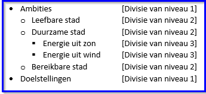

## Toepassing van de STOP-tekststructuren op omgevingsdocumenten

STOP benoemt tekstelementen en beschrijft de structuur waarin die tekstelementen
toegepast kunnen worden. STOP geldt voor alle officiële overheidspublicaties.
Specifieke typen publicaties hebben een eigen toepassingsprofiel op het
STOP-model, dat nadere specificaties van STOP kan geven. In dit hoofdstuk wordt
beschreven hoe de STOP-tekststructuren in zijn algemeenheid op
omgevingsdocumenten en vervolgens specifiek op de omgevingsvisie moeten worden
toegepast.

### Soorten tekststructuur

STOP onderscheidt twee tekststructuren:

-   Artikelstructuur: de tekststructuur voor het Lichaam van een Regeling als
    dat is opgebouwd uit één of meer artikelen;

-   Vrijetekststructuur:

    -   de tekststructuur voor het Lichaam van een Regeling van juridisch
        authentieke documenten die geen artikelen bevat;

    -   de tekststructuur voor onderdelen van Regeling en Besluit buiten het
        Lichaam.

Er zijn omgevingsdocumenten waarvan het Lichaam artikelen bevat en dus de
Artikelstructuur heeft, zoals de omgevingsverordening, de waterschapsverordening
en het omgevingsplan, en omgevingsdocumenten waarvan het Lichaam geen artikelen
bevat en dus de Vrijetekststructuur heeft, zoals de omgevingsvisie. In het
vervolg van dit toepassingsprofiel worden omgevingsdocumenten waarvan het
Lichaam artikelen bevat ‘omgevingsdocument met Artikelstructuur’ genoemd en
worden omgevingsdocumenten waarvan het Lichaam de Vrijetekststructuur heeft
(oftewel geen artikelen bevat) ‘omgevingsdocument met Vrijetekststructuur’
genoemd.

Zoals in hoofdstuk 4 al is opgemerkt komen er ook in het Lichaam van een Besluit
artikelen voor. Deze artikelen vallen echter niet onder het begrip
Artikelstructuur. Dat de elementen van de Vrijetekststructuur worden gebruikt
buiten het Lichaam geldt zowel voor omgevingsdocumenten met Artikelstructuur als
voor omgevingsdocumenten met Vrijetekststructuur, en zowel voor Regeling als
Besluit. De specificatie van de STOP-Artikelstructuur is dus alleen van
toepassing op het Lichaam van omgevingsdocumenten met Artikelstructuur. De
specificatie van de STOP-Vrijetekststructuur is van toepassing op alle
omgevingsdocumenten.

### Specificatie van de Vrijetekststructuur

Zoals in paragraaf 5.1 is beschreven is de Vrijetekststructuur:

-   de tekststructuur voor het Lichaam van een Regeling van juridisch
    authentieke documenten die geen artikelen bevat;

-   de tekststructuur voor onderdelen van Regeling en Besluit buiten het
    Lichaam: Bijlage, Toelichting, ArtikelgewijzeToelichting en Motivering.[^1]

    [^1]: Zie voor uitleg en toepassing van de elementen Lichaam, Regeling,
    Bijlage, Toelichting, ArtikelgewijzeToelichting en Motivering hoofdstuk 4

De specificaties voor de Vrijetekststructuur en de toepassing van die
specificaties voor de omgevingsvisie worden in de navolgende paragrafen
beschreven.

De elementen van de STOP-tekststructuren zijn onder te verdelen in
structuurelementen, elementen met inhoud en de inhoud zelf. Structuurelementen
zijn die elementen die de tekst structureren maar zelf geen inhoud bevatten. In
de Vrijetekststructuur is dat het element Divisie. Elementen met inhoud zijn die
elementen die inhoud bevatten maar niet zelf inhoud *zijn*. In de
Vrijetekststructuur is dat het element Divisietekst. De inhoud zelf is dat wat
in de Divisietekst staat. Voorbeelden van de vorm die de inhoud kan aannemen
zijn Alinea, Tabel en Figuur. In de navolgende tekst gebruiken we ‘tekstelement’
als term voor de drie elementsoorten tezamen.

De opmaak van de tekst, waaronder die van de Koppen, wordt bepaald door de
applicaties die de tekst tonen: officielebekendmakingen.nl, de regelingenbanken
op overheid.nl en DSO-LV. Dit toepassingsprofiel bevat daarom geen voorschriften
over de opmaak van de elementen en hun Koppen. Ten behoeve van de mensleesbare
tekst in het proces van opstellen van en besluitvorming over het
omgevingsdocument, voorafgaand aan de bekendmaking en consolidatie, kan de
plansoftware -door leverancier of bevoegd gezag te bepalen- opmaak aan de tekst
toevoegen.

In paragraaf 5.2.1 is de norm voor de toepassing van de Vrijetekststructuur op
de omgevingsvisie vastgelegd: welke elementen moeten respectievelijk mogen
worden gebruikt, hoe vaak kunnen ze voorkomen en in welke volgorde. Paragraaf
5.2.2 geeft daar een toelichting op.

#### Norm

De elementen van Besluit en Regeling van de omgevingsvisie waarvan in hoofdstuk
4 is bepaald dat ze moeten worden opgebouwd volgens de Vrijetekststructuur,
moeten voldoen aan de specificaties in deze paragraaf. De Vrijetekststructuur
kent de volgende elementen:

-   **Divisie**: STOP-structuurelement dat gebruikt wordt voor de structurering
    van vrije tekst. Optioneel element. Komt zo vaak voor als gewenst. Divisie
    kan genest worden, oftewel hiërarchisch ingedeeld worden in verschillende
    niveaus van Divisie. Indien gebruik gemaakt wordt van Divisie, bevat de
    Divisie van het laagste hiërarchische niveau het element Divisietekst. In de
    hiërarchische indeling van de Divisies kunnen geen niveaus worden
    overgeslagen.  
    Divisie bevat de volgende elementen:

    -   *Kop*: STOP-element dat de Kop bevat. Verplicht element. Komt 1 keer
        voor. Bevat ten minste één van de Kopelementen Label, Nummer en
        Opschrift; ieder van deze elementen komt 0 of 1 keer voor. Optioneel kan
        het element Subtitel worden toegevoegd.

    -   *Gereserveerd*: leeg STOP-element waarmee bij weergave op overheid.nl en
        in DSO-LV de tekst ‘Gereserveerd’ wordt gegenereerd. Optioneel element.
        Komt 0 of 1 keer voor. Mag alleen voorkomen in een Divisie binnen de
        Regeling. Indien in een Divisie het element Gereserveerd wordt gebruikt
        mag in die Divisie geen van de elementen Divisie of Divisietekst
        voorkomen.

    -   *Vervallen*: leeg STOP-element waarmee bij weergave op overheid.nl en in
        DSO-LV de tekst ‘Vervallen’ wordt gegenereerd. Geeft aan dat de Divisie
        de status ‘vervallen’ heeft; het is niet langer juridisch geldig en
        heeft geen inhoud meer. Optioneel element. Komt 0 of 1 keer voor. Mag
        alleen voorkomen in een Divisie binnen de Regeling. Indien in een
        Divisie het element Vervallen wordt gebruikt mag in die Divisie geen van
        de elementen Gereserveerd, Divisie en Divisietekst voorkomen.

    -   Wanneer binnen de Divisie de elementen Gereserveerd of Vervallen niet
        voorkomen: een verplichte keuze tussen:

        -   *Divisie* (van een lagergelegen niveau)

        -   *Divisietekst*

-   **Divisietekst**: STOP-element dat de inhoudelijke bouwsteen is voor de
    Vrijetekststructuur. Onder voorwaarde verplicht element: alleen te gebruiken
    wanneer binnen het bovenliggende element de elementen Gereserveerd en
    Vervallen niet voorkomen; is dan verplicht en komt dan ten minste 1 keer
    voor.  
    Divisietekst bevat de volgende elementen:

    -   *Kop*: STOP-element dat de Kop bevat. Optioneel element. Komt 0 of 1
        keer voor. Indien Kop voorkomt bevat het ten minste één van de
        Kopelementen Label, Nummer en Opschrift; ieder van deze onderdelen komt
        0 of 1 keer voor. Optioneel kan het element Subtitel worden toegevoegd.

    -   *Gereserveerd*: leeg STOP-element waarmee bij weergave op overheid.nl en
        in DSO-LV de tekst ‘Gereserveerd’ wordt gegenereerd. Optioneel element.
        Komt 0 of 1 keer voor. Mag alleen voorkomen in een Divisietekst binnen
        de Regeling. Indien in een Divisietekst het element Gereserveerd wordt
        gebruikt mag in die Divisie geen van de elementen Divisie of
        Divisietekst voorkomen.

    -   *Vervallen*: leeg STOP-element waarmee bij weergave op overheid.nl en in
        DSO-LV de tekst ‘Vervallen’ wordt gegenereerd. Geeft aan dat de
        Divisietekst de status ‘vervallen’ heeft; het is niet langer juridisch
        geldig en heeft geen inhoud meer. Optioneel element. Komt 0 of 1 keer
        voor. Mag alleen voorkomen in een Divisietekst binnen de Regeling.
        Indien in een Divisietekst het element Vervallen wordt gebruikt mag in
        die Divisie geen van de elementen Gereserveerd, Divisie en Divisietekst
        voorkomen.

    -   *Inhoud*: STOP-element voor de inhoud. Onder voorwaarde verplicht
        element: alleen te gebruiken wanneer binnen de Divisietekst de elementen
        Gereserveerd en Vervallen niet voorkomen; is dan verplicht en komt dan
        (per Divisietekst) ten minste 1 keer voor. Het element Inhoud bevat ten
        minste één van de inhoud-elementen Alinea, Begrippenlijst, Citaat,
        Figuur, Formule, Groep, Lijst, Tabel en Tussenkop. Deze elementen zijn
        desgewenst binnen het element Kadertekst te plaatsen.

#### Toelichting

De Artikelstructuur wordt alleen toegepast in het Lichaam van de Regeling van
omgevingsdocumenten met Artikelstructuur. De Vrijetekststructuur is de
tekststructuur voor het Lichaam van de Regeling van omgevingsdocumenten met
Vrijetekststructuur, zoals de omgevingsvisie. Dit is het deel dat de
(beleids)tekst met de inhoud van het omgevingsdocument bevat. Daarnaast is de
Vrijetekststructuur de tekststructuur die wordt gebruikt in diverse delen van
Regeling en Besluit buiten het Lichaam: Bijlage, Toelichting,
ArtikelgewijzeToelichting en Motivering. Dat geldt zowel voor
omgevingsdocumenten met Vrijetekststructuur als voor omgevingsdocumenten met
Artikelstructuur.

In de Artikelstructuur wordt structuur aangebracht met specifiek benoemde
structuurelementen zoals Hoofdstuk, Afdeling en Paragraaf. Die structuur toont
direct -mens- en machineleesbaar- de positie van een element in het geheel. In
de Vrijetekststructuur komt slechts één structuurelement voor, namelijk Divisie.
Divisies kunnen genest worden: de opsteller kan desgewenst de tekst naar eigen
inzicht hiërarchisch indelen in verschillende niveaus van Divisie. De positie
van een Divisie in de hiërarchie bepaalt het niveau van die Divisie. De indeling
in Divisies is de structuur zoals die kan worden weergegeven in een
inhoudsopgave. Figuur 7 toont een voorbeeld van een tekst met Divisie in drie
hiërarchische niveaus.

<figure id="5dc65a3e40abee65cae9b1a4cef44350">
    
    <figcaption>Divisie in drie hiërarchische niveaus</figcaption>
</figure>

<!--

1.  Divisie in drie hiërarchische niveaus
-->

In het Label van de Kop van de Divisie kan uiteraard gebruik gemaakt worden van
de termen hoofdstuk, afdeling en paragraaf. Dat wordt getoond in Figuur 8.

<figure id="68c0bbea31afa3d35280c100fdb606a1">
    
    <figcaption>Divisie in drie hiërarchische niveaus met de termen hoofdstuk, afdeling en paragraaf als Label in de Kop</figcaption>
</figure>

<!--

1.  Divisie in drie hiërarchische niveaus met de termen hoofdstuk, afdeling en
    paragraaf als Label in de Kop
-->

Divisie is dus het structuurelement van de Vrijetekststructuur, vergelijkbaar
met structuurelementen als Hoofdstuk en Paragraaf in de Artikelstructuur.
Divisie is een optioneel element: het is dus niet verplicht om tekstdelen met
Vrijetekststructuur te structureren met Divisies. In de praktijk zal dat vaak
wel gebeuren en zal Divisie in ten minste één niveau voorkomen. Iedere Divisie
moet worden voorzien van een Kop. In de Vrijetekststructuur worden slechts
beperkte eisen aan Kop gesteld: er moet ten minste één van de Kopelementen
Label, Nummer of Opschrift zijn. Hoe die worden ingevuld is aan de opsteller.
Figuur 9 geeft een voorbeeld van een tekst met Divisies in drie niveaus waarbij
in de Kop alleen gebruik wordt gemaakt van het Kop-element Opschrift.

<figure id="8aeff80d662a7ab49852517534b350c3">
    
    <figcaption>Divisie in drie hiërarchische niveaus met een Kop die alleen bestaat uit Opschrift</figcaption>
</figure>

<!--

1.  Divisie in drie hiërarchische niveaus met een Kop die alleen bestaat uit
    Opschrift
-->

In de Vrijetekststructuur is Divisietekst het element met inhoud: het element
dat inhoud bevat maar niet zelf inhoud *is*. Divisietekst is het verplichte
element: het moet in iedere tekst met Vrijetekststructuur voorkomen. Het element
Divisietekst van de Vrijetekststructuur komt overeen met Artikel (en Lid) van de
Artikelstructuur. Divisietekst kan niet genest worden en is dus niet in te delen
in hiërarchische niveaus. In STOP is Divisietekst binnen de Regeling de kleinste
mutatie-eenheid. Dit betekent dat het de eenheid is die, ongeacht hoeveel
wijzigingen met een wijzigingsbesluit in die Divisietekst worden aangebracht en
in renvooi worden weergegeven, als geheel vervangen wordt bij consolidatie. Het
is ook de eenheid waarover in de wetstechnische informatie in de
regelingenbanken de juridische verantwoording wordt bijgehouden.

Divisietekst is in STOP gedefinieerd als een zelfstandig leesbaar stuk tekst met
een interne inhoudelijke samenhang. De opsteller bepaalt zelf wat tot een
Divisietekst behoort. Dat kunnen een of meer alinea’s zijn, maar ook de
volledige tekst binnen een Divisie.

Bij Divisietekst is de Kop optioneel: de opsteller kan een Divisietekst voorzien
van een Kop, maar dat is niet verplicht. Als een Divisietekst een Kop heeft,
geldt ook daarvoor de beperkte eis dat de Kop uit ten minste één van de
Kopelementen Label, Nummer of Opschrift moet bestaan. Hoe die worden ingevuld is
aan de opsteller.

Binnen de Divisietekst wordt Inhoud opgenomen. Hiervoor kan gebruik gemaakt
worden van alle Inhoud-elementen die STOP kent. Daaronder valt ook het element
Tussenkop, waarmee een niet-structurerende ordening in de tekst kan worden
aangebracht. Tussenkop is geen structuurelement en komt dan ook niet in een
inhoudsopgave voor.

<figure id="dd9cece017b76fe460ac15ebc9d70aa2">
    
    <figcaption>Toepassing van de Vrijetekststructuur in het Lichaam van de Regeling van een omgevingsvisie</figcaption>
</figure>

<!--

1.  Toepassing van de Vrijetekststructuur in het Lichaam van de Regeling van een
    omgevingsvisie
-->

Zowel in Divisie als in Divisietekst die voorkomen in de Regeling kunnen de
elementen Gereserveerd en Vervallen geplaatst worden. Het element Gereserveerd
is een leeg element waarmee bij weergave op overheid.nl en in DSO-LV de tekst
‘Gereserveerd’ wordt gegenereerd. Het bevoegd gezag kan het element niet zelf
vullen met eigen tekst. Dit element maakt het mogelijk om alvast een structuur
neer te zetten die is voorbereid op toekomstige aanvullingen. Met latere
wijzigingsbesluiten kan het element Gereserveerd worden vervangen door een
structuurelement met daadwerkelijke inhoud. Dat verklaart ook waarom het element
Gereserveerd niet in Divisie en Divisietekst in het Besluit kan voorkomen. Het
Besluit zelf wordt immers niet gewijzigd en daardoor zou het element
Gereserveerd nooit vervangen worden door daadwerkelijke inhoud. Ook inhoudelijk
zou een element Gereserveerd in een Besluit een wonderlijke keuze zijn.

Het element Vervallen is een leeg element waarmee bij weergave op overheid.nl en
in DSO-LV de tekst ‘Vervallen’ wordt gegenereerd. Het bevoegd gezag kan het
element niet zelf vullen met eigen tekst. Wanneer een Divisie of Divisietekst
vervalt kan het worden vervangen door het element Vervallen. Op deze manier
blijft zichtbaar dat er een Divisie of Divisietekst was en dat die later is
vervallen. Het voordeel daarvan is dat in de wetstechnische informatie de
historie van het element kan worden teruggevonden. Het element Vervallen kan
niet in Divisie en Divisietekst in het Besluit voorkomen. Het Besluit zelf wordt
immers niet gemuteerd en daardoor zijn er geen Besluit-onderdelen die vervallen.
Het werken met het element Vervallen is niet verplicht: het is ook mogelijk om
de betreffende Divisie of Divisietekst met een wijzigingsbesluit volledig te
verwijderen. Dan is het element niet langer zichtbaar. Het nadeel hiervan is dat
er van het element geen wetstechnische informatie meer is.

Opgemerkt wordt dat waar in deze paragraaf Divisie wordt genoemd, het gaat over
het STOP-structuurelement Divisie. Het gaat niet over het IMOW-object Divisie.
Zoals hiervoor al gezegd komt het STOP-structuurelement Divisie voor in het
Lichaam van de Regeling van omgevingsdocumenten met Vrijetekststructuur, maar
ook in onderdelen van Besluit en Regeling daarbuiten, zowel in
omgevingsdocumenten met Vrijetekststructuur als in omgevingsdocumenten met
Artikelstructuur. In IMOW komt Divisie voor als objecttype, dat alleen gebruikt
kan worden in het Lichaam van de Regeling van omgevingsdocumenten met
Vrijetekststructuur.

### Bijlagen bij Besluit en Regeling

Er is informatie die onderdeel vormt van (een besluit tot vaststelling of
wijziging van) een omgevingsdocument maar niet goed direct in het lichaam van
besluit of regeling is op te nemen. Deze informatie wordt dan in een bijlage
opgenomen (waarbij hier onder bijlage ook motivering en (algemene en/of
artikelsgewijze) toelichting worden verstaan). Redenen daarvoor zijn functioneel
(een artikelsgewijze toelichting heeft een eigen functie ten opzichte van de
regels), leesbaarheid en vormgeving (denk aan lange lijsten en complexe
tabellen). Ook kan een bijlage bestaan uit verwijzingen naar elders
gepubliceerde (geografische) informatieobjecten of uit niet-tekstuele
informatie.

Bijlagen kunnen worden gepubliceerd als:

-   bijlage als onderdeel van de tekst in STOP-XML;

-   informatieobject als bijlage.

Opgemerkt wordt dat aan DSO-LV alleen tekstonderdelen worden doorgeleverd die in
de Regeling zijn opgenomen. DSO-LV kan dus ook alleen die onderdelen tonen.
Bijlagen die onlosmakelijk onderdeel zijn van het omgevingsdocument zelf, zoals
bijlagen bij de regels of de beleidstekst, moeten dus in de Regeling zelf worden
opgenomen om in DSO-LV getoond en gebruikt te kunnen worden.

#### Bijlage als onderdeel van de tekst in STOP-XML

Een bijlage die onderdeel is van de tekst wordt gecodeerd in XML overeenkomstig
het STOP-model voor Vrijetekststructuur dat is beschreven in paragraaf 5.2. Een
bijlage die onderdeel is van de regeling wordt geconsolideerd, een bijlage die
onderdeel is van het besluit wordt niet geconsolideerd. Een voorbeeld van een
bijlage die onderdeel is van de (XML-)tekst is een bijlage met de opsomming van
activiteiten die hoort bij een omgevingsplan-artikel over de functie
Bedrijventerrein dat voor de toegelaten activiteiten verwijst naar de bijlage.

Een bijlage die uit tekst bestaat en onderdeel is van het besluit of de regeling
wordt gecodeerd als een van de elementen Bijlage, Toelichting of Motivering. Een
Motivering geeft een onderbouwing van een besluit en kan daarom alleen worden
toegepast in de modellen voor Besluit en wordt dus niet geconsolideerd. De
elementen Motivering en Toelichting kunnen ook zelf weer Bijlages bevatten. Deze
bijlages worden als onlosmakelijk deel van de tekst van de Motivering of
Toelichting beschouwd. De consolidatieregels voor Toelichting en Motivering
gelden derhalve onverkort voor hun Bijlages.

#### Informatieobject als bijlage

Een bijlage die niet in XML via het STOP-model gecodeerd kan worden, is in STOP
een informatieobject. Een informatieobject is een zelfstandige entiteit die
onderdeel is van het besluit of de regeling waarin het vastgesteld wordt, maar
niet is opgenomen in de (XML-) tekst van besluit of regeling.

Naast het GIO, die wordt beschreven in paragraaf 6.1.2.2, kent STOP het
document-informatieobject, dat wordt gebruikt voor tekstuele bijlagen. Bekende
voorbeelden zijn onderzoeksrapportages zoals een bodemrapport en een
milieueffectrapport. De bijlage wordt in de vorm van een PDF-bestand met het
besluit meegegeven, gemodelleerd als document-informatieobject. Als de bijlage
bekendgemaakt en/of geconsolideerd moet worden, moet het PDF-document voldoen
aan de eisen van PDF/A-1a of PDF/A-2a. Bij een latere wijziging van het
document-informatieobject moet het gehele document worden vervangen. STOP kent
namelijk geen voorziening om een document-informatieobject te muteren.

Let op dat een document-informatieobject precies hetzelfde werkt als een GIO.
Het wordt geen onderdeel van de tekst van regeling of besluit. In een bijlage
Informatieobjecten wordt de naam van de bijlage oftewel het
document-informatieobject opgenomen op een manier vergelijkbaar met een begrip
en zijn definitie: bij wijze van definitie komt achter de naam van de bijlage de
volledige identificatie van het document-informatieobject. Aanbevolen wordt om
twee verschillende bijlagen informatieobjecten te maken: een bijlage voor de
GIO’s en een bijlage voor de document-informatieobjecten. In de bekendmaking en
de viewers op overheid.nl en in DSO-LV zijn document-informatieobjecten alleen
via een omweg (mogelijk via het klikken op een link) te raadplegen. Daarom wordt
aanbevolen om als dat maar enigszins mogelijk is, bijlagen als onderdeel van de
tekst in STOP-XML toe te voegen.
